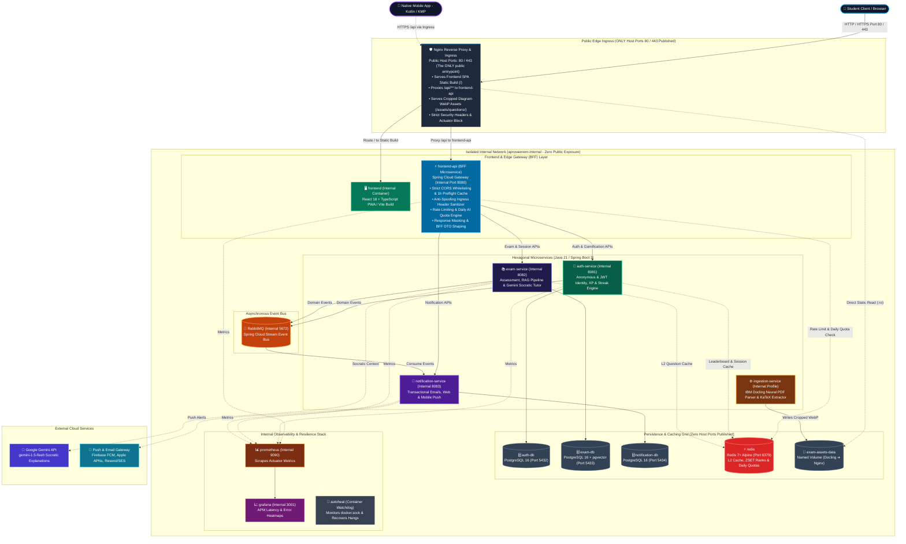

<div align="center">
    <h1>📚 AprovaENEM — Open Examination & Diagnostic Platform</h1>
    <p><strong>Democratizing high-quality ENEM preparation for Brazilian public high school students through open public data, diagnostic assessment, resilient microservices, and mobile-first accessibility.</strong></p>
</div>

<div align="center">

[](https://polyformproject.org/licenses/noncommercial/1.0.0)
[](https://react.dev/)
[](https://www.typescriptlang.org/)
[](https://tailwindcss.com/)
[](https://openjdk.org/)
[](https://spring.io/projects/spring-boot)
[](https://www.postgresql.org/)
[](https://www.docker.com/)
[](https://prometheus.io/)
[](https://github.com/)
[](https://www.w3.org/WAI/standards-guidelines/wcag/)
[](https://www.gov.br/governodigital/pt-br/vlibras)
[](https://www.gov.br/anpd/pt-br)
[](https://sdgs.un.org/goals/goal4)
[](https://sdgs.un.org/goals/goal10)

</div>

---

## 📖 Overview

According to INEP's Censo Escolar, **84.3% of Brazilian secondary students attend public high schools**, yet they remain heavily underrepresented in competitive admissions to federal universities. Commercial online preparatory platforms charge between **R$ 30 and R$ 200+/month** (often requiring full-year credit card debt commitments), while physical prep academies exceed **R$ 1,000/month**, systematically pricing out low-income students from urban peripheries.

**AprovaENEM** is a full-stack open educational platform. It transforms official, public-domain exam archives from **INEP (spanning 2009 to 2025)** into an interactive, mobile-optimized learning ecosystem. Students can practice authentic exam questions on their phones, receive instant step-by-step resolution breakdowns, track diagnostic weak-spot radars, and interact with a Socratic AI study tutor — **100% free, mobile-first, and with zero registration barriers for core question training**.

---

## ✨ Features

### 🛡️ LGPD Compliance & Privacy by Design (Lei nº 13.709/2018)
- 🔒 **Privacy by Default**: Practice past exams, simulate tests, and view INEP resolutions with **zero login, zero CPF, and zero personal data collection**.
- 🧒 **Adolescent Protection (Art. 14)**: Processing conducted strictly in the best interest of secondary students; student emails and data are **never sold or shared** with commercial prep courses, private colleges, or ad networks.
- 📦 **Data Portability (Art. 18, V)**: Self-service endpoint (`GET /api/v1/auth/export`) delivering a machine-readable JSON snapshot of student profile, goals, and history.
- 🗑️ **Right to Erasure (Art. 18, VI)**: Irrevocable account deletion (`DELETE /api/v1/auth/me`) permanently purging PII from `auth_db` while anonymizing historical psychometric exam data in `exam_db`.

### ♿ Universal Digital Accessibility & Inclusion (WCAG 2.1 AA & INEP Standards)
- 🤟 **VLibras Integration**: Embedded Brazilian Sign Language 3D digital avatar translating Portuguese text into Libras with 1 click for deaf and hard-of-hearing students.
- 👁️ **Screen Reader & Semantic HTML5**: Native `<fieldset>`/`<legend>` question structures, ARIA Live Regions (`aria-live="polite"` for instant grading feedback without focus loss), and descriptive `figureAltText` for all exam figures and charts.
- ⏱️ **INEP Exam Time Accommodations**: Mirroring official INEP *Atendimento Especializado* with Standard Mode (3 min/question), Extended Time Mode (+50% or +100% time), and Untimed Relaxed Mode for students with ADHD, Autism, or test anxiety.
- 📖 **Neurodiversity & Dyslexia Support**: Instant typography toggle for **OpenDyslexic** and **Atkinson Hyperlegible**, alongside an optional Focus Reading Guide (*Régua de Foco*) to eliminate sensory overload.
- 🎨 **Daltonism & High Contrast**: Accessible color schemes (Protanopia, Deuteranopia, Tritanopia) pairing color with explicit icons (`✓`, `✗`) so status is never conveyed by color alone.
- ⌨️ **100% Keyboard Operability**: Complete keyboard navigation (Tab flow, hotkeys `A`–`E` or `1`–`5` to select options, `Enter` to submit, `Space` to toggle Socratic AI).

### 📱 Student Web & Mobile Experience (`frontend/`)
- 🎯 **Frictionless Instant Practice**: Students start solving questions immediately with zero mandatory registration, phone verification, or paywalls.
- 🎮 **Game Experience & Progression**: Experience points (XP), student levels (from *Freshman* to *Top Scorer*), celebratory level-up animations, and unlockable achievement badges for registered users.
- 🔥 **Daily Goals & Streak Tracker**: Customizable daily question targets (5–25 questions/day), daily streak counter, emergency monthly freeze protection, and automated study reminders.
- 🏆 **Weekly Reset Leagues**: Competitive weekly leaderboards across 4 tiers (Bronze, Silver, Gold, Diamond) resetting every Sunday at 23:59 BRT to foster peer motivation.
- 📱 **Mobile-First & 3G/4G Optimized**: High-density, low-bandwidth UI built for budget smartphones and constrained mobile data plans.
- 📊 **Interactive Diagnostic Radar**: Visual skill radar charts mapping student mastery across topics (`MASTERED`, `ATTENTION_NEEDED`, `CRITICAL`).
- 🌙 **High-Contrast & Dark Mode Design**: Eye-strain-free, accessible interface optimized for long focused study marathons and battery efficiency on mobile screens.
- 🧮 **LaTeX & MathJax Rendering**: Flawless mathematical formula and chemical equation rendering across all question statements and options.

### ⚙️ Backend & Distributed Architecture (`backend/`)
- 🗄️ **Complete INEP Question Bank**: Past exams categorized by subject area (*Mathematics, Natural Sciences, Humanities, Languages*), discipline, sub-topic, and Item Response Theory (TRI) difficulty.
- ⚡ **Real-Time Assessment & Sub-5ms Caching**: Millisecond evaluation of submissions with immediate distractor analysis, backed by **Redis 7+ L2 distributed caching** and specialized PostgreSQL composite B-Tree and partial indexes.
- 🕹️ **Event-Driven Gamification Engine**: Evaluates domain events (`QuestionAnsweredEvent`, `SessionCompletedEvent`) to compute XP rewards, evaluate daily study goals, and calculate weekly league rankings via **Redis Sorted Sets (`ZSET`)** with asynchronous persistence to PostgreSQL.
- 🔔 **Multi-Channel Notification Microservice**: Decoupled `notification-service` dispatching transactional emails (SES/Resend), Web Push, and mobile notifications (FCM/APNs) for daily streak preservation at 19:00 BRT and Sunday league results.
- 🤖 **Socratic AI Study Tutor**: Powered by **Google Gemini (gemini-1.5-flash)** with pedagogical guardrails: guides students through underlying scientific and mathematical principles without spoiling answers. Unlocked via a free student account (`ROLE_STUDENT`) with **1 free daily AI consultation per student** (resets at midnight 00:00 BRT); **unlimited AI tutoring** unlocked with the **AprovaENEM Pro** plan. (Core question catalog, exam simulations, instant scoring, and written resolutions remain 100% free and unlimited with zero login required).
- 🧠 **Retrieval-Augmented Generation (RAG) & Vector Search**: Grounded in official INEP curriculum matrices, verified step-by-step resolutions, and distractor catalogs via **PostgreSQL 16 `pgvector`** with HNSW semantic indexing to eliminate LLM hallucinations before student prompts are dispatched.
- 🛡️ **Perimeter Isolation & `frontend-api` Microservice (BFF)**: The public user has network access **strictly to the frontend ingress (ports 80/443) and nothing else**. A dedicated `frontend-api` BFF microservice acts as the hardened edge facade, enforcing strict CORS origin whitelisting, 1-hour preflight caching, Token Bucket rate limiting, and anti-spoofing request sanitization while completely shielding internal domain microservices ("Real APIs"), databases, and message brokers inside an isolated Docker network.
- 📈 **Datadog-Style Observability**: Complete Prometheus APM metrics, Micrometer distributed tracing (`traceId` / `spanId` MDC injection), and sub-minute trace-to-error bug isolation.
- 🏗️ **Hexagonal Architecture**: Strict separation of pure Java domain models from Spring Boot frameworks and PostgreSQL persistence.
- 🔄 **Self-Healing Container Resilience**: 100% Docker Compose orchestration featuring automated crash restarts (`restart: unless-stopped`), `/actuator/health` liveness/readiness probes, and an `autoheal` watcher daemon that automatically detects and respawns deadlocked containers without Kubernetes overhead.
- 📝 **Phase 2 Premium Roadmap (*AI Essay Evaluator*)**: Handwritten essay photo scanning via multimodal vision OCR and 5-competency grading (0–1,000 pts) powered by a **Provider-Agnostic AI Engine with LLM-as-a-Judge arbitration** (benchmarked via empirical evals across candidate models for lowest cost and highest scoring accuracy) under a paid plan / subsidized vouchers.
- 📱 **Phase 2 Mobile Roadmap (Native Android Kotlin & KMP)**: Native mobile application built with **Kotlin / Java** and **Jetpack Compose** on Android, leveraging **Room Database** for offline SQLite question caching, **CameraX** for edge document scanning of handwritten essays, **Kotlin Multiplatform (KMP)** for cross-platform expansion, and **Google AdMob Rewarded Video Ads** calibrated to Brazilian eCPM yields ($1.50–$3.50 USD/1k views) allowing low-income students without credit cards to earn bonus Socratic AI consultations with sustainable ~9x margin coverage.

---

## 🛠️ Tech Stack

### Frontend Application
- **Framework**: React 18+ with TypeScript (Strict mode, zero `any`)
- **Styling**: Tailwind CSS with custom Dark Design Tokens
- **Icons**: Lucide React
- **Data Visualization**: Recharts / Chart.js for diagnostic skill radars
- **Math Rendering**: KaTeX / MathJax for scientific expressions
- **Build Tool**: Vite 5
- **Mobile Roadmap**: **Native Android (Kotlin / Java & Jetpack Compose)** + **Kotlin Multiplatform (KMP)** (Room SQLite offline question bank, CameraX essay scanner, Firebase Cloud Messaging)

### Backend Microservices
- **Language**: Java 21 LTS
- **Framework**: Spring Boot 3.3+ (Web, Data JPA, Validation, Actuator)
- **Security**: **Spring Security 6.3+** (Stateless JWT, `SecurityFilterChain`, Method Security `@PreAuthorize`, RBAC for anonymous and registered students, BCrypt password hashing)
- **Architecture**: Microservices with **Hexagonal Architecture (Ports and Adapters)**
- **Frontend API & Gateway**: **Spring Cloud Gateway (`frontend-api` BFF microservice)** with Token Bucket Rate Limiting, strict CORS engine (origin whitelisting & 1-hour preflight caching), anti-spoofing header stripping, and domain API shielding
- **Event Bus / Messaging**: **RabbitMQ / Spring Cloud Stream** for asynchronous notification events
- **Reverse Proxy & Ingress**: Nginx (L7 Reverse Proxy, SSL termination, static SPA delivery, **the ONLY publicly exposed host port: `80`/`443`**)

### Persistence & Storage
- **Primary Database**: PostgreSQL 16 (isolated `auth_db`, `exam_db`, and `notification_db`)
- **Docker Named Volumes (`driver: local`)**: Managed volume strategy for persistent backends (`exam-db-data`, `auth-db-data`, `notification-db-data`, `redis-data`, `rabbitmq-data`, `prometheus-data`, `grafana-data`), preventing Linux UID 999 permission collisions and ensuring zero data loss across container restarts
- **12-Factor Stateless Microservices**: Backend microservices (`frontend-api`, `auth-service`, `exam-service`, `notification-service`) and the React 18 SPA are strictly **stateless** with zero local data volume mounts, enabling instantaneous teardowns and horizontal scaling
- **Shared Static Media Pipeline**: `exam-assets-data` named volume shared between `ingestion-service` (Docling diagram extraction) and `nginx-proxy` (read-only WebP delivery with 1-year cache headers), offloading static asset traffic 100% from JVM runtimes
- **Distributed Cache & State Grid**: **Redis 7+ Alpine** (L2 entity caching, Redis `ZSET` for sub-millisecond weekly league leaderboards, Token Bucket rate limiting, and ephemeral session store)
- **Database Migrations**: **Flyway** (`flyway-core` + `flyway-database-postgresql`, strictly immutable SQL scripts `V1__...`, zero auto-DDL in runtime)
- **ORM & Data Access**: **Spring Data JPA / Hibernate 6** (Jakarta Persistence), isolated within outbound adapters to preserve pure Java domain entities
- **Vector Search Engine**: **PostgreSQL `pgvector`** extension (768-dim embeddings, HNSW cosine index `m=16, ef_construction=64`) for sub-5ms pedagogical RAG retrieval
- **Key Strategy**: Time-ordered UUIDv7
- **Indexing Strategy**: Comprehensive PostgreSQL indexes including Composite B-Trees, Partial Indexes (`WHERE status = 'ACTIVE'`), Portuguese Full-Text Search GIN (`to_tsvector`), GIN JSONB Path indexes, and HNSW Vector indexes

### Observability & Resilience
- **Metrics Scraping**: Prometheus Server (Port 9090) scraping `/actuator/prometheus`
- **Dashboards**: Grafana APM (Port 3000)
- **Distributed Tracing**: Micrometer Tracing with W3C Trace Context
- **Resilience**: Resilience4j Circuit Breaker for Gemini API fallback

### Automated Testing & Verification
- **Backend Unit Tests**: JUnit 5, Mockito, AssertJ (Domain entities, TRI rules, scoring algorithms)
- **Backend Integration Tests**: Spring Boot `@SpringBootTest`, Testcontainers PostgreSQL 16, Spring Security `@WithMockUser`, Maven Failsafe
- **Backend Coverage**: JaCoCo Maven Plugin (Unified unit + integration merged coverage $\ge 80\%$ line, $\ge 75\%$ branch)
- **Frontend Unit & Component Tests**: Vitest, React Testing Library, jsdom
- **Frontend Integration Tests**: Vitest + Mock Service Worker (MSW)
- **Frontend Coverage**: `@vitest/coverage-v8` ($\ge 80\%$ lines & statements)
- **API Contract Tests**: Automated Postman test suite executed via **Newman CLI**
- **End-to-End (E2E) Tests**: **Cypress** (Interactive student DOM workflows) + **Playwright** (Cross-browser and mobile device matrices)

### Digital Accessibility & Inclusion
- **Standards & Guidelines**: **WCAG 2.1 Level AA**, e-MAG (Governo Federal Brasileiro), Lei Brasileira de Inclusão (LBI - Lei nº 13.146/2015)
- **Assistive Technologies**: **VLibras** (official open-source 3D avatar for Brazilian Sign Language translation), Screen Reader compatibility (NVDA, TalkBack, VoiceOver, JAWS)
- **Typography & Ergonomics**: **OpenDyslexic**, **Atkinson Hyperlegible**, dynamic font scaling ($100\%$ to $200\%$) via root `rem` units
- **Automated Accessibility Testing**: `@axe-core/react`, `cypress-axe`, Lighthouse Accessibility Audit ($\ge 95/100$)

### DevOps & CI/CD
- **Containerization**: Unified Multi-Container Docker Compose (Orchestrating Frontend, Nginx, API Gateway, Microservices, Databases, Prometheus & Grafana)
- **Quality Gate**: Multi-Job GitHub Actions CI (`-Werror`, Checkstyle, PMD, PMD CPD, Trivy CVE scan, Gitleaks, JaCoCo 80%+, Vitest 80%+, Newman API tests, Cypress E2E, Playwright E2E, Axe-Core WCAG 2.1 AA audit)

---

## 🏗️ System Architecture



---

## 📁 Project Structure

```bash
ReconectaRecode/
├── README.md                            # Master project documentation
├── CHANGELOG.md                         # Project changelog (Keep a Changelog standard)
├── docker-compose.yml                   # Root Full-Stack Docker Compose Orchestration
├── docker-compose.override.dev.yml      # Local developer port-forwarding override (optional)
├── .env.example                         # Global environment variable template
├── docs/                                # Project Specifications & Planning
│   ├── BACKLOG.md                       # Multi-Sprint Product Backlog & Roadmap
│   ├── postman/                         # Automated Postman Collection & Environment (Newman CI)
│   │   ├── AprovaENEM.postman_collection.json
│   │   └── AprovaENEM.postman_environment.json
│   └── specifications/                  # System Architecture & Technical Specifications
│       ├── 01-business-and-market-strategy.md  # BMC, ICP Personas & SDG 4/10 KPIs
│       ├── 02-project-charter.md        # Scope, INEP Ingestion & Requirements
│       ├── 03-system-architecture.md   # C4 Containers, Ingress, Hexagonal Layout
│       ├── 04-data-modeling.md          # PostgreSQL DDL, ER Schemas, Indexes & Redis Caching
│       ├── 05-api-specification.md      # OpenAPI 3.0 REST Route & CORS Specifications
│       ├── 06-observability-datadog-style.md # Prometheus, Micrometer & Alert Rules
│       ├── 07-quality-gate-ci.md        # 6-Stage CI/CD Specification
│       └── 08-data-ingestion-pipeline.md # IBM Docling & Multi-Source Extraction Architecture
├── backend/                             # Spring Boot Microservices (Java 21 LTS)
│   ├── common-core/                     # Shared Domain Events, Unified RFC 7807 DTOs & Exceptions
│   ├── frontend-api/                    # Spring Cloud Gateway BFF + Rate Limiting & CORS
│   ├── auth-service/                    # Authentication, Identity & Gamification Service
│   ├── exam-service/                    # Examination, Assessment, RAG & Socratic AI
│   ├── notification-service/            # Multi-channel Email, Web & Mobile Push Service
│   ├── ingestion-service/               # On-demand Docling PDF Ingestion & Normalizer
│   └── pom.xml                          # Multi-module Maven Parent POM
├── frontend/                            # React 18 + TypeScript Application
│   ├── src/                             # UI components, pages & state management
│   ├── Dockerfile                       # Multi-stage production build container
│   ├── package.json                     # Frontend dependencies & scripts
│   └── vite.config.ts                   # Vite configuration
├── mobile/                              # [Roadmap] Native Android & Kotlin Multiplatform (KMP)
│   ├── androidApp/                      # Android Client (Jetpack Compose, CameraX, Room SQLite)
│   └── shared/                          # KMP shared business logic, data models & offline cache
├── infrastructure/                      # Edge Ingress & Telemetry Configuration
│   ├── nginx/                           # Reverse proxy, SSL, WebP static media & security headers (nginx.conf)
│   ├── prometheus/                      # Prometheus scraping config & alerting rules
│   └── grafana/                         # APM dashboards & datasource provisioning
├── evals/                               # [Phase 2] LLM Evaluation & Benchmark Harness (run_benchmarks.py)
└── .github/
    └── workflows/
        └── ci.yml                       # 7-Stage Automated CI Verification Pipeline & Pre-Flight Suite
```

---

## 🚀 Quickstart (100% Docker Compose)

The entire full-stack ecosystem (frontend, backend microservices, gateway, databases, and telemetry) runs with a **single command**, featuring **Kubernetes-grade container self-healing** (`restart: unless-stopped`, Spring Boot `/actuator/health` probes, deterministic boot sequencing, and automatic deadlock recovery via `autoheal`) alongside **resilient Docker named volume persistence**.

### Prerequisites
- Docker Engine 24+ & Docker Compose v2
- Google Gemini API Key (free tier available for development from [Google AI Studio](https://aistudio.google.com/))

### 1. Clone & Configure
```bash
git clone https://github.com/Veras-D/AprovaENEM.git
cd AprovaENEM
cp .env.example .env
```
Edit `.env` and insert your Gemini API Key:
```env
GEMINI_API_KEY=AIzaSyYourApiKeyHere...
```

### 2. Launch Entire Platform
```bash
docker compose up -d --build
```

### 3. Access Endpoints

#### 🌐 Public Production Ingress (Host Port 80 / 443 Only)
In strict adherence to **Perimeter Isolation**, external clients (browsers and mobile devices) interact strictly with the Nginx edge proxy:
- **Student Web Application (Frontend)**: `http://localhost`
- **Public REST API (via frontend-api BFF)**: `http://localhost/api/v1/...`
- **OpenAPI Swagger UI (Dev Ingress)**: `http://localhost/swagger-ui.html`

#### 🔒 Internal Backend Network (`aprovaenem-internal` - Zero Host Port Exposure)
In production, all domain services, databases, caches, and telemetry run within the private Docker network:
- **frontend-api (BFF Gateway)**: `http://frontend-api:8080` (Internal port only)
- **auth-service**: `http://auth-service:8081` (Internal port only)
- **exam-service**: `http://exam-service:8082` (Internal port only)
- **notification-service**: `http://notification-service:8083` (Internal port only)
- **PostgreSQL Databases**: `postgres-auth:5432`, `postgres-exam:5432`, `postgres-notification:5432` (Internal ports; host port forwarding 5432/5433/5434 available via dev override)
- **Redis 7+ Alpine**: `redis:6379`
- **RabbitMQ Event Bus**: `rabbitmq:5672` (Management: `rabbitmq:15672`)
- **Prometheus Telemetry**: `http://prometheus:9090`
- **Grafana APM**: `http://grafana:3000` (admin / admin)

> [!TIP]
> For local development and APM dashboard debugging, use the optional developer override to bind telemetry ports to localhost:
> ```bash
> docker compose -f docker-compose.yml -f docker-compose.override.dev.yml up -d
> ```

---

## 📡 Core API Routes Summary

| Method | Endpoint | Description | Auth / Security |
| :---: | :--- | :--- | :--- |
| `POST` | `/api/v1/auth/session` | Create anonymous practice session UUID | None (30-day TTL) |
| `POST` | `/api/v1/auth/register` | Register student account & emit Outbox event | None (Public) |
| `POST` | `/api/v1/auth/login` | Authenticate student & issue HMAC-SHA256 JWT | None (Public) |
| `POST` | `/api/v1/auth/verify-email` | Verify email with single-use Outbox token | None (Public) |
| `POST` | `/api/v1/auth/resend-verification` | Request fresh email verification token (3/hr) | None (Public) |
| `GET` | `/api/v1/auth/me` | Fetch authenticated student profile | Bearer (`ROLE_STUDENT`) |
| `GET` | `/api/v1/auth/export` | Export LGPD Art. 18 machine-readable student data | Bearer (`ROLE_STUDENT`) |
| `DELETE` | `/api/v1/auth/me` | Irrevocable LGPD account erasure / anonymization | Bearer (`ROLE_STUDENT`) |
| `GET` | `/api/v1/exams` | List available ENEM historical editions | Optional |
| `GET` | `/api/v1/subjects` | List subject areas, disciplines & topics | Optional |
| `GET` | `/api/v1/questions` | Query questions with topic & difficulty filters | Optional |
| `POST` | `/api/v1/sessions` | Generate randomized or topic practice quiz | `X-Session-Id` |
| `POST` | `/api/v1/sessions/{id}/attempts` | Submit answer & receive instant feedback | `X-Session-Id` |
| `POST` | `/api/v1/sessions/{id}/complete` | Finish quiz & trigger diagnostic generation | `X-Session-Id` |
| `GET` | `/api/v1/sessions/{id}/report` | Retrieve completed quiz diagnostic radar report | `X-Session-Id` / Bearer |
| `GET` | `/api/v1/questions/{id}/resolution` | Fetch curated step-by-step resolution | Optional (100% Free & Unlimited) |
| `POST` | `/api/v1/questions/{id}/chat` | Socratic dialogue turn (alias: `/ask`) | Bearer (1 free/day, Unlimited Pro) |
| `GET` | `/api/v1/questions/{id}/chat` | Fetch thread message history bubbles | Bearer (`ROLE_STUDENT`) |
| `DELETE` | `/api/v1/questions/{id}/chat` | Reset active conversation thread | Bearer (`ROLE_STUDENT`) |
| `GET` | `/api/v1/questions/ai-quota` | Check remaining daily AI tutor quota | Optional Bearer (Free / Pro / Anonymous) |
| `GET` | `/api/v1/gamification/profile` | Fetch XP balance, level title, streaks & goals | Bearer (`ROLE_STUDENT`) |
| `PUT` | `/api/v1/gamification/daily-goal` | Update daily question target & reminder opt-in | Bearer (`ROLE_STUDENT`) |
| `GET` | `/api/v1/gamification/leaderboard/weekly` | Query Redis `ZSET` weekly league standings | Bearer (`ROLE_STUDENT`) |
| `GET` | `/api/v1/gamification/badges` | List student achievement badges & unlocked status | Bearer (`ROLE_STUDENT`) |
| `GET` | `/api/v1/notifications` | Fetch paginated multi-channel notification inbox | Bearer / `X-User-Id` |
| `POST` | `/api/v1/notifications/push-tokens` | Register Web Push, Android FCM or iOS device token | Bearer / `X-User-Id` |
| `PATCH` | `/api/v1/notifications/{id}/read` | Mark notification alert as read | Bearer / `X-User-Id` |
| `GET` | `/api/v1/notifications/unread-count` | Query unread notification counter | Bearer / `X-User-Id` |
| `POST` | `/api/v1/essays/upload` | Upload handwritten essay for OCR evaluation (Phase 2) | Bearer (`ROLE_PREMIUM_STUDENT`) |
| `GET` | `/api/v1/essays/{id}` | Get 5-competency breakdown & thesis feedback (Phase 2) | Bearer (`ROLE_PREMIUM_STUDENT`) |

*Complete OpenAPI specification with request/response JSON schemas is available in [docs/specifications/05-api-specification.md](docs/specifications/05-api-specification.md).*

---

## 🛡️ 7-Stage Quality Gate & Pre-Flight Verification

AprovaENEM enforces a strict, enterprise-grade automated quality gate across all backend and frontend tiers via `.github/workflows/ci.yml`:

1. **Stage 1: Strict Compilation**: `javac` executed with `-Werror -parameters` across all 6 microservice modules and TypeScript strict type checking (`strict: true`).
2. **Stage 2: Static Analysis & Cyclomatic Complexity**: Checkstyle (Google Java Style) + PMD (enforcing cyclomatic complexity $\le 15$ per method, $\le 80$ per class) + ESLint (0 violations across all modules).
3. **Stage 3: Duplication Detection**: PMD CPD enforcing duplicate token threshold $< 3\%$ (100 tokens, 0 duplications).
4. **Stage 4: Security & Secret Scan**: Gitleaks commit history secret scan (`gitleaks-action@v2`) + Trivy CVE filesystem audit (`trivy-action`).
5. **Stage 5: Full Test Pyramid & JaCoCo Unified Coverage**:
   - **Backend**: **336 unit, adapter, and WebMvc tests (100% green, 0 failures)** + **16 Testcontainers integration tests** (`PostgreSQL 16 pgvector` and `Redis 7.2`). Enforced by **JaCoCo unified coverage quality gate ($\ge 80\%$ line, $\ge 75\%$ branch)** during `verify` lifecycle across all modules (`common-core`: 100%, `notification-service`: 99.2% line / 81.3% branch, `auth-service`: 96.3% line / 82.7% branch, `frontend-api`: 94.2% line / 88.6% branch, `exam-service`: 88.7% line / 75.8% branch).
   - **Frontend**: Vitest + React Testing Library component tests and MSW integration tests. Enforced by **`@vitest/coverage-v8` ($\ge 80\%$)**.
6. **Stage 6: Docker Compose Ecosystem & Pre-Flight Smoke Suite**: Automated container ecosystem startup and health verification via `tests/smoke/preflight-smoke.sh` executing 7 fast probes (`/health`, `/actuator/health`, trace propagation, catalog queries, session lifecycle) completing in $< 15\text{s}$ (verified in 147ms).
7. **Stage 7: Automated Postman Newman API Contract Suite & k6 Smoke**:
   - **API Contracts**: Automated Postman regression suite executed via **Newman CLI** (`docs/postman/AprovaENEM.postman_collection.json` — 31 requests, 56 assertions, 100% pass rate in 9.7s).
   - **Load & Stress Smoke**: Headless containerized **Grafana k6** (`catalog-browse-load.js` 150 VUs, 0% errors, sub-135ms P95 latency).

### 🔒 Multi-Stage Security & Test Suite Integrity Audits
Each engineering milestone is sealed by a comprehensive security and test legitimacy audit to guarantee zero vulnerabilities, zero specification gaps, and 100% authentic test assertions:
- **JAM 1 Exit Gate (Sprint 3 — Back-end)**: 6-Stage Audit: (1) **Static Analysis & Workarounds Technical Audit** (deep technical investigation of Checkstyle MethodName regex `^[a-z][a-zA-Z0-9]*(_[a-zA-Z0-9]+)*$`, PMD ruleset bounding, `QuestionDtoMapper` extraction, shell script JSON parsing vs `jq`, Newman rate-limiter delays, and password pepper backwards compatibility to ensure complete architectural legitimacy and zero compromised standards), (2) AI-assisted OWASP API Top 10 threat modeling, (3) automated DAST/CVE scans (Trivy, Gitleaks), (4) live runtime penetration testing against the container stack (JWT signature forgery, CORS origin bypass, perimeter isolation breach, header spoofing rejection, Token Bucket flood testing, and SQLi/pgvector fuzzing), (5) **Test Suite Quality, Legitimacy & Mutation Audit** (eliminating test smells, vacuous/tautological assertions, over-mocking, and validating mutant killing on TRI scoring, streaks, daily goals, and security filters), and (6) formal attestation report (`docs/audit/jam1-backend-security-audit.md`).
- **JAM 2 Exit Gate (Sprint 6 — Full-Stack Deployment)**: 5-Stage Audit: (1) AI-driven client DOM and KaTeX LaTeX injection audits, (2) supply-chain scans (`npm audit`, Trivy), (3) live interactive penetration testing on public deployed URL (strict CSP, clickjacking immunity, session storage isolation, mobile sandbox), (4) **Frontend & E2E Test Suite Quality & Legitimacy Audit** (eliminating test smells, vacuous assertions, unhandled async promise rejections, over-mocked UI handlers, and UI fault injection on Question Cards, LaTeX rendering, and accessibility toggles), and (5) formal full-stack attestation report (`docs/audit/jam2-fullstack-security-audit.md`). Visual media assets (`docs/images/`) are captured and packaged during this phase for partner showcases and final closure.

---

## 🤝 Contributing

Contributions from educators, engineers, and students are welcome!

1. Fork the repository and create a feature branch (`git checkout -b feature/issue-12-quiz-filter`).
2. Follow **Conventional Commits**:
   - `feat: add topic filter to question repository`
   - `fix: correct scoring calculation in complete session`
   - `docs: update OpenAPI schemas`
3. Ensure all local quality checks pass before pushing.
4. Push and open a Pull Request.

---

## 📄 License
 
Distributed under the **PolyForm Noncommercial License 1.0.0**. Free for students, educators, academic researchers, and non-commercial educational use. Commercial use and commercial prep course exploitation are strictly prohibited. See [`LICENSE`](LICENSE) for details.

---

<div align="center">
  <p>© 2026 AprovaENEM — Reconecta Recode Initiative. Built for educational equity.</p>
</div>
