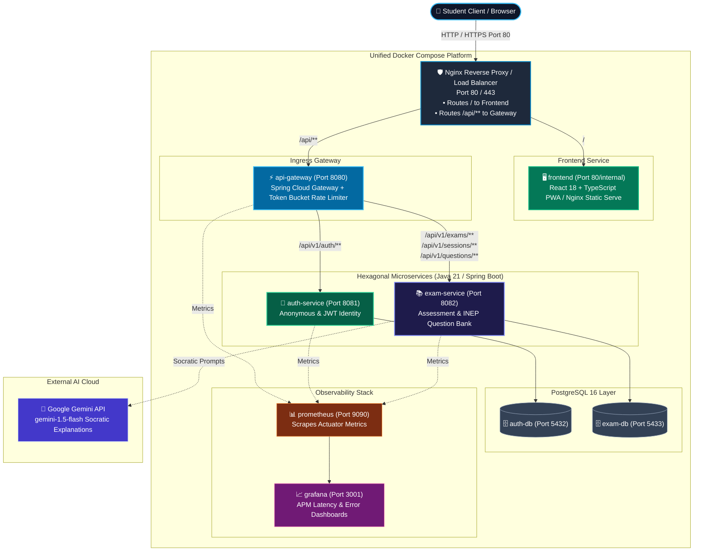

<div align="center">
    <h1>📚 AprovaENEM — Open Examination & Diagnostic Platform</h1>
    <p><strong>Democratizing high-quality ENEM preparation for Brazilian public high school students through open public data, diagnostic assessment, resilient microservices, and mobile-first accessibility.</strong></p>
</div>

<div align="center">

[](https://opensource.org/licenses/MIT)
[](https://react.dev/)
[](https://www.typescriptlang.org/)
[](https://tailwindcss.com/)
[](https://openjdk.org/)
[](https://spring.io/projects/spring-boot)
[](https://www.postgresql.org/)
[](https://www.docker.com/)
[](https://prometheus.io/)
[](https://github.com/)
[](https://sdgs.un.org/goals/goal4)
[](https://sdgs.un.org/goals/goal10)

</div>

---

## 📖 Overview

According to INEP's Censo Escolar, **84.3% of Brazilian secondary students attend public high schools**, yet they remain heavily underrepresented in competitive admissions to federal universities. Commercial online preparatory platforms charge between **R$ 30 and R$ 200+/month** (often requiring full-year credit card debt commitments), while physical prep academies exceed **R$ 1,000/month**, systematically pricing out low-income students from urban peripheries.

**AprovaENEM** is a full-stack open educational platform. It transforms official, public-domain exam archives from **INEP (spanning 2009 to 2025)** into an interactive, mobile-optimized learning ecosystem. Students can practice authentic exam questions on their phones, receive instant step-by-step resolution breakdowns, track diagnostic weak-spot radars, and interact with a Socratic AI study tutor — **100% free, mobile-first, and with zero registration barriers**.

---

## ✨ Features

### 📱 Student Web & Mobile Experience (`frontend/`)
- 🎯 **Frictionless Instant Practice**: Students start solving questions immediately with zero mandatory registration, phone verification, or paywalls.
- 📱 **Mobile-First & 3G/4G Optimized**: High-density, low-bandwidth UI built for budget smartphones and constrained mobile data plans.
- 📊 **Interactive Diagnostic Radar**: Visual skill radar charts mapping student mastery across topics (`MASTERED`, `ATTENTION_NEEDED`, `CRITICAL`).
- 🌙 **High-Contrast & Dark Mode Design**: Eye-strain-free, accessible interface optimized for long focused study marathons and battery efficiency on mobile screens.
- 🧮 **LaTeX & MathJax Rendering**: Flawless mathematical formula and chemical equation rendering across all question statements and options.

### ⚙️ Backend & Distributed Architecture (`backend/`)
- 🗄️ **Complete INEP Question Bank**: Past exams categorized by subject area (*Mathematics, Natural Sciences, Humanities, Languages*), discipline, sub-topic, and Item Response Theory (TRI) difficulty.
- ⚡ **Real-Time Assessment & Grading**: Millisecond evaluation of submissions with immediate distractor analysis.
- 🤖 **Socratic AI Study Tutor**: Powered by **Google Gemini (gemini-1.5-flash)** with pedagogical guardrails: guides students through underlying scientific and mathematical principles without spoiling answers.
- 🛡️ **Token Bucket Edge Rate Limiting**: Built into the API Gateway to prevent scraper abuse and protect upstream LLM API consumption.
- 📈 **Datadog-Style Observability**: Complete Prometheus APM metrics, Micrometer distributed tracing (`traceId` / `spanId` MDC injection), and sub-minute trace-to-error bug isolation.
- 🌐 **Bilingual Backend (i18n)**: Spring Boot `MessageSource` supporting both Portuguese (`pt-BR`) and English (`en`).
- 🏗️ **Hexagonal Architecture**: Strict separation of pure Java domain models from Spring Boot frameworks and PostgreSQL persistence.

---

## 🛠️ Tech Stack

### Frontend Application
- **Framework**: React 18+ with TypeScript (Strict mode, zero `any`)
- **Styling**: Tailwind CSS with custom Dark Design Tokens
- **Icons**: Lucide React
- **Data Visualization**: Recharts / Chart.js for diagnostic skill radars
- **Math Rendering**: KaTeX / MathJax for scientific expressions
- **Build Tool**: Vite 5

### Backend Microservices
- **Language**: Java 21 LTS
- **Framework**: Spring Boot 3.3+ (Web, Data JPA, Validation, Actuator)
- **Architecture**: Microservices with **Hexagonal Architecture (Ports and Adapters)**
- **API Gateway**: Spring Cloud Gateway with Token Bucket Rate Limiting
- **Reverse Proxy**: Nginx (L7 Load Balancer, SSL termination, request buffering)

### Persistence & Storage
- **Primary Database**: PostgreSQL 16 (isolated `auth_db` and `exam_db`)
- **Key Strategy**: Time-ordered UUIDv7
- **Indexing**: Specialized B-Tree multi-column indexes & GIN JSONB indexes

### Observability & Resilience
- **Metrics Scraping**: Prometheus Server (Port 9090) scraping `/actuator/prometheus`
- **Dashboards**: Grafana APM (Port 3000)
- **Distributed Tracing**: Micrometer Tracing with W3C Trace Context
- **Resilience**: Resilience4j Circuit Breaker for Gemini API fallback

### DevOps & CI/CD
- **Containerization**: Unified Multi-Container Docker Compose (Orchestrating Frontend, Nginx, API Gateway, Microservices, Databases, Prometheus & Grafana)
- **Quality Gate**: 6-Stage GitHub Actions CI (`-Werror`, Checkstyle, PMD, PMD CPD, Trivy CVE scan, Gitleaks, JaCoCo 80%+ coverage)

---

## 🏗️ System Architecture



---

## 📁 Project Structure

```bash
ReconectaRecode/
├── README.md                            # Master project documentation
├── CHANGELOG.md                         # Project changelog (Keep a Changelog standard)
├── docker-compose.yml                   # Root Full-Stack Docker Compose Orchestration
├── .env.example                         # Global environment variable template
├── docs/                                # Project Specifications & Planning
│   ├── BACKLOG.md                       # Multi-Sprint Product Backlog & Roadmap
│   └── sprint-1/                        # Sprint 1 Deliverables
│       ├── 01-business-and-market-strategy.md  # BMC, ICP Personas & SDG 4/10 KPIs
│       ├── 02-project-charter.md        # Scope, INEP Ingestion & Requirements
│       ├── 03-system-architecture.md   # C4 Containers, Ingress, Hexagonal Layout
│       ├── 04-data-modeling.md          # PostgreSQL DDL, ER Schemas & B-Trees
│       ├── 05-api-specification.md      # OpenAPI 3.0 REST Route Specifications
│       ├── 06-observability-datadog-style.md # Prometheus, Micrometer & Alert Rules
│       ├── 07-quality-gate-ci.md        # 6-Stage CI/CD Specification
│       └── 08-sprint-backlog.md         # Sprint 1 Summary & Next Steps Index
├── backend/                             # Spring Boot Microservices
│   ├── api-gateway/                     # Spring Cloud Gateway + Rate Limiting
│   ├── auth-service/                    # Authentication & Session Service
│   ├── exam-service/                    # Examination, Assessment & Socratic AI
│   └── pom.xml                          # Multi-module Maven Parent POM
├── frontend/                            # React 18 + TypeScript Application
│   ├── src/                             # UI components, pages & state management
│   ├── Dockerfile                       # Production multi-stage Nginx container
│   ├── package.json                     # Frontend dependencies & scripts
│   └── vite.config.ts                   # Vite configuration
└── .github/
    └── workflows/
        └── quality-gate.yml             # Automated CI Verification Pipeline
```

---

## 🚀 Quickstart (100% Docker Compose)

The entire full-stack ecosystem (frontend, backend microservices, gateway, databases, and telemetry) runs with a **single command**.

### Prerequisites
- Docker Engine 24+ & Docker Compose v2
- Google Gemini API Key (free tier available for development from [Google AI Studio](https://aistudio.google.com/))

### 1. Clone & Configure
```bash
git clone https://github.com/Veras-D/ReconectaRecode.git
cd ReconectaRecode
cp .env.example .env
```
Edit `.env` and insert your Gemini API Key:
```env
GEMINI_API_KEY=AIzaSyYourApiKeyHere...
```

### 2. Launch Entire Platform
```bash
docker compose up -d --build
```

### 3. Access Endpoints
- **Student Web Application (Frontend)**: `http://localhost`
- **API Gateway**: `http://localhost:8080` (or `http://localhost/api/v1/...`)
- **OpenAPI Swagger Documentation**: `http://localhost:8080/swagger-ui.html`
- **Prometheus Telemetry**: `http://localhost:9090`
- **Grafana APM**: `http://localhost:3001` (admin / admin)

---

## 📡 Core API Routes Summary

| Method | Endpoint | Description | Auth Header |
| :---: | :--- | :--- | :--- |
| `POST` | `/api/v1/auth/session` | Create anonymous practice session UUID | None |
| `GET` | `/api/v1/exams` | List available ENEM historical editions | Optional |
| `GET` | `/api/v1/subjects` | List subject areas, disciplines & topics | Optional |
| `GET` | `/api/v1/questions` | Query questions with topic & difficulty filters | Optional |
| `POST` | `/api/v1/sessions` | Generate randomized or topic practice quiz | `X-Session-Id` |
| `POST` | `/api/v1/sessions/{id}/attempts` | Submit answer & receive instant feedback | `X-Session-Id` |
| `POST` | `/api/v1/sessions/{id}/complete` | Finish quiz & generate diagnostic radar | `X-Session-Id` |
| `GET` | `/api/v1/questions/{id}/resolution` | Fetch curated step-by-step resolution | Optional |
| `POST` | `/api/v1/questions/{id}/ask` | Ask Socratic concept question (Gemini AI) | `X-Session-Id` |

*Complete OpenAPI specification with request/response JSON schemas is available in [docs/sprint-1/05-api-specification.md](docs/sprint-1/05-api-specification.md).*

---

## 🛡️ 6-Stage Quality Gate

AprovaENEM adopts the strict automated quality gate standard established in [CV_Maker](https://github.com/Veras-D/CV_Maker):

1. **Gate 1: Compiler Zero Warnings**: `javac` executed with `-Werror -Xlint:all` and TypeScript strict type checking.
2. **Gate 2: Static Analysis**: Checkstyle (Google Java Style) + PMD (Cyclomatic Complexity $\le 12$, max method lines $\le 50$) + ESLint.
3. **Gate 3: Duplication Detection**: PMD CPD enforcing duplicate token threshold $< 3\%$.
4. **Gate 4: Security & Secret Scan**: Trivy CVE dependency audit (0 critical/high) + Gitleaks commit history scan.
5. **Gate 5: Automated Test Suite**: JUnit 5 unit & integration tests with **80%+ JaCoCo coverage**.
6. **Gate 6: Build Verification**: Clean container builds via Docker Compose and production bundle packaging.

---

## 🤝 Contributing

Contributions from educators, engineers, and students are welcome!

1. Fork the repository and create a feature branch (`git checkout -b feature/issue-12-quiz-filter`).
2. Follow **Conventional Commits**:
   - `feat: add topic filter to question repository`
   - `fix: correct scoring calculation in complete session`
   - `docs: update OpenAPI schemas`
3. Ensure all local quality checks pass before pushing.
4. Push and open a Pull Request.

---

## 📄 License

Distributed under the **MIT License**. See `LICENSE` for details.

---

<div align="center">
  <p>© 2026 AprovaENEM — Reconecta Recode Initiative. Built for educational equity.</p>
</div>
