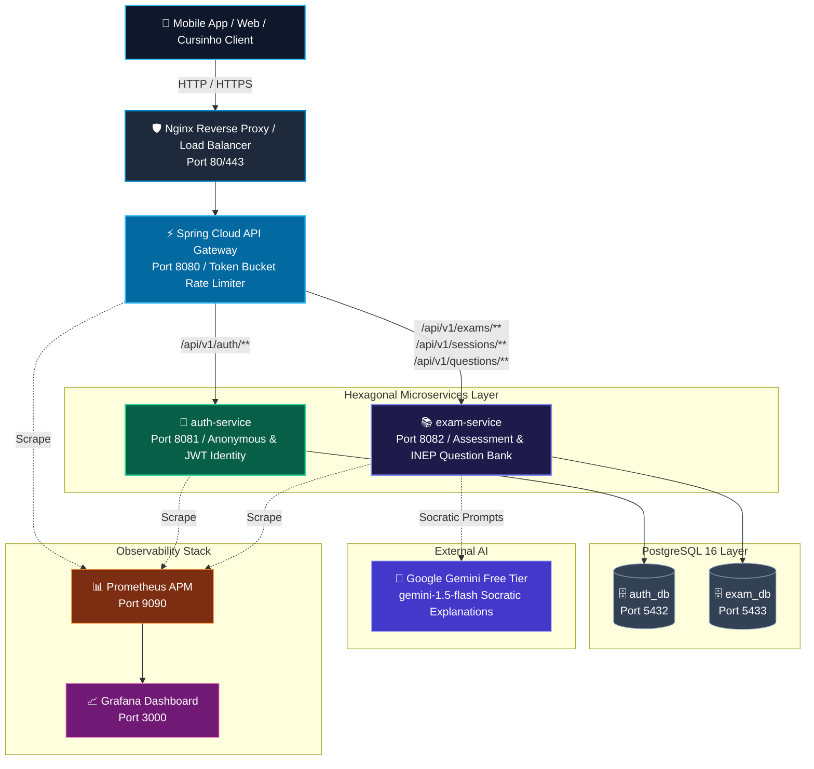

<div align="center">
    <h1>📚 AprovaENEM — Open Examination & Diagnostic Engine</h1>
    <p><strong>Democratizing high-quality ENEM preparation for Brazilian public high school students through open public data, diagnostic assessment, and resilient microservices.</strong></p>
</div>

<div align="center">

[](https://opensource.org/licenses/MIT)
[](https://openjdk.org/)
[](https://spring.io/projects/spring-boot)
[](https://www.postgresql.org/)
[](https://www.docker.com/)
[](https://prometheus.io/)
[](https://github.com/)
[](https://sdgs.un.org/goals/goal4)
[](https://sdgs.un.org/goals/goal10)

</div>

---

## 📖 Overview

In Brazil, over 80% of secondary students attend public high schools, yet they represent a fraction of admissions to prestigious federal universities. Commercial prep platforms charge expensive subscriptions (R$ 60 to R$ 250/month) that systematically exclude low-income students from urban peripheries.

**AprovaENEM** bridges this educational gap. It transforms official, public-domain exam archives from **INEP** (2010–2024) into a lightweight, high-performance REST API. Students can practice authentic exam questions, receive instant step-by-step resolution breakdowns, track diagnostic weak-spot radars, and interact with a Socratic AI study tutor — **100% free, mobile-optimized, and with zero registration barriers**.

---

## ✨ Features

- 🎯 **Frictionless Anonymous Practice**: Students start solving questions instantly via an `X-Session-Id` header (UUID) with zero mandatory sign-up, email, or paywalls.
- 🗄️ **Comprehensive Ingested Catalog**: Official INEP exams categorized by subject (*Mathematics, Natural Sciences, Humanities, Languages*), discipline, sub-topic, and Item Response Theory (TRI) difficulty.
- ⚡ **Instant Assessment & Grading**: Real-time evaluation of question attempts with step-by-step pedagogical explanations and distractor rationale.
- 📊 **Diagnostic Skill-Gap Radar**: Automated post-session analytics mapping topic mastery (`MASTERED`, `ATTENTION_NEEDED`, `CRITICAL`) to guide high-yield study sessions.
- 🤖 **Socratic AI Study Tutor**: Powered by **Google Gemini Free Tier** with strict educational guardrails: guides the student through fundamental scientific concepts without spoiling answers.
- 🛡️ **Edge Rate Limiting**: Built-in Token Bucket algorithm preventing scraper abuse and protecting upstream free-tier AI quotas.
- 📈 **Datadog-Style Observability**: Complete Prometheus APM metrics, Micrometer distributed tracing (`traceId` / `spanId` MDC propagation), and trace-to-error correlation for instant bug hunting.
- 🌐 **Bilingual Backend (i18n)**: Spring Boot `MessageSource` localized error messages for both Portuguese (`pt-BR`) and English (`en`).
- 🏗️ **Hexagonal Architecture**: Strict decoupling of pure Java domain logic from Spring Boot frameworks and PostgreSQL persistence.

---

## 🛠️ Tech Stack

### Core Backend & Services
- **Language**: Java 21 LTS
- **Framework**: Spring Boot 3.3+ (Spring Web, Spring Data JPA, Spring Validation)
- **Architecture**: Microservices with **Hexagonal Architecture (Ports and Adapters)**
- **API Gateway**: Spring Cloud Gateway with Token Bucket Rate Limiter
- **Reverse Proxy**: Nginx (L7 Load Balancer, SSL termination, request buffering)

### Persistence & Storage
- **Primary Database**: PostgreSQL 16 (isolated `auth_db` and `exam_db`)
- **Key Strategy**: Time-ordered UUIDv7
- **Indexing**: Specialized B-Tree multi-column indexes & GIN JSONB indexes

### Observability & Resilience
- **Metrics Scraping**: Prometheus Server (Port 9090) scraping `/actuator/prometheus`
- **Dashboards**: Grafana APM (Port 3000)
- **Distributed Tracing**: Micrometer Tracing with W3C Trace Context
- **Resilience**: Resilience4j Circuit Breaker for Gemini API fallback

### DevOps & CI/CD
- **Containerization**: Multi-container Docker Compose
- **Quality Gate**: 6-Stage GitHub Actions CI (`-Werror`, Checkstyle, PMD, PMD CPD, Trivy CVE scan, Gitleaks, JaCoCo 80%+ coverage)

---

## 🏗️ System Architecture



---

## 📁 Project Structure

```bash
ReconectaRecode/
├── docs/                                # Comprehensive Documentation
│   ├── BACKLOG.md                       # Multi-Sprint Product Backlog & Roadmap
│   ├── README.md                        # Documentation Index & Architecture Guide
│   └── sprint-1/                        # Sprint 1 Planning Baseline
│       ├── 01-business-and-market-strategy.md  # BMC, ICP Personas & SDG 4/10 KPIs
│       ├── 02-project-charter.md        # Scope, Ingestion Strategy & Requirements
│       ├── 03-system-architecture.md   # C4 Containers, Ingress, Hexagonal Layout
│       ├── 04-data-modeling.md          # PostgreSQL DDL, ER Schemas & B-Tree Indexes
│       ├── 05-api-specification.md      # OpenAPI 3.0 REST Route Specifications
│       ├── 06-observability-datadog-style.md # Prometheus, Micrometer & Error Hunting
│       └── 07-quality-gate-ci.md        # 6-Stage CI/CD Specification
├── backend/                             # Spring Boot Microservices
│   ├── api-gateway/                     # Spring Cloud Gateway + Rate Limiting
│   ├── auth-service/                    # Authentication & Session Service
│   ├── exam-service/                    # Examination, Assessment & Socratic AI
│   ├── docker-compose.yml               # Local Infrastructure Stack
│   └── pom.xml                          # Multi-module Maven Parent POM
└── .github/
    └── workflows/
        └── quality-gate.yml             # Automated CI Verification Pipeline
```

---

## 🚀 Quickstart (Docker Compose)

### Prerequisites
- Docker Engine 24+ & Docker Compose v2
- Java 21 LTS (optional for host builds)
- Google Gemini API Key (free tier from [Google AI Studio](https://aistudio.google.com/))

### 1. Clone & Configure
```bash
git clone https://github.com/Veras-D/ReconectaRecode.git
cd ReconectaRecode/backend
cp .env.example .env
```
Edit `.env` and insert your Gemini API Key:
```env
GEMINI_API_KEY=AIzaSyYourFreeTierKeyHere...
```

### 2. Launch Entire Ecosystem
```bash
docker compose up -d
```

### 3. Verify Health Endpoints
- **API Gateway**: `http://localhost:8080/actuator/health`
- **Prometheus Telemetry**: `http://localhost:9090`
- **Grafana APM**: `http://localhost:3000` (admin / admin)
- **OpenAPI Swagger**: `http://localhost:8080/swagger-ui.html`

---

## 📡 Core API Routes Summary

| Method | Endpoint | Description | Auth Header |
| :---: | :--- | :--- | :--- |
| `POST` | `/api/v1/auth/session` | Create anonymous practice session UUID | None |
| `GET` | `/api/v1/exams` | List available ENEM historical editions | Optional |
| `GET` | `/api/v1/subjects` | List subject areas, disciplines & topics | Optional |
| `GET` | `/api/v1/questions` | Query questions with topic & difficulty filters | Optional |
| `POST` | `/api/v1/sessions` | Generate randomized or topic practice quiz | `X-Session-Id` |
| `POST` | `/api/v1/sessions/{id}/attempts` | Submit answer & receive instant feedback | `X-Session-Id` |
| `POST` | `/api/v1/sessions/{id}/complete` | Finish quiz & generate diagnostic radar | `X-Session-Id` |
| `GET` | `/api/v1/questions/{id}/resolution` | Fetch curated step-by-step resolution | Optional |
| `POST` | `/api/v1/questions/{id}/ask` | Ask Socratic concept question (Gemini AI) | `X-Session-Id` |

*Complete OpenAPI specification with request/response JSON schemas is available in [05-api-specification.md](file:///home/verivi/Veras/Projects/ReconectaRecode/docs/sprint-1/05-api-specification.md).*

---

## 🛡️ 6-Stage Quality Gate

AprovaENEM adopts the strict automated quality gate standard established in [CV_Maker](https://github.com/Veras-D/CV_Maker):

1. **Gate 1: Compiler Zero Warnings**: `javac` executed with `-Werror -Xlint:all`.
2. **Gate 2: Static Analysis**: Checkstyle (Google Java Style) + PMD (Cyclomatic Complexity $\le 12$, max method lines $\le 50$).
3. **Gate 3: Duplication Detection**: PMD CPD enforcing duplicate token threshold $< 3\%$.
4. **Gate 4: Security & Secret Scan**: Trivy CVE dependency scan (0 critical/high) + Gitleaks commit history scan.
5. **Gate 5: Automated Test Suite**: JUnit 5 unit & integration tests with **80%+ JaCoCo coverage**.
6. **Gate 6: Build Verification**: Clean container builds via Docker Compose.

---

## 🤝 Contributing

Contributions from educators, engineers, and students are welcome!

1. Fork the repository and create a feature branch (`git checkout -b feature/issue-12-quiz-filter`).
2. Follow **Conventional Commits**:
   - `feat: add topic filter to question repository`
   - `fix: correct scoring calculation in complete session`
   - `docs: update OpenAPI schemas`
3. Ensure all local quality checks pass:
   ```bash
   mvn clean verify
   ```
4. Push and open a Pull Request.

---

## 📄 License

Distributed under the **MIT License**. See `LICENSE` for details.

---

<div align="center">
  <p>© 2026 AprovaENEM — Reconecta Recode Initiative. Built for educational equity.</p>
</div>
