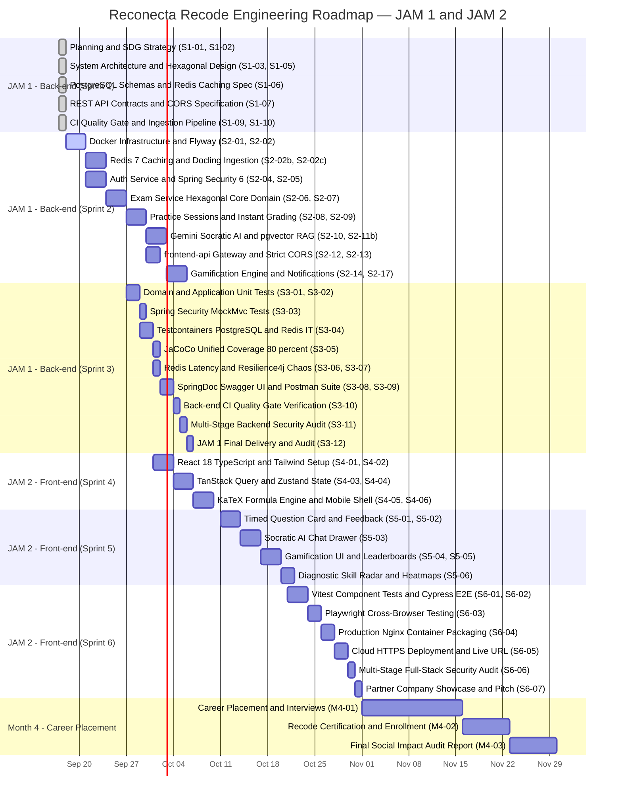

# Project Backlog & Multi-Sprint Roadmap — AprovaENEM

> **Program**: [Reconecta Recode](https://recode.org.br/reconecta/) (Recode Pro Initiative)  
> **Framework**: Agile / Scrum / Kanban  
> **Delivery Horizon**:  
> • **JAM 1 (Month 2 · September — Sprints 1 to 3)**: **Back-end Focus** ➔ Functional REST API documented in Swagger / OpenAPI & Postman in a public GitHub repository  
> • **JAM 2 (Month 3 · October — Sprints 4 to 6)**: **Front-end & Integration Focus** ➔ Deployed full-stack application accessible via public URL, certification & partner company presentation  
> • **Month 4 · November**: **Career Placement & Program Closure** ➔ Tech placement, freelancing/entrepreneurship tracking & final social impact audit  

---

## 1. Multi-Sprint Milestone Roadmap

---

## 2. Sprint 1: Planning & Architecture Baseline (JAM 1 — COMPLETED ✅)

All architectural foundations, entity models, REST contracts, and verification blueprints for the backend were completed in Sprint 1:

| Task ID   | Work Item & Title                            | Priority | Output Deliverable                                                                                                                                              |  Status  |
| :-------- | :------------------------------------------- | :------: | :-------------------------------------------------------------------------------------------------------------------------------------------------------------- | :------: |
| **S1-01** | **Social Impact Strategy & SDG Alignment**   |   `P0`   | [01-business-and-market-strategy.md](file:///home/verivi/Veras/Projects/ReconectaRecode/docs/specifications/01-business-and-market-strategy.md)                       | **DONE** |
| **S1-02** | **Customer Research, Personas & JTBD**       |   `P0`   | Value Proposition Canvas, Personas: *Lucas & Mariana*                                                                                                           | **DONE** |
| **S1-03** | **Project Charter & Ingestion Scope**        |   `P0`   | [02-project-charter.md](file:///home/verivi/Veras/Projects/ReconectaRecode/docs/specifications/02-project-charter.md)                                                 | **DONE** |
| **S1-04** | **System Topology & Perimeter Architecture** |   `P0`   | [03-system-architecture.md](file:///home/verivi/Veras/Projects/ReconectaRecode/docs/specifications/03-system-architecture.md) (Nginx + Gateway + Rate Limiter)        | **DONE** |
| **S1-05** | **Hexagonal Architecture Specifications**    |   `P0`   | Domain, Ports & Adapters package layout                                                                                                                         | **DONE** |
| **S1-06** | **Data Modeling & PostgreSQL Schemas**       |   `P0`   | [04-data-modeling.md](file:///home/verivi/Veras/Projects/ReconectaRecode/docs/specifications/04-data-modeling.md) (DDL, ER schema, B-trees, GIN & Vector)             | **DONE** |
| **S1-07** | **REST API Route & CORS Specifications**     |   `P0`   | [05-api-specification.md](file:///home/verivi/Veras/Projects/ReconectaRecode/docs/specifications/05-api-specification.md) (OpenAPI contracts, CORS preflight)         | **DONE** |
| **S1-08** | **Datadog-Style Observability Design**       |   `P0`   | [06-observability-datadog-style.md](file:///home/verivi/Veras/Projects/ReconectaRecode/docs/specifications/06-observability-datadog-style.md) (Prometheus + Tracing)  | **DONE** |
| **S1-09** | **Automated CI Quality Gate Definition**     |   `P0`   | [07-quality-gate-ci.md](file:///home/verivi/Veras/Projects/ReconectaRecode/docs/specifications/07-quality-gate-ci.md) (6-stage pipeline blueprint)                    | **DONE** |
| **S1-10** | **Data Ingestion Pipeline Architecture**     |   `P0`   | [08-data-ingestion-pipeline.md](file:///home/verivi/Veras/Projects/ReconectaRecode/docs/specifications/08-data-ingestion-pipeline.md) (Docling neural layout & LaTeX) | **DONE** |

---

## 3. Sprint 2: Core Back-end Development & Implementation (JAM 1 — COMPLETED ✅)

Focus: **Hands-on Implementation of Hexagonal Back-end Microservices, Persistence, Caching, and Ingress Security**.

### Epic 1: Infrastructure & Database Foundation
#### `TASK-S2-01`: Back-end Docker Compose Stack with Perimeter Isolation, Self-Healing Resilience & Persistent Named Volumes — **COMPLETED ✅**
- **Priority**: `P0` | **Estimation**: 5 pts
- **Description**: Setup root `docker-compose.yml` orchestrating the backend microservices with strict network segregation, Kubernetes-grade container self-healing, and enterprise persistent storage architecture: `frontend-edge` network exposing ONLY port 80/443 (Nginx reverse-proxying `/api/**` to `frontend-api`), internal private `aprovaenem-internal` network (`internal: true`) with zero host ports exposed for domain services, `restart: unless-stopped` crash recovery on all containers, `/actuator/health` probes, deterministic boot sequencing (`condition: service_healthy`), `autoheal` container daemon, and Docker **named volumes** (`driver: local`) for all stateful stores (`auth-db-data`, `exam-db-data`, `notification-db-data`, `redis-data`, `rabbitmq-data`, `exam-assets-data`, `prometheus-data`, `grafana-data`), maintaining strict 12-Factor statelessness for compute microservices.
- **Acceptance Criteria**:
  - [x] `docker compose up -d` brings up all backend services, databases, cache, queue, and telemetry with 1 command.
  - [x] Host port bindings strictly limited: ONLY `80` / `443` (Nginx) bound to `0.0.0.0`.
  - [x] All internal services (`frontend-api:8080`, `auth-service:8081`, `exam-service:8082`, `notification-service:8083`, Redis `6379`, Postgres `5432-5434`, RabbitMQ `5672`) have NO published host ports.
  - [x] All containers configure `restart: unless-stopped` for instant automated process crash respawns.
  - [x] Spring Boot services configure `/actuator/health` probes; PostgreSQL (`pg_isready`), Redis (`redis-cli ping`), and RabbitMQ (`rabbitmq-diagnostics ping`) configure native probes.
  - [x] Downstream services wait for `condition: service_healthy` before initiating database or cache connections, eliminating cold-start boot races.
  - [x] Lightweight `autoheal` container automatically detects and respawns deadlocked containers marked `unhealthy`.
  - [x] Persistent named volumes configured with `driver: local` for PostgreSQL databases (`/var/lib/postgresql/data`), Redis (`/data`), RabbitMQ (`/var/lib/rabbitmq`), Docling/Nginx assets, and Prometheus/Grafana TSDB.
  - [x] Backend application microservices (`frontend-api`, `auth-service`, `exam-service`, `notification-service`) remain strictly stateless (Twelve-Factor Factor VI) with zero local persistent volume mounts.
  - [x] Zero data loss verified across container teardown: `docker compose down && docker compose up -d` preserves all database records, migrations, Redis leaderboards, and extracted assets.
  - [x] Shared `exam-assets-data` volume verified: `ingestion-service` writes extracted WebP figures to `/app/extracted_assets` and `nginx-proxy` mounts it read-only to serve `/assets/questions/` directly with zero JVM overhead.

#### `TASK-S2-02`: Database Flyway Migrations & Performance Indexing Strategy — **COMPLETED ✅**
- **Priority**: `P0` | **Estimation**: 5 pts
- **Description**: Create Flyway migration scripts (`V1__init_schema.sql` and `V2__performance_indexes.sql`) implementing the physical DDL and specialized PostgreSQL indexes defined in `04-data-modeling.md`.
- **Acceptance Criteria**:
  - [x] Tables, foreign keys, and indexes created automatically on application boot.
  - [x] Specialized indexes verified: Portuguese Full-Text Search GIN (`idx_questions_statement_fts`), partial active question index (`idx_questions_active_serving`), 19:00 BRT streak reminder index (`idx_gamification_streak_reminder`), HNSW vector index, and JSONB GIN index.
  - [x] Seed script populates initial ENEM editions and subject areas.

#### `TASK-S2-02b`: Data Ingestion & Extraction Microservice (`ingestion-service`) — **COMPLETED ✅**
- **Priority**: `P0` | **Estimation**: 8 pts
- **Description**: Build the decoupled on-demand containerized microservice (`ingestion-service`) using Python and **IBM Docling** (DocLayNet + TableFormer) under Docker Compose profile `ingestion` to perform neural layout parsing, automatic two-column reading flow, built-in formula-to-LaTeX conversion, and diagram cropping (WebP), reconciled with INEP `ITENS_PROVA.csv` microdados.
- **Acceptance Criteria**:
  - [x] Containerized with `profiles: ["ingestion"]` (zero idle RAM overhead on core cluster).
  - [x] Employs IBM Docling to parse two-column pages into clean Markdown without interleaved text.
  - [x] Converts math formulas into KaTeX-compatible LaTeX (`$...$` and `$$...$$`).
  - [x] Crops diagrams (`PictureItem`) at 300 DPI and outputs lossless WebP assets.
  - [x] Reconciles extracted answers with official answer key with 100% concordance.
  - [x] Injects official TRI parameters ($a, b, c$) and generates normalized seed fixtures.

#### `TASK-S2-02c`: Distributed Caching Architecture with Redis 7+ — **COMPLETED ✅**
- **Priority**: `P0` | **Estimation**: 5 pts
- **Description**: Configure Spring Data Redis with Lettuce connection pool, Jackson JSON serialization, custom TTL cache manager (24h questions, 48h resolutions, 2h active sessions), and Redis Sorted Sets (`ZSET`) for real-time sub-millisecond weekly league leaderboards (`ZINCRBY`, `ZREVRANK`, `ZREVRANGE`).
- **Acceptance Criteria**:
  - [x] `@Cacheable` caches question entities in Redis; achieves sub-2ms cache hit latency.
  - [x] Gamification service updates and queries weekly leaderboards via Redis `ZSET` without executing expensive SQL window functions.
  - [x] Redis memory configured with `maxmemory 512mb` and `allkeys-lru` eviction policy.
  - [x] Redis runs strictly inside `aprovaenem-internal` with zero host port exposure.

#### `TASK-S2-03`: Multi-Module Maven Configuration (Java 21 LTS) — **COMPLETED ✅**
- **Priority**: `P0` | **Estimation**: 3 pts
- **Description**: Configure root `pom.xml` with Maven Compiler Plugin (`-parameters`), submodules (`common-core`, `frontend-api`, `auth-service`, `exam-service`, `notification-service`), Checkstyle, PMD, and JaCoCo plugins.
- **Acceptance Criteria**:
  - [x] `mvn clean compile` succeeds across all modules without warnings.
  - [x] All 5 submodules build and package into Spring Boot executable fat JARs and multi-stage Docker images.

---

### Epic 2: Authentication & Session Microservice (`auth-service`)
#### `TASK-S2-04`: Anonymous Session Management (Hexagonal) — **COMPLETED ✅**
- **Priority**: `P0` | **Estimation**: 5 pts
- **Description**: Implement anonymous session generator (`POST /api/v1/auth/session`) in `auth-service`.
- **Acceptance Criteria**:
  - [x] Returns UUID session with 30-day expiration.
  - [x] Stores session in `anonymous_sessions` table.

#### `TASK-S2-05`: Spring Security 6 Integration, Stateless JWT & RBAC — **COMPLETED ✅**
- **Priority**: `P0` | **Estimation**: 8 pts
- **Description**: Configure Spring Security 6 `SecurityFilterChain` bean architecture, stateless session management, `BCryptPasswordEncoder(12)`, custom `JwtAuthenticationFilter` (`OncePerRequestFilter`), `AnonymousAuthenticationFilter` (`ROLE_ANONYMOUS_STUDENT`), method-level security (`@EnableMethodSecurity`), and RFC 7807 `AuthenticationEntryPoint` / `AccessDeniedHandler`.
- **Acceptance Criteria**:
  - [x] Unauthenticated requests safely obtain `ROLE_ANONYMOUS_STUDENT` to practice quizzes and query public catalogs without credentials.
  - [x] User `/register` and `/login` issue signed HMAC-SHA256 JWT tokens with `ROLE_STUDENT`.
  - [x] Protected endpoints validate Bearer tokens and enforce `@PreAuthorize`.
  - [x] Missing or expired tokens return RFC 7807 401 Unauthorized; insufficient roles return RFC 7807 403 Forbidden.

#### `TASK-S2-05b`: Transactional Outbox Pattern & Student Email Confirmation — **COMPLETED ✅**
- **Priority**: `P0` | **Estimation**: 5 pts
- **Description**: Implement the Transactional Outbox pattern in `auth-service` to reliably publish `UserRegisteredEvent` and `EmailVerificationRequestedEvent` to RabbitMQ exchange `auth.events` without dual-write inconsistency. Implement email verification endpoints (`POST /api/v1/auth/verify-email`, `POST /api/v1/auth/resend-verification`) with cryptographically secure single-use tokens (24h TTL).
- **Acceptance Criteria**:
  - [x] Registration atomically inserts `users` (with `is_email_verified = false`, `email_verification_token`) and `outbox_events` (status: `PENDING`) within the same `@Transactional` boundary.
  - [x] Scheduled background worker queries `outbox_events` (`SELECT ... FOR UPDATE SKIP LOCKED`), publishes events to RabbitMQ, and updates status to `PUBLISHED`.
  - [x] `POST /api/v1/auth/verify-email` verifies token, marks `is_email_verified = true`, and invalidates token.
  - [x] `POST /api/v1/auth/resend-verification` enforces rate limit (3/hour) and emits new outbox event.

---

### Epic 3: Examination & Assessment Engine (`exam-service`)
#### `TASK-S2-06`: Hexagonal Core Domain Modeling — **COMPLETED ✅**
- **Priority**: `P0` | **Estimation**: 5 pts
- **Description**: Implement pure Java domain entities (`Question`, `QuestionStatus`, `ExamSession`, `Attempt`, `DiagnosticReport`) without any Spring or JPA annotations.
- **Acceptance Criteria**:
  - [x] 100% framework-free pure Java classes under `com.aprovaenem.exam.domain.model`.
  - [x] Enforces `QuestionStatus` lifecycle enum (`ACTIVE`, `SUSPENDED`, `NEEDS_REVIEW`, `DRAFT`, `ANNULLED`).
  - [x] Domain validation rules: options must be between A and E, session cannot receive attempts once completed.

#### `TASK-S2-07`: Question Catalog & Filtered Query Use Cases — **COMPLETED ✅**
- **Priority**: `P0` | **Estimation**: 5 pts
- **Description**: Implement `GetQuestionsQuery` and outbound `QuestionRepositoryPort` adapter fetching questions from PostgreSQL with pagination, subject/difficulty filters, and status filtering.
- **Acceptance Criteria**:
  - [x] Public student queries and quiz sessions strictly select `ACTIVE` questions (excluding `SUSPENDED` or `NEEDS_REVIEW` items).
  - [x] Admin endpoint allows updating question status and suspension notes.
  - [x] Answers correctly omitted from public list queries.
  - [x] Paginated responses return `page`, `size`, `totalElements`.

#### `TASK-S2-08`: Practice Session State Machine & Instant Grading — **COMPLETED ✅**
- **Priority**: `P0` | **Estimation**: 8 pts
- **Description**: Implement `StartSessionUseCase` and `SubmitAnswerUseCase`.
- **Acceptance Criteria**:
  - [x] Generates random or topic-filtered session question set.
  - [x] Submitting an answer instantly evaluates correctness, updates `correct_count`, and returns base resolution explanation.
  - [x] Double submission of the same question in a session is prevented via unique constraint.

#### `TASK-S2-09`: Diagnostic Score & Weak-Topic Calculation — **COMPLETED ✅**
- **Priority**: `P0` | **Estimation**: 5 pts
- **Description**: Implement `CompleteSessionUseCase` to calculate score percentage, accuracy radar per discipline/topic, and recommended study focus.
- **Acceptance Criteria**:
  - [x] Returns structured `diagnosticRadar` JSON mapping topic performance (`MASTERED`, `ATTENTION_NEEDED`, `CRITICAL`).

---

### Epic 4: Socratic AI Tutor & External Resilience
#### `TASK-S2-10`: Google Gemini AI Tutor Client Adapter & Per-Question Multi-Turn Thread Engine — **COMPLETED ✅**
- **Priority**: `P1` | **Estimation**: 5 pts
- **Description**: Implement `GeminiTutorClientAdapter` using Google GenAI SDK / Spring AI with Socratic system prompt (compatible with local development free-tier keys and production quotas) and integrate with Redis and PostgreSQL (`tutor_chat_threads`, `tutor_chat_messages`) to enforce a daily rate limit of 1 free question consultation per registered student per day (`ROLE_STUDENT`), supporting up to 6 multi-turn Socratic turns per thread, thread reset (`DELETE /chat`), and 90-day hot retention while granting unlimited questions to `ROLE_PREMIUM_STUDENT`.
- **Acceptance Criteria**:
  - [x] Sends question context and student query history to `gemini-1.5-flash`.
  - [x] Enforces educational prompt: guide the student conceptually without spoiling the answer.
  - [x] Requires authenticated Bearer token (`ROLE_STUDENT` or `ROLE_PREMIUM_STUDENT`); unauthenticated requests return HTTP 401 with registration call-to-action to prevent cookie-clearing quota abuse.
  - [x] Enforces Redis daily counter (`ratelimit:tutor:daily:{userId}:{YYYY-MM-DD}`): 1 credit unlocks multi-turn Socratic conversation on 1 question per day; subsequent turns on that already-unlocked question do not deduct quota.
  - [x] Exposes `GET /api/v1/questions/{id}/chat` (history) and `DELETE /api/v1/questions/{id}/chat` (reset).
  - [x] Pro subscribers (`ROLE_PREMIUM_STUDENT`) bypass the 1 question/day quota limit.
  - [x] Returns quota metadata headers (`X-AI-Quota-Limit`, `X-AI-Quota-Remaining`, `X-AI-Quota-Reset`).
  - [x] Core question solving, quiz generation, and written resolutions remain completely unaffected (100% free and unlimited with zero login required).

#### `TASK-S2-11`: Resilience4j Circuit Breaker & Fallback Strategy — **COMPLETED ✅**
- **Priority**: `P1` | **Estimation**: 5 pts
- **Description**: Wrap Gemini calls with a Resilience4j Circuit Breaker.
- **Acceptance Criteria**:
  - [x] If Gemini returns HTTP 429 or times out, circuit trips and returns the static curated INEP explanation with `isFallback: true`.

#### `TASK-S2-11b`: Retrieval-Augmented Generation (RAG) & pgvector Knowledge Store — **COMPLETED ✅**
- **Priority**: `P1` | **Estimation**: 5 pts
- **Description**: Configure PostgreSQL `pgvector` with HNSW indexing and implement the RAG retrieval pipeline in `exam-service` using Spring AI `VectorStore` (or JDBC vector queries) to inject verified pedagogical documents into Socratic prompts.
- **Acceptance Criteria**:
  - [x] Flyway migration creates `vector` extension, `knowledge_documents`, `knowledge_chunks` tables and HNSW index.
  - [x] Generates 768-dim embeddings for question context and performs cosine similarity search (`<=>`).
  - [x] Fetches top-$k$ ($k=3$, similarity $> 0.75$) pedagogical chunks and injects them into the Socratic AI prompt.
  - [x] Socratic AI endpoint returns `retrievedContext` metadata in response payload.

---

### Epic 5: Ingress & Observability Integration
#### `TASK-S2-12`: `frontend-api` Microservice (BFF / Edge API Gateway) & Strict CORS Engine — **COMPLETED ✅**
- **Priority**: `P0` | **Estimation**: 8 pts
- **Description**: Implement the `frontend-api` microservice (BFF / Edge API Gateway) acting as the single public API facade that shields downstream domain microservices ("Real APIs"). Configure strict CORS policies (`CorsWebFilter` with origin whitelist, explicit allowed headers/methods, credentials support, 1-hour preflight caching), untrusted header stripping (`X-User-Id`, `X-User-Roles`), JWT/session ingress validation, response data masking (stripping SQL/stack traces), Token Bucket burst rate limiting, and Redis-backed daily AI Tutor quota enforcement.
- **Acceptance Criteria**:
  - [x] External requests never reach real domain microservices directly; all traffic flows through `frontend-api`.
  - [x] Strict CORS headers enforced: whitelisted origins only (rejects `*` when credentials are used), allowed methods (`GET, POST, PUT, PATCH, DELETE, OPTIONS`), allowed headers (`Authorization, Content-Type, Accept, X-Session-Id, traceparent, X-Trace-Id`), exposed headers (`Authorization, X-Trace-Id, X-Session-Id, X-RateLimit-Remaining`).
  - [x] Preflight `OPTIONS` requests immediately return `200 OK` or `204 No Content` with `Access-Control-Max-Age: 3600`.
  - [x] Spoofed internal headers stripped from incoming requests before forwarding.
  - [x] Token Bucket rate limiter (60 req/min general, 10 req/min burst on `/ask`), JWT authentication challenge on `/ask` (HTTP 401 for anonymous guests), and Redis daily AI quota (1 free/day for registered `ROLE_STUDENT`, unlimited for Pro) emit HTTP 429 with `Retry-After` and quota metadata.

#### `TASK-S2-13`: Micrometer Tracing & Prometheus Scraping — **COMPLETED ✅**
- **Priority**: `P1` | **Estimation**: 3 pts
- **Description**: Wire Micrometer tracing so all microservice logs include `[serviceName, traceId, spanId]` and configure Prometheus to scrape `/actuator/prometheus`.
- **Acceptance Criteria**:
  - [x] Outgoing HTTP responses include `X-Trace-Id` header.
  - [x] Prometheus target dashboard shows `UP` for all microservices.

---

### Epic 6: Gamification, Streaks & Notifications Microservice
#### `TASK-S2-14`: Student Gamification Engine (XP, Levels & Daily Goals) — **COMPLETED ✅**
- **Priority**: `P1` | **Estimation**: 5 pts
- **Description**: Implement event-driven gamification listener reacting to `QuestionAnsweredEvent` and `SessionCompletedEvent` to award XP (+10 per correct answer, +50 per completed session), evaluate daily goals, increment daily streak counters, and handle level promotions.
- **Acceptance Criteria**:
  - Automatically calculates XP and updates `user_gamification_profiles`.
  - Increments streak days and tracks monthly emergency streak freeze usage.
  - Exposes `GET /api/v1/gamification/profile` and `PUT /api/v1/gamification/daily-goal`.

#### `TASK-S2-15`: Weekly Reset Leaderboard & League Ranking (Redis ZSET) — **COMPLETED ✅**
- **Priority**: `P1` | **Estimation**: 5 pts
- **Description**: Implement weekly leaderboard engine using Redis Sorted Sets (`ZSET`) partitioned by league tiers (Bronze, Silver, Gold, Diamond), and scheduled Sunday 23:59:59 BRT league resets.
- **Acceptance Criteria**:
  - Sub-5ms query performance on `GET /api/v1/gamification/leaderboard/weekly`.
  - Promotes top 20% to next league and relegates bottom 10% on weekly reset.

#### `TASK-S2-16`: Daily Study Reminder Scheduled Worker — **COMPLETED ✅**
- **Priority**: `P2` | **Estimation**: 3 pts
- **Description**: Implement Spring `@Scheduled` background worker running daily at 19:00 BRT to query students with pending daily study goals and publish reminder events to RabbitMQ.
- **Acceptance Criteria**:
  - Only alerts users with `opt_in_reminders = true` and `isCompleted = false`.
  - Emits `DailyGoalReminderEvent` to the RabbitMQ exchange.

#### `TASK-S2-17`: Multi-Channel Notification Microservice (`notification-service`) — **COMPLETED ✅**
- **Priority**: `P1` | **Estimation**: 5 pts
- **Description**: Implement decoupled `notification-service` listening to domain events (`UserRegisteredEvent`, `DailyGoalReminderEvent`, `WeeklyLeagueResetEvent`, `EssayEvaluatedEvent`) via RabbitMQ to dispatch transactional emails (SES/Resend) and Web/Mobile Push notifications (FCM/APNs).
- **Acceptance Criteria**:
  - Delivers welcome and password reset emails with localized Thymeleaf templates (Portuguese pt-BR / English en).
  - Sends Web Push and FCM device notifications with quiet hours checks (22:00 to 07:00).
  - Exposes `/api/v1/notifications` inbox and `/api/v1/notifications/push-tokens` registration.

---

## 4. Sprint 3: Back-end Hardening, Verification & JAM 1 Delivery (JAM 1 — FINAL SPRINT 🛡️)

> **JAM 1 Official Deliverable**: Fully functional, tested backend API documented via **Swagger / OpenAPI 3.0** and **Postman**, verified through the automated CI quality gate, and published to a **public GitHub repository**.

| Task ID | Work Item & Title | Priority | Estimation | Acceptance Criteria |
| :--- | :--- | :---: | :---: | :--- |
| **S3-01** | **Domain Unit Testing** | `P0` | 5 pts | Pure Java domain tests (scoring, TRI formulas, question status transitions, entities) with JUnit 5 & AssertJ (execution $< 1\text{s}$). |
| **S3-02** | **Application Service Unit Testing** | `P0` | 5 pts | Mockito unit tests covering all Use Case orchestration flows, Socratic prompt builders, and domain event publishers. |
| **S3-03** | **Spring Security & WebMvc MockMvc Tests** | `P0` | 5 pts | MockMvc tests with `@WithMockUser` and `@WithAnonymousUser` validating 200 OK, 401 Unauthorized, 403 Forbidden, and RFC 7807 Problem Details payloads. |
| **S3-04** | **Testcontainers PostgreSQL 16 & Redis Integration Tests** | `P0` | 8 pts | Real PostgreSQL 16 (`pgvector`) and Redis container integration tests (`*IT.java` via Maven Failsafe) verifying Flyway migrations, JPA queries, and Redis ZSET operations. |
| **S3-05** | **JaCoCo Unified Backend Coverage Enforcement** | `P0` | 3 pts | Merged Surefire + Failsafe execution data (`jacoco.exec`); build fails if line coverage $< 80\%$ or branch coverage $< 75\%$. |
| **S3-06** | **Redis Caching & Latency Benchmarking** | `P1` | 5 pts | Verification of sub-2ms L2 cache hit latency, sub-5ms composite index queries, and ZSET ranking performance under concurrent request simulation. |
| **S3-07** | **Resilience4j Chaos & Fault Injection Testing** | `P1` | 5 pts | Verification of Circuit Breaker behavior: simulated Gemini API timeouts, HTTP 429 quota exhaustion, and graceful fallback to static INEP explanations with `isFallback: true`. |
| **S3-08** | **SpringDoc OpenAPI 3.0 & Swagger UI Documentation** | `P0` | 5 pts | Full interactive API documentation generated at `/swagger-ui.html` via SpringDoc OpenAPI, including schemas, parameter descriptions, error responses, and CORS behavior. |
| **S3-09** | **Automated Newman / Postman API Contract Suite** | `P0` | 5 pts | Complete Postman collection (`docs/postman/AprovaENEM.postman_collection.json`) and environment file executed via Newman CLI in CI, asserting status codes, schemas, and SLAs. |
| **S3-10** | **Back-end GitHub Actions CI Quality Gate Verification** | `P0` | 5 pts | 6-stage CI verification for backend (`javac -Werror`, Checkstyle, PMD, PMD CPD, Trivy, Gitleaks, JaCoCo, Newman) 100% green on `main`. |
| **S3-11** | **Multi-Stage AI-Assisted & Real-Time Backend Security Audit** | `P0` | 5 pts | Comprehensive 4-stage audit: (1) AI-driven threat modeling & code review (OWASP API Top 10), (2) Automated DAST & dependency audit (Trivy, Gitleaks, ZAP), (3) Live interactive runtime penetration testing (JWT signature tampering, CORS bypass fuzzing, perimeter isolation check, header spoofing rejection, Token Bucket flooding, SQLi/pgvector injection), (4) Audit report certifying zero vulnerabilities. |
| **S3-12** | **JAM 1 Final Delivery & Repository Submission** | `P0` | 2 pts | Audit public GitHub repository, verify README quickstart, validate Swagger UI, Postman collection export, capture initial backend visual assets in `docs/images/` (`swagger-ui-portal.png`, `postman-flow-journey.png`, `newman-test-dashboard.png`), and submit project URL to the Reconecta Recode platform. |

---

## 5. JAM 2: Front-end, Full-Stack Integration & Deployment (Month 3 · October — Sprints 4 to 6 💻)

> **JAM 2 Official Deliverable**: Deployed full-stack application accessible via a **public URL**, certification issuance, GitHub portfolio showcase, and **presentation to partner companies**.

### Sprint 4: Frontend Architecture & Design System (JAM 2 — Sprint 1)
| Task ID | Work Item & Title | Priority | Estimation | Acceptance Criteria |
| :--- | :--- | :---: | :---: | :--- |
| **S4-01** | **React 18 + TypeScript + Vite Project Setup** | `P0` | 5 pts | Strict TypeScript configuration (`strict: true`, zero `any`), ESLint, and fast Vite 5 HMR build pipeline. |
| **S4-02** | **Tailwind CSS Theme & Dark Mode Design Tokens** | `P0` | 5 pts | Accessible, high-contrast dark theme optimized for student mobile displays, custom colors, and typography tokens. |
| **S4-03** | **API Client SDK & TanStack Query Integration** | `P0` | 5 pts | Typed Axios/Fetch client connecting to `frontend-api` BFF, JWT header injection, preflight caching, and MSW mock integration for offline development. |
| **S4-04** | **Authentication & Student Session State Machine** | `P0` | 5 pts | Zustand store managing anonymous practice sessions (`X-Session-Id`), registered JWT auth, and seamless progress migration upon registration. |
| **S4-05** | **KaTeX & MathJax Formula Rendering Engine** | `P0` | 5 pts | Flawless inline (`$...$`) and block (`$$...$$`) LaTeX rendering for mathematical formulas, physics equations, and chemical notations. |
| **S4-06** | **Responsive Layout Shell & Mobile Navigation** | `P0` | 5 pts | Mobile-first responsive header, bottom navigation bar for smartphones, drawer navigation, and 3G/4G bandwidth optimization. |
| **S4-07** | **Digital Accessibility Baseline (WCAG 2.1 AA & VLibras Integration)** | `P0` | 5 pts | Implementation of universal accessibility floating widget with VLibras (Língua Brasileira de Sinais 3D avatar), font scaling (100%-200%), high-contrast & Daltonism themes, OpenDyslexic typography toggle, and 100% keyboard focus management (WCAG 2.1 AA / e-MAG compliance). |
| **S4-08** | **Student Registration Terms of Use & LGPD Consent Modal** | `P0` | 3 pts | Interactive Terms of Use modal with explicit consent opt-in checkbox during registration, clear disclosure of data minimization (no CPF, no commercial data selling), and links to the LGPD privacy policy. |

### Sprint 5: Student Practice Experience & Gamification UI (JAM 2 — Sprint 2)
| Task ID | Work Item & Title | Priority | Estimation | Acceptance Criteria |
| :--- | :--- | :---: | :---: | :--- |
| **S5-01** | **Interactive Question Card & Timed Quiz Mode** | `P0` | 5 pts | Question statement, statement images (WebP), option selector (A to E), countdown timer, and question navigation carousel. |
| **S5-02** | **Instant Feedback Banner & Step-by-Step Accordion** | `P0` | 5 pts | Color-coded immediate correctness indicator (green/red + icons `✓`/`✗`), distractor explanation breakdown, and curated INEP resolution accordion. |
| **S5-03** | **Socratic AI Tutor Per-Question Chat Drawer & Quota Widget** | `P0` | 8 pts | Slide-out conversational AI drawer bound per question, guiding students conceptually without spoiling answers, displaying message bubble history, turn counter indicator (up to 6 turns per unlock), reset conversation button, free registration prompt gate for unauthenticated guests, daily free question unlock counter (1 question/day), countdown to midnight reset, and upgrade CTA when exhausted. |
| **S5-04** | **Gamification Dashboard & Celebration Animations** | `P1` | 5 pts | XP progress bar, student level badges (*Freshman* to *Top Scorer*), daily streak counter, emergency freeze button, and level-up confetti. |
| **S5-05** | **Weekly League Leaderboard UI** | `P1` | 5 pts | Ranked league tables (Bronze, Silver, Gold, Diamond) with user position highlight, countdown timer to Sunday 23:59 reset, and promotion/relegation zones. |
| **S5-06** | **Diagnostic Skill Radar & Topic Heatmaps** | `P1` | 5 pts | Recharts / Chart.js radar charts mapping student proficiency across 4 ENEM areas, highlighting critical weak spots for revision. |
| **S5-07** | **Accessible Question Reader, Hotkeys & INEP Accommodations** | `P0` | 5 pts | Semantic `<fieldset>`/`<legend>` question cards with radio group navigation, hotkeys (A-E or 1-5 to select, Enter to submit, Space for Socratic AI), live ARIA status announcements (`aria-live="polite"` for grading), Web Speech TTS ("Ouvir Questão"), and INEP exam time accommodations (Standard, +60min Extended, Untimed Mode). |

### Sprint 6: Full-Stack Integration, E2E Testing & Production Deployment (JAM 2 — Sprint 3)
| Task ID | Work Item & Title | Priority | Estimation | Acceptance Criteria |
| :--- | :--- | :---: | :---: | :--- |
| **S6-01** | **Frontend Vitest & RTL Component Testing Suite** | `P0` | 5 pts | Vitest + React Testing Library testing Question Cards, LaTeX rendering, radar charts, dark mode, and accessibility audit via `@axe-core/react` ($\ge 80\%$ line coverage, zero WCAG 2.1 AA critical violations). |
| **S6-02** | **Cypress Interactive Student Journey E2E Suite** | `P0` | 8 pts | Interactive browser test suite (`frontend/cypress/`) testing full student quiz flow, Socratic chat, diagnostic completion, and automated `cypress-axe` WCAG accessibility checks across all views. |
| **S6-03** | **Playwright Cross-Browser & Mobile Viewport Matrix** | `P1` | 5 pts | Headless automated suite verifying rendering across Chromium, Firefox, WebKit, mobile screen emulation (iPhone/Pixel), and Lighthouse Accessibility score ($\ge 95/100$). |
| **S6-04** | **Production Multi-Stage Nginx Container Packaging** | `P0` | 5 pts | Multi-stage Docker build packaging optimized static React build into Nginx alpine with gzip, caching headers, and BFF proxying. |
| **S6-05** | **Cloud Production Deployment with Public HTTPS URL** | `P0` | 8 pts | Full-stack deployment on cloud infrastructure (VPS / Kubernetes / Render) with automated SSL termination (Let's Encrypt) and public domain access. |
| **S6-06** | **Multi-Stage AI-Assisted & Real-Time Full-Stack Security Audit** | `P0` | 5 pts | Comprehensive 4-stage audit: (1) AI-assisted client audit & threat analysis (XSS, DOM clobbering, secret leakage), (2) Automated static & supply chain audit (`npm audit`, Trivy, CSP check), (3) Live real-time penetration testing on the deployed URL (LaTeX injection, CSP enforcement, JWT storage security, mobile sandbox check, live traffic abuse), (4) Full-stack audit attestation certifying production readiness. |
| **S6-07** | **JAM 2 Final Delivery & Partner Company Presentation** | `P0` | 5 pts | Presentation pitch deck, live demo rehearsal, portfolio showcase on GitHub, and project presentation to partner companies highlighting social impact and digital accessibility. |
| **S6-08** | **Visual Showcase Media Kit & High-Impact Visual Assets** | `P0` | 3 pts | Curate, capture, and package a high-resolution visual media kit in `docs/images/` for README, pitch deck, and partner presentations (Postman Flows canvas, Swagger UI portal, Newman dark-mode test report, Grafana metrics, frontend dark-mode question interface, Socratic AI chat drawer, diagnostic radar, accessibility features, and mobile viewports). |
| **S6-09** | **Legal Compliance, Terms of Use & LGPD Privacy Portal** | `P0` | 5 pts | Implementation of adolescent-friendly Terms of Use, transparent Privacy Policy (plain Portuguese), Art. 18 self-service data portability export (`GET /api/v1/auth/export`), and 1-click irrevocable account erasure/anonymization (`DELETE /api/v1/auth/me`) with automated contract tests in Newman. |

#### Visual Showcase Media Kit & Presentation Asset Catalog (`docs/images/`)

| Asset File Name | Phase | Visual Concept & Contents | Recommended Placement |
| :--- | :---: | :--- | :--- |
| **`postman-flow-journey.png`** (or `.gif`) | **JAM 1** | Animated/static capture of the visual Postman Flow canvas showing the live request pipeline (Auth $\rightarrow$ Practice Session $\rightarrow$ Answer $\rightarrow$ AI Tutor $\rightarrow$ Leaderboard) with green pulses on `200 OK`. | **README.md** & **Slide Deck** (proves robust backend architecture and automated workflows). |
| **`swagger-ui-portal.png`** | **JAM 1** | High-resolution capture of the unified BFF Swagger UI (`/swagger-ui.html`) showcasing the multi-spec dropdown switcher (`exam-service`, `auth-service`, `notification-service`) and OpenAPI 3.0 schema explorer. | **README.md** (API Documentation section) & **Technical Specs**. |
| **`newman-test-dashboard.png`** | **JAM 1** | Dark-mode HTML Extra dashboard showing the automated contract test suite with 100% passing tests (53 assertions, 0 failures), latency breakdown, and SLA compliance. | **README.md** (Quality Gate section) & **Slide Deck** (proves reliability). |
| **`grafana-observability.png`** | **JAM 1** | High-contrast Grafana dashboard showing live Prometheus telemetry: JVM heap memory, Redis sub-millisecond cache hits, RabbitMQ event dispatching, and BFF token bucket rate limiter traffic. | **README.md** (Observability section) & **Slide Deck** (demonstrates production readiness). |
| **`architecture-topology.png`** | **JAM 1** | Clean visual diagram of the perimeter isolation topology (Nginx Reverse Proxy $\rightarrow$ Frontend-API BFF $\rightarrow$ Internal Private Network microservices $\rightarrow$ Autonomous PostgreSQL databases & Redis/RabbitMQ). | **README.md** & **Slide Deck** (System Architecture slide). |
| **`frontend-hero-banner.png`** | **JAM 2** | Hero mockup of the AprovaENEM web platform on desktop and tablet, showing the clean modern dark-mode landing page, value proposition, and "Start Free Practice (No Login Required)" CTA. | **README.md** (Top Hero Banner) & **Slide Deck** (Title / Intro slide). |
| **`frontend-practice-card.png`** | **JAM 2** | Focused view of the interactive question practice interface: KaTeX math formula rendering, timer widget, 5-option selector (A to E), and instant color-coded feedback banner with INEP resolution accordion. | **README.md** & **Slide Deck** (Product Demo slide). |
| **`socratic-ai-tutor-drawer.png`** | **JAM 2** | The slide-out Socratic AI Tutor conversational drawer in action: displaying multi-turn conceptual guidance ("Think about Newton's Third Law..."), turn counter indicator, and daily quota badge (1 free question/day). | **README.md** & **Slide Deck** (Key Differentiator / Innovation slide). |
| **`accessibility-features.png`** | **JAM 2** | Visual showcase of universal digital accessibility: VLibras Brazilian Sign Language 3D avatar translating question text, OpenDyslexic font switcher, Daltonism high-contrast filters, and INEP extended time modal. | **README.md** (Accessibility section) & **Slide Deck** (Social Impact & Inclusion slide). |
| **`diagnostic-radar-heatmaps.png`** | **JAM 2** | Visual student performance analytics: interactive Recharts radar spider chart across the 4 ENEM knowledge areas + subject heatmaps identifying weak spots for targeted revision. | **README.md** & **Slide Deck** (Pedagogical Impact slide). |
| **`gamification-leaderboard.png`** | **JAM 2** | Vibrant gamification dashboard: student level progress bar, flame streak counter with monthly freeze shield, badge shelf, and weekly league ladder (Bronze $\rightarrow$ Diamond) highlighting promotion zone. | **README.md** & **Slide Deck** (Student Retention & Engagement slide). |
| **`mobile-responsive-mockup.png`** | **JAM 2** | Smartphone device frame mockup (Android/iPhone) demonstrating mobile-first responsiveness, bottom navigation bar, and 3G/4G bandwidth optimization for public school students. | **README.md** & **Slide Deck** (Accessibility & Social Impact slide). |
| **`e2e-journey-recording.gif`** | **JAM 2** | 10-second looping GIF showing a student journey from anonymous practice start $\rightarrow$ answering a question $\rightarrow$ opening Socratic tutor $\rightarrow$ checking diagnostic report. | **README.md** (Live Demo section). |

---

## 6. Month 4 · November — Career Placement & Program Closure 🎓

> **Focus**: Career monitoring (formal employment, freelance contracts, or entrepreneurship), mentorship support from Recode, and final social impact audit.

| Task ID | Work Item & Title | Priority | Estimation | Acceptance Criteria |
| :--- | :--- | :---: | :---: | :--- |
| **M4-01** | **Career Placement & Job Opportunities** | `P0` | Continuous | Participation in partner company interviews, hiring pipelines, technical interviews, and freelance onboarding. |
| **M4-02** | **Recode Certification & Alumni Network Enrollment** | `P0` | 1 pt | Issuance of official Reconecta Recode graduation certificates and integration into the alumni mentorship community. |
| **M4-03** | **Final Social Impact Audit Report** | `P0` | 3 pts | Report quantifying student reach, questions solved, diagnostic accuracy improvement, and UN SDG 4 & 10 alignment indicators. |

---

## 7. Future Roadmap: AI Essay Evaluator & Multimodal OCR (*Essay Evaluator*)

> **Context**: Phase 2 enhancement scheduled after base platform delivery. Essays account for 20% of the final ENEM score (1,000 points). Operated under an affordable paid plan or subsidized vouchers (`ROLE_PREMIUM_STUDENT`) to sustain vision OCR and generative evaluation costs.

| Task ID | Work Item & Title | Priority | Estimation | Acceptance Criteria |
| :--- | :--- | :---: | :---: | :--- |
| **S7-01** | **Essay Photo Ingestion & Storage Adapter** | `P1` | 5 pts | Multipart image upload saving handwritten essay photos to S3/MinIO bucket. |
| **S7-02** | **Model Evaluation (LLM Eval) Benchmark Harness** | `P1` | 8 pts | Benchmarking suite (`evals/`) evaluating candidate vision models on OCR WER/CER, scoring MAE, and cost-per-evaluation. |
| **S7-03** | **Dual-Evaluator & LLM-as-a-Judge Arbitration Engine** | `P0` | 8 pts | Dual independent evaluation + LLM Judge arbitrating discrepancies $> 100$ pts total or $> 80$ pts per competency. |
| **S7-04** | **Spring Security `ROLE_PREMIUM_STUDENT` Gate** | `P0` | 3 pts | Enforce premium role / voucher token on all `/api/v1/essays/**` endpoints. |
| **S7-05** | **Frontend Essay Upload & Interactive Annotation Viewer** | `P1` | 8 pts | Student photo upload, transcription review, and visual radar for the 5 competencies. |

---

## 8. Future Roadmap: Native Android Mobile Application (Kotlin & KMP)

> **Context**: Enhancing accessibility for public school students with native smartphone hardware features, offline study capabilities on budget Android phones, and Kotlin Multiplatform (KMP) parity.

| Task ID | Work Item & Title | Priority | Estimation | Acceptance Criteria |
| :--- | :--- | :---: | :---: | :--- |
| **M1-01** | **Native Android (Kotlin) & KMP Project Setup** | `P1` | 5 pts | Multi-module Gradle project with Jetpack Compose, Material 3 Dark Theme tokens, and shared Kotlin domain/network DTO models with backend. |
| **M1-02** | **Offline Question Bank & Sync (Room SQLite + WorkManager)** | `P1` | 8 pts | Local Room database caching question packs for offline subway/bus study; Jetpack WorkManager background jobs for reliable sync upon reconnect. |
| **M1-03** | **Native Document Camera Scanner (CameraX + ML Kit)** | `P1` | 8 pts | CameraX integration with automatic edge detection, 4-point perspective keystone correction, and contrast enhancement for handwritten essay photo scanning. |
| **M1-04** | **Native Push Notifications (Firebase Cloud Messaging - FCM)** | `P1` | 5 pts | Native FCM receiver for lock-screen daily study reminders (19:00 BRT), streak defense alerts, and instant essay grading notifications. |
| **M1-05** | **Rewarded Video Ads & Brazil eCPM Unit Economics Engine (AdMob)** | `P1` | 5 pts | Google Mobile Ads (AdMob) Rewarded Video integration with Server-Side Verification (SSV) callback to grant +1 bonus AI Socratic credit upon voluntary video view; unit economics telemetry auditing that Brazilian eCPM yields ($1.50–$3.50 USD/1k views = ~$0.0020/view) comfortably exceed Gemini 1.5 Flash token costs (~$0.00017/query, ~9x margin); Wi-Fi pre-caching to preserve student 4G mobile data. |
