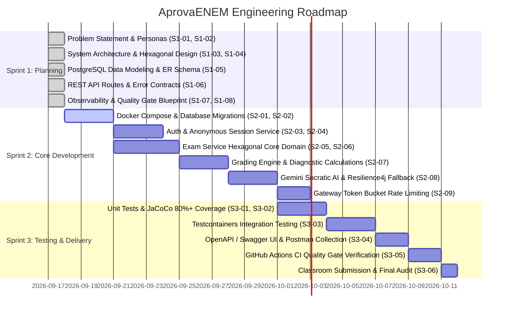

# Project Backlog & Multi-Sprint Roadmap — AprovaENEM

> **Framework**: Agile / Scrum / Kanban  
> **Project Horizon**: Sprint 1 (Planning & Architecture) ➔ Sprint 2 (Core Development) ➔ Sprint 3 (Testing & Delivery)  
> **Target Delivery**: Public GitHub Repository with Documented OpenAPI / Swagger & CI Quality Gate  

---

## 1. Multi-Sprint Milestone Roadmap

---

## 2. Sprint 1: Planning & Architecture Baseline (COMPLETED ✅)

| Task ID | Work Item & Title | Priority | Output Deliverable | Status |
| :--- | :--- | :---: | :--- | :---: |
| **S1-01** | **Social Impact Strategy & SDG Alignment** | `P0` | `docs/sprint-1/01-business-and-market-strategy.md` | **DONE** |
| **S1-02** | **Customer Research, Personas & JTBD** | `P0` | Value Proposition Canvas, Personas: *Lucas & Mariana* | **DONE** |
| **S1-03** | **Project Charter & Ingestion Scope** | `P0` | `docs/sprint-1/02-project-charter.md` | **DONE** |
| **S1-04** | **System Topology & Perimeter Architecture** | `P0` | `docs/sprint-1/03-system-architecture.md` (Nginx + Gateway + Rate Limiter) | **DONE** |
| **S1-05** | **Hexagonal Architecture Specifications** | `P0` | Domain, Ports & Adapters package structure | **DONE** |
| **S1-06** | **Data Modeling & PostgreSQL Schemas** | `P0` | `docs/sprint-1/04-data-modeling.md` (DDL, ER diagram, B-trees) | **DONE** |
| **S1-07** | **REST API Route Specifications** | `P0` | `docs/sprint-1/05-api-specification.md` (OpenAPI contracts) | **DONE** |
| **S1-08** | **Datadog-Style Observability Design** | `P0` | `docs/sprint-1/06-observability-datadog-style.md` (Prometheus + Tracing) | **DONE** |
| **S1-09** | **Automated CI Quality Gate Definition** | `P0` | `docs/sprint-1/07-quality-gate-ci.md` (6-stage pipeline) | **DONE** |

---

## 3. Sprint 2: Core Development & Implementation (Mão na Massa 🚀)

### Epic 1: Infrastructure & Database Foundation
#### `TASK-S2-01`: Docker Compose Local Infrastructure Stack
- **Priority**: `P0` | **Estimation**: 5 pts
- **Description**: Setup `docker-compose.yml` defining PostgreSQL 16 (two distinct databases: `auth_db` and `exam_db`), Prometheus, Grafana, and persistent named volumes.
- **Acceptance Criteria**:
  - `docker compose up -d` brings up both Postgres instances and Prometheus cleanly.
  - Health checks verify port bindings (`5432`, `5433`, `9090`).

#### `TASK-S2-02`: Database Flyway Migrations
- **Priority**: `P0` | **Estimation**: 5 pts
- **Description**: Create Flyway migration scripts (`V1__init_schema.sql`) implementing the DDL defined in `04-data-modeling.md`.
- **Acceptance Criteria**:
  - Tables, foreign keys, and indexes created automatically on application boot.
  - Seed script populates initial ENEM editions and subject areas.

#### `TASK-S2-03`: Multi-Module Maven Configuration
- **Priority**: `P0` | **Estimation**: 3 pts
- **Description**: Configure root `pom.xml` with Maven Compiler Plugin (`-Werror`, `-Xlint:all`), Checkstyle, PMD, and JaCoCo plugins.
- **Acceptance Criteria**:
  - `mvn clean compile` succeeds across all modules without warnings.

---

### Epic 2: Authentication & Session Microservice (`auth-service`)
#### `TASK-S2-04`: Anonymous Session Management (Hexagonal)
- **Priority**: `P0` | **Estimation**: 5 pts
- **Description**: Implement anonymous session generator (`POST /api/v1/auth/session`) in `auth-service`.
- **Acceptance Criteria**:
  - Returns UUID session with 30-day expiration.
  - Stores session in `anonymous_sessions` table.

#### `TASK-S2-05`: Optional Student Registration & JWT Security
- **Priority**: `P1` | **Estimation**: 5 pts
- **Description**: Implement user registration (`/register`) and login (`/login`) with BCrypt password hashing and stateless JWT issuance.
- **Acceptance Criteria**:
  - Valid JWT returned with `userId` and student claims.
  - Expired or tampered tokens return HTTP 401 with RFC 7807 problem details.

---

### Epic 3: Examination & Assessment Engine (`exam-service`)
#### `TASK-S2-06`: Hexagonal Core Domain Modeling
- **Priority**: `P0` | **Estimation**: 5 pts
- **Description**: Implement pure Java domain entities (`Question`, `ExamSession`, `Attempt`, `DiagnosticReport`) without any Spring or JPA annotations.
- **Acceptance Criteria**:
  - 100% framework-free pure Java classes under `com.openenem.assessment.domain`.
  - Domain validation rules: options must be between A and E, session cannot receive attempts once completed.

#### `TASK-S2-07`: Question Catalog & Filtered Query Use Cases
- **Priority**: `P0` | **Estimation**: 5 pts
- **Description**: Implement `GetQuestionsQuery` and outbound `QuestionRepositoryPort` adapter fetching questions from PostgreSQL with pagination and filters.
- **Acceptance Criteria**:
  - Answers correctly omitted from public list queries.
  - Paginated responses return `page`, `size`, `totalElements`.

#### `TASK-S2-08`: Practice Session State Machine & Instant Grading
- **Priority**: `P0` | **Estimation**: 8 pts
- **Description**: Implement `StartSessionUseCase` and `SubmitAnswerUseCase`.
- **Acceptance Criteria**:
  - Generates random or topic-filtered session question set.
  - Submitting an answer instantly evaluates correctness, updates `correct_count`, and returns base resolution explanation.
  - Double submission of the same question in a session is prevented via unique constraint.

#### `TASK-S2-09`: Diagnostic Score & Weak-Topic Calculation
- **Priority**: `P0` | **Estimation**: 5 pts
- **Description**: Implement `CompleteSessionUseCase` to calculate score percentage, accuracy radar per discipline/topic, and recommended study focus.
- **Acceptance Criteria**:
  - Returns structured `diagnosticRadar` JSON mapping topic performance (`MASTERED`, `ATTENTION_NEEDED`, `CRITICAL`).

---

### Epic 4: Socratic AI Tutor & External Resilience
#### `TASK-S2-10`: Google Gemini Free-Tier Client Adapter
- **Priority**: `P1` | **Estimation**: 5 pts
- **Description**: Implement `GeminiTutorClientAdapter` using Google GenAI SDK / Spring AI with Socratic system prompt.
- **Acceptance Criteria**:
  - Sends question context and student query to `gemini-1.5-flash`.
  - Enforces educational prompt: guide the student conceptually without spoiling the answer.

#### `TASK-S2-11`: Resilience4j Circuit Breaker & Fallback Strategy
- **Priority**: `P1` | **Estimation**: 5 pts
- **Description**: Wrap Gemini calls with a Resilience4j Circuit Breaker.
- **Acceptance Criteria**:
  - If Gemini returns HTTP 429 or times out, circuit trips and returns the static curated INEP explanation with `isFallback: true`.

---

### Epic 5: Ingress & Observability Integration
#### `TASK-S2-12`: Spring Cloud Gateway with Token Bucket Rate Limiting
- **Priority**: `P0` | **Estimation**: 5 pts
- **Description**: Configure API Gateway routes and Token Bucket rate limiter (60 req/min for general API; 10 req/min for `/ask`).
- **Acceptance Criteria**:
  - Requests exceeding limit receive HTTP 429 with `Retry-After` header.

#### `TASK-S2-13`: Micrometer Tracing & Prometheus Scraping
- **Priority**: `P1` | **Estimation**: 3 pts
- **Description**: Wire Micrometer tracing so all microservice logs include `[serviceName, traceId, spanId]` and configure Prometheus to scrape `/actuator/prometheus`.
- **Acceptance Criteria**:
  - Outgoing HTTP responses include `X-Trace-Id` header.
  - Prometheus target dashboard shows `UP` for all microservices.

---

## 4. Sprint 3: Testing, Quality Gate & Delivery (Review & Polish 🛡️)

| Task ID | Work Item & Title | Priority | Estimation | Acceptance Criteria |
| :--- | :--- | :---: | :---: | :--- |
| **S3-01** | **Domain Unit Testing** | `P0` | 5 pts | 100% branch coverage on domain entities and business rules via JUnit 5. |
| **S3-02** | **Application Service Unit Testing** | `P0` | 5 pts | Mockito tests covering all Use Case orchestration flows. |
| **S3-03** | **REST Controller WebMvc Tests** | `P0` | 5 pts | MockMvc tests validating status codes (200, 201, 400, 404, 429) and RFC 7807 payloads. |
| **S3-04** | **Testcontainers Integration Testing** | `P0` | 8 pts | End-to-end integration test running against real PostgreSQL container via Testcontainers. |
| **S3-05** | **JaCoCo Coverage Enforcement** | `P0` | 3 pts | Build fails if line coverage $< 80\%$ or branch coverage $< 75\%$. |
| **S3-06** | **OpenAPI / Swagger UI Generation** | `P0` | 3 pts | SpringDoc OpenAPI generated and accessible at `/swagger-ui.html`. |
| **S3-07** | **Postman Collection Export** | `P1` | 3 pts | Complete Postman collection with sample environments committed to `docs/postman/`. |
| **S3-08** | **GitHub Actions CI Quality Gate Run** | `P0` | 5 pts | Push to branch triggers full 6-stage CI gate in `.github/workflows/quality-gate.yml` with green check. |
| **S3-09** | **Reconecta Recode Classroom Delivery** | `P0` | 2 pts | Public GitHub repository link, student name, and email submitted to Google Classroom activity. |
