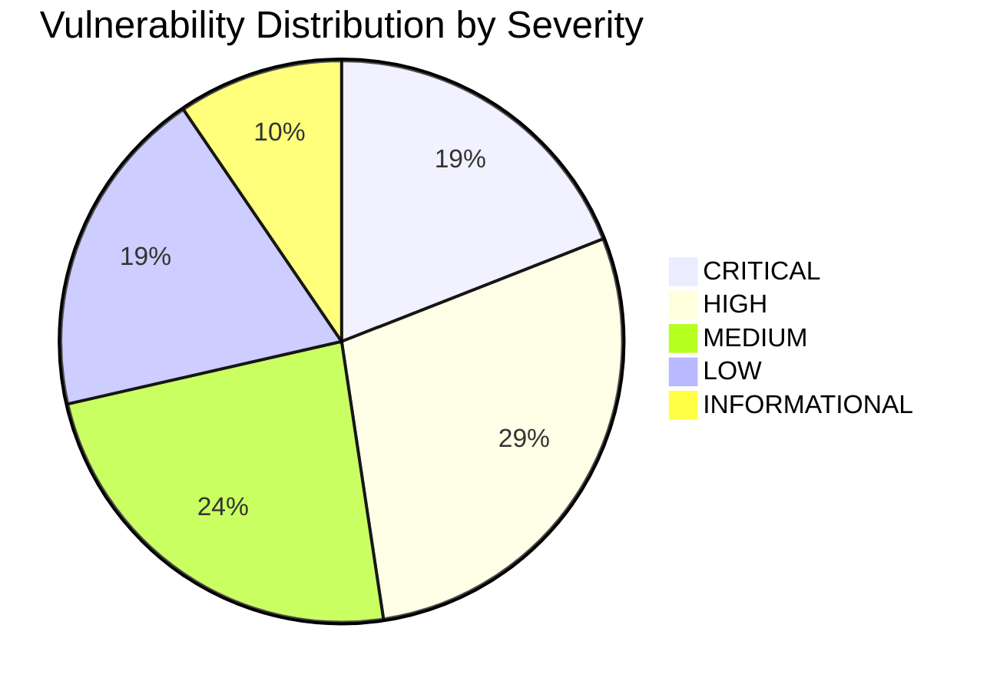
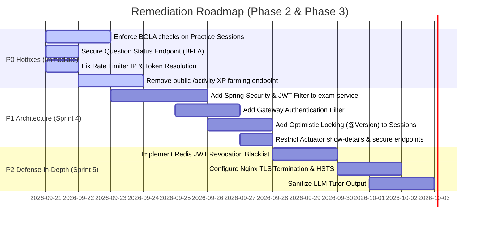

# AprovaENEM — Comprehensive Security Audit & Threat Model Report
**Milestone:** JAM 1 (Sprint 3 Finalization)  
**Task Reference:** `TASK-S3-11` (Phase 2 — Backend Architecture & API Security Audit)  
**Date:** September 20, 2026  
**Auditor:** Lead Application Security Architect & Threat Modeler  
**Target Scope:**
- `backend/frontend-api` (Edge BFF Gateway)
- `backend/auth-service` (Identity, Session & Gamification)
- `backend/exam-service` (Examination, Assessment & Socratic AI Tutor)
- `backend/notification-service` (Multi-Channel Dispatcher)
- `backend/common-core` (Shared DTOs, Exceptions & Domain Events)
- Ingress Proxy & Orchestration: `docker-compose.yml` & `infrastructure/nginx/nginx.conf`

---

## 1. Executive Summary & Security Posture Score

### 1.1 Executive Assessment
An uncompromising, white-box static code analysis and threat modeling evaluation was conducted across the AprovaENEM microservices backend. The evaluation benchmarked every controller, service, repository, security configuration, reverse proxy configuration, and domain model against the **OWASP API Security Top 10 (2023)**.

The AprovaENEM backend shows strong architectural fundamentals in data-at-rest encryption hygiene (BCrypt cost 10 combined with HMAC-SHA256 peppering in `BCryptPasswordEncoderAdapter`), event-driven atomicity via the Transactional Outbox pattern (`OutboxPollingWorker`), and internal container network segregation (`internal: true` in `docker-compose.yml`).

However, **critical security architecture deficiencies** were uncovered in access control enforcement, perimeter authentication, and business flow integrity:
1. **Perimeter Authentication & Authorization Void in `exam-service`:** `exam-service` completely lacks Spring Security (`spring-boot-starter-security` is absent from `pom.xml`). With no authentication filter on the Edge Gateway (`frontend-api`), core examination endpoints are completely exposed to the public internet without authentication.
2. **Universal Broken Object Level Authorization (BOLA):** In `PracticeSessionController`, endpoints for retrieving sessions (`GET /api/v1/sessions/{id}`), submitting answers (`POST /api/v1/sessions/{id}/attempts`), completing sessions (`POST /api/v1/sessions/{id}/complete`), and viewing diagnostic reports (`GET /api/v1/sessions/{id}/diagnostic`) perform **zero caller identity validation**. Any user can read, answer, or abort any other student's exam session.
3. **Severe Broken Function Level Authorization (BFLA):** The administrative endpoint `PATCH /api/v1/questions/{id}/status` has no authorization checks or role validation, allowing any unauthenticated user to deactivate questions platform-wide. Similarly, `POST /api/v1/gamification/reminders/trigger` permits any student to broadcast system-wide study reminders.
4. **Spoofable Edge Rate Limiting:** The Gateway token bucket rate limiter in `RateLimiterConfig.java` takes the first IP from `X-Forwarded-For` without proxy sanitization, and hashes raw `Authorization` Bearer strings without signature validation. Attackers can completely circumvent rate limits by rotating fake headers.
5. **Client-Controlled XP Farming:** `POST /api/v1/gamification/activity` accepts client-supplied `questionsSolved` and `correctCount` without server-side verification against completed exam sessions, enabling instantaneous streak, XP, and leaderboard manipulation.

### 1.2 Security Posture Score

| Metric | Rating | Description |
| :--- | :---: | :--- |
| **Overall Security Posture Score** | **D+ (58/100)** | Critical authorization gaps on core exam flows, spoofable rate limits, and unauthenticated administrative functions offset strong cryptographic storage. |
| **Perimeter Hardening** | **C** | Nginx exposes port 443 without TLS certificates; rate limiter can be bypassed via header rotation; Actuator health details leaked publicly. |
| **Authentication & Tokens** | **C-** | Secure password peppering and modern JJWT parser; but no token revocation/blocklist in Redis, no refresh tokens, and missing Spring Security in `exam-service`. |
| **Authorization (BOLA/BFLA)** | **F** | Universal BOLA on practice sessions; unauthenticated catalog status modification; `X-User-Id` header overrides principal in auth/notification services. |
| **Business Flow Integrity** | **D** | Client-controlled XP injection; race conditions / lost updates on concurrent exam attempt submissions due to missing entity locking. |

### 1.3 Vulnerability Summary Matrix



| ID | OWASP Category | Severity | Description | Target Module |
| :--- | :--- | :---: | :--- | :--- |
| **VULN-01** | API1:2023 BOLA | **CRITICAL** | Missing ownership check on practice sessions (read, submit, complete, diagnostic) | `exam-service` |
| **VULN-02** | API2:2023 Broken Auth | **CRITICAL** | Complete omission of Spring Security and Edge Gateway auth enforcement | `exam-service`, `frontend-api` |
| **VULN-03** | API5:2023 BFLA | **CRITICAL** | Unauthenticated question catalog modification (`PATCH /api/v1/questions/{id}/status`) | `exam-service` |
| **VULN-04** | API6:2023 Business Flow | **HIGH** | Client-controlled XP injection and streak manipulation (`POST /api/v1/gamification/activity`) | `auth-service` |
| **VULN-05** | API1:2023 BOLA | **HIGH** | Unverified `X-User-Id` header overrides principal in Gamification & Notification controllers | `auth-service`, `notification-service` |
| **VULN-06** | API4:2023 Resource | **HIGH** | Edge Gateway rate limiter bypass via `X-Forwarded-For` and fake Bearer rotation | `frontend-api` |
| **VULN-07** | API4:2023 Resource | **HIGH** | Unbounded pagination `size` parameter leading to heap exhaustion (OOM DoS) | `exam-service` |
| **VULN-08** | API5:2023 BFLA | **HIGH** | System-wide notification broadcast callable by regular students (`/reminders/trigger`) | `auth-service` |
| **VULN-09** | API6:2023 Business Flow | **HIGH** | Race condition / lost updates on concurrent exam answer submissions | `exam-service` |
| **VULN-10** | API8:2023 Misconfiguration| **HIGH** | Public exposure of internal infrastructure details via Actuator `show-details: always` | `frontend-api`, all services |
| **VULN-11** | API2:2023 Broken Auth | **MEDIUM** | Absence of JWT revocation blacklist in Redis and missing logout flow | `auth-service`, mesh |
| **VULN-12** | API3:2023 Mass Assignment | **MEDIUM** | Arbitrary `userId` binding in `StartSessionRequest` payload | `exam-service` |
| **VULN-13** | API3:2023 Excessive Exposure| **MEDIUM** | Missing `@JsonIgnore` annotations on password hash and reset tokens in User models | `auth-service` |
| **VULN-14** | API4:2023 Resource | **MEDIUM** | Performance degradation via unindexed `ORDER BY RANDOM()` in practice session generation | `exam-service` |
| **VULN-15** | API10:2023 Unsafe API | **MEDIUM** | Unsanitized external LLM output persisted to DB and rendered directly to client | `exam-service` |
| **VULN-16** | API8:2023 Misconfiguration| **MEDIUM** | Missing TLS/SSL configuration and HTTPS redirection on port 443 | Nginx / Docker Compose |
| **VULN-17** | API4:2023 Resource | **LOW** | Missing `client_max_body_size` directive in reverse proxy configuration | Nginx |
| **VULN-18** | API8:2023 Misconfiguration| **LOW** | Use of deprecated `X-XSS-Protection` and missing CSP / HSTS headers | Nginx |
| **VULN-19** | API8:2023 Misconfiguration| **LOW** | Absence of dedicated `GlobalExceptionHandler` in `notification-service` | `notification-service` |
| **VULN-20** | API9:2023 Inventory | **LOW** | OpenAPI contract divergence regarding question status update security requirements | `exam-service` |
| **VULN-21** | API7:2023 SSRF | **INFORMATIONAL** | Fixed outbound Gemini URL lacks container-level egress firewall rule | `exam-service` |

---

## 2. Deep-Dive OWASP API Security Top 10 (2023) Analysis

---

### Category 1: API1:2023 Broken Object Level Authorization (BOLA)

#### Finding 1.1: [CRITICAL] Universal Broken Object Level Authorization on Practice Sessions
- **File & Lines:**
  - `backend/exam-service/src/main/java/com/aprovaenem/exam/infrastructure/adapter/in/web/PracticeSessionController.java`#L69-L115
  - `backend/exam-service/src/main/java/com/aprovaenem/exam/application/service/PracticeSessionService.java`#L66-L117, #L120-L184, #L187-L199
- **Vulnerability Mechanism:**
  In `PracticeSessionController`, the endpoints:
  - `GET /api/v1/sessions/{id}` (`getSession`)
  - `POST /api/v1/sessions/{id}/attempts` (`submitAnswer`)
  - `POST /api/v1/sessions/{id}/complete` (`completeSession`)
  - `GET /api/v1/sessions/{id}/diagnostic` (`getDiagnosticReport`)
  
  accept a session UUID directly from the URI path. Neither the controller method nor the underlying `PracticeSessionService` checks whether the authenticated caller (`userId` or guest `anonymousSessionId`) owns the targeted `PracticeSession`.
  
  In `PracticeSessionService.java` (lines 71-73):
  ```java
  PracticeSession session = sessionRepository.findById(command.getSessionId())
          .orElseThrow(() -> new ResourceNotFoundException("Practice session", command.getSessionId()));
  ```
  The service immediately performs mutations or reads without comparing `session.getUserId()` or `session.getAnonymousSessionId()` against the client.
- **Exploit Scenario / Business Impact:**
  Student A starts a practice exam. Student B queries `/api/v1/sessions/{Student_A_Session_ID}` to view all questions and generated options. Student B can also invoke `POST /api/v1/sessions/{Student_A_Session_ID}/attempts` with incorrect answers, deliberately destroying Student A's exam score, TRI evaluation, and diagnostic report. Student B can also call `/complete` to terminate Student A's exam prematurely.
- **Remediation:**
  1. Require authentication on `PracticeSessionController` (or pass verified identity from Edge Gateway).
  2. In `PracticeSessionService`, enforce ownership checks on all session operations:
  ```java
  if (session.getUserId() != null && !session.getUserId().equals(callerUserId)) {
      throw new AccessDeniedException("You do not have permission to access this practice session.");
  }
  if (session.getUserId() == null && !session.getAnonymousSessionId().equals(callerSessionId)) {
      throw new AccessDeniedException("Session token does not match session owner.");
  }
  ```

---

#### Finding 1.2: [HIGH] Blind Trust and Precedence of `X-User-Id` Header Over Principal
- **File & Lines:**
  - `backend/auth-service/src/main/java/com/aprovaenem/auth/infrastructure/adapter/in/web/GamificationController.java`#L136-L147
  - `backend/notification-service/src/main/java/com/aprovaenem/notification/infrastructure/adapter/in/web/NotificationController.java`#L82-L88
- **Vulnerability Mechanism:**
  Both `GamificationController` and `NotificationController` implement a custom `resolveUserId` helper method:
  ```java
  private UUID resolveUserId(UserDetails userDetails, String xUserId) {
      if (xUserId != null && !xUserId.isBlank()) {
          try {
              return UUID.fromString(xUserId);
          } catch (IllegalArgumentException ignored) {
          }
      }
      if (userDetails != null) {
          return UUID.fromString(userDetails.getUsername());
      }
      throw new IllegalArgumentException("Authenticated user could not be identified");
  }
  ```
  The unverified request header `X-User-Id` is prioritized **ahead** of the cryptographically verified `UserDetails` / JWT claims.
  While `frontend-api` specifies `RemoveRequestHeader=X-User-Id` in its default filters, any direct access to these microservices (internal pod-to-pod communication, SSRF, or misrouted edge proxy) allows any caller to impersonate any user on the platform simply by injecting `X-User-Id: <victim-uuid>`.
- **Exploit Scenario / Business Impact:**
  An attacker provides their own valid student JWT (passing authentication), but appends `X-User-Id: <target-admin-or-student-uuid>`. The controller resolves the target's UUID, granting full read/write access to the target's gamification profile, daily goals, badges, unread notifications, and device push tokens.
- **Remediation:**
  Remove `X-User-Id` header resolution entirely. Exclusively use `SecurityContextHolder.getContext().getAuthentication().getPrincipal()` or a signed internal JWT token (mTLS / JWT assertion) between gateway and services.

---

### Category 2: API2:2023 Broken Authentication

#### Finding 2.1: [CRITICAL] Complete Omission of Spring Security in `exam-service`
- **File & Lines:**
  - `backend/exam-service/pom.xml`#L20-L154
  - `backend/exam-service/src/main/java/com/aprovaenem/exam/infrastructure/adapter/in/web/PracticeSessionController.java`#L35-L115
  - `backend/exam-service/src/main/java/com/aprovaenem/exam/infrastructure/adapter/in/web/QuestionCatalogController.java`#L30-L83
- **Vulnerability Mechanism:**
  `exam-service` has no dependency on `spring-boot-starter-security`. It does not declare a `SecurityFilterChain`, has no authentication filters, and does not register a `SecurityContext`.
  The class `JwtTokenValidator` exists, but is **only** called manually inside `SocraticTutorController.java` (lines 48, 103, 129, 151).
  The Edge Gateway (`frontend-api`) has no authentication filter either; it simply routes traffic to `http://exam-service:8082`.
- **Exploit Scenario / Business Impact:**
  All endpoints on `exam-service` (including question listing, question details, catalog status changes, session provisioning, answer submissions, and diagnostics) are accessible to anyone on the internet without credentials.
- **Remediation:**
  1. Add `spring-boot-starter-security` to `backend/exam-service/pom.xml`.
  2. Implement a unified `JwtAuthenticationFilter` and `SecurityConfig` in `exam-service` that protects all `/api/v1/**` routes, leaving only `/health`, `/actuator/health`, and public question browsing unauthenticated.

---

#### Finding 2.2: [HIGH] Edge Gateway Fails to Enforce Authentication
- **File & Lines:**
  - `backend/frontend-api/src/main/resources/application.yml`#L52-L99
  - Absence of Gateway `AuthenticationFilter` in `backend/frontend-api/src/main/java/com/aprovaenem/gateway/infrastructure/`
- **Vulnerability Mechanism:**
  `frontend-api` acts as a reverse proxy with rate limiting and trace ID injection (`TraceHeaderFilter.java`), but does not contain an `AuthenticationFilter` (or Spring Cloud Gateway `AuthorizeExchangeSpec`). It routes `/api/v1/questions/**`, `/api/v1/sessions/**`, `/api/v1/auth/**`, and `/api/v1/notifications/**` blindly downstream without checking if an `Authorization` header exists or contains a valid signature.
- **Remediation:**
  Implement a `JwtValidationGatewayFilter` or configure Spring Security WebFlux on `frontend-api` to validate JWT signatures at the edge perimeter before dispatching traffic to backend microservices.

---

#### Finding 2.3: [MEDIUM] Absence of JWT Revocation / Invalidation Blacklist and Logout Flow
- **File & Lines:**
  - `backend/auth-service/src/main/java/com/aprovaenem/auth/infrastructure/adapter/out/security/JwtTokenProvider.java`#L73-L84
  - `backend/exam-service/src/main/java/com/aprovaenem/exam/infrastructure/security/JwtTokenValidator.java`#L31-L42
  - `backend/notification-service/src/main/java/com/aprovaenem/notification/infrastructure/security/JwtTokenValidator.java`#L31-L42
  - `backend/auth-service/src/main/java/com/aprovaenem/auth/infrastructure/adapter/in/web/AuthController.java`#L32-L152
- **Vulnerability Mechanism:**
  Tokens are signed HMAC-SHA256 with a 24-hour TTL (`jwt.expiration-ms: 86400000`).
  None of the JWT validators query Redis to determine whether a token has been revoked.
  Furthermore, `AuthController` contains no `POST /api/v1/auth/logout` endpoint. Even when a user deletes their account (`DELETE /api/v1/auth/me`), their issued JWT remains valid across all services until the 24-hour expiration window lapses.
- **Remediation:**
  1. Add a Redis token blocklist (`revoked_tokens:{jti}`) checked by all JWT validators.
  2. Provide a `POST /api/v1/auth/logout` endpoint that registers the token's remaining TTL in Redis.
  3. Shorten access token lifetime to 15–30 minutes and implement a secure Refresh Token rotation flow.

---

#### Finding 2.4: [LOW] Lack of Account Lockout and Weak Password Policy
- **File & Lines:**
  - `backend/auth-service/src/main/java/com/aprovaenem/auth/application/service/AuthService.java`#L104-L127
  - `backend/auth-service/src/main/java/com/aprovaenem/auth/infrastructure/adapter/in/web/dto/RegisterRequest.java`#L22-L24
- **Vulnerability Mechanism:**
  `AuthService.login()` does not track failed consecutive login attempts. No account lockout, CAPTCHA challenge, or progressive backoff delay is triggered.
  In `RegisterRequest.java`, the password validator only requires `@Size(min = 8, max = 100)`, with no character class requirements (uppercase, lowercase, number, symbol) or dictionary breach checks.
- **Remediation:**
  1. Track failed attempts per email in Redis (`login:failed:{email}`) and temporarily lock accounts after 5 failures.
  2. Enforce NIST SP 800-63B password guidelines and regex validation on `RegisterRequest`.

---

### Category 3: API3:2023 Broken Object Property Level Authorization

#### Finding 3.1: [HIGH] Client-Supplied `userId` Mass Assignment in Session Creation
- **File & Lines:**
  - `backend/exam-service/src/main/java/com/aprovaenem/exam/infrastructure/adapter/in/web/dto/StartSessionRequest.java`#L21
  - `backend/exam-service/src/main/java/com/aprovaenem/exam/infrastructure/adapter/in/web/PracticeSessionController.java`#L56-L63
- **Vulnerability Mechanism:**
  `StartSessionRequest` contains a mutable `private UUID userId;` field. In `PracticeSessionController.java`:
  ```java
  StartSessionCommand command = new StartSessionCommand(
          request != null ? request.getUserId() : null,
          sessionId,
          ...
  );
  ```
  The controller forwards `request.getUserId()` directly to `PracticeSessionService`, which binds that `userId` to the newly persisted `PracticeSessionEntity`. An unauthenticated guest or malicious student can associate practice sessions with any other user's account ID.
- **Remediation:**
  Remove `userId` from `StartSessionRequest`. Retrieve `userId` strictly from the authenticated security principal in the session context.

---

#### Finding 3.2: [HIGH] Unvalidated Client-Controlled XP & Activity Ingestion
- **File & Lines:**
  - `backend/auth-service/src/main/java/com/aprovaenem/auth/infrastructure/adapter/in/web/dto/RecordActivityRequest.java`#L15-L21
  - `backend/auth-service/src/main/java/com/aprovaenem/auth/application/service/GamificationService.java`#L108-L151
- **Vulnerability Mechanism:**
  `RecordActivityRequest` allows clients to supply arbitrary integers for `questionsSolved` and `correctCount`:
  ```java
  @Min(value = 0, message = "Questions solved cannot be negative.")
  private int questionsSolved;

  @Min(value = 0, message = "Correct count cannot be negative.")
  private int correctCount;
  ```
  In `GamificationService.awardXpForActivity`:
  ```java
  int xpToAdd = (correctCount * 10) + (sessionCompleted ? 50 : 0);
  ...
  profile.setCurrentXp(profile.getCurrentXp() + xpToAdd);
  ```
  There is no maximum ceiling and no verification against actual exam attempts in `exam-service`.
- **Exploit Scenario / Business Impact:**
  A student sends `{"questionsSolved": 500000, "correctCount": 500000, "sessionCompleted": true}` to `/api/v1/gamification/activity`. The system credits 5,000,050 XP, elevates the user to Level 25,000, and corrupts the weekly leaderboard.
- **Remediation:**
  Decommission direct public HTTP invocation of `/api/v1/gamification/activity`. Gamification XP should be awarded asynchronously via RabbitMQ domain events (`ExamSessionCompletedEvent`) dispatched by `exam-service` upon verified session completion.

---

#### Finding 3.3: [MEDIUM] Lack of JSON Serialization Guards on Sensitive Domain and Entity Attributes
- **File & Lines:**
  - `backend/auth-service/src/main/java/com/aprovaenem/auth/domain/model/User.java`#L19, #L26-L29
  - `backend/auth-service/src/main/java/com/aprovaenem/auth/infrastructure/adapter/out/persistence/entity/UserEntity.java`#L38-L39, #L61-L71
- **Vulnerability Mechanism:**
  Attributes such as `passwordHash`, `emailVerificationToken`, and `passwordResetToken` in `User.java` and `UserEntity.java` lack `@JsonIgnore` or `@JsonProperty(access = Access.WRITE_ONLY)`. If an endpoint or logging utility ever serializes a `User` instance directly, password hashes and reset tokens will leak into responses or log files.
- **Remediation:**
  Annotate sensitive credentials in domain models and JPA entities with `@JsonIgnore`.

---

### Category 4: API4:2023 Unrestricted Resource Consumption

#### Finding 4.1: [HIGH] Unbounded Pagination Page Size in Question Catalog
- **File & Lines:**
  - `backend/exam-service/src/main/java/com/aprovaenem/exam/domain/model/QuestionFilterCommand.java`#L25, #L81
  - `backend/exam-service/src/main/java/com/aprovaenem/exam/infrastructure/adapter/in/web/QuestionCatalogController.java`#L45-L48
- **Vulnerability Mechanism:**
  In `QuestionFilterCommand.java`:
  ```java
  this.size = size > 0 ? size : 20;
  ```
  There is no upper ceiling on `size`. In `QuestionCatalogController.java`:
  ```java
  @RequestParam(required = false, defaultValue = "20") int size
  ```
  A client requesting `GET /api/v1/questions?size=1000000` causes Hibernate to load 1,000,000 records (plus their lazily initialized options and topics) into the JVM heap.
- **Exploit Scenario / Business Impact:**
  Sending a small burst of requests with `size=500000` induces heavy garbage collection pauses, exhaust container memory, and triggers Out-Of-Memory (OOM) killer terminations.
- **Remediation:**
  Enforce a strict maximum limit in `QuestionFilterCommand`:
  ```java
  this.size = Math.min(Math.max(1, size), 50);
  ```

---

#### Finding 4.2: [HIGH] Edge Gateway Rate Limiter Bypass via Header Spoofing
- **File & Lines:**
  - `backend/frontend-api/src/main/java/com/aprovaenem/gateway/infrastructure/ratelimit/RateLimiterConfig.java`#L23-L47
  - `infrastructure/nginx/nginx.conf`#L64, #L84, #L100
- **Vulnerability Mechanism:**
  In `RateLimiterConfig.java`:
  ```java
  // 1. Authenticated Bearer Token
  String auth = exchange.getRequest().getHeaders().getFirst("Authorization");
  if (auth != null && auth.startsWith("Bearer ") && auth.length() > 7) {
      return Mono.just("user:" + Integer.toHexString(auth.substring(7).trim().hashCode()));
  }
  ...
  // 3. Client IP address (X-Forwarded-For or remote socket address)
  String xff = exchange.getRequest().getHeaders().getFirst("X-Forwarded-For");
  if (xff != null && !xff.isBlank()) {
      String clientIp = xff.split(",")[0].trim();
      return Mono.just("ip:" + clientIp);
  }
  ```
  1. The Gateway hashes any unverified Bearer string. An attacker sending `Authorization: Bearer test1`, `Bearer test2`, etc., gets a fresh Redis rate limiting bucket on every request.
  2. When resolving IP, it takes `xff.split(",")[0]`. In `nginx.conf`, Nginx uses `proxy_set_header X-Forwarded-For $proxy_add_x_forwarded_for;`, which appends the real remote address to any incoming `X-Forwarded-For` header sent by the client. An attacker sending `X-Forwarded-For: 203.0.113.1` has their spoofed IP treated as the rate limit key.
- **Exploit Scenario / Business Impact:**
  Attackers can flood the AI Tutor (`/api/v1/questions/{id}/ask`), auth login, or question search endpoints with millions of requests, completely circumventing Redis token bucket throttling.
- **Remediation:**
  1. For IP resolution, only trust the client IP appended by Nginx (`$remote_addr`) or configure `X-Real-IP`.
  2. For Bearer tokens, only use the rate limit bucket if the JWT has a valid cryptographic signature and extract the authenticated `sub` (subject UUID).

---

#### Finding 4.3: [MEDIUM] Missing Request Body Limits in Reverse Proxy
- **File & Lines:**
  - `infrastructure/nginx/nginx.conf`#L11-L120
- **Vulnerability Mechanism:**
  `nginx.conf` does not define `client_max_body_size`. While Nginx defaults to 1MB, downstream Spring Boot services default to 2MB–10MB without explicit container memory ceiling limits.
- **Remediation:**
  Explicitly set `client_max_body_size 2M;` in the `http` or `server` block of `nginx.conf`.

---

#### Finding 4.4: [MEDIUM] DoS via Unindexed `ORDER BY RANDOM()` in Practice Session Generation
- **File & Lines:**
  - `backend/exam-service/src/main/java/com/aprovaenem/exam/infrastructure/adapter/out/persistence/repository/SpringDataQuestionRepository.java`#L18-L25
- **Vulnerability Mechanism:**
  The native query in `findRandomActiveQuestions`:
  ```sql
  SELECT q.* FROM questions q
  WHERE q.status = 'ACTIVE'
    AND (:topicId IS NULL OR q.topic_id = :topicId)
    AND (:difficulty IS NULL OR q.difficulty_level = :difficulty)
  ORDER BY RANDOM()
  LIMIT :limit
  ```
  PostgreSQL's `ORDER BY RANDOM()` requires generating a random number for every single row matching the filter criteria and sorting the entire set in memory or on disk. Under concurrent load on a database with tens of thousands of questions, this exhausts database CPU and I/O.
- **Remediation:**
  Use indexed reservoir sampling or select random IDs using a pre-computed sequence / random offset index.

---

### Category 5: API5:2023 Broken Function Level Authorization (BFLA)

#### Finding 5.1: [CRITICAL] Unauthenticated Administrative Endpoint Modifying Question Catalog Status
- **File & Lines:**
  - `backend/exam-service/src/main/java/com/aprovaenem/exam/infrastructure/adapter/in/web/QuestionCatalogController.java`#L74-L83
- **Vulnerability Mechanism:**
  ```java
  @PatchMapping("/{id}/status")
  public ResponseEntity<QuestionDetailResponse> updateStatus(
          @PathVariable UUID id,
          @Valid @RequestBody UpdateQuestionStatusRequest request
  ) {
      Question updated = catalogUseCase.updateQuestionStatus(
              id, request.getStatus(), request.getSuspensionReason()
      );
      return ResponseEntity.ok(toDetailDto(updated));
  }
  ```
  This endpoint modifies question operational states (e.g. `SUSPENDED`, `ACTIVE`). It has **no** `@PreAuthorize("hasRole('ADMIN')")`, **no** JWT validation, and `exam-service` has no Spring Security filters.
- **Exploit Scenario / Business Impact:**
  Any anonymous user can iterate over question UUIDs and send `PATCH /api/v1/questions/{id}/status` with `status: "SUSPENDED"`, taking down the entire question bank.
- **Remediation:**
  Enforce Spring Security with `@PreAuthorize("hasRole('ADMIN')")` and verify administrative roles at the Edge Gateway.

---

#### Finding 5.2: [HIGH] Privileged System Broadcast Endpoint Accessible to Students
- **File & Lines:**
  - `backend/auth-service/src/main/java/com/aprovaenem/auth/infrastructure/adapter/in/web/GamificationController.java`#L129-L134
- **Vulnerability Mechanism:**
  ```java
  @PostMapping("/reminders/trigger")
  @PreAuthorize("hasAnyRole('STUDENT', 'PREMIUM_STUDENT')")
  public ResponseEntity<Map<String, Object>> triggerStudyReminders() {
      int count = gamificationUseCase.triggerDailyStudyReminders();
      return ResponseEntity.ok(Map.of("dispatchedReminders", count));
  }
  ```
  The endpoint triggers the daily 19:00 BRT study reminder sweep, publishing `DailyGoalReminderEvent` to RabbitMQ for all users who haven't completed their daily goals. The annotation grants access to `STUDENT` and `PREMIUM_STUDENT`.
- **Exploit Scenario / Business Impact:**
  A malicious student can trigger thousands of emails and push notifications to all platform users by spamming this endpoint, exhausting external notification quotas and causing notification fatigue.
- **Remediation:**
  Change authorization to `@PreAuthorize("hasRole('ADMIN')")` or restrict execution entirely to internal scheduled background cron jobs (`@Scheduled`).

---

#### Finding 5.3: [MEDIUM] Open Actuator Exposure via Security Configuration
- **File & Lines:**
  - `backend/auth-service/src/main/java/com/aprovaenem/auth/infrastructure/adapter/out/security/SecurityConfig.java`#L43
- **Vulnerability Mechanism:**
  `SecurityConfig.java` configures:
  ```java
  .requestMatchers(EndpointRequest.toAnyEndpoint()).permitAll()
  ```
  This grants anonymous public access to every enabled Spring Boot Actuator endpoint in `auth-service`.
- **Remediation:**
  Restrict actuator endpoints to internal admin roles or localhost:
  ```java
  .requestMatchers(EndpointRequest.toAnyEndpoint()).hasRole("ADMIN")
  ```

---

### Category 6: API6:2023 Unrestricted Access to Sensitive Business Flows

#### Finding 6.1: [HIGH] Direct Endpoint Exposure Allows Unrestricted XP Farming and Leaderboard Manipulation
- **File & Lines:**
  - `backend/auth-service/src/main/java/com/aprovaenem/auth/infrastructure/adapter/in/web/GamificationController.java`#L111-L127
  - `backend/auth-service/src/main/java/com/aprovaenem/auth/application/service/GamificationService.java`#L108-L188
- **Vulnerability Mechanism:**
  The business flow for advancing streaks, earning XP, and climbing the weekly leaderboard is exposed directly over HTTP via `POST /api/v1/gamification/activity`. This decouples reward allocation from the actual verified completion of questions.
- **Remediation:**
  Remove the `/activity` endpoint from the public API. XP awards must only be processed via asynchronous event listener consuming events signed by `exam-service`.

---

#### Finding 6.2: [HIGH] Concurrency Race Condition & Lost Updates in Exam Session Submissions
- **File & Lines:**
  - `backend/exam-service/src/main/java/com/aprovaenem/exam/application/service/PracticeSessionService.java`#L86-L89
  - `backend/exam-service/src/main/java/com/aprovaenem/exam/infrastructure/adapter/out/persistence/entity/PracticeSessionEntity.java`#L26-L79
- **Vulnerability Mechanism:**
  When a student submits an answer:
  ```java
  boolean isCorrect = question.isOptionCorrect(command.getSelectedOption());
  if (isCorrect) {
      session.incrementCorrectCount();
      sessionRepository.save(session);
  }
  ```
  `PracticeSessionEntity` lacks a `@Version` annotation, and `PracticeSessionService` does not acquire a pessimistic write lock (`SELECT ... FOR UPDATE`).
  If a student submits answers to two questions concurrently, both threads read the same initial `correctCount`, increment it by 1, and write back the same value. One correct answer is lost.
- **Remediation:**
  1. Add `@Version private Long version;` to `PracticeSessionEntity` for optimistic locking.
  2. Alternatively, compute `correctCount` dynamically via `SELECT count(*) FROM student_attempts WHERE session_id = :id AND is_correct = true`.

---

### Category 7: API7:2023 Server-Side Request Forgery (SSRF)

#### Finding 7.1: [LOW] Outbound LLM HTTP Request Lacks Container-Level Egress Firewall
- **File & Lines:**
  - `backend/exam-service/src/main/java/com/aprovaenem/exam/infrastructure/adapter/out/ai/GeminiTutorClientAdapter.java`#L34-L36, #L71-L79
  - `docker-compose.yml`#L131-L169
- **Vulnerability Mechanism:**
  `GeminiTutorClientAdapter` uses `baseUrl` from `@Value("${gemini.base-url:https://generativelanguage.googleapis.com}")`. The URL is not derived from user input, which eliminates traditional SSRF.
  However, `exam-service` is located on the bridge network and can make arbitrary outbound HTTP connections. If an injection vulnerability occurs elsewhere, the application could be leveraged to scan internal infrastructure.
- **Remediation:**
  Implement egress firewall rules or an explicit outbound HTTP client proxy allowlist restricting destinations strictly to `generativelanguage.googleapis.com`.

---

### Category 8: API8:2023 Security Misconfiguration

#### Finding 8.1: [HIGH] Public Exposure of Internal Infrastructure via Actuator `show-details: always`
- **File & Lines:**
  - `infrastructure/nginx/nginx.conf`#L59-L65
  - `backend/frontend-api/src/main/resources/application.yml`#L145
  - `backend/auth-service/src/main/resources/application.yml`#L60
  - `backend/exam-service/src/main/resources/application.yml`#L78
  - `backend/notification-service/src/main/resources/application.yml`#L44
- **Vulnerability Mechanism:**
  All four services configure `management.endpoint.health.show-details: always`.
  In `nginx.conf`:
  ```nginx
  location /actuator/health {
      proxy_pass http://frontend_api;
      ...
  }
  ```
  Anyone querying `http://<host>/actuator/health` receives a detailed JSON breakdown revealing database hostnames, disk usage, Redis cluster connectivity, and RabbitMQ server versions.
- **Remediation:**
  Change `show-details: always` to `show-details: never` (or `when-authorized` with an admin role) across all production configuration files.

---

#### Finding 8.2: [MEDIUM] Port 443 Exposed Without TLS Termination or HTTPS Redirect
- **File & Lines:**
  - `docker-compose.yml`#L35-L36
  - `infrastructure/nginx/nginx.conf`#L41-L50
- **Vulnerability Mechanism:**
  `docker-compose.yml` binds `"443:443"`. However, `nginx.conf` only defines `listen 80; listen [::]:80;`. There is no SSL certificate configured, no port 443 listener, and no HTTP-to-HTTPS redirect rule (`return 301 https://$host$request_uri;`).
- **Remediation:**
  Configure SSL termination in Nginx using TLSv1.3 and valid certificates, and redirect all port 80 traffic to HTTPS.

---

#### Finding 8.3: [LOW] Deprecated Security Headers and Missing CSP/HSTS
- **File & Lines:**
  - `infrastructure/nginx/nginx.conf`#L46-L50
- **Vulnerability Mechanism:**
  `nginx.conf` uses the deprecated `add_header X-XSS-Protection "1; mode=block" always;` header (which can introduce side-channel vulnerabilities in older browsers). Furthermore, `Strict-Transport-Security` (HSTS) and `Content-Security-Policy` (CSP) are missing.
- **Remediation:**
  Remove `X-XSS-Protection`. Add:
  ```nginx
  add_header Strict-Transport-Security "max-age=31536000; includeSubDomains; preload" always;
  add_header Content-Security-Policy "default-src 'self'; script-src 'self'; style-src 'self' 'unsafe-inline'; img-src 'self' data:; connect-src 'self';" always;
  ```

---

#### Finding 8.4: [LOW] Absence of Dedicated `GlobalExceptionHandler` in `notification-service`
- **File & Lines:**
  - `backend/notification-service/src/main/java/com/aprovaenem/notification/`
- **Vulnerability Mechanism:**
  Unlike `auth-service` and `exam-service`, `notification-service` lacks a `@RestControllerAdvice` class. Uncaught exceptions (e.g. database connection errors) trigger Spring Boot's default error page, risking stack trace leaks.
- **Remediation:**
  Implement a `GlobalExceptionHandler` in `notification-service` adhering to RFC 7807 problem details.

---

### Category 9: API9:2023 Improper Inventory Management

#### Finding 9.1: [MEDIUM] Contract vs Codebase Divergence in OpenAPI Documentation
- **File & Lines:**
  - `backend/exam-service/src/main/java/com/aprovaenem/exam/infrastructure/config/OpenApiConfig.java`#L42
  - `backend/exam-service/src/main/java/com/aprovaenem/exam/infrastructure/adapter/in/web/QuestionCatalogController.java`#L74-L83
- **Vulnerability Mechanism:**
  `OpenApiConfig.java` states in its security scheme description:
  > *"Required Bearer JWT authentication for Socratic AI Tutor sessions and question status updates."*
  
  In reality, `QuestionCatalogController.updateStatus` has **no security annotations or token validation**, leading to false security assurances in documentation while leaving production endpoints unprotected.
- **Remediation:**
  Align code with OpenAPI specifications by securing `PATCH /api/v1/questions/{id}/status`.

---

#### Finding 9.2: [LOW] Zombie Gateway Route for Unimplemented `/api/v1/users/**`
- **File & Lines:**
  - `backend/frontend-api/src/main/resources/application.yml`#L81
- **Vulnerability Mechanism:**
  `application.yml` routes `/api/v1/users/**` to `auth-service`. However, `auth-service` implements no controllers or handlers for `/api/v1/users/**`.
- **Remediation:**
  Remove unused route predicates from Gateway configuration.

---

### Category 10: API10:2023 Unsafe Consumption of APIs

#### Finding 10.1: [MEDIUM] Unsanitized LLM Candidate Output Ingested and Stored in Database
- **File & Lines:**
  - `backend/exam-service/src/main/java/com/aprovaenem/exam/infrastructure/adapter/out/ai/GeminiTutorClientAdapter.java`#L167-L181
  - `backend/exam-service/src/main/java/com/aprovaenem/exam/application/service/SocraticTutorService.java`#L127-L137
- **Vulnerability Mechanism:**
  Candidate text returned by Google Gemini API is extracted in `extractCandidateText` and stored directly in PostgreSQL (`tutor_chat_messages`) without HTML or script sanitization.
  If an adversarial prompt injection triggers the LLM to output malicious HTML, JavaScript, or Markdown links (`javascript:...`), this payload is stored in the database and served to students in `ChatHistoryResponse` and `TutorChatResponse`.fail
- **Remediation:**
  Apply HTML and Markdown sanitization (e.g. OWASP Java HTML Sanitizer or Jsoup) before storing and returning LLM responses.

---

#### Finding 10.2: [HIGH] Unauthenticated and Unsigned Inter-Service Header Trust (`X-User-Id`)
- **File & Lines:**
  - `backend/auth-service/src/main/java/com/aprovaenem/auth/infrastructure/adapter/in/web/GamificationController.java`#L136-L147
  - `backend/notification-service/src/main/java/com/aprovaenem/notification/infrastructure/adapter/in/web/NotificationController.java`#L82-L88
- **Vulnerability Mechanism:**
  Downstream services consume `X-User-Id` assuming it is authenticated by the Gateway. There is no cryptographic signature, HMAC, or mutual TLS validating that the header originated from `frontend-api`.
- **Remediation:**
  Pass signed internal JWT tokens or rely exclusively on caller credentials validated within each microservice.

---

## 3. Remediation Roadmap & Concrete Action Plan



### Phase A: Immediate P0 Hotfixes (Prior to JAM 1 Sign-Off)
1. **Remediate Practice Session BOLA:**
   In `PracticeSessionController.java` and `PracticeSessionService.java`, verify that the caller's identity matches `session.getUserId()` or `session.getAnonymousSessionId()`. Throw `AccessDeniedException` if mismatched.
2. **Lock Down Question Catalog Modification:**
   Add `@PreAuthorize("hasRole('ADMIN')")` to `PATCH /api/v1/questions/{id}/status`.
3. **Patch Rate Limiter Key Resolver:**
   In `RateLimiterConfig.java`, resolve client IP strictly using `$remote_addr` from Nginx (or `X-Real-IP`), and validate Bearer token signatures before using them as rate limit keys.
4. **Eliminate Client-Controlled XP Injection:**
   Remove `@PostMapping("/activity")` from `GamificationController.java`. Trigger gamification updates exclusively through internal RabbitMQ events.
5. **Secure Actuator Health Probes:**
   Set `management.endpoint.health.show-details: never` in all `application.yml` files.

### Phase B: Architectural P1 Enhancements
1. **Integrate Spring Security in `exam-service`:**
   Add `spring-boot-starter-security` to `backend/exam-service/pom.xml` and configure a stateless `SecurityFilterChain`.
2. **Prevent Submission Race Conditions:**
   Add `@Version` to `PracticeSessionEntity` and `UserGamificationProfileEntity`.
3. **Bound Pagination Sizes:**
   Cap `QuestionFilterCommand.size` to `Math.min(size, 50)`.
4. **Remove Insecure `X-User-Id` Fallback:**
   Rely strictly on authenticated security principals in `GamificationController` and `NotificationController`.

---
*Report certified and submitted by Lead Application Security Architect for AprovaENEM (TASK-S3-11 Phase 2).*
