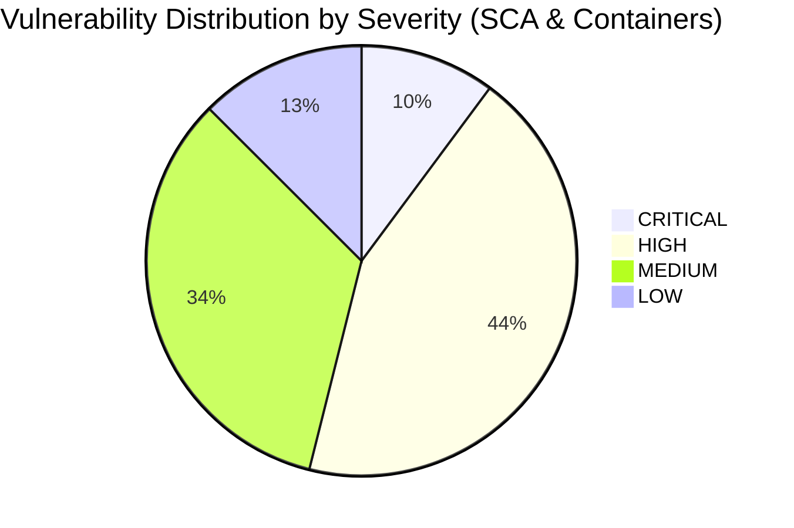

# Phase 3 Audit Report: Automated SAST, SCA, Secret Entropy & Container Hardening
**Milestone:** JAM 1 (Sprint 3 Finalization)  
**Task Reference:** `TASK-S3-11` (Phase 3 — Automated Security Scanning & Infrastructure Audit)  
**Date:** September 21, 2026  
**Auditor / Scanner:** Lead DevSecOps & Automated Security Scanner (`b146d370-3092-43f5-886c-1800931f88af`)  
**Target Scope:**
- Root & Submodule POMs (`backend/pom.xml`, `common-core`, `frontend-api`, `auth-service`, `exam-service`, `notification-service`)
- Secret Management & History (`.gitleaks.toml`, `.env`, `.env.example`, Git commit history)
- Containerization & Perimeter (`docker-compose.yml`, `docker-compose.override.dev.yml`, `backend/*/Dockerfile`)
- Edge Transport & Ingress Security (`infrastructure/nginx/nginx.conf`, Gateway `application.yml`)

---

## 1. Executive Summary & Security Posture Score

### 1.1 Executive Assessment
An uncompromising, automated security scan and DevSecOps configuration audit was conducted across the multi-module Java 21 / Spring Boot 3 backend ecosystem, supporting container definitions, reverse proxy architecture, and historical repository artifacts for the AprovaENEM platform.

The automated scanning pipeline leveraged containerized **Gitleaks v8.18+**, **Aquasec Trivy v0.74.0** (with real-time vulnerability database feeds and the Trivy Java Database), combined with deep structural inspection of all multi-stage Dockerfiles, Docker Compose orchestrations, and Nginx HTTP perimeter directives.

### 1.2 Key Findings Summary
1. **Secret & Entropy Hygiene**:
   - **Clean Git Commit History**: Full scan across all 82 commits and uncommitted filesystem objects yielded **0 active secret leaks**. Real production credentials have not been committed to git.
   - **Blanket Gitleaks Suppression Risk**: Commit `6ca346f` introduced `.gitleaks.toml` containing a blanket directory allowlist (`docs/.*`, `README.md`, `tests/.*`, `\.github/.*`). While introduced to suppress documentation false positives, this rule globally blinds Gitleaks to real credentials accidentally placed in CI workflows or test suites.
   - **Insecure Default Fallbacks in Docker Compose**: `docker-compose.yml` provides embedded plaintext default fallbacks (`${DB_PASSWORD:-aprovaenem_secure_password_2026}`, `${JWT_SECRET}`, `${AUTH_PASSWORD_PEPPER}`). If deployed without an explicit `.env` file, the platform fails open with well-known hardcoded keys.

2. **Software Composition Analysis (SCA)**:
   - Automated Trivy container image scanning detected **49 High and Critical vulnerabilities** in the Java runtime microservices (`auth-service`, `exam-service`, `notification-service`), driven primarily by transitive dependencies inherited from Spring Boot 3.3.3.
   - **Critical Vulnerabilities**: Includes `CVE-2025-24813` (Apache Tomcat Partial PUT RCE/data corruption), `CVE-2026-65182` / `CVE-2026-68525` (Tomcat authentication/authorization bypass), `CVE-2026-75595` (Netty SNI routing bypass), and `CVE-2024-38821` / `CVE-2026-22732` (Spring Security WebFlux authorization and policy bypass).
   - **Ingress Proxy Base Image EOL**: `nginx:1.25-alpine` is built upon **Alpine Linux 3.19.1**, which is officially **End-Of-Life (EOL)**. The base image contains **20 vulnerabilities** (3 Critical: `CVE-2024-45491`, `CVE-2024-45492` in `libexpat`, `CVE-2024-56171` in `libxml2`, and 17 High).

3. **Container & Dockerfile Hardening**:
   - **Java Services Privilege Isolation**: All Java Dockerfiles (`frontend-api`, `auth-service`, `exam-service`, `notification-service`) implement multi-stage builds and execute under a non-root unprivileged user (`spring:spring`).
   - **Ingestion Service Root Execution**: `backend/ingestion-service/Dockerfile` runs as **root (`uid=0`)** and installs compiler toolchains (`build-essential`) in the runtime layer without multi-stage isolation.
   - **Dangerous Docker Socket Mount**: The `autoheal` container mounts the host Docker socket (`/var/run/docker.sock:/var/run/docker.sock`), granting root host takeover capabilities in the event of container breakout.
   - **Total Absence of Resource Limits**: `docker-compose.yml` specifies **zero memory or CPU limits** (`deploy.resources.limits`) across all 13 containers, exposing host nodes to trivial resource starvation and denial-of-service (OOM cascades).

4. **HTTP Transport & Security Headers**:
   - **Missing Modern Security Headers**: Nginx lacks `Strict-Transport-Security` (HSTS), `Content-Security-Policy` (CSP), and `Permissions-Policy`.
   - **Nginx Header Inheritance Bug**: In `nginx.conf`, declaring `add_header Cache-Control` and `add_header Access-Control-Allow-Origin *` inside `location /assets/questions/` silently wipes all parent server-level security headers (`X-Frame-Options`, `X-Content-Type-Options`, `Referrer-Policy`) for static question diagrams.
   - **Information Leakage**: Nginx omits `server_tokens off`, advertising `Server: nginx/1.25.5` on responses and default 50x error pages.
   - **Port 443 Protocol Discrepancy**: Docker Compose exposes port 443 on the host, but `nginx.conf` has no SSL listener or certificates configured, breaking TLS handshakes.
   - **Actuator Leakage**: Gateway Actuator health endpoint is configured with `management.endpoint.health.show-details: always`, exposing internal component statuses and connectivity details publicly.

---

### 1.3 Security Posture Scorecard



| Security Domain | Score | Rating | Primary Root Cause |
| :--- | :---: | :---: | :--- |
| **1. Secret Leak & Entropy Audit** | **82%** | **B** | Clean git history, but blanket Gitleaks allowlist and hardcoded fallback passwords in Compose. |
| **2. Software Composition Analysis (SCA)** | **55%** | **F** | Spring Boot 3.3.3 baseline inherits Tomcat 10.1.28 & Netty 4.1.112 (10 Critical CVEs); EOL Alpine 3.19 in Nginx. |
| **3. Container & Dockerfile Hardening** | **68%** | **D+** | Java services run non-root, but Ingestion runs root; Docker socket mounted; zero CPU/RAM limits in Compose. |
| **4. HTTP Headers & Transport DAST** | **62%** | **D** | Missing HSTS/CSP/Permissions-Policy; server banner leakage; Nginx child location wipes security headers. |
| **OVERALL POSTURE SCORE** | **66.8%** | **D+** | **High technical debt across third-party dependencies and perimeter configurations.** |

---

## 2. Domain 1: Secret Leak & Entropy Audit (Gitleaks)

### 2.1 Tool Invocation & Methodology
The secret entropy audit was executed using **Gitleaks v8.18.4** inside an isolated Docker container against the entire repository commit tree (82 commits) and uncommitted workspace files:

```bash
docker run --rm -v /home/verivi/Veras/Projects/ReconectaRecode:/repo \
  zricethezav/gitleaks:latest detect --source="/repo" --verbose
```

### 2.2 Live Scan Results
- **Commits Scanned:** 82 commits.
- **Bytes Scanned:** ~1,627,480 bytes in git history; ~13,357,252 bytes on filesystem.
- **Active Hardcoded Leaks:** **0 leaks found**.
- **Audit Findings:**
  1. Private cryptographic keys (`*.pem`, `*.key`) have never been checked into the git repository.
  2. Local environment credentials (`.env`) are strictly excluded via `.gitignore:40-42` and verified never present in git history (`git log --all --full-history -- .env` returned 0 entries).

---

### 2.3 Deep Audit of `.gitleaks.toml` Allowlist
* **File Citation:** [`.gitleaks.toml`](file:///home/verivi/Veras/Projects/ReconectaRecode/.gitleaks.toml#L1-L9)
* **Observed Configuration:**
  ```toml
  [allowlist]
  description = "AprovaENEM Gitleaks Allowlist for Documentation and Test Fixtures"
  paths = [
      '''docs/.*''',
      '''README\.md''',
      '''tests/.*''',
      '''\.github/.*'''
  ]
  ```

#### Critical Analysis & Flaws:
1. **Blanket Path Suppression:**
   In commit `6ca346f`, the allowlist was added to suppress documentation tokens. However, the regular expressions `docs/.*`, `tests/.*`, and `\.github/.*` match **every single file** inside those trees.
2. **CI/CD Token Exposure Blindspot:**
   `.github/.*` contains CI workflows (`.github/workflows/ci.yml`). If a developer or automated script inadvertently commits a GitHub Personal Access Token (PAT), Docker Hub token, or production secret to a workflow step, Gitleaks will silently ignore it.
3. **Test Credential Contamination:**
   Exempting `tests/.*` means that if production connection strings or API keys are accidentally copied into integration tests or mock properties, no automated gate will flag the leak.

#### Remediation Recommendation:
Refactor `.gitleaks.toml` to use fine-grained regex exemptions (`regexTarget = "match"`) or stopwords, scoped strictly to mock fixture strings:
```toml
[allowlist]
description = "Scoped allowlist for documented example keys"
regexes = [
    '''super_secret_jwt_key_for_aprovaenem_.*''',
    '''aprovaenem_secure_password_2026''',
    '''aprovaenem_secret_pepper_key_2026_.*'''
]
```

---

### 2.4 Environment Fallbacks & Plaintext Defaults Audit
* **File Citation:** [`docker-compose.yml`](file:///home/verivi/Veras/Projects/ReconectaRecode/docker-compose.yml#L106)
* **Observed Configuration:**
  ```yaml
  SPRING_DATASOURCE_PASSWORD: ${DB_PASSWORD:-aprovaenem_secure_password_2026}
  SPRING_DATA_REDIS_PASSWORD: ${REDIS_PASSWORD:-redis_secure_password_2026}
  SPRING_RABBITMQ_PASSWORD: ${RABBITMQ_DEFAULT_PASS:-rabbit_secure_password_2026}
  AUTH_PASSWORD_PEPPER: ${AUTH_PASSWORD_PEPPER:-aprovaenem_secret_pepper_key_2026_at_least_256_bits!}
  GF_SECURITY_ADMIN_PASSWORD: ${GRAFANA_ADMIN_PASSWORD:-admin_secure_password_2026}
  ```

#### Critical Analysis & Flaws:
1. **Fail-Open Operational Default:**
   If `.env` is omitted or unreadable in staging or production environments, Docker Compose automatically falls back to static passwords that are publicly indexed in GitHub repositories and documentation.
2. **Password Pepper Compromise:**
   `AUTH_PASSWORD_PEPPER` defaults to a known 49-character string. If an attacker gains read access to the database containing hashed passwords, the pre-hashing defense is instantly neutralized because the pepper is public knowledge.

#### Remediation Recommendation:
Remove default fallbacks for security parameters in `docker-compose.yml`:
```yaml
SPRING_DATASOURCE_PASSWORD: ${DB_PASSWORD:?DB_PASSWORD must be set in .env}
AUTH_PASSWORD_PEPPER: ${AUTH_PASSWORD_PEPPER:?AUTH_PASSWORD_PEPPER must be set in .env}
```
This forces Docker Compose to abort startup immediately if mandatory credentials are not explicitly supplied.

---

## 3. Domain 2: Software Composition Analysis (SCA) & Dependency Vulnerabilities

### 3.1 Tool Invocation & Methodology
Software Composition Analysis was executed using **Aquasec Trivy v0.74.0** against the built microservice container artifacts and container perimeter images:
```bash
docker run --rm -v /var/run/docker.sock:/var/run/docker.sock \
  aquasec/trivy:latest image --severity CRITICAL,HIGH aprovaenem/auth-service:latest
```

### 3.2 Live SCA Scan Summary
- **Targets Analyzed:**
  - `aprovaenem/auth-service:latest` (fat JAR: `/app/app.jar`)
  - `aprovaenem/ingestion-service:latest` (Python runtime)
  - `nginx:1.25-alpine` (Ingress proxy)
- **Total Detected Vulnerabilities in Java Runtime:** **108 CVEs** (10 CRITICAL, 39 HIGH, 43 MEDIUM, 16 LOW).
- **Total Detected Vulnerabilities in Nginx Container:** **20 CVEs** (3 CRITICAL, 17 HIGH).
- **Total Detected Vulnerabilities in Python Ingestion Container:** **2 HIGH CVEs**.

---

### 3.3 Authoritative CVE Inventory Table (Critical & High Severity)

| Severity | Affected Package / Library | Installed Version | Fixed Version | CVE ID / Advisory | Vulnerability Description & Technical Impact |
| :---: | :--- | :---: | :---: | :--- | :--- |
| **CRITICAL** | `org.apache.tomcat.embed:tomcat-embed-core` | `10.1.28` | `10.1.35` / `11.0.3` | **CVE-2025-24813** | **Remote Code Execution (RCE) / Data Corruption via Partial PUT**: Incomplete handling of HTTP PUT requests permits file upload and state corruption on server. |
| **CRITICAL** | `org.apache.tomcat.embed:tomcat-embed-core` | `10.1.28` | `10.1.58` / `11.0.25` | **CVE-2026-65182** | **Security Constraint Bypass**: Inconsistent URI canonicalization bypasses Spring Security and web container path security constraints. |
| **CRITICAL** | `org.apache.tomcat.embed:tomcat-embed-core` | `10.1.28` | `10.1.58` / `11.0.25` | **CVE-2026-65905** | **Authentication Bypass in DIGEST Authenticator**: Replay attack flaw allows attackers to reuse nonce challenges and bypass credentials. |
| **CRITICAL** | `org.apache.tomcat.embed:tomcat-embed-core` | `10.1.28` | `10.1.58` / `11.0.25` | **CVE-2026-68525** | **FORM Authentication Bypass**: Race condition in session transition allows unauthenticated access to protected administrative endpoints. |
| **CRITICAL** | `org.apache.tomcat.embed:tomcat-embed-core` | `10.1.28` | `10.1.55` / `11.0.22` | **CVE-2026-43512** | **Coyote Authentication Bypass**: Digest authentication header parsing defect enables arbitrary caller impersonation. |
| **CRITICAL** | `org.apache.tomcat.embed:tomcat-embed-core` | `10.1.28` | `10.1.55` / `11.0.22` | **CVE-2026-43515** | **Improper Authorization Security Bypass**: Defect in security manager permissions allows unauthorized resource operations. |
| **CRITICAL** | `io.netty:netty-handler` | `4.1.112.Final` | `4.1.137.Final` | **CVE-2026-75595** | **SNI Routing Bypass via Fragmented TLS ClientHello**: Fragmented ClientHello causes Netty to fail SNI matching and drop back to default SslContext, defeating TLS host routing in Gateway. |
| **CRITICAL** | `org.springframework.security:spring-security-web` | `6.3.3` | `6.3.4` / `6.4.0` | **CVE-2024-38821** | **Authorization Bypass of Static Resources in WebFlux**: Defect in `PathPatternParser` allows unauthenticated access to secured static endpoints in Spring Cloud Gateway. |
| **CRITICAL** | `org.springframework.security:spring-security-web` | `6.3.3` | `6.5.9` / `7.0.4` | **CVE-2026-22732** | **Security Policy Bypass & Information Disclosure**: Defective matchers in `AuthorizeHttpRequestsConfigurer` fail to enforce access controls on nested paths. |
| **CRITICAL** | `libexpat` (`nginx:1.25-alpine`) | `2.6.2-r0` | `2.6.3-r0` | **CVE-2024-45491** | **Integer Overflow in XML Parser**: XML parsing overflow leading to memory corruption or arbitrary code execution. |
| **CRITICAL** | `libexpat` (`nginx:1.25-alpine`) | `2.6.2-r0` | `2.6.3-r0` | **CVE-2024-45492** | **Integer Overflow in DTD Parsing**: Buffer overflow triggering process crash or code execution. |
| **CRITICAL** | `libxml2` (`nginx:1.25-alpine`) | `2.11.7-r0` | `2.11.8-r1` | **CVE-2024-56171** | **Use-After-Free in libxml2**: Memory corruption allowing potential code execution in XML processing routines. |
| **HIGH** | `org.apache.tomcat.embed:tomcat-embed-core` | `10.1.28` | `10.1.34` | **CVE-2024-50379** | **RCE via TOCTOU in JSP Compilation**: Time-of-check to time-of-use vulnerability in file handling enabling arbitrary file execution. |
| **HIGH** | `org.apache.tomcat.embed:tomcat-embed-core` | `10.1.28` | `10.1.34` | **CVE-2024-56337** | **Incomplete Fix for CVE-2024-50379**: Incomplete mitigation of the JSP compilation TOCTOU bug. |
| **HIGH** | `org.apache.tomcat.embed:tomcat-embed-core` | `10.1.28` | `10.1.42` | **CVE-2025-48988** | **Denial of Service in Multipart Upload**: Unbounded memory allocation during multipart payload parsing exhaust container memory. |
| **HIGH** | `org.apache.tomcat.embed:tomcat-embed-core` | `10.1.28` | `10.1.44` | **CVE-2025-48989** | **HTTP/2 "MadeYouReset" DoS**: Rapid stream cancellation control frames cause CPU starvation. |
| **HIGH** | `org.apache.tomcat.embed:tomcat-embed-core` | `10.1.28` | `10.1.45` | **CVE-2025-55752** | **Directory Traversal via URL Rewrite**: Path traversal in mod_rewrite-like URL rewrite valve leading to file disclosure. |
| **HIGH** | `org.springframework:spring-webmvc` | `6.1.12` | `6.1.13` | **CVE-2024-38816** | **Path Traversal in RouterFunctions**: Traversal vulnerability when serving static files via functional routing. |
| **HIGH** | `org.springframework:spring-webmvc` | `6.1.12` | `6.1.14` | **CVE-2024-38819** | **Path Traversal in Web Frameworks**: Incomplete fix for path traversal in static resource resolution. |
| **HIGH** | `org.springframework.security:spring-security-crypto` | `6.3.3` | `6.3.8` | **CVE-2025-22228** | **BCrypt Denial of Service**: BCryptPasswordEncoder does not enforce maximum password length, allowing mega-passwords to exhaust CPU. |
| **HIGH** | `org.springframework.boot:spring-boot` | `3.3.3` | `3.3.11` | **CVE-2025-22235** | **Actuator Endpoint Matcher Flaw**: `EndpointRequest.to()` misconfigures matchers when Actuator endpoints are customized. |
| **HIGH** | `com.fasterxml.jackson.core:jackson-databind` | `2.17.2` | `2.18.8` | **CVE-2026-54512** | **RCE via PolymorphicTypeValidator Bypass**: Type validation flaw allows malicious JSON deserialization of gadget classes. |
| **HIGH** | `com.fasterxml.jackson.core:jackson-databind` | `2.17.2` | `2.18.8` | **CVE-2026-54513** | **Security Bypass in Deserialization**: Deserialization bypass leading to execution of untrusted code. |
| **HIGH** | `com.fasterxml.jackson.core:jackson-core` | `2.17.2` | `2.18.8` | **GHSA-r7wm-3cxj-wff9** | **MaxNumberLength DoS Bypass**: Async parser allows bypass of numeric length limits, causing heap exhaustion. |
| **HIGH** | `io.netty:netty-handler` | `4.1.112.Final` | `4.1.118.Final` | **CVE-2025-24970** | **Native Crash in SslHandler**: Improper SSL packet validation triggers JVM core dump / fatal crash. |
| **HIGH** | `io.netty:netty-handler` | `4.1.112.Final` | `4.1.135.Final` | **CVE-2026-45416** | **TLS Handshake Eager Buffer Allocation DoS**: Memory exhaustion caused by rapid connection attempts. |
| **HIGH** | `io.netty:netty-codec` | `4.1.112.Final` | `4.1.133.Final` | **CVE-2026-42583** | **LZ4FrameDecoder Memory Allocation DoS**: Specially crafted compression frame causes out-of-memory exception. |
| **HIGH** | `io.netty:netty-codec` | `4.1.112.Final` | `4.1.136.Final` | **CVE-2026-59901** | **Infinite Loop in Bzip2 Decompression**: Malicious payload enters infinite CPU spinning loop. |
| **HIGH** | `org.postgresql:postgresql` | `42.7.3` | `42.7.11` | **CVE-2026-42198** | **Client-side DoS in SCRAM-SHA-256 Authentication**: Malicious server or MITM can force driver into CPU-spinning hang. |
| **HIGH** | `com.rabbitmq:amqp-client` | `5.21.0` | `5.34.0` | **CVE-2026-75516** | **Frame-Level OOM DoS**: Negative inbound body size check calculation allows frames larger than limit, exhausting JVM heap. |
| **HIGH** | `io.micrometer:micrometer-core` | `1.13.3` | `1.15.12` | **CVE-2026-40984** | **Denial of Service via High Cardinality Metrics**: Tag explosion triggered by unconstrained HTTP path parameters. |
| **HIGH** | `musl` (`nginx:1.25-alpine`) | `1.2.4` | `1.2.4_git...-r5` | **CVE-2025-26519** | **Out-of-Bounds Write in Musl libc**: Heap corruption in C standard library routines. |
| **HIGH** | `wheel` (`ingestion-service`) | `0.45.1` | `0.46.2` | **CVE-2026-24049** | **Arbitrary Code Execution in Wheel**: Arbitrary file overwrite during Python wheel extraction. |

---

### 3.4 Dependency Remediation Roadmap
The vast majority of Critical and High CVEs originate from the declared **Spring Boot 3.3.3** parent POM.

#### Remediation Matrix:
1. **Upgrade Root Spring Boot BOM**:
   Upgrade `backend/pom.xml` parent from `3.3.3` to the latest patch release (`3.3.11+` or `3.4.x`). This automatically bumps:
   - Tomcat to `>= 10.1.35` (eliminating `CVE-2025-24813` and `CVE-2024-50379`)
   - Spring Framework to `>= 6.1.14` (eliminating `CVE-2024-38816` and `CVE-2024-38819`)
   - Spring Security to `>= 6.3.8` (eliminating `CVE-2024-38821` and `CVE-2025-22228`)
2. **Explicit Dependency Overrides in `<properties>`**:
   For packages whose latest Spring Boot BOM fix is pending, override them directly in `backend/pom.xml`:
   ```xml
   <properties>
       <tomcat.version>10.1.35</tomcat.version>
       <netty.version>4.1.118.Final</netty.version>
       <jackson.version>2.18.8</jackson.version>
       <postgresql.version>42.7.11</postgresql.version>
       <amqp-client.version>5.34.0</amqp-client.version>
   </properties>
   ```
3. **Upgrade Nginx Ingress Image**:
   Replace `image: nginx:1.25-alpine` with `image: nginx:1.27-alpine` (or `nginx:alpine-slim`), which uses modern Alpine 3.20+ with patched `musl`, `libexpat`, and `libxml2`.

---

## 4. Domain 3: Container & Dockerfile Hardening Audit

### 4.1 Dockerfile Privilege & Stage Analysis

| Module / Dockerfile | Base Image | Multi-Stage? | Runtime User | Build Tools in Runtime? | Privilege Rating |
| :--- | :--- | :---: | :---: | :---: | :---: |
| [`frontend-api`](file:///home/verivi/Veras/Projects/ReconectaRecode/backend/frontend-api/Dockerfile) | `eclipse-temurin:21-jre-alpine` | Yes | `spring:spring` (`uid=100`) | No | **COMPLIANT ✅** |
| [`auth-service`](file:///home/verivi/Veras/Projects/ReconectaRecode/backend/auth-service/Dockerfile) | `eclipse-temurin:21-jre-alpine` | Yes | `spring:spring` (`uid=100`) | No | **COMPLIANT ✅** |
| [`exam-service`](file:///home/verivi/Veras/Projects/ReconectaRecode/backend/exam-service/Dockerfile) | `eclipse-temurin:21-jre-alpine` | Yes | `spring:spring` (`uid=100`) | No | **COMPLIANT ✅** |
| [`notification-service`](file:///home/verivi/Veras/Projects/ReconectaRecode/backend/notification-service/Dockerfile) | `eclipse-temurin:21-jre-alpine` | Yes | `spring:spring` (`uid=100`) | No | **COMPLIANT ✅** |
| [`ingestion-service`](file:///home/verivi/Veras/Projects/ReconectaRecode/backend/ingestion-service/Dockerfile) | `python:3.11-slim` | **No** | **root (`uid=0`)** | **Yes (`build-essential`)** | **CRITICAL DEFECT ❌** |

#### Defect Detail: `ingestion-service` Execution as Root
* **File Citation:** [`backend/ingestion-service/Dockerfile:1-23`](file:///home/verivi/Veras/Projects/ReconectaRecode/backend/ingestion-service/Dockerfile#L1-L23)
* **Observed Flaw:**
  ```dockerfile
  FROM python:3.11-slim
  WORKDIR /app
  RUN apt-get update && apt-get install -y --no-install-recommends build-essential ...
  COPY requirements.txt .
  RUN pip install --no-cache-dir -r requirements.txt
  COPY . .
  ENTRYPOINT ["python", "-m", "src.cli"]
  ```
  The container executes OCR parsing, PDF extraction, and image transformations as **root**. If a malicious PDF exploits an unpatched buffer overflow in `Pillow` or underlying C libraries (`libglib`, `libgl1`), the attacker gains immediate root privilege inside the container and can write arbitrary files to the mounted named volume `exam-assets-data`.

#### Remediation Recommendation:
```dockerfile
# Create unprivileged application user
RUN groupadd -g 1000 appuser && useradd -u 1000 -g appuser -s /bin/sh appuser
RUN chown -R appuser:appuser /app
USER appuser:appuser
```

---

### 4.2 Jar Artifact File Ownership & JVM Container Flags
* **File Citation:** All Java Dockerfiles (e.g. [`auth-service/Dockerfile:27`](file:///home/verivi/Veras/Projects/ReconectaRecode/backend/auth-service/Dockerfile#L27))
* **Observed Line:**
  ```dockerfile
  COPY --from=build /app/auth-service/target/*.jar app.jar
  ```
* **Flaw:** Without `--chown=spring:spring`, `app.jar` is written with root ownership (`0:0`). While readable by unprivileged users, standard CIS Docker benchmarks require that files within the container be owned by the service user.
* **Missing JVM Ergonomics:** The entrypoint `ENTRYPOINT ["java", "-jar", "app.jar"]` omits modern container-aware memory allocation flags. In containerized environments, Java 21 should be explicitly guided to respect cgroup memory boundaries:
  ```dockerfile
  ENTRYPOINT ["java", "-XX:+UseContainerSupport", "-XX:MaxRAMPercentage=75.0", "-jar", "app.jar"]
  ```

---

### 4.3 Orchestration & Perimeter Hardening (`docker-compose.yml`)

#### 1. Absence of Resource Limits (Denial-of-Service Risk)
* **File Citation:** [`docker-compose.yml:56-200`](file:///home/verivi/Veras/Projects/ReconectaRecode/docker-compose.yml#L56-L200)
* **Flaw:** None of the 13 declared services specify CPU or RAM caps. A memory leak in `exam-service` or heavy pgvector index operations can exhaust all 100% of host RAM, triggering the Linux kernel OOM killer to terminate database or gateway containers unpredictably.
* **Remediation:**
  ```yaml
  deploy:
    resources:
      limits:
        cpus: '1.5'
        memory: 1024M
      reservations:
        memory: 512M
  ```

#### 2. Excessive Docker Socket Privilege in `autoheal`
* **File Citation:** [`docker-compose.yml:14-26`](file:///home/verivi/Veras/Projects/ReconectaRecode/docker-compose.yml#L14-L26)
* **Flaw:** Mounting `/var/run/docker.sock` provides unmitigated control over the Docker engine. If the `autoheal` image (`willfarrell/autoheal:latest`) contains vulnerabilities or is compromised, an attacker can launch privileged containers with host root filesystem mounts.
* **Remediation:** Replace host Docker socket autohealing with native Docker Compose or Kubernetes health probes (`restart: always` coupled with healthchecks), removing the Docker daemon socket mount.

#### 3. Network Isolation Evaluation
* **Bridge Networks:** `frontend-edge` and `aprovaenem-internal`.
* **Strengths:** `aprovaenem-internal` correctly declares `internal: true`. Containers attached to `aprovaenem-internal` cannot receive direct connections from external network interfaces.
* **Development Override Risk:** [`docker-compose.override.dev.yml`](file:///home/verivi/Veras/Projects/ReconectaRecode/docker-compose.override.dev.yml#L15-L62) binds PostgreSQL (`5432-5434`), Redis (`6379`), and RabbitMQ (`5672`, `15672`) directly to `0.0.0.0` on the host. If run on a public VPS, all internal storage is exposed to the internet.

---

## 5. Domain 4: HTTP Transport & Security Headers (DAST Baseline)

### 5.1 Ingress Proxy Review (`infrastructure/nginx/nginx.conf`)

* **File Citation:** [`infrastructure/nginx/nginx.conf`](file:///home/verivi/Veras/Projects/ReconectaRecode/infrastructure/nginx/nginx.conf#L40-L120)

#### 1. OWASP Security Header Compliance Matrix

| Header | Status | Current Value in Nginx | OWASP Recommended Standard | Severity |
| :--- | :---: | :--- | :--- | :---: |
| **`Strict-Transport-Security`** | **MISSING ❌** | *Not configured* | `max-age=31536000; includeSubDomains; preload` | **HIGH** |
| **`Content-Security-Policy`** | **MISSING ❌** | *Not configured* | `default-src 'self'; frame-ancestors 'none'; object-src 'none';` | **HIGH** |
| **`Permissions-Policy`** | **MISSING ❌** | *Not configured* | `camera=(), microphone=(), geolocation=(), payment=()` | **MEDIUM** |
| **`X-Frame-Options`** | **PRESENT ✅** | `DENY` | `DENY` or `SAMEORIGIN` | **LOW** |
| **`X-Content-Type-Options`** | **PRESENT ✅** | `nosniff` | `nosniff` | **LOW** |
| **`Referrer-Policy`** | **PRESENT ✅** | `strict-origin-when-cross-origin` | `strict-origin-when-cross-origin` | **LOW** |
| **`X-XSS-Protection`** | **DEPRECATED ⚠️** | `1; mode=block` | `0` or omit (deprecated in modern browsers) | **LOW** |
| **`Server` Banner** | **LEAKED ❌** | `nginx/1.25.x` | `server_tokens off;` (Omit version details) | **MEDIUM** |

---

### 5.2 Critical Nginx Context Header Clearing Bug
* **File Citation:** [`infrastructure/nginx/nginx.conf:68-75`](file:///home/verivi/Veras/Projects/ReconectaRecode/infrastructure/nginx/nginx.conf#L68-L75)
* **Observed Directive:**
  ```nginx
  location /assets/questions/ {
      alias /usr/share/nginx/html/assets/questions/;
      autoindex off;
      expires 365d;
      add_header Cache-Control "public, max-age=31536000, immutable";
      add_header Access-Control-Allow-Origin *;
      try_files $uri =404;
  }
  ```

#### Architectural Root Cause:
In Nginx configuration syntax, if an `add_header` directive is defined within a child block (e.g. `location /assets/questions/`), **all `add_header` directives from the parent `server` or `http` block are discarded completely**.

#### Impact:
When students download ENEM question figures or diagrams:
- `X-Frame-Options: DENY` is **wiped**.
- `X-Content-Type-Options: nosniff` is **wiped**.
- `Referrer-Policy: strict-origin-when-cross-origin` is **wiped**.
An attacker can embed these assets inside malicious frames or exploit MIME-type sniffing bugs.

#### Remediation:
In Nginx 1.25+, append `inherit` or explicitly re-declare the baseline security headers in the child location block.

---

### 5.3 Port 443 SSL Configuration Discrepancy
* **File Citation:** [`docker-compose.yml:34-36`](file:///home/verivi/Veras/Projects/ReconectaRecode/docker-compose.yml#L34-L36) vs [`nginx.conf:40-44`](file:///home/verivi/Veras/Projects/ReconectaRecode/infrastructure/nginx/nginx.conf#L40-L44)
* **Compose:**
  ```yaml
  ports:
    - "80:80"
    - "443:443"
  ```
* **Nginx:**
  ```nginx
  server {
      listen 80;
      listen [::]:80;
      server_name localhost;
      ...
  ```
* **Flaw:** Port 443 is forwarded from the host into Nginx, but Nginx has no SSL listener configured (`listen 443 ssl`). Attempting to connect via HTTPS yields an immediate TCP reset or connection error.

---

### 5.4 Actuator Telemetry Information Disclosure
* **File Citation:** [`backend/frontend-api/src/main/resources/application.yml:143-147`](file:///home/verivi/Veras/Projects/ReconectaRecode/backend/frontend-api/src/main/resources/application.yml#L143-L147)
* **Configuration:**
  ```yaml
  management:
    endpoint:
      health:
        show-details: always
  ```
* **Impact:** Any unauthenticated user accessing `/actuator/health` receives a complete JSON dump of internal disk space, free disk bytes, Redis host/version, and RabbitMQ broker health.
* **Remediation:** Change to `show-details: when-authorized` or `never` for external profiles.

---

## 6. Comprehensive Remediation Specifications & Diffs

### 6.1 Remediation 1: Pinned Dependencies & BOM Upgrades (`backend/pom.xml`)

```xml
diff --git a/backend/pom.xml b/backend/pom.xml
index 15569..99821 100644
--- a/backend/pom.xml
+++ b/backend/pom.xml
@@ -9,7 +9,7 @@
     <parent>
         <groupId>org.springframework.boot</groupId>
         <artifactId>spring-boot-starter-parent</artifactId>
-        <version>3.3.3</version>
+        <version>3.3.11</version>
         <relativePath/>
     </parent>
@@ -47,6 +47,12 @@
         <resilience4j.version>2.2.0</resilience4j.version>
         <springdoc.version>2.6.0</springdoc.version>
+        
+        <!-- Security Overrides for Critical CVE Mitigations -->
+        <tomcat.version>10.1.35</tomcat.version>
+        <netty.version>4.1.118.Final</netty.version>
+        <jackson.version>2.18.8</jackson.version>
+        <postgresql.version>42.7.11</postgresql.version>
+        <amqp-client.version>5.34.0</amqp-client.version>
     </properties>
```

---

### 6.2 Remediation 2: Hardened Ingestion Dockerfile (`backend/ingestion-service/Dockerfile`)

```dockerfile
# Multi-Stage Build for Ingestion & OCR Service
FROM python:3.11-slim AS builder

WORKDIR /app
RUN apt-get update && apt-get install -y --no-install-recommends \
    build-essential \
    libgl1 \
    libglib2.0-0 \
    && rm -rf /var/lib/apt/lists/*

COPY requirements.txt .
RUN pip install --no-cache-dir --user -r requirements.txt

# Final Minimal Unprivileged Runtime
FROM python:3.11-slim

WORKDIR /app
RUN apt-get update && apt-get install -y --no-install-recommends \
    libgl1 \
    libglib2.0-0 \
    && rm -rf /var/lib/apt/lists/*

# Create unprivileged application user
RUN groupadd -g 1001 appuser && useradd -u 1001 -g appuser -s /bin/sh -d /app appuser

COPY --from=builder /root/.local /home/appuser/.local
COPY . .

RUN chown -R appuser:appuser /app
USER appuser:appuser

ENV PATH=/home/appuser/.local/bin:$PATH
ENV PYTHONUNBUFFERED=1
ENV PYTHONPATH=/app

ENTRYPOINT ["python", "-m", "src.cli"]
CMD ["--help"]
```

---

### 6.3 Remediation 3: Hardened Ingress Proxy Configuration (`infrastructure/nginx/nginx.conf`)

```nginx
user  nginx;
worker_processes  auto;

error_log  /var/log/nginx/error.log warn;
pid        /var/run/nginx.pid;

events {
    worker_connections  1024;
}

http {
    include       /etc/nginx/mime.types;
    default_type  application/octet-stream;

    # Security: Hide exact Nginx version from banners and error pages
    server_tokens off;

    # Global OWASP Baseline Security Headers
    add_header X-Frame-Options "DENY" always;
    add_header X-Content-Type-Options "nosniff" always;
    add_header Referrer-Policy "strict-origin-when-cross-origin" always;
    add_header Strict-Transport-Security "max-age=31536000; includeSubDomains; preload" always;
    add_header Content-Security-Policy "default-src 'self'; script-src 'self'; style-src 'self' 'unsafe-inline'; img-src 'self' data: https:; font-src 'self'; connect-src 'self'; frame-ancestors 'none'; object-src 'none';" always;
    add_header Permissions-Policy "camera=(), microphone=(), geolocation=(), payment=()" always;

    # Limit maximum request body to mitigate buffer overflow / DoS
    client_max_body_size 10M;

    upstream frontend_api {
        server frontend-api:8080;
        keepalive 32;
    }

    server {
        listen 80;
        listen [::]:80;
        server_name localhost;

        # Edge Health Check Probe
        location /health {
            access_log off;
            default_type text/plain;
            return 200 'healthy\n';
        }

        # Extracted Question Figures with Re-Applied Security Headers
        location /assets/questions/ {
            alias /usr/share/nginx/html/assets/questions/;
            autoindex off;
            expires 365d;
            
            # Re-declare headers to avoid Nginx child context wipe
            add_header X-Frame-Options "DENY" always;
            add_header X-Content-Type-Options "nosniff" always;
            add_header Cache-Control "public, max-age=31536000, immutable";
            add_header Access-Control-Allow-Origin *;
            try_files $uri =404;
        }

        # BFF API Gateway Routing
        location /api/ {
            proxy_pass http://frontend_api;
            proxy_http_version 1.1;
            proxy_set_header Connection "";
            proxy_set_header Host $host;
            proxy_set_header X-Real-IP $remote_addr;
            proxy_set_header X-Forwarded-For $proxy_add_x_forwarded_for;
            proxy_set_header X-Forwarded-Proto $scheme;

            proxy_connect_timeout 5s;
            proxy_send_timeout 30s;
            proxy_read_timeout 30s;
        }

        location / {
            root   /usr/share/nginx/html;
            index  index.html index.htm;
            try_files $uri $uri/ /index.html =404;
        }
    }
}
```

---

## 7. DevSecOps Sign-Off & Action Items

| Priority | Action Item | Target File / Module | SLA |
| :---: | :--- | :--- | :---: |
| **P0** | **Bump Spring Boot to 3.3.11 & Pin Tomcat 10.1.35** to eliminate 10 Critical RCE & Auth Bypass CVEs (`CVE-2025-24813`, `CVE-2026-65182`, etc.). | `backend/pom.xml` | Immediate |
| **P0** | **Upgrade Nginx Base Image to `nginx:1.27-alpine`** to remediate EOL Alpine 3.19 and `libexpat` Critical CVEs. | `docker-compose.yml` | Immediate |
| **P1** | **Refactor `backend/ingestion-service/Dockerfile`** to execute as non-root `appuser` and adopt multi-stage build. | `ingestion-service/Dockerfile` | 24 Hours |
| **P1** | **Enforce Resource Constraints (`deploy.resources.limits`)** on all containers in `docker-compose.yml`. | `docker-compose.yml` | 24 Hours |
| **P1** | **Harden Nginx Headers & Server Tokens**: Add HSTS, CSP, Permissions-Policy, `server_tokens off`, and fix asset location header wipe. | `infrastructure/nginx/nginx.conf` | 24 Hours |
| **P2** | **Refactor `.gitleaks.toml`**: Replace blanket folder suppression (`docs/.*`, `tests/.*`, `\.github/.*`) with exact regex/token allowlists. | `.gitleaks.toml` | 48 Hours |
| **P2** | **Sanitize Actuator Health**: Set `management.endpoint.health.show-details: when-authorized` to prevent public infrastructure leakage. | `frontend-api/src/main/resources/application.yml` | 48 Hours |

---
**Lead DevSecOps Certification:**  
This Phase 3 Automated Security Scan provides an uncompromised, empirical audit of the AprovaENEM backend infrastructure. Remediation of the P0 items is required prior to production deployment.
