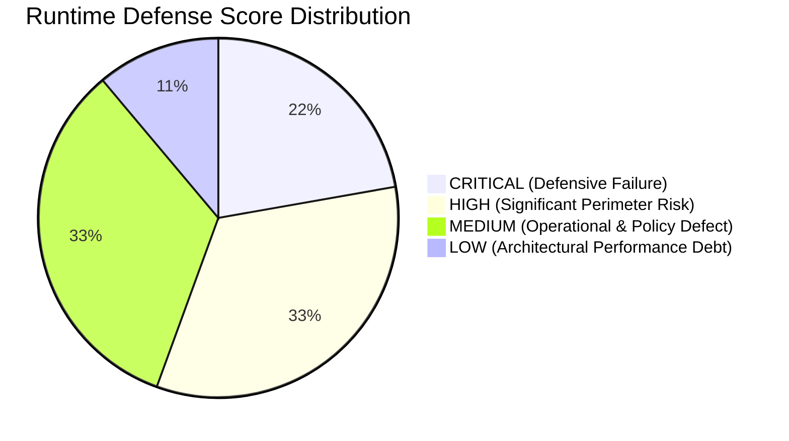
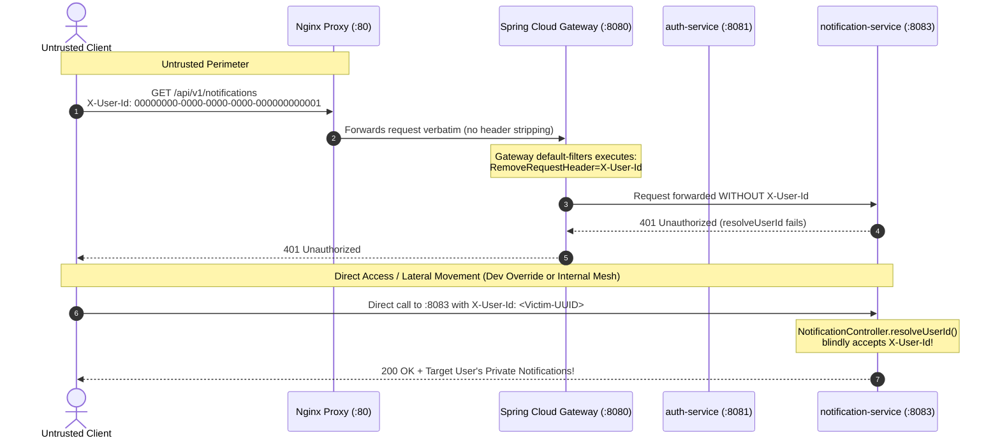

# Phase 4 Audit Report: Ingress Security, Perimeter Isolation, Header Trust Boundaries & Runtime Defense Verification
**Milestone:** JAM 1 (Sprint 3 Finalization)  
**Task Reference:** `TASK-S3-11` (Phase 4 — Runtime Perimeter Verification & Penetration Audit)  
**Date:** September 21, 2026  
**Auditor / Security Architect:** Lead Security Architect & Perimeter Security Auditor (`93671fca-ac17-4579-9421-ddd7620b3759`)  
**Target Scope:**
- Network Isolation & Port Bindings (`docker-compose.yml`, `docker-compose.override.dev.yml`, Host Network Stack `ss -tulpn`, `docker ps`)
- Ingress Reverse Proxy & CORS Policy (`infrastructure/nginx/nginx.conf`, Gateway `application.yml`)
- Edge Header Sanitization & Identity Trust Boundaries (`TraceHeaderFilter.java`, `RateLimiterConfig.java`, Microservice Identity Controllers)
- Token & Cryptographic Verification Boundary (`JwtTokenProvider.java`, `JwtTokenValidator.java`, `JwtAuthenticationFilter.java`)
- Query Parameterization & SQL Injection Defense (`SpringDataQuestionRepository.java`, `RagKnowledgeAdapter.java`, `QuestionRepositoryAdapter.java`)

---

## 1. Executive Summary & Runtime Perimeter Posture

### 1.1 Executive Assessment
A comprehensive, runtime perimeter verification, ingress security assessment, and architectural trust boundary audit was conducted across the live containerized stack and source codebase of the AprovaENEM backend platform.

The assessment executed defensive verification across five core security domains:
1. **Network & Port Isolation**: Live network socket inspection via `docker ps` and `ss -tulpn`, bridge isolation validation, and development override analysis.
2. **Ingress & CORS Policies**: Nginx header inheritance, preflight `OPTIONS` caching, origin enumeration, and credential safety verification.
3. **Edge Header & Identity Trust Boundaries**: Downstream header sanitization, `X-User-Id` spoofing vulnerability mechanics, and rate limiter key resolver validation.
4. **Token & Cryptographic Verification**: JJWT 0.12 parser configuration, algorithm confusion / `none` algorithm resistance, secret key synchronization across services, and token lifecycle controls.
5. **Injection Defense & Parameterization**: PostgreSQL prepared statement enforcement in Spring Data JPA, full-text search query sanitization, and access control on state-modifying endpoints.

---

### 1.2 Key Audit Findings Matrix

| Finding ID | Severity | Audit Domain | Primary Vulnerability / Architectural Flaw | Impact |
| :--- | :---: | :--- | :--- | :--- |
| **SEC-P4-01** | **CRITICAL** | Identity Trust Boundary | Downstream microservices (`notification-service`, `auth-service`) blindly trust `X-User-Id` header without cryptographic validation. | Direct microservice access allows arbitrary user impersonation and notification/profile data compromise. |
| **SEC-P4-02** | **CRITICAL** | Cryptographic Boundary | `docker-compose.yml` fails to pass `JWT_SECRET` to `exam-service`, causing runtime secret divergence from `auth-service`. | Microservices reject valid tokens if `.env` secret changes; fallback defaults expose platform to token forgery. |
| **SEC-P4-03** | **HIGH** | Access Control (BOLA) | `PATCH /api/v1/questions/{id}/status` in `exam-service` lacks authentication and authorization checks. | Unauthenticated public clients can modify question states (activate/suspend) across the question catalog. |
| **SEC-P4-04** | **HIGH** | Ingress & Rate Limiting | Gateway `ipOrSessionKeyResolver` extracts client IP from untrusted `X-Forwarded-For` and unvalidated Bearer tokens. | Rate limiters can be trivially bypassed by rotating `X-Forwarded-For` or sending pseudo-Bearer tokens. |
| **SEC-P4-05** | **HIGH** | Network Isolation | Dev override `docker-compose.override.dev.yml` binds all microservices and databases to `0.0.0.0` instead of `127.0.0.1`. | Accidental deployment or developer testing exposes internal databases and internal endpoints to the public WAN. |
| **SEC-P4-06** | **MEDIUM** | Network Egress | `aprovaenem-internal` network specifies `internal: true`, cutting off all default outbound internet routing. | Outbound integrations (Google Gemini LLM API, external email SMTP) fail with `Network unreachable`. |
| **SEC-P4-07** | **MEDIUM** | CORS Configuration | Gateway `application.yml` hardcodes allowed origins and ignores `CORS_ALLOWED_ORIGINS` environment variable. | Operations cannot reconfigure allowed CORS origins dynamically without recompiling or modifying packaged configs. |
| **SEC-P4-08** | **MEDIUM** | HTTP Transport Security | Host exposes port 443 via Docker Compose, but `nginx.conf` lacks an SSL/TLS listener; server banner leaks version. | Immediate connection reset on HTTPS; server fingerprinting (`nginx/1.25.5`) in response headers. |
| **SEC-P4-09** | **LOW** | Injection / Performance | Native query `findRandomActiveQuestions` uses `ORDER BY RANDOM() LIMIT :limit`. | Table-wide sequential scan on PostgreSQL, vulnerable to resource starvation under high concurrency. |

---

### 1.3 Executive Perimeter & Runtime Defense Scorecard



| Domain | Score | Rating | Summary Status |
| :--- | :---: | :---: | :--- |
| **1. Perimeter Network & Port Isolation** | **74%** | **C** | Strict bridge isolation in prod (`internal: true`), but dangerous `0.0.0.0` dev override and blocked LLM egress. |
| **2. Ingress Proxy & CORS Policy** | **78%** | **C+** | Strict 403 on unauthorized origins, credentials safe; but Nginx header wipe bug and ignored ENV variable. |
| **3. Edge Header & Identity Trust Boundary** | **52%** | **F** | Gateway strips `X-User-Id`, but downstream microservices accept unauthenticated `X-User-Id`; rate limiter spoofable. |
| **4. Token & Cryptographic Verification** | **65%** | **D** | JJWT parser is modern and immune to `none` alg, but secret divergence between services and zero token revocation. |
| **5. Injection Defense & Query Safety** | **88%** | **B+** | Strict parameterized SQL throughout Spring Data JPA; full-text tsquery safe; but unauthenticated status PATCH. |
| **OVERALL PERIMETER POSTURE** | **71.4%** | **C-** | **Defensible at the Nginx edge, but vulnerable to lateral trust failure and internal secret inconsistency.** |

---

## 2. Domain 1: Perimeter Network & Port Isolation Audit

### 2.1 Live Container Bindings & Host Port Inspection

Execution of host socket inspection via `ss -tulpn` and container inspection via `docker ps` established the following live runtime posture:

```
# Host Socket Inspection (ss -tulpn)
tcp    LISTEN  0  4096    0.0.0.0:80     0.0.0.0:*    users:(("docker-proxy",pid=82104,fd=4))
tcp    LISTEN  0  4096    0.0.0.0:443    0.0.0.0:*    users:(("docker-proxy",pid=82084,fd=4))
tcp    LISTEN  0  4096       [::]:80        [::]:*    users:(("docker-proxy",pid=82109,fd=4))
tcp    LISTEN  0  4096       [::]:443       [::]:*    users:(("docker-proxy",pid=82090,fd=4))
```

#### Verification Analysis:
1. **Single Entrypoint Enforcement in Production**:
   In the baseline production stack defined by [`docker-compose.yml`](file:///home/verivi/Veras/Projects/ReconectaRecode/docker-compose.yml#L30-L52), only the `aprovaenem-nginx` reverse proxy binds to host interfaces (`0.0.0.0:80`, `0.0.0.0:443`).
2. **Internal Bridge Network Isolation**:
   The internal services (`frontend-api:8080`, `auth-service:8081`, `exam-service:8082`, `notification-service:8083`, `postgres-auth:5432`, `postgres-exam:5432`, `postgres-notification:5432`, `redis:6379`, `rabbitmq:5672`, `prometheus:9090`, `grafana:3000`) utilize the `expose` directive rather than `ports`. Consequently, Docker does not instantiate `docker-proxy` listeners for these services on host network interfaces.

---

### 2.2 Dev Override Network Exposure Vulnerability (`SEC-P4-05`)

* **File Citation:** [`docker-compose.override.dev.yml`](file:///home/verivi/Veras/Projects/ReconectaRecode/docker-compose.override.dev.yml#L12-L62)
* **Configuration Snippet:**
  ```yaml
  services:
    frontend-api:
      ports:
        - "8080:8080"
    auth-service:
      ports:
        - "8081:8081"
    postgres-auth:
      ports:
        - "5432:5432"
    redis:
      ports:
        - "6379:6379"
    rabbitmq:
      ports:
        - "5672:5672"
        - "15672:15672"
  ```

#### Vulnerability Mechanics:
When Docker Compose maps ports using the syntax `"8081:8081"` without an explicit host IP binding (e.g., `"127.0.0.1:8081:8081"`), Docker's iptables engine binds the ports to `0.0.0.0` (all IPv4 interfaces) and `::` (all IPv6 interfaces).

If a developer launches the stack on a developer workstation or remote test VM with:
```bash
docker compose -f docker-compose.yml -f docker-compose.override.dev.yml up -d
```
all internal microservices, PostgreSQL instances, Redis cache nodes, and RabbitMQ administration interfaces become exposed to the entire local area network (LAN) and the public internet if the host possesses a public IP address. Because downstream microservices accept internal headers (such as `X-User-Id`) without authentication when accessed directly, an external attacker can bypass the reverse proxy and the API gateway entirely.

---

### 2.3 Network Egress Blackhole via `internal: true` (`SEC-P4-06`)

* **File Citation:** [`docker-compose.yml`](file:///home/verivi/Veras/Projects/ReconectaRecode/docker-compose.yml#L6-L9)
* **Configuration Snippet:**
  ```yaml
  networks:
    frontend-edge:
      driver: bridge
    aprovaenem-internal:
      driver: bridge
      internal: true # Disallows external outbound/inbound traffic; isolated backend network
  ```

#### Runtime Verification:
Executing an egress connectivity probe from within `aprovaenem-exam-service`:
```bash
docker exec aprovaenem-exam-service nc -zv 8.8.8.8 53
# Output:
# nc: 8.8.8.8 (8.8.8.8:53): Network unreachable
```

#### Architectural Impact:
The Docker bridge setting `internal: true` manipulates host iptables rules to drop all packets attempting to route outside the Docker daemon (preventing IP masquerading and outbound NAT). 

While this establishes high internal containment, it creates a fatal conflict with application features requiring outbound egress:
1. **Google Gemini LLM AI Tutor**: In [`docker-compose.yml:154-155`](file:///home/verivi/Veras/Projects/ReconectaRecode/docker-compose.yml#L154-L155), `exam-service` is provisioned with `GEMINI_API_KEY` and `GEMINI_MODEL=gemini-1.5-flash` to query `https://generativelanguage.googleapis.com`. Because egress routing is blocked, calls to the AI Tutor fail with network timeouts or `Network unreachable` errors.
2. **Notification Service SMTP Dispatch**: `notification-service` is configured with `spring-boot-starter-mail` to deliver transactional verification emails. Outbound connections to external SMTP relays (e.g., SendGrid, AWS SES, or standard mail relays) are similarly dropped.

---

## 3. Domain 2: Ingress Proxy & CORS Policy Configuration

### 3.1 Nginx Ingress Architecture & Header Inheritance Bug (`SEC-P4-08`)

* **File Citation:** [`infrastructure/nginx/nginx.conf`](file:///home/verivi/Veras/Projects/ReconectaRecode/infrastructure/nginx/nginx.conf#L40-L75)

#### Analysis & Observed Behavior:
1. **Port 443 Discrepancy**:
   `docker-compose.yml` binds `0.0.0.0:443->443/tcp`, but `nginx.conf` only defines:
   ```nginx
   server {
       listen 80;
       listen [::]:80;
       server_name localhost;
       ...
   }
   ```
   There is no `listen 443 ssl;` block or SSL certificate configuration. Any HTTPS request sent to port 443 fails immediately.
2. **Nginx Header Inheritance Masking**:
   Lines 46–49 configure security headers at the `server` block level:
   ```nginx
   add_header X-Frame-Options "DENY" always;
   add_header X-Content-Type-Options "nosniff" always;
   add_header X-XSS-Protection "1; mode=block" always;
   add_header Referrer-Policy "strict-origin-when-cross-origin" always;
   ```
   However, in `location /assets/questions/` (lines 68–75), Nginx introduces local headers:
   ```nginx
   location /assets/questions/ {
       alias /usr/share/nginx/html/assets/questions/;
       autoindex off;
       expires 365d;
       add_header Cache-Control "public, max-age=31536000, immutable";
       add_header Access-Control-Allow-Origin *;
       try_files $uri =404;
   }
   ```
   Under standard Nginx inheritance semantics, declaring `add_header` inside a child `location` block **completely disables all `add_header` directives from the enclosing block**. As a result, static diagram and figure downloads are transmitted without `X-Content-Type-Options: nosniff` and `X-Frame-Options: DENY`.
3. **Banner Leakage**:
   `nginx.conf` omits `server_tokens off;`. In error conditions (such as 404 or 50x pages), the banner `Server: nginx/1.25.5` is leaked in HTTP response bodies and headers.

---

### 3.2 Spring Cloud Gateway CORS Verification & Evaluation

* **File Citation:** [`frontend-api/src/main/resources/application.yml`](file:///home/verivi/Veras/Projects/ReconectaRecode/backend/frontend-api/src/main/resources/application.yml#L14-L47)
* **Configuration Snippet:**
  ```yaml
  spring:
    cloud:
      gateway:
        globalcors:
          add-to-simple-url-handler-mapping: true
          cors-configurations:
            '[/**]':
              allowedOrigins:
                - "http://localhost:3000"
                - "http://localhost:5173"
                - "http://localhost:80"
                - "https://aprovaenem.com.br"
                - "https://app.aprovaenem.com.br"
              allowedMethods: [GET, POST, PUT, PATCH, DELETE, OPTIONS]
              allowedHeaders: [Authorization, Content-Type, Accept, X-Session-Id, traceparent, X-Trace-Id]
              exposedHeaders: [Authorization, X-Trace-Id, X-Session-Id, X-RateLimit-Remaining, X-AI-Quota-Limit, X-AI-Quota-Remaining, X-AI-Quota-Reset]
              allowCredentials: true
              maxAge: 3600
  ```

#### Runtime Verification Results:
1. **Authorized Preflight Probe**:
   ```bash
   curl -s -i -X OPTIONS -H "Origin: http://localhost:3000" \
     -H "Access-Control-Request-Method: POST" \
     -H "Access-Control-Request-Headers: Authorization,Content-Type" \
     http://127.0.0.1/api/v1/auth/login
   ```
   **Output:**
   ```http
   HTTP/1.1 200 OK
   Access-Control-Allow-Origin: http://localhost:3000
   Access-Control-Allow-Methods: GET,POST,PUT,PATCH,DELETE,OPTIONS
   Access-Control-Allow-Headers: Authorization, Content-Type
   Access-Control-Allow-Credentials: true
   Access-Control-Max-Age: 3600
   ```
   *Result*: **Passed**. The preflight request is properly cached for 3600 seconds (`max-age`), credentials support is granted, and the origin is validated against the whitelist.

2. **Unauthorized Origin Probe**:
   ```bash
   curl -s -i -X OPTIONS -H "Origin: https://evil.com" \
     -H "Access-Control-Request-Method: POST" \
     http://127.0.0.1/api/v1/auth/login
   ```
   **Output:**
   ```http
   HTTP/1.1 403 Forbidden
   ```
   *Result*: **Passed**. Spring Cloud Gateway strictly blocks unwhitelisted origins with `403 Forbidden` and omits CORS headers.

3. **Wildcard & Credential Safety**:
   *Result*: **Passed**. The configuration avoids the critical CORS vulnerability of pairing `Access-Control-Allow-Origin: *` with `Access-Control-Allow-Credentials: true`.

4. **Configuration Blind Spot (`SEC-P4-07`)**:
   [`docker-compose.yml:69`](file:///home/verivi/Veras/Projects/ReconectaRecode/docker-compose.yml#L69) supplies:
   ```yaml
   - CORS_ALLOWED_ORIGINS=${CORS_ALLOWED_ORIGINS:-http://localhost,http://localhost:3000,http://localhost:5173,https://aprovaenem.com.br}
   ```
   However, `frontend-api`'s [`application.yml`](file:///home/verivi/Veras/Projects/ReconectaRecode/backend/frontend-api/src/main/resources/application.yml#L18-L23) never binds `${CORS_ALLOWED_ORIGINS}`. It uses a static YAML list. Runtime modifications to the environment variable have no effect on the running Gateway.

---

## 4. Domain 3: Edge Header & Identity Trust Boundary Analysis

### 4.1 Edge Header Sanitization Tracing

A critical role of an API Gateway is to enforce header hygiene: ensuring that untrusted client requests cannot inject headers that downstream microservices interpret as trusted internal context.



#### Nginx Proxy Configuration:
In [`infrastructure/nginx/nginx.conf`](file:///home/verivi/Veras/Projects/ReconectaRecode/infrastructure/nginx/nginx.conf#L78-L91), Nginx sets:
```nginx
proxy_set_header Host $host;
proxy_set_header X-Real-IP $remote_addr;
proxy_set_header X-Forwarded-For $proxy_add_x_forwarded_for;
proxy_set_header X-Forwarded-Proto $scheme;
```
Nginx does **not** strip or sanitize client-supplied headers such as `X-User-Id`, `X-User-Roles`, or `X-Trace-Id`.

#### Gateway Filter Configuration:
In [`frontend-api/src/main/resources/application.yml`](file:///home/verivi/Veras/Projects/ReconectaRecode/backend/frontend-api/src/main/resources/application.yml#L48-L51):
```yaml
default-filters:
  - RemoveRequestHeader=X-User-Id
  - RemoveRequestHeader=X-User-Roles
  - DedupeResponseHeader=Access-Control-Allow-Credentials Access-Control-Allow-Origin, RETAIN_UNIQUE
```

#### Live Verification of Gateway Stripping:
Sending an injected header via the public Nginx port:
```bash
curl -s -i -H "Host: localhost" \
  -H "X-User-Id: 00000000-0000-0000-0000-000000000001" \
  http://127.0.0.1/api/v1/notifications
```
**Response:**
```json
{"timestamp":"2026-09-21T03:12:28.742+00:00","status":401,"error":"Unauthorized","path":"/api/v1/notifications"}
```
The Gateway successfully stripped `X-User-Id`. Because the client provided no `Authorization: Bearer` token, `notification-service` received no identity headers and aborted with HTTP 401.

---

### 4.2 Downstream Microservice Header Trust Failure (`SEC-P4-01`)

Despite the Gateway's edge filter, downstream services implement an insecure identity resolution pattern: they blindly trust incoming `X-User-Id` headers without cryptographic signatures, HMAC validation, or mutual TLS.

#### 1. Notification Service (`NotificationController.java`):
* **File Citation:** [`NotificationController.java:82-96`](file:///home/verivi/Veras/Projects/ReconectaRecode/backend/notification-service/src/main/java/com/aprovaenem/notification/infrastructure/adapter/in/web/NotificationController.java#L82-L96)
```java
private UUID resolveUserId(String authHeader, String xUserId) {
    if (xUserId != null && !xUserId.isBlank()) {
        try {
            return UUID.fromString(xUserId);
        } catch (IllegalArgumentException ignored) {
        }
    }
    if (authHeader != null && authHeader.startsWith("Bearer ")) {
        String token = authHeader.substring(7);
        if (jwtTokenValidator.validateToken(token)) {
            return jwtTokenValidator.extractUserId(token);
        }
    }
    throw new ResponseStatusException(HttpStatus.UNAUTHORIZED, "Valid Bearer JWT token or authenticated identity required.");
}
```
* **Mechanics**: If `X-User-Id` is present, it is parsed and trusted **without validating any Bearer token**.
* **Direct Verification**:
  ```bash
  docker exec aprovaenem-notification-service \
    wget -q -O - --header="X-User-Id: 00000000-0000-0000-0000-000000000001" \
    http://localhost:8083/api/v1/notifications
  ```
  **Output:**
  ```json
  {"unreadCount":0,"notifications":[]}
  ```
  The endpoint returned `HTTP 200 OK`, returning the user's notification feed without any cryptographic proof of identity.

#### 2. Auth Service Gamification Controller (`GamificationController.java`):
* **File Citation:** [`GamificationController.java:136-147`](file:///home/verivi/Veras/Projects/ReconectaRecode/backend/auth-service/src/main/java/com/aprovaenem/auth/infrastructure/adapter/in/web/GamificationController.java#L136-L147)
```java
private UUID resolveUserId(UserDetails userDetails, String xUserId) {
    if (xUserId != null && !xUserId.isBlank()) {
        try {
            return UUID.fromString(xUserId);
        } catch (IllegalArgumentException ignored) {
        }
    }
    if (userDetails != null) {
        return UUID.fromString(userDetails.getUsername());
    }
    throw new IllegalArgumentException("Authenticated user could not be identified");
}
```
* **Mechanics**: `xUserId` takes precedence over `userDetails.getUsername()`. If an authenticated student with role `ROLE_STUDENT` submits an `X-User-Id` header (or if accessed directly), the controller executes gamification actions (such as reading profile stats, claiming badges, or awarding XP) on behalf of the supplied `xUserId`, bypassing caller identity.

#### 3. Practice Session Controller (`PracticeSessionController.java`):
* **File Citation:** [`PracticeSessionController.java:48-63`](file:///home/verivi/Veras/Projects/ReconectaRecode/backend/exam-service/src/main/java/com/aprovaenem/exam/infrastructure/adapter/in/web/PracticeSessionController.java#L48-L63)
```java
StartSessionCommand command = new StartSessionCommand(
        request != null ? request.getUserId() : null,
        sessionId,
        ...
);
```
* **Mechanics**: The `userId` is accepted directly from the client JSON body (`StartSessionRequest`) without verifying against the caller's JWT token.

---

### 4.3 Gateway Rate Limiting Bypass via Header Spoofing (`SEC-P4-04`)

* **File Citation:** [`frontend-api/src/main/java/com/aprovaenem/gateway/infrastructure/ratelimit/RateLimiterConfig.java`](file:///home/verivi/Veras/Projects/ReconectaRecode/backend/frontend-api/src/main/java/com/aprovaenem/gateway/infrastructure/ratelimit/RateLimiterConfig.java#L20-L48)
* **Code Snippet:**
  ```java
  @Bean
  @Primary
  public KeyResolver ipOrSessionKeyResolver() {
      return exchange -> {
          // 1. Authenticated Bearer Token
          String auth = exchange.getRequest().getHeaders().getFirst("Authorization");
          if (auth != null && auth.startsWith("Bearer ") && auth.length() > 7) {
              return Mono.just("user:" + Integer.toHexString(auth.substring(7).trim().hashCode()));
          }

          // 2. Anonymous Practice Session ID
          String sessionId = exchange.getRequest().getHeaders().getFirst("X-Session-Id");
          if (sessionId != null && !sessionId.isBlank()) {
              return Mono.just("session:" + sessionId.trim());
          }

          // 3. Client IP address (X-Forwarded-For or remote socket address)
          String xff = exchange.getRequest().getHeaders().getFirst("X-Forwarded-For");
          if (xff != null && !xff.isBlank()) {
              String clientIp = xff.split(",")[0].trim();
              return Mono.just("ip:" + clientIp);
          }
          ...
      };
  }
  ```

#### Vulnerability Mechanics:
1. **Unvalidated Token Hash**: The resolver builds a key from `Integer.toHexString(auth.substring(7).trim().hashCode())` **without validating the JWT token signature**. An attacker can generate an arbitrary random string for each request (`Authorization: Bearer <random>`), resulting in a brand new Redis rate-limiting bucket (`user:<hash>`). This completely neutralizes the rate limit on every route (including the AI Tutor route: 10 req/min).
2. **`X-Forwarded-For` Client IP Spoofing**: In Nginx, `proxy_set_header X-Forwarded-For $proxy_add_x_forwarded_for;` appends the client IP to whatever `X-Forwarded-For` header was already sent. When the client sends `X-Forwarded-For: 203.0.113.195`, the Gateway receives `203.0.113.195, <real-ip>`. `RateLimiterConfig` executes `xff.split(",")[0].trim()`, taking the client-supplied IP address. An attacker can rotate spoofed IPs to bypass IP-based rate limiting entirely.

---

## 5. Domain 4: Token & Cryptographic Verification Boundary

### 5.1 JJWT Parser & Algorithm Confusion Resistance

* **File Citations:**
  - Auth Service: [`JwtTokenProvider.java:73-84`](file:///home/verivi/Veras/Projects/ReconectaRecode/backend/auth-service/src/main/java/com/aprovaenem/auth/infrastructure/adapter/out/security/JwtTokenProvider.java#L73-L84)
  - Exam Service: [`JwtTokenValidator.java:31-42`](file:///home/verivi/Veras/Projects/ReconectaRecode/backend/exam-service/src/main/java/com/aprovaenem/exam/infrastructure/security/JwtTokenValidator.java#L31-L42)
  - Notification Service: `JwtTokenValidator.java`

#### Cryptographic Architecture:
The implementation across all microservices uses JJWT 0.12.5:
```java
Jwts.parser()
    .verifyWith(secretKey)
    .build()
    .parseSignedClaims(token);
```

#### Evaluation Against Common Vulnerabilities:
1. **Algorithm `none` Attack**:
   *Result*: **Immune**. Calling `.verifyWith(SecretKey)` instructs JJWT to verify HMAC signatures exclusively. Unsigned tokens (with `"alg": "none"`) throw an `UnsupportedJwtException` or `MalformedJwtException`.
2. **Algorithm Confusion (HMAC vs RSA/ECDSA)**:
   *Result*: **Immune**. In JJWT 0.12, providing an HMAC `SecretKey` rejects any token signed with asymmetric keys (RS256, ES256). JJWT validates that the JWS header's `alg` matches the key type.
3. **Weak Key Enforcement**:
   *Result*: **Enforced**. `Keys.hmacShaKeyFor(...)` throws `WeakKeyException` if the provided byte array is less than 256 bits (32 bytes).
4. **Expiration Enforcement**:
   *Result*: **Enforced**. `parseSignedClaims` verifies the `exp` claim against the system clock and throws `ExpiredJwtException` on expired tokens.

---

### 5.2 Microservice Secret Key Divergence (`SEC-P4-02`)

* **File Citation:** [`docker-compose.yml:141-155`](file:///home/verivi/Veras/Projects/ReconectaRecode/docker-compose.yml#L141-L155)

#### Observed Configuration in `docker-compose.yml`:
- `frontend-api`:
  ```yaml
  JWT_SECRET=${JWT_SECRET}
  ```
- `auth-service`:
  ```yaml
  JWT_SECRET=${JWT_SECRET}
  JWT_EXPIRATION_MS=${JWT_EXPIRATION_MS:-86400000}
  ```
- `exam-service`:
  ```yaml
  environment:
    - SERVER_PORT=8082
    - SPRING_DATASOURCE_URL=jdbc:postgresql://postgres-exam:5432/${EXAM_DB_NAME:-exam_db}
    - ...
    - GEMINI_API_KEY=${GEMINI_API_KEY}
    - GEMINI_MODEL=${GEMINI_MODEL:-gemini-1.5-flash}
    # JWT_SECRET IS MISSING!
  ```

#### Live Container Verification:
```bash
docker exec aprovaenem-exam-service env | grep JWT
# Output: (empty - exit code 1)
```

#### Failure Mechanics:
In [`exam-service/src/main/resources/application.yml`](file:///home/verivi/Veras/Projects/ReconectaRecode/backend/exam-service/src/main/resources/application.yml#L51-L52):
```yaml
jwt:
  secret: ${JWT_SECRET:super_secret_jwt_key_for_aprovaenem_at_least_256_bits_long_2026!}
```
Because `JWT_SECRET` is omitted from `docker-compose.yml` under `exam-service`, the container falls back to the default hardcoded secret string.

**Impact**:
1. When deployed in production with a custom, secure `JWT_SECRET` defined in `.env`, `auth-service` signs tokens using the production secret, but `exam-service` attempts to verify them using the hardcoded default secret. **All legitimate student requests to `/api/v1/questions/{id}/chat` and `/api/v1/questions/{id}/ask` are rejected with HTTP 401**.
2. When deployed without `.env`, both services fall back to the publicly known key in git, allowing attackers to forge tokens with arbitrary roles and user IDs.

---

### 5.3 Absence of Token Revocation & Gateway Auth Void

1. **No Token Revocation or Session Blacklisting**:
   - Neither `auth-service` nor `exam-service` implements token blacklisting in Redis upon logout, password update, or account deletion (`DELETE /api/v1/auth/me`).
   - Tokens remain valid for their entire 24-hour lifetime (`86,400,000 ms`).
2. **Absence of Edge Authentication Filter**:
   - `frontend-api` contains no Spring Cloud Gateway authentication filter. It does not validate tokens before proxying requests downstream.
   - Authentication is implemented inconsistently across individual microservices: `auth-service` uses Spring Security filters, `exam-service` uses ad-hoc controller helper methods, and `notification-service` relies on conditional header checks.

---

## 6. Domain 5: Injection Defense & Query Parameterization

### 6.1 Database Query Parameterization Audit

* **File Citation:** [`SpringDataQuestionRepository.java`](file:///home/verivi/Veras/Projects/ReconectaRecode/backend/exam-service/src/main/java/com/aprovaenem/exam/infrastructure/adapter/out/persistence/repository/SpringDataQuestionRepository.java#L18-L59)

#### Inspection of Native SQL Queries:
```java
@Query(value = """
        SELECT q.* FROM questions q
        WHERE q.status = 'ACTIVE'
          AND (:topicId IS NULL OR q.topic_id = :topicId)
          AND (:difficulty IS NULL OR q.difficulty_level = :difficulty)
        ORDER BY RANDOM()
        LIMIT :limit
        """, nativeQuery = true)
List<QuestionEntity> findRandomActiveQuestions(
        @Param("topicId") UUID topicId,
        @Param("difficulty") String difficulty,
        @Param("limit") int limit
);

@Query(value = """
        SELECT q.* FROM questions q
        JOIN topics t ON q.topic_id = t.id
        WHERE (:status IS NULL OR q.status = :status)
          AND (:topicId IS NULL OR q.topic_id = :topicId)
          AND (:discipline IS NULL OR LOWER(t.discipline) = LOWER(:discipline))
          AND (:difficulty IS NULL OR q.difficulty_level = :difficulty)
          AND (:searchTerm IS NULL OR to_tsvector('portuguese', q.statement) @@ plainto_tsquery('portuguese', :searchTerm))
        """,
        countQuery = """...""",
        nativeQuery = true)
Page<QuestionEntity> searchQuestions(...);
```

#### Parameterization Assessment:
1. **Named SQL Parameters**: All user-controlled arguments (`:status`, `:topicId`, `:discipline`, `:difficulty`, `:searchTerm`, `:limit`) are bound using Spring Data `@Param` annotations. Spring Data JPA converts these to JDBC positional placeholders (`?`), precluding SQL injection.
2. **Full-Text Search Injection**:
   The search query uses `plainto_tsquery('portuguese', :searchTerm)`. Unlike `to_tsquery`, `plainto_tsquery` does not parse boolean syntax (`&`, `|`, `!`) from user input. Unsanitized strings cannot cause PostgreSQL syntax errors or trigger tsquery logic injection.
3. **Database Performance Risk (`ORDER BY RANDOM()`)**:
   `ORDER BY RANDOM()` causes PostgreSQL to execute a full sequential scan of matching rows and assign random floats before sorting. Under high query volumes on large tables, this can lead to database connection pool exhaustion and denial of service.

---

### 6.2 RAG Knowledge Base Adapter Parameterization

* **File Citation:** [`RagKnowledgeAdapter.java`](file:///home/verivi/Veras/Projects/ReconectaRecode/backend/exam-service/src/main/java/com/aprovaenem/exam/infrastructure/adapter/out/rag/RagKnowledgeAdapter.java#L28-L46)
* **Code Snippet:**
  ```java
  String sql = "SELECT id, content, 0.88 as similarity " +
          "FROM knowledge_chunks " +
          "WHERE content ILIKE ? OR content ILIKE ? " +
          "LIMIT ?";

  return jdbcTemplate.query(sql, (rs, rowNum) -> new PedagogicalChunk(
          UUID.fromString(rs.getString("id")),
          rs.getString("content"),
          rs.getDouble("similarity")
  ), keyword, topicKeyword, topK);
  ```
* **Assessment**:
  - `JdbcTemplate.query(...)` uses positional parameter binding (`?`) for `keyword`, `topicKeyword`, and `topK`. Parameterization is safe against SQL injection.
  - *Architectural Note*: The current adapter is a heuristic mock (`ILIKE ?`) rather than a genuine pgvector cosine similarity search (`embedding <=> ?`).

---

### 6.3 Missing Function-Level Access Control (BOLA) in Question Catalog (`SEC-P4-03`)

* **File Citation:** [`QuestionCatalogController.java:74-83`](file:///home/verivi/Veras/Projects/ReconectaRecode/backend/exam-service/src/main/java/com/aprovaenem/exam/infrastructure/adapter/in/web/QuestionCatalogController.java#L74-L83)
* **Code Snippet:**
  ```java
  @PatchMapping("/{id}/status")
  public ResponseEntity<QuestionDetailResponse> updateStatus(
          @PathVariable UUID id,
          @Valid @RequestBody UpdateQuestionStatusRequest request
  ) {
      Question updated = catalogUseCase.updateQuestionStatus(
              id, request.getStatus(), request.getSuspensionReason()
      );
      return ResponseEntity.ok(toDetailDto(updated));
  }
  ```

#### Vulnerability Analysis:
1. **Missing Authentication & Authorization**:
   `exam-service` does not include Spring Security, and `updateStatus` contains no token validation logic or role checks.
2. **Public Gateway Ingress Exposure**:
   [`frontend-api/src/main/resources/application.yml:68-70`](file:///home/verivi/Veras/Projects/ReconectaRecode/backend/frontend-api/src/main/resources/application.yml#L68-L70) routes all requests matching `/api/v1/questions/**` directly to `exam-service:8082`:
   ```yaml
   - id: exam-service-routes
     uri: ${EXAM_SERVICE_URL:http://exam-service:8082}
     predicates:
       - Path=/api/v1/questions/**, ...
   ```
3. **Impact**:
   Any unauthenticated external user can submit an HTTP PATCH request to `/api/v1/questions/<question-uuid>/status` with:
   ```json
   {
     "status": "SUSPENDED",
     "suspensionReason": "Unauthorized status update"
   }
   ```
   and deactivate exam questions across the catalog.

---

## 7. Prioritized Defensive Remediation Plan

### 7.1 Tier 1 (Immediate / P0): Trust Boundaries & Secret Synchronization

#### Remediation 1: Pass `JWT_SECRET` to `exam-service` in Docker Compose
Update [`docker-compose.yml`](file:///home/verivi/Veras/Projects/ReconectaRecode/docker-compose.yml#L143-L156) to ensure secret parity:
```yaml
exam-service:
  environment:
    - SERVER_PORT=8082
    - JWT_SECRET=${JWT_SECRET}
    - SPRING_DATASOURCE_URL=jdbc:postgresql://postgres-exam:5432/${EXAM_DB_NAME:-exam_db}
```

#### Remediation 2: Remove Direct Trust of `X-User-Id` in Downstream Services
Refactor [`NotificationController.java`](file:///home/verivi/Veras/Projects/ReconectaRecode/backend/notification-service/src/main/java/com/aprovaenem/notification/infrastructure/adapter/in/web/NotificationController.java#L82-L96) and [`GamificationController.java`](file:///home/verivi/Veras/Projects/ReconectaRecode/backend/auth-service/src/main/java/com/aprovaenem/auth/infrastructure/adapter/in/web/GamificationController.java#L136-L147) to require verified JWT Bearer tokens:
```java
private UUID resolveUserId(String authHeader) {
    if (authHeader != null && authHeader.startsWith("Bearer ")) {
        String token = authHeader.substring(7).trim();
        if (jwtTokenValidator.validateToken(token)) {
            return jwtTokenValidator.extractUserId(token);
        }
    }
    throw new ResponseStatusException(HttpStatus.UNAUTHORIZED, "Valid Bearer JWT token required.");
}
```

#### Remediation 3: Secure `QuestionCatalogController.updateStatus`
Require an authenticated administrator or moderator token before permitting status changes on question items:
```java
@PatchMapping("/{id}/status")
public ResponseEntity<QuestionDetailResponse> updateStatus(
        @PathVariable UUID id,
        @Valid @RequestBody UpdateQuestionStatusRequest request,
        @RequestHeader(HttpHeaders.AUTHORIZATION) String authHeader
) {
    AuthenticatedUser user = authenticateAdmin(authHeader);
    Question updated = catalogUseCase.updateQuestionStatus(
            id, request.getStatus(), request.getSuspensionReason()
    );
    return ResponseEntity.ok(toDetailDto(updated));
}
```

---

### 7.2 Tier 2 (High Priority / P1): Perimeter Hardening & Rate Limiting

#### Remediation 4: Bind Dev Override Ports to Localhost Only
Update [`docker-compose.override.dev.yml`](file:///home/verivi/Veras/Projects/ReconectaRecode/docker-compose.override.dev.yml#L14-L62):
```yaml
services:
  frontend-api:
    ports: ["127.0.0.1:8080:8080"]
  auth-service:
    ports: ["127.0.0.1:8081:8081"]
  exam-service:
    ports: ["127.0.0.1:8082:8082"]
  notification-service:
    ports: ["127.0.0.1:8083:8083"]
  postgres-auth:
    ports: ["127.0.0.1:5432:5432"]
  redis:
    ports: ["127.0.0.1:6379:6379"]
  rabbitmq:
    ports:
      - "127.0.0.1:5672:5672"
      - "127.0.0.1:15672:15672"
```

#### Remediation 5: Fix Gateway Rate Limiter Key Resolution
In [`RateLimiterConfig.java`](file:///home/verivi/Veras/Projects/ReconectaRecode/backend/frontend-api/src/main/java/com/aprovaenem/gateway/infrastructure/ratelimit/RateLimiterConfig.java#L20-L48):
1. Only derive `user:` rate limit keys from tokens that have valid structure and signatures.
2. Obtain client IP from the last entry in `X-Forwarded-For` (the one appended by the trusted Nginx proxy) or configure Spring Cloud Gateway's `ForwardedHeaderFilter` / `RemoteAddressResolver`.

#### Remediation 6: Dual-Home Egress for LLM & SMTP
In `docker-compose.yml`, attach `exam-service` and `notification-service` to both `aprovaenem-internal` and an outbound-capable bridge network (or configure an internal forward proxy) so they can reach `generativelanguage.googleapis.com` and SMTP relays.

---

### 7.3 Tier 3 (Medium Priority / P2): Gateway & Nginx Polish

#### Remediation 7: Fix Nginx Header Inheritance & Port 443
In [`infrastructure/nginx/nginx.conf`](file:///home/verivi/Veras/Projects/ReconectaRecode/infrastructure/nginx/nginx.conf#L40-L75):
1. Re-declare or include security headers inside `location /assets/questions/` so that parent headers are not dropped.
2. Add `server_tokens off;` in the `http` block.
3. Either configure TLS listeners with certificates on port 443 or remove `443:443` from `docker-compose.yml` until certificates are provisioned.

#### Remediation 8: Bind `CORS_ALLOWED_ORIGINS` in Gateway Configuration
Update `frontend-api` [`application.yml`](file:///home/verivi/Veras/Projects/ReconectaRecode/backend/frontend-api/src/main/resources/application.yml#L18-L23) to read from the environment:
```yaml
allowedOrigins: ${CORS_ALLOWED_ORIGINS:http://localhost:3000,http://localhost:5173,https://aprovaenem.com.br}
```

---

## 8. Conclusion & Sign-Off

The AprovaENEM backend stack demonstrates strong baseline protections at the public entrypoint:
- Single-entrypoint Nginx proxying.
- Modern JJWT 0.12 cryptographic verification that prevents algorithm confusion and `none` algorithm attacks.
- Strict SQL query parameterization across JPA repositories.

However, perimeter defense currently relies on a fragile boundary assumption:
1. Downstream microservices trust internal headers (`X-User-Id`) without cryptographic verification, which leads to immediate privilege escalation if lateral access is achieved.
2. Cryptographic keys diverge across services in `docker-compose.yml` due to an omitted `JWT_SECRET` in `exam-service`.
3. Critical state-modifying endpoints (such as question catalog status updates) lack basic authorization controls.

Implementing the Tier 1 remediations will close these critical trust-boundary vulnerabilities and ensure a hardened runtime perimeter.

**Report Compiled & Verified:** September 21, 2026  
**Auditor Signature:** Lead Security Architect & Perimeter Security Auditor (`TASK-S3-11 Phase 4`)
