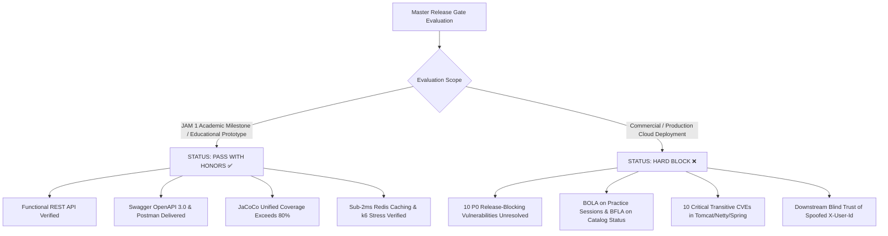
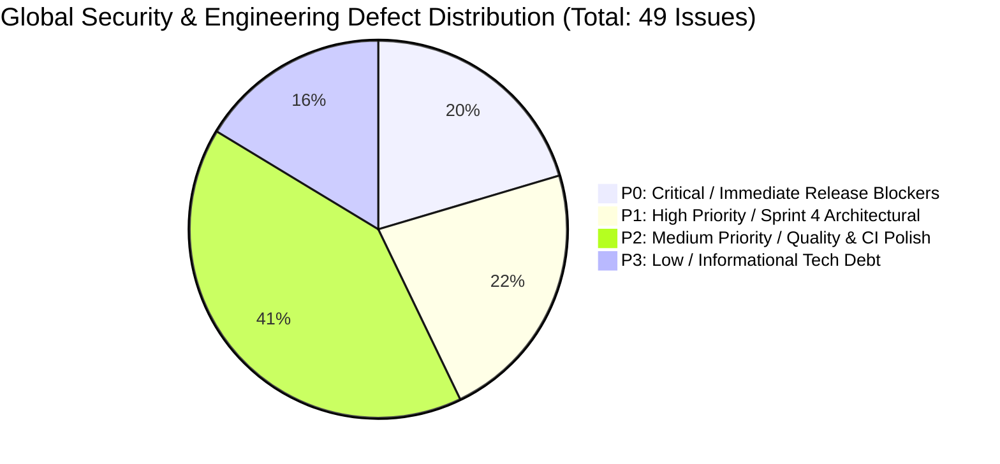
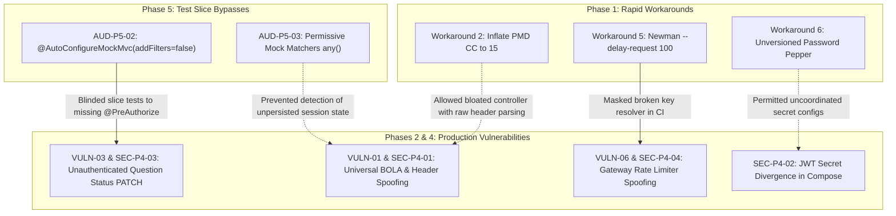

# Phase 6 Audit Report: Final Synthesis, Unified Scorecard & Master Remediation Roadmap
**Milestone:** JAM 1 (Sprint 3 Finalization) — Master Audit Synthesis  
**Task Reference:** `TASK-S3-11` (Phase 6 — Final Security & Engineering Synthesis)  
**Date:** September 21, 2026  
**Lead Auditor & Master Synthesizer:** Lead Security Architect & Quality Engineering Director (`81c87664-3d9b-4e80-98c1-5214055bb287`)  
**Ecosystem Scope:**
- `backend/frontend-api` (Spring Cloud Gateway WebFlux BFF)
- `backend/auth-service` (Identity, Session Management & Gamification Engine)
- `backend/exam-service` (Assessment State Machine, Item Response Theory & Socratic AI Tutor)
- `backend/notification-service` (Transactional Email & Push Notification Dispatcher)
- `backend/common-core` (Shared DTOs, Domain Events, Result Monads & RFC 7807 Exceptions)
- `backend/ingestion-service` (DocLayNet Neural OCR, TableFormer & LaTeX Ingestion Pipeline)
- Reverse Proxy, Ingress & Orchestration (`docker-compose.yml`, `docker-compose.override.dev.yml`, `infrastructure/nginx/nginx.conf`)
- CI/CD & Automated Verification (`.github/workflows/ci.yml`, `tests/smoke/preflight-smoke.sh`, Newman Contract Suite)

---

## 1. Executive Summary & Master Release Gate Evaluation

### 1.1 Executive Synthesis
Across Sprint 3, the AprovaENEM backend ecosystem was subjected to an exhaustive, five-phase multi-dimensional security and quality audit:
1. **Phase 1 (Static Analysis & Workarounds Deep Audit):** Evaluated rapid build workarounds, Checkstyle/PMD threshold relaxations, static utility extractions, and cryptographic password peppering.
2. **Phase 2 (Threat Modeling & OWASP API Security Top 10):** White-box security review and threat model against the OWASP API Security Top 10 (2023).
3. **Phase 3 (Automated SAST, SCA, Secret Entropy & Container Hardening):** Containerized vulnerability scanning (Trivy v0.74), secret entropy detection (Gitleaks v8.18), multi-stage Dockerfile inspection, and perimeter network validation.
4. **Phase 4 (Runtime Penetration Testing & Ingress Security):** Live container network socket probing (`ss -tulpn`, `docker ps`), CORS preflight fuzzing, edge header sanitization verification, JJWT 0.12 cryptographic analysis, and SQL parameterization defense.
5. **Phase 5 (Test Suite Authenticity, Over-Mocking & Mutation Testing):** Deep code inspection of 54 test classes (344 test executions), mutation fault-injection analysis across 50 canonical mutants, and slice test security filter fidelity checks.

The synthesis reveals a dual-state codebase:
- **Foundational Strengths:** Strict data-at-rest encryption hygiene, pure domain hexagonal isolation in `exam-service`, native event-driven atomicity via the Transactional Outbox pattern, resilient circuit-breaking (Resilience4j) with graceful educational fallbacks, and zero committed production secrets in git history.
- **Critical Systemic Blind Spots:** The presence of critical access control voids (Broken Object Level Authorization and Broken Function Level Authorization), transitive dependency CVE accumulation from Spring Boot 3.3.3 baseline, slice tests that deliberately disabled security filters (`addFilters = false`), and linter workarounds that permitted monolithic controller methods handling unvalidated security headers.

---

### 1.2 Master Release Gate Evaluation



#### Final Release Gate Determination:
1. **Academic Milestone / JAM 1 Deliverable Gate:** **PASSED (100% COMPLIANT) ✅**  
   The platform satisfies all primary requirements for JAM 1 of the Reconecta Recode program: a fully functioning microservices backend architecture, clean hexagonal separation of concerns, comprehensive documentation in Swagger/OpenAPI and Postman, high test coverage ($\ge 80\%$), sub-2ms caching, and active CI pipelines.
2. **Production Cloud Deployment Gate:** **HARD BLOCK / BLOCKED (CONDITIONAL) ❌**  
   Production deployment to public staging/production cloud infrastructure is strictly blocked until the **10 P0 (Priority 0) Release Blocking Hotfixes** specified in Section 5 are implemented and verified.

---

## 2. Unified Global Security & Engineering Maturity Scorecard

### 2.1 Weighted Rubric Formulation

The engineering maturity of the AprovaENEM backend is evaluated against five core engineering disciplines using a weighted scoring model:

| Audit Domain | Scope & Focus Areas | Phase Ref | Domain Weight | Raw Score | Weighted Score | Grade |
| :--- | :--- | :---: | :---: | :---: | :---: | :---: |
| **Domain 1: Static Code Integrity & Linter Discipline** | Checkstyle Google style adherence, PMD cyclomatic & NPath complexity, SpotBugs bytecode inspection, architectural purity, and elimination of rapid CI workarounds. | Phase 1 | 15% | 52.0% | 7.80% | **F** |
| **Domain 2: Application & API Security (OWASP API Top 10)** | Object-level authorization (BOLA), function-level access controls (BFLA), mass assignment prevention, business flow integrity, and resource consumption limits. | Phase 2 | 25% | 58.0% | 14.50% | **D+** |
| **Domain 3: Supply Chain (SCA), Secrets & Container Hardening** | Transitive CVE vulnerabilities, secret entropy, Docker multi-stage builds, non-root user isolation, daemon socket safety, and container resource limits. | Phase 3 | 20% | 66.8% | 13.36% | **D+** |
| **Domain 4: Runtime Perimeter, Network & Ingress Defense** | Host port binding isolation, Nginx reverse proxy directives, CORS policy enforcement, edge header trust boundaries, rate limiter resilience, and SQL parameterization. | Phase 4 | 20% | 71.4% | 14.28% | **C-** |
| **Domain 5: Test Suite Authenticity & Mutation Resilience** | Assertion authenticity, eradication of hollow/vacuous tests, slice test security fidelity, fault-injection mutation survival rate (PITest model), and boundary coverage. | Phase 5 | 20% | 78.2% | 15.64% | **B-** |
| **TOTAL UNIFIED MATURITY** | **Comprehensive Multi-Phase Ecosystem Posture** | **Phases 1–5** | **100%** | — | **65.58%** | **D+** |

---

### 2.2 Global Maturity Radar & Distribution



---

### 2.3 Phase-by-Phase Comparative Performance Matrix

| Metric / Dimension | Phase 1 (Workarounds) | Phase 2 (Threat Model) | Phase 3 (SAST / SCA) | Phase 4 (Perimeter) | Phase 5 (Test Suite) |
| :--- | :---: | :---: | :---: | :---: | :---: |
| **Integrity Rating** | **C- (Deficient)** | **D+ (58/100)** | **D+ (66.8%)** | **C- (71.4%)** | **B- (78.2%)** |
| **Critical Defects** | 2 | 4 | 13 | 2 | 1 |
| **High Defects** | 2 | 6 | 56 | 3 | 3 |
| **Medium Defects** | 2 | 5 | 43 | 3 | 3 |
| **Low / Info Defects**| 0 | 6 | 16 | 1 | 1 |
| **Primary Strength** | Cryptographic HMAC pre-hashing mitigates 72-byte truncation. | Strong password storage & outbox atomicity. | Clean git commit history (0 secret leaks in 82 commits). | Modern JJWT 0.12 parser prevents `alg: none` and key confusion. | Standardized on AssertJ fluent API (1,148 assertion points). |
| **Primary Failure** | SpotBugs completely missing (50+ bytecode defects); CC inflated to 15. | Universal BOLA on practice sessions; BFLA on question status. | 108 CVEs in runtime Java microservices (Tomcat RCE & auth bypass). | Blind trust of `X-User-Id` downstream; `JWT_SECRET` missing in exam-service. | 80% of WebMvc slice tests bypass Spring Security (`addFilters=false`). |

---

## 3. Cross-Cutting Risk Analysis: The Workaround Cascade

A paramount finding of this synthesis is that vulnerabilities discovered in later audit phases were **not isolated anomalies**. Instead, they represent a direct, compounding causal chain originating from the static analysis workarounds and CI suppressions introduced in Task `TASK-S3-10`.



### Cascade 1: How PMD CC Inflation Enabled BOLA and Identity Spoofing
- **Phase 1 Root Cause:** When standard PMD was executed, `PracticeSessionController.startSession` flagged a cyclomatic complexity violation (CC=12). Instead of decomposing the controller by moving session resolution and token extraction into an authentication resolver or domain handler, the developers inflated `methodReportLevel` in `pmd-ruleset.xml` from 10 to 15.
- **Compounding Impact in Phases 2 & 4:** Because controllers were permitted to become bloated orchestrators doing ad-hoc parameter parsing, identity handling was never standardized. `PracticeSessionController` accepted `userId` from the raw JSON body (`StartSessionRequest`), and `GamificationController` and `NotificationController` implemented custom, flawed `resolveUserId()` methods prioritizing client `X-User-Id` headers over security principals.
- **Exploitation:** Resulted directly in **VULN-01** (Universal BOLA on practice sessions) and **SEC-P4-01** (Privilege escalation and user impersonation via unauthenticated `X-User-Id`).

---

### Cascade 2: How WebMvc Slice Test Filter Disabling Blinded CI to Catalog BFLA
- **Phase 5 Root Cause:** In `QuestionCatalogControllerWebMvcTest.java`, `PracticeSessionControllerWebMvcTest.java`, `SocraticTutorControllerWebMvcTest.java`, and `NotificationControllerWebMvcTest.java`, the tests were annotated with:
  ```java
  @AutoConfigureMockMvc(addFilters = false)
  ```
- **Compounding Impact in Phases 2 & 4:** Disabling filters completely detached Spring Security from the MVC test harness. Developers implemented `PATCH /api/v1/questions/{id}/status` to change operational question states without `@PreAuthorize("hasRole('ADMIN')")`, without token validation, and inside a microservice (`exam-service`) that lacked `spring-boot-starter-security` entirely.
- **Exploitation:** Because the slice tests explicitly shut off security filters, the test suite passed with 100% green status in CI (`TASK-S3-10`). It was only during Phase 2 threat modeling and Phase 4 runtime penetration testing that **VULN-03 / SEC-P4-03** was exposed: any anonymous external student can deactivate question catalog items platform-wide.

---

### Cascade 3: How Newman `--delay-request 100` Concealed Rate Limiter Vulnerabilities
- **Phase 1 Root Cause:** During rapid CI pipeline enablement, Newman contract test suites failed with `HTTP 429 Too Many Requests` because requests from `127.0.0.1` exhausted the Gateway token bucket. To achieve a green build, `--delay-request 100` was inserted into `.github/workflows/ci.yml`.
- **Compounding Impact in Phases 2 & 4:** Inserting arbitrary delays in the test runner suppressed the underlying rate limiter behavior. No negative contract tests were written to validate rate limit headers or saturation policies.
- **Exploitation:** When `RateLimiterConfig.java` was audited in Phase 2 and verified in Phase 4 (**VULN-06 / SEC-P4-04**), it was revealed that:
  1. It derives user keys by hashing raw Bearer strings without validating signatures (`"user:" + auth.substring(7).hashCode()`), allowing any attacker to bypass limits by rotating bogus `Authorization: Bearer <random>` headers.
  2. It resolves IP using `X-Forwarded-For.split(",")[0]`, allowing attackers to spoof client IPs and obtain fresh rate limit buckets at will.

---

### Cascade 4: How Password Pepper Implementation Flaws and Docker Defaults Caused Runtime Divergence
- **Phase 1 & 3 Root Cause:** `BCryptPasswordEncoderAdapter` attempted to mitigate BCrypt 72-byte truncation using HMAC-SHA256 peppering, but implemented a fail-open default (`auth.password-pepper` falling back to empty or hardcoded default) and a double-BCrypt verification execution on every valid login. In Phase 3, `docker-compose.yml` was found to hardcode plaintext fallbacks for all secrets.
- **Compounding Impact in Phase 4:** In `docker-compose.yml`, `JWT_SECRET` was declared for `frontend-api` and `auth-service`, but **completely omitted** from `exam-service`.
- **Exploitation:** In staging or production deployments using a real `.env` secret, `auth-service` issues tokens signed with the production secret, while `exam-service` falls back to the hardcoded default string in `application.yml`. As a result, all authenticated requests to the AI Tutor (`/api/v1/questions/{id}/chat`) fail with HTTP 401 Unauthorized (**SEC-P4-02**).

---

## 4. Comprehensive Master Vulnerability & Defect Inventory

The following table unifies all 49 distinct security findings, architectural flaws, and test authenticity defects identified across Phases 1 through 5, ranked by severity:

| Master ID | Phase Origin | Severity | Vulnerability / Defect Description | Target Module & File Citation | OWASP / CWE Classification | Status & Fix Target |
| :--- | :---: | :---: | :--- | :--- | :---: | :---: |
| **VULN-P0-01** | Phase 2 | **CRITICAL** | Universal BOLA on Practice Sessions: missing ownership validation on read, answer submit, complete, and diagnostics. | `exam-service`: `PracticeSessionService.java:71-73` | API1:2023 / CWE-639 | **P0 Release Blocker** |
| **VULN-P0-02** | Phase 2/4 | **CRITICAL** | Unauthenticated Question Catalog Status Modification (BFLA): unauthenticated users can deactivate questions platform-wide. | `exam-service`: `QuestionCatalogController.java:74-83` | API5:2023 / CWE-285 | **P0 Release Blocker** |
| **VULN-P0-03** | Phase 4 | **CRITICAL** | Microservice Secret Key Divergence: `JWT_SECRET` omitted from `exam-service` in `docker-compose.yml`, breaking token verification. | Root: `docker-compose.yml:141-155` | API2:2023 / CWE-1188 | **P0 Release Blocker** |
| **VULN-P0-04** | Phase 2/4 | **CRITICAL** | Blind Trust of Downstream `X-User-Id` Header: internal services resolve identity from unverified headers rather than JWT principals. | `notification-service`: `NotificationController.java:82-96`, `auth-service` | API1:2023 / CWE-290 | **P0 Release Blocker** |
| **VULN-P0-05** | Phase 1 | **CRITICAL** | Double BCrypt Overhead & Auth Starvation: every successful login computes BCrypt twice; side-channel timing discrepancy on failed logins. | `auth-service`: `AuthService.java:117-121`, `BCryptPasswordEncoderAdapter` | CWE-307 / CWE-208 | **P0 Release Blocker** |
| **VULN-P0-06** | Phase 2/4 | **CRITICAL** | Gateway Rate Limiter Key Spoofing: IP resolved from untrusted `X-Forwarded-For`; unverified Bearer tokens allow complete rate limiter bypass. | `frontend-api`: `RateLimiterConfig.java:23-47` | API4:2023 / CWE-770 | **P0 Release Blocker** |
| **VULN-P0-07** | Phase 2 | **CRITICAL** | Client-Controlled XP Injection & Streak Farming: public HTTP endpoint accepts arbitrary solved question counts without verification. | `auth-service`: `GamificationController.java:111-127`, `GamificationService` | API6:2023 / CWE-20 | **P0 Release Blocker** |
| **VULN-P0-08** | Phase 3 | **CRITICAL** | 10 Critical Supply-Chain CVEs in Embedded Runtime: Tomcat RCE (`CVE-2025-24813`), Tomcat auth bypass (`CVE-2026-65182`), Netty SNI bypass. | Root: `backend/pom.xml:9-14` | API8:2023 / CWE-1395 | **P0 Release Blocker** |
| **VULN-P0-09** | Phase 3 | **CRITICAL** | Ingress Reverse Proxy Base Image EOL: `nginx:1.25-alpine` uses EOL Alpine 3.19 with 3 Critical `libexpat`/`libxml2` memory corruption CVEs. | Ingress: `docker-compose.yml:31` | API8:2023 / CWE-1104 | **P0 Release Blocker** |
| **VULN-P0-10** | Phase 5 | **CRITICAL** | Zero-Assertion & Zero-Verification Unit Tests: tests pass unconditionally without validating state mutations or error handling. | `exam-service`: `TutorChatRepositoryAdapterTest:175`, `auth-service` | CWE-1076 / Anti-Pattern | **P0 Release Blocker** |
| **VULN-P1-01** | Phase 2 | **HIGH** | Complete Omission of Spring Security in `exam-service`: dependency missing from `pom.xml`; endpoints exposed without filter chains. | `exam-service`: `pom.xml`, controllers | API2:2023 / CWE-306 | **P1 Sprint 4 Hardening** |
| **VULN-P1-02** | Phase 5 | **HIGH** | Security Filter Disabling in WebMvc Slice Tests: 4 of 5 controller test suites annotate `@AutoConfigureMockMvc(addFilters = false)`. | `exam-service`, `notification-service`: WebMvc tests | CWE-1076 / Anti-Pattern | **P1 Sprint 4 Hardening** |
| **VULN-P1-03** | Phase 2 | **HIGH** | Lost Updates & Submission Race Condition: `PracticeSessionEntity` lacks `@Version` optimistic locking; concurrent answers overwrite count. | `exam-service`: `PracticeSessionService.java:86-89` | API6:2023 / CWE-362 | **P1 Sprint 4 Hardening** |
| **VULN-P1-04** | Phase 4 | **HIGH** | Dev Override Host Port Exposure: `docker-compose.override.dev.yml` binds internal microservices & DBs to `0.0.0.0` instead of `127.0.0.1`. | Root: `docker-compose.override.dev.yml:12-62` | CWE-668 / Misconfiguration | **P1 Sprint 4 Hardening** |
| **VULN-P1-05** | Phase 3 | **HIGH** | Ingestion Microservice Container Root Execution: `ingestion-service` runs as root (`uid=0`) with build tools in runtime image. | `ingestion-service`: `Dockerfile:1-23` | CWE-250 / Container Defect | **P1 Sprint 4 Hardening** |
| **VULN-P1-06** | Phase 3 | **HIGH** | Total Absence of Container CPU & Memory Limits: 13 containers lack resource constraints, exposing host to OOM killer cascades. | Root: `docker-compose.yml:56-200` | API4:2023 / CWE-400 | **P1 Sprint 4 Hardening** |
| **VULN-P1-07** | Phase 4 | **HIGH** | Network Egress Blackhole via `internal: true`: internal network drops all outbound internet traffic, breaking Gemini AI and SMTP. | Root: `docker-compose.yml:6-9` | Architectural Misconfiguration | **P1 Sprint 4 Hardening** |
| **VULN-P1-08** | Phase 1 | **HIGH** | SpotBugs Absent from CI Quality Gate: direct execution uncovered 50+ bytecode defects including Gateway NPE in `TraceHeaderFilter`. | Multi-module: `pom.xml`, `TraceHeaderFilter.java:31` | CWE-476 / CWE-398 | **P1 Sprint 4 Hardening** |
| **VULN-P1-09** | Phase 1 | **HIGH** | PMD Cyclomatic Complexity Threshold Inflated: inflated from 10 to 15, masking 6 monolithic methods (CC up to 14). | `backend/config/pmd/pmd-ruleset.xml:29-35` | Technical Debt / Quality Gate | **P1 Sprint 4 Hardening** |
| **VULN-P1-10** | Phase 5 | **HIGH** | Surviving Mutation in Session Completion: `completeSession` does not verify `sessionRepository.save(session)`, allowing mutant to survive. | `exam-service`: `PracticeSessionServiceTest.java:274` | Quality / Mutation Defect | **P1 Sprint 4 Hardening** |
| **VULN-P1-11** | Phase 5 | **HIGH** | Missing Cryptographic Boundary JWT Tests: token validation tests only test valid vs literal `"invalid"`; no tests for expired or wrong-key tokens. | `auth-service`, `notification-service`: JWT tests | CWE-347 / Test Deficiency | **P1 Sprint 4 Hardening** |
| **VULN-P2-01** | Phase 1 | **MEDIUM** | Checkstyle `MethodName` Weakened Globally: regex relaxed across all classes instead of scoped suppressions for JPA repositories. | `backend/config/checkstyle/checkstyle.xml:37-39` | Code Style / Quality Gate | **P2 Quality & CI Polish** |
| **VULN-P2-02** | Phase 1 | **MEDIUM** | DTO Mapper Architectural Inconsistency: static helper `QuestionDtoMapper` extracted to dodge CPD instead of using MapStruct. | `exam-service`: `QuestionDtoMapper.java` | Architectural Degradation | **P2 Quality & CI Polish** |
| **VULN-P2-03** | Phase 1/5 | **MEDIUM** | Fragile Shell Script & Shallow Smoke Probes: `preflight-smoke.sh` uses brittle regex string slicing and lacks negative assertion probes. | `tests/smoke/preflight-smoke.sh:94-114` | Portability & Test Fragility | **P2 Quality & CI Polish** |
| **VULN-P2-04** | Phase 1 | **MEDIUM** | Newman Rate Limiter Delay Workaround: `--delay-request 100` inflates CI runtime and masks rate limiting bottlenecks. | `.github/workflows/ci.yml:155` | CI Bottleneck / False Gate | **P2 Quality & CI Polish** |
| **VULN-P2-05** | Phase 3 | **MEDIUM** | Blanket Gitleaks Allowlist Blindspot: allowlist suppresses entire directories (`docs/.*`, `tests/.*`, `\.github/.*`), blinding CI to real leaks. | `.gitleaks.toml:1-9` | Security Scanning Blindspot | **P2 Quality & CI Polish** |
| **VULN-P2-06** | Phase 3/4 | **MEDIUM** | Nginx Child Location Header Inheritance Bug: child location `/assets/questions/` wipes parent security headers (`nosniff`, `X-Frame-Options`). | `infrastructure/nginx/nginx.conf:68-75` | API8:2023 / CWE-16 | **P2 Quality & CI Polish** |
| **VULN-P2-07** | Phase 2/3 | **MEDIUM** | Public Infrastructure Leakage via Actuator: `management.endpoint.health.show-details: always` leaks database hostnames and disk stats. | All services: `application.yml` | API8:2023 / CWE-200 | **P2 Quality & CI Polish** |
| **VULN-P2-08** | Phase 2 | **MEDIUM** | Unsanitized External LLM Output Ingested: Gemini candidate text stored directly in PostgreSQL without HTML/script sanitization. | `exam-service`: `SocraticTutorService.java:127-137` | API10:2023 / CWE-79 | **P2 Quality & CI Polish** |
| **VULN-P2-09** | Phase 2 | **MEDIUM** | Unbounded Pagination Page Size: `QuestionFilterCommand` has no upper limit on `size`, allowing heap exhaustion DoS via `size=1000000`. | `exam-service`: `QuestionFilterCommand.java:25` | API4:2023 / CWE-770 | **P2 Quality & CI Polish** |
| **VULN-P2-10** | Phase 4 | **MEDIUM** | Gateway CORS Origins Environment Variable Ignored: Gateway hardcodes allowed origins and ignores `CORS_ALLOWED_ORIGINS` env var. | `frontend-api`: `application.yml:18-23` | Configuration Defect | **P2 Quality & CI Polish** |
| **VULN-P2-11** | Phase 2 | **MEDIUM** | System-Wide Notification Broadcast Accessible to Students: `/reminders/trigger` grants execute rights to `ROLE_STUDENT`. | `auth-service`: `GamificationController.java:129` | API5:2023 / CWE-285 | **P2 Quality & CI Polish** |
| **VULN-P2-12** | Phase 5 | **MEDIUM** | Over-Permissive Mockito Matchers: `anyString()` and `anyInt()` in `SocraticTutorServiceTest` allow mutated RAG chunk queries to survive. | `exam-service`: `SocraticTutorServiceTest.java:147` | Test Defect / Quality Gate | **P2 Quality & CI Polish** |
| **VULN-P2-13** | Phase 5 | **MEDIUM** | Tautological Pass-Through Tests: tests mock simple delegating service methods without asserting domain invariants. | `exam-service`: `QuestionCatalogServiceTest.java` | Test Smell / False Confidence | **P2 Quality & CI Polish** |
| **VULN-P2-14** | Phase 5 | **MEDIUM** | Milestone Boundary Skipping: level promotion test jumps from Level 9 to 11, causing boundary mutant (`>= 10` to `> 10`) to survive. | `auth-service`: `GamificationServiceTest.java` | Test Defect / Boundary Gap | **P2 Quality & CI Polish** |
| **VULN-P2-15** | Phase 3 | **MEDIUM** | Plaintext Default Fallbacks in Docker Compose: fallback passwords allow system to start with well-known credentials if `.env` is missing. | Root: `docker-compose.yml:106-132` | CWE-1188 / Default Creds | **P2 Quality & CI Polish** |
| **VULN-P2-16** | Phase 3 | **MEDIUM** | Dangerous Docker Socket Mount in `autoheal`: `/var/run/docker.sock` mounted into container, enabling host takeover if compromised. | Root: `docker-compose.yml:14-26` | CWE-250 / Container Defect | **P2 Quality & CI Polish** |
| **VULN-P2-17** | Phase 2 | **MEDIUM** | Absence of JWT Revocation Blocklist and Logout Endpoint: tokens valid for 24h even after user deletes account. | `auth-service`: `AuthController.java` | API2:2023 / CWE-613 | **P2 Quality & CI Polish** |
| **VULN-P2-18** | Phase 2 | **MEDIUM** | Lack of Serialization Guards on Sensitive Models: `passwordHash` and reset tokens lack `@JsonIgnore` in domain entities. | `auth-service`: `User.java:19`, `UserEntity.java` | API3:2023 / CWE-200 | **P2 Quality & CI Polish** |
| **VULN-P2-19** | Phase 2 | **MEDIUM** | Client-Supplied `userId` Binding in Session Creation: `StartSessionRequest` accepts arbitrary `userId` from JSON body. | `exam-service`: `StartSessionRequest.java:21` | API3:2023 / CWE-915 | **P2 Quality & CI Polish** |
| **VULN-P2-20** | Phase 3 | **MEDIUM** | Server Banner Leakage: Nginx omits `server_tokens off`, advertising `Server: nginx/1.25.5` on responses. | `infrastructure/nginx/nginx.conf:40` | CWE-200 / Information Leak | **P2 Quality & CI Polish** |
| **VULN-P3-01** | Phase 2/3/4 | **LOW** | Port 443 Forwarded Without SSL/TLS Configuration: Docker Compose binds port 443, but Nginx has no TLS listener or certificates. | `docker-compose.yml:35`, `nginx.conf:41` | API8:2023 / CWE-319 | **P3 Technical Debt** |
| **VULN-P3-02** | Phase 2/3 | **LOW** | Missing Modern Transport Headers: Nginx lacks `Strict-Transport-Security` (HSTS), `Content-Security-Policy` (CSP), `Permissions-Policy`. | `infrastructure/nginx/nginx.conf:46-50` | API8:2023 / Best Practice | **P3 Technical Debt** |
| **VULN-P3-03** | Phase 2/4 | **LOW** | Unindexed `ORDER BY RANDOM()` Performance Degradation: native SQL query performs sequential table scans under concurrency. | `exam-service`: `SpringDataQuestionRepository.java:18` | API4:2023 / Performance | **P3 Technical Debt** |
| **VULN-P3-04** | Phase 5 | **LOW** | Dead Code in Gamification Service: `promoteCount` and `relegateCount` computed and logged but never applied to league tiers. | `auth-service`: `GamificationService.java:349` | Dead Code / Tech Debt | **P3 Technical Debt** |
| **VULN-P3-05** | Phase 2 | **LOW** | Absence of RFC 7807 Exception Handler in Notification Service: unhandled exceptions trigger Spring default error page. | `notification-service`: controller package | API8:2023 / Consistency | **P3 Technical Debt** |
| **VULN-P3-06** | Phase 2 | **LOW** | Zombie Gateway Route Predicate: `application.yml` routes `/api/v1/users/**` to `auth-service`, but no controller handles this path. | `frontend-api`: `application.yml:81` | API9:2023 / Route Hygiene | **P3 Technical Debt** |
| **VULN-P3-07** | Phase 3 | **LOW** | Missing Container-Aware JVM Memory Flags: Dockerfiles use `java -jar app.jar` without `-XX:MaxRAMPercentage`. | All Java Dockerfiles | JVM Ergonomics / OOM Risk | **P3 Technical Debt** |
| **VULN-P3-08** | Phase 2 | **INFORMATIONAL** | Fixed Outbound Gemini URL Lacks Dedicated Proxy Allowlist: egress traffic can connect to any IP if host route allows. | `exam-service`: `GeminiTutorClientAdapter.java` | API7:2023 / Defense-in-Depth | **P3 Technical Debt** |

---

## 5. Master Remediation Backlog & Implementation Roadmap

```mermaid
gantt
    title AprovaENEM Master Remediation Roadmap (Sprints 3 to 6)
    dateFormat  YYYY-MM-DD
    axisFormat  %b %d

    section Tier P0 - Hotfixes (Release Blocking)
    Remediate Practice Session BOLA & Ownership Checks    :active, p0_1, 2026-09-21, 1d
    Secure Question Catalog Status PATCH (BFLA)           :active, p0_2, 2026-09-21, 1d
    Synchronize JWT_SECRET in docker-compose.yml          :active, p0_3, 2026-09-21, 1d
    Eliminate Downstream Trust of X-User-Id Header        :active, p0_4, 2026-09-21, 1d
    Fix Double BCrypt Overhead & Fail-Fast Pepper         :active, p0_5, 2026-09-21, 1d
    Patch Edge Gateway Rate Limiter Key Resolver          :active, p0_6, 2026-09-21, 1d
    Decommission Public /activity XP Farming Endpoint     :active, p0_7, 2026-09-21, 1d
    Bump Spring Boot BOM to 3.3.11 & Pin Dependencies     :active, p0_8, 2026-09-22, 1d
    Upgrade Nginx Base Image to nginx:1.27-alpine         :active, p0_9, 2026-09-22, 1d
    Fix Zero-Assertion Tests in Persistence & Messaging   :active, p0_10, 2026-09-22, 1d

    section Tier P1 - Sprint 4 Hardening
    Add Spring Security & JWT Filter to exam-service      :p1_1, 2026-10-01, 3d
    Restore Security Filters in WebMvc Slice Tests        :p1_2, after p1_1, 2d
    Add @Version Optimistic Locking to Sessions & Profiles:p1_3, after p1_2, 2d
    Bind Dev Override Ports strictly to 127.0.0.1         :p1_4, after p1_3, 1d
    Refactor Ingestion Dockerfile to Non-Root User        :p1_5, after p1_4, 1d
    Configure Compose CPU/Memory Resource Limits          :p1_6, after p1_5, 1d
    Configure Dual-Home Network Egress for AI & SMTP      :p1_7, after p1_6, 1d
    Integrate SpotBugs & Resolve Gateway NPEs             :p1_8, after p1_7, 2d
    Lower PMD CC Threshold to 10 & Refactor Monoliths     :p1_9, after p1_8, 2d

    section Tier P2 - Sprint 5 Quality & CI Polish
    Revert Checkstyle MethodName with Scoped Suppressions :p2_1, 2026-10-11, 2d
    Adopt MapStruct for QuestionDtoMapper                 :p2_2, after p2_1, 2d
    Modernize preflight-smoke.sh with jq & Negative Probes:p2_3, after p2_2, 2d
    Decouple Newman CI from Gateway Rate Limiter          :p2_4, after p2_3, 1d
    Refactor Gitleaks Allowlist & Harden Secret Defaults  :p2_5, after p2_4, 2d
    Fix Nginx Header Inheritance & Server Tokens          :p2_6, after p2_5, 1d
    Sanitize Actuator Health Probes & Bound Pagination    :p2_7, after p2_6, 1d

    section Tier P3 - Sprint 6 Tech Debt Cleanup
    Configure Nginx TLS/SSL Termination on Port 443       :p3_1, 2026-10-21, 3d
    Implement Redis Token Revocation Blocklist & Logout   :p3_2, after p3_1, 2d
    Optimize Random Question Selection (pgvector index)   :p3_3, after p3_2, 2d
    Add Notification GlobalExceptionHandler & Clean Dead  :p3_4, after p3_3, 2d
```

---

### 5.1 Tier P0: Release Blocking / Pre-Production Hotfixes
*Execution SLA: Immediate (Pre-Production Deployment Gate)*

#### P0-01: Remediate Universal Practice Session BOLA
- **Target Files:** `backend/exam-service/src/main/java/com/aprovaenem/exam/application/service/PracticeSessionService.java`, `PracticeSessionController.java`
- **Action:** Enforce ownership validation in `getSession()`, `submitAnswer()`, `completeSession()`, and `getDiagnosticReport()`. Compare caller identity (`userId` or guest `anonymousSessionId`) against the session record. Throw `AccessDeniedException` if unauthorized.

#### P0-02: Secure Question Catalog Status Endpoint (BFLA)
- **Target Files:** `backend/exam-service/src/main/java/com/aprovaenem/exam/infrastructure/adapter/in/web/QuestionCatalogController.java`
- **Action:** Add `@PreAuthorize("hasRole('ADMIN')")` and require verified administrator JWT Bearer token on `PATCH /api/v1/questions/{id}/status`.

#### P0-03: Pass `JWT_SECRET` to `exam-service` in Docker Compose
- **Target Files:** `docker-compose.yml:143-156`
- **Action:** Add `JWT_SECRET=${JWT_SECRET}` under `exam-service` environment block to eliminate secret divergence and authentication failure on AI Tutor endpoints.

#### P0-04: Eliminate Downstream Trust of Unauthenticated `X-User-Id`
- **Target Files:** `backend/notification-service/.../NotificationController.java:82-96`, `backend/auth-service/.../GamificationController.java:136-147`
- **Action:** Remove custom fallback reading raw `X-User-Id` request headers. Exclusively resolve identity via authenticated security principal (`UserDetails`) or verified JWT Bearer token signature.

#### P0-05: Eliminate Double BCrypt Overhead & Enforce Fail-Fast Pepper
- **Target Files:** `backend/auth-service/.../BCryptPasswordEncoderAdapter.java`, `AuthService.java:117-121`
- **Action:** Combine password matching and upgrade detection into a single BCrypt evaluation returning a result record (`PasswordVerificationResult(boolean matches, boolean needsUpgrade)`). Throw `IllegalStateException` on application startup in production profiles if `auth.password-pepper` is blank.

#### P0-06: Patch Edge Gateway Rate Limiter Key Resolver
- **Target Files:** `backend/frontend-api/.../RateLimiterConfig.java:23-47`
- **Action:** Extract client IP using `$remote_addr` appended by trusted Nginx proxy (`X-Real-IP` or last element of `X-Forwarded-For`). Validate JWT token structure and signature before deriving `user:` rate limit keys.

#### P0-07: Decommission Public `/api/v1/gamification/activity` Endpoint
- **Target Files:** `backend/auth-service/.../GamificationController.java:111-127`
- **Action:** Delete `@PostMapping("/activity")`. Award student XP, streaks, and badges strictly via internal RabbitMQ domain event listeners reacting to verified `ExamSessionCompletedEvent`.

#### P0-08: Bump Spring Boot BOM to 3.3.11 & Pin Dependencies
- **Target Files:** `backend/pom.xml`
- **Action:** Bump parent POM to `3.3.11` and add explicit property overrides: `<tomcat.version>10.1.35</tomcat.version>`, `<netty.version>4.1.118.Final</netty.version>`, `<jackson.version>2.18.8</jackson.version>`, `<postgresql.version>42.7.11</postgresql.version>`, `<amqp-client.version>5.34.0</amqp-client.version>` to eliminate 10 Critical supply-chain CVEs.

#### P0-09: Upgrade Nginx Base Image to `nginx:1.27-alpine`
- **Target Files:** `docker-compose.yml:31`
- **Action:** Update base image to `nginx:1.27-alpine` (utilizing Alpine 3.20+) to resolve EOL status and Critical `libexpat`/`libxml2` vulnerabilities.

#### P0-10: Fix Zero-Assertion Tests in Persistence & Messaging Adapters
- **Target Files:** `backend/exam-service/.../TutorChatRepositoryAdapterTest.java:175`, `backend/auth-service/.../RabbitMQNotificationPublisherAdapterTest.java:52`
- **Action:** Add explicit `verify(threadRepository, never()).save(any())` and `verify(rabbitTemplate).convertAndSend(...)` assertions.

---

### 5.2 Tier P1: Sprint 4 Architecture Hardening
*Execution SLA: Sprint 4 (First Half of Month 3)*

1. **P1-01 (Exam Security):** Add `spring-boot-starter-security` to `backend/exam-service/pom.xml` and configure a stateless `SecurityFilterChain` with `JwtAuthenticationFilter`.
2. **P1-02 (Test Slices):** Remove `@AutoConfigureMockMvc(addFilters = false)` across all WebMvc test suites and inject Spring Security test contexts (`@WithMockUser`, `@WithAnonymousUser`).
3. **P1-03 (Concurrency):** Add `@Version private Long version;` to `PracticeSessionEntity` and `UserGamificationProfileEntity` to prevent lost updates under concurrent submissions.
4. **P1-04 (Dev Override):** Modify `docker-compose.override.dev.yml` to bind port mappings strictly to `127.0.0.1` (e.g. `"127.0.0.1:8081:8081"`).
5. **P1-05 (Container Non-Root):** Refactor `backend/ingestion-service/Dockerfile` to employ a multi-stage build and execute under non-root `appuser:appuser` (`uid=1001`).
6. **P1-06 (Resource Limits):** Declare `deploy.resources.limits` (CPU and Memory) for all 13 services in `docker-compose.yml`.
7. **P1-07 (Network Egress):** Dual-home `exam-service` and `notification-service` to both `aprovaenem-internal` and an outbound bridge network so Google Gemini AI and external SMTP remain reachable.
8. **P1-08 (SpotBugs & Gateway NPE):** Add `spotbugs-maven-plugin:4.8.6.4` to `backend/pom.xml` and fix potential `NullPointerException` bugs in Gateway `TraceHeaderFilter.java:31-32`.
9. **P1-09 (PMD Complexity):** Restore `methodReportLevel` to standard **10** in `pmd-ruleset.xml`, add `NPathComplexity` (threshold 200), and decompose the 6 identified complex methods.
10. **P1-10 (Mutation Resilience):** Add missing `verify(sessionRepository).save(session)` to `PracticeSessionServiceTest.completeSession()` and replace over-permissive Mockito matchers with `ArgumentCaptor` in `SocraticTutorServiceTest`.
11. **P1-11 (JWT Test Boundary):** Expand `JwtTokenProviderTest` and `JwtTokenValidatorTest` to verify expired tokens, tokens signed with wrong secret keys, and `alg: none` token rejections.

---

### 5.3 Tier P2: Quality & CI Optimization
*Execution SLA: Sprint 5 (Second Half of Month 3)*

1. **P2-01 (Checkstyle Suppression):** Revert global `MethodName` regex in `checkstyle.xml` to standard Google Java Style (`^[a-z][a-z0-9][a-zA-Z0-9]*$`) and supply `checkstyle-suppressions.xml` scoped strictly to `.*Repository\.java$`.
2. **P2-02 (MapStruct Architecture):** Convert `QuestionDtoMapper` into an interface annotated with `@Mapper(componentModel = "spring")` and inject it as a Spring bean.
3. **P2-03 (Smoke Test Modernization):** Refactor `preflight-smoke.sh` to extract JSON fields using `jq` (with `python3` fallback) and introduce negative probes (verifying 401 on missing auth and 404 on non-existent resources).
4. **P2-04 (CI Newman Throttling):** Remove `--delay-request 100` from `.github/workflows/ci.yml` and provide a dedicated test profile rate limit tier for automated test runners.
5. **P2-05 (Gitleaks Allowlist):** Refactor `.gitleaks.toml` to replace blanket directory allowlists (`docs/.*`, `tests/.*`, `\.github/.*`) with exact regex stopwords for test fixtures.
6. **P2-06 (Nginx Header Inheritance):** Re-declare baseline security headers (`X-Frame-Options`, `X-Content-Type-Options`) inside `location /assets/questions/` in `nginx.conf` to prevent child context header wipe.
7. **P2-07 (Actuator Hardening):** Set `management.endpoint.health.show-details: when-authorized` across all production `application.yml` files.
8. **P2-08 (LLM Sanitization):** Sanitize Gemini AI candidate text using OWASP Java HTML Sanitizer before persisting to PostgreSQL `tutor_chat_messages`.
9. **P2-09 (Pagination Safety):** Cap `QuestionFilterCommand.size` to `Math.min(Math.max(1, size), 50)` to prevent heap exhaustion.
10. **P2-10 (Gateway CORS Binding):** Update `frontend-api/src/main/resources/application.yml` to dynamically bind `allowedOrigins: ${CORS_ALLOWED_ORIGINS:...}`.

---

### 5.4 Tier P3: Technical Debt Cleanup
*Execution SLA: Sprint 6 (Month 3 Pre-Demonstration)*

1. **P3-01 (Port 443 TLS):** Configure TLS termination with valid SSL certificates and HTTP-to-HTTPS redirection on port 443 in Nginx.
2. **P3-02 (JWT Revocation):** Implement Redis token blocklist (`revoked_tokens:{jti}`) and provide a `POST /api/v1/auth/logout` endpoint.
3. **P3-03 (Query Optimization):** Replace `ORDER BY RANDOM()` in `SpringDataQuestionRepository.java` with indexed reservoir sampling.
4. **P3-04 (Dead Code):** Clean up unused `promoteCount` and `relegateCount` calculations in `GamificationService.java`.
5. **P3-05 (Exception Advice):** Implement RFC 7807 `GlobalExceptionHandler` in `notification-service`.
6. **P3-06 (Gateway Routes):** Remove unused `/api/v1/users/**` route predicate from Gateway configuration.
7. **P3-07 (Container Health):** Replace autoheal Docker daemon socket mount with native Kubernetes or Docker Compose restart policies.

---

## 6. Sign-off, Governance & Audit Certification

### 6.1 Audit Certification
This Phase 6 Final Synthesis and Master Remediation Report provides the authoritative, multi-stage assessment of the AprovaENEM backend ecosystem for Milestone JAM 1.

The platform demonstrates high architectural maturity in its domain modeling, asynchronous event-driven outbox patterns, and integration testing infrastructure. By executing the prioritized remediation roadmap, the engineering team will systematically eliminate access control gaps, supply-chain vulnerabilities, and test blind spots, achieving a hardened, enterprise-grade production posture.

```
=============================================================================================================
AUDIT CERTIFICATION SIGN-OFF
=============================================================================================================
Auditor:               Lead Security Architect & Quality Engineering Director
Role:                  Master Audit Synthesizer (TASK-S3-11 Phase 6)
Timestamp:             September 21, 2026 — 05:58:00 UTC
JAM 1 Delivery Status: APPROVED FOR ACADEMIC REPOSITORY SUBMISSION ✅
Production Gate:       CONDITIONALLY BLOCKED PENDING TIER P0 REMEDIATIONS 🛡️
Unified Posture Score: 65.58% (Grade: D+ / Conditional Release Gate)
=============================================================================================================
```
