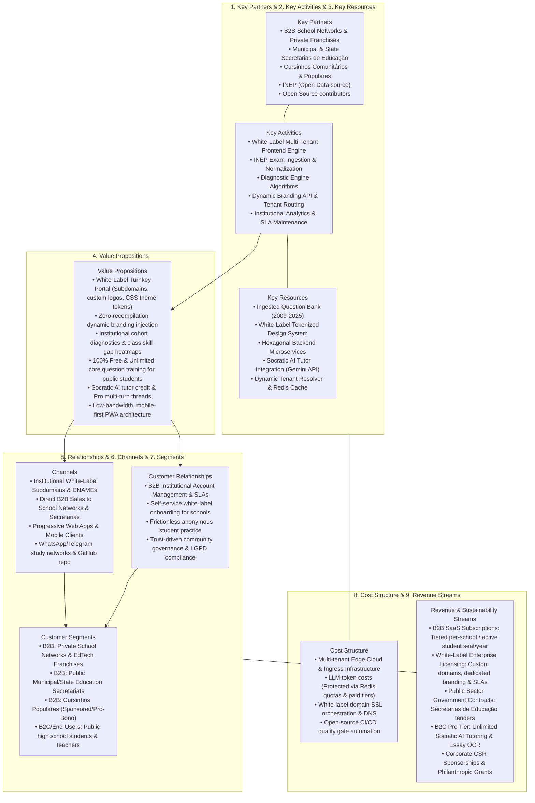
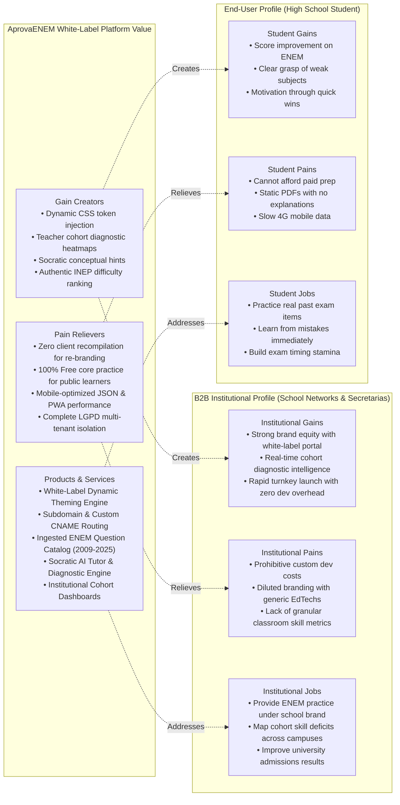

# Business & Market Strategy — AprovaENEM

> **Strategic Framework Alignment**: Business Model Canvas (Osterwalder), Value Proposition Canvas, Jobs-to-be-Done (JTBD), B2B White-Label SaaS Multi-Tenancy, and UN Sustainable Development Goals (SDG 4 & SDG 10).

---

## 1. Executive Summary & Social Mission

**AprovaENEM** is an open-source, multi-tenant digital learning and diagnostic assessment platform built with a **White-Label B2B / B2B2C architectural engine**. The platform enables educational institutions—including private school networks (*redes de ensino*), municipal and state education departments (*Secretarias de Educação*), university-affiliated preparatory programs (*cursinhos comunitários*), and commercial EdTechs—to deploy their own fully branded, turnkey ENEM diagnostic assessment portals with zero frontend recompilation.

In Brazil, **84.3% of secondary school students attend public high schools** (INEP Censo Escolar), yet they represent a fraction of admissions to high-demand programs in federal universities. While online commercial platforms charge between R$ 30 and R$ 200+/month (often locking up annual credit card limits) and private physical preparatory courses (*cursinhos*) cost between R$ 1,000 and R$ 2,500/month, public school students are left with static, confusing PDFs and fragmented YouTube videos.

AprovaENEM bridges this gap through a dual-engine model:
1. **Direct Open Access**: 100% public, official open data from INEP (historical exams spanning 2009 to 2025, official answer keys, and Item Response Theory / TRI metadata) packaged into a modern, frictionless API for self-directed public school students.
2. **White-Label B2B Institutional Engine**: Partner institutions, schools, and educational secretariats deploy the platform under their own institutional identity (custom brand colors, typography, institutional logos, and custom CNAME subdomains). The white-label frontend resolves tenant configuration dynamically at runtime, delivering institutional cohort tracking, class-level diagnostic analytics, and zero infrastructure overhead for educators, while cross-subsidizing free public school access.

---

## 2. Business Model Canvas (9 Building Blocks)

### Detailed Canvas Breakdown

| Canvas Block                            | Strategy & Implementation                                                                                                                                                                                                                                                                                                                                                                                                                                                                                                                                                                             |
| :-------------------------------------- | :---------------------------------------------------------------------------------------------------------------------------------------------------------------------------------------------------------------------------------------------------------------------------------------------------------------------------------------------------------------------------------------------------------------------------------------------------------------------------------------------------------------------------------------------------------------------------------------------------- |
| **1. Key Partners**                     | • **Private School Networks & EdTech Franchises**: Private educational groups seeking an turnkey, institutional-branded ENEM diagnostic solution without developing proprietary question-bank engines from scratch. • **Municipal & State Secretarias de Educação**: Public educational departments implementing large-scale diagnostic exam preparation across public school networks. • **Community Preparatory Courses (*Cursinhos Comunitários & Populares*)**: Partner with initiatives like Educafro, Uneafro, and university student-run cursinhos for pro-bono white-label portals. • **INEP**: Public provider of open exam datasets, guidelines, and answer keys. • **Open-Source Tech Community**: Developers contributing code, integrations, and hosting optimizations.                                                                                                                                    |
| **2. Key Activities**                   | • Developing and maintaining the **White-Label Multi-Tenant Frontend Engine** (runtime CSS token injection, tenant routing, dynamic logo/favicon swaps). • Ingesting, cleaning, and normalizing historical ENEM exams (2009 to present). • Maintaining high-availability REST APIs and Edge Gateway with sub-100ms response times and tenant routing. • Developing adaptive diagnostic algorithms mapping skill deficiencies per student and per institutional cohort. • Ensuring 100% uptime and enterprise SLAs during pre-ENEM peak traffic periods.                                                                                                                                                 |
| **3. Key Resources**                    | • White-label design token system allowing instant dynamic CSS custom property injection. • Structured relational question repository categorized by discipline, topic, and difficulty. • High-performance Spring Boot Hexagonal backend with PostgreSQL and Redis 7 multi-tenant caching. • Automated deployment scripts, Docker Compose environments, and tenant routing proxies. • Comprehensive documentation and developer guides.                                                                                                                                                                                                                                                                                                           |
| **4. Value Propositions**               | • **Turnkey White-Label Branding**: Educational institutions deploy their own branded platform (custom palette, logo, favicon, institution typography, and custom CNAME domain) in under 10 minutes with zero code changes or client rebuilds. • **Institutional Cohort Analytics**: School directors and coordinators receive aggregate class diagnostics, identifying common student pitfalls per ENEM competency and topic. • **Zero Financial Barrier for Core Public Training**: All historical questions, answer validations, and curated step-by-step resolutions are 100% free and unlimited for students with zero paywalls. • **Daily Free AI Tutor Quota**: 1 free Socratic AI Tutor consultation per day for every registered student (resets daily at 00:00 BRT). • **Frictionless Onboarding**: Students start practicing exam questions in 1 click without mandatory sign-up or credit card. • **Accessible Performance**: Lightweight API and PWA designed to function seamlessly over 3G/4G mobile connections. |
| **5. Customer Relationships**           | • **B2B Institutional Accounts**: Dedicated technical support, tenant onboarding portal, custom domain configuration assistance, and institutional SLAs. • **End-User Students**: Anonymous, respectful, privacy-focused interactions for core practice with organic conversion funnels. • **Community Governance**: Public open-source transparency, community-driven feature roadmaps, and privacy compliance (LGPD).                                                                                                                                                                                                                                                                                                                                                                                                                        |
| **6. Channels**                         | • **White-Label Institutional Portals**: Custom subdomains (e.g., `colegio-alfa.example.com` or `tenant.${BASE_DOMAIN}`), path-based portals (`/t/{tenantSlug}`), and institutional CNAME custom domains (`simulado.escola.com.br`). • **B2B Direct Institutional Outreach**: Engagement with school network directors, private education congresses, and public education procurement tenders. • **Direct Digital Channels**: Progressive Web Apps (PWA), student study networks on WhatsApp/Telegram, and open-source GitHub repository.                                                                                                                                                                                                                                                                                                                                                                                                         |
| **7. Customer Segments**                | • **B2B Institutional Tier 1 (Private School Networks)**: K-12 private school groups and prep course franchises seeking white-label student portals and cohort diagnostic reports. • **B2B Institutional Tier 2 (Public Secretarias de Educação)**: Municipal and state government education departments delivering centralized exam prep across hundreds of public schools. • **B2B Pro-Bono (Cursinhos Populares)**: Non-profit community prep organizations receiving sponsored white-label instances. • **End-Users (Students & Teachers)**: Public school seniors, vestibular repeaters, and classroom educators.                                                                                                                                                                                                                                                                                                         |
| **8. Cost Structure**                   | • Multi-tenant edge infrastructure: Scalable cloud instances, multi-tenant database clusters, and Nginx reverse proxy edge. • Upstream LLM token costs: Strictly protected via Redis rate limiters, 1-per-day quotas, and institutional B2B enterprise allowances. • DNS, automated SSL certificate issuance (Let's Encrypt / ACME) for custom tenant domains. • Open-source CI/CD quality gate automation and maintenance.                                                                                                                               |
| **9. Revenue Streams & Sustainability** | • **B2B White-Label SaaS Subscriptions**: Annual or monthly subscription fees tiered by institutional student seats (e.g., Starter School: up to 500 active students; Enterprise Network: 5,000+ students with custom CNAME and SLA). • **Public Sector Educational Contracts**: Government procurement agreements with state secretarias de educação for subsidized public network rollouts. • **Institutional Feature Add-ons**: Custom question bank ingestion, proprietary mock-exam authoring, and advanced predictive TRI analytics. • **AprovaENEM Pro Plan (B2C Direct)**: Optional individual student subscription for unlimited Socratic AI tutoring and essay photo OCR evaluation. • **Philanthropic Grants & CSR**: Corporate technology sponsorships funding pro-bono white-label instances for cursinhos populares. |

---

## 3. Ideal Customer Profiles (ICPs) & User Personas

### Persona 1: Lucas Silva — The Resilient Public School Senior

> [!NOTE]
> **Lucas Silva (18 years old)**  
> *Public High School Senior — Periphery of São Luís, Maranhão*

* **Demographics**: 18 years old, lives with his mother and two siblings in an urban periphery neighborhood. Attends a state public high school in the morning and dedicates his afternoons and evenings to independent study and exam prep at home.
* **Tech Access**: Budget Android smartphone (Moto G series) with a prepaid 4G data plan; accesses public school desktop computers twice a week.
* **Goal**: Score 700+ on ENEM to earn a full PROUNI scholarship or SISU admission into Computer Science or Civil Engineering at a federal university (UFMA/IFMA).

#### Jobs to Be Done (JTBD)
* **Functional Job**: Solve authentic ENEM exam questions on his phone during the 40-minute bus commute, receive instant verification, and see why his answer was incorrect without burning through his limited mobile data.
* **Emotional Job**: Feel confident and capable of competing against private school students; relieve anxiety about unknown weak spots.
* **Social Job**: Become the first person in his family to earn a university degree, breaking the generational cycle of low income.

#### Top Pain Points
1. **Frustration with Static PDFs**: Downloading 40MB exam PDFs on a prepaid data plan is slow and impossible to read on a mobile screen.
2. **Lack of Explanations**: Official answer keys only state *"Option C is correct"*, offering zero explanation of the underlying mathematical theorem or historical context.
3. **No Financial Means for Cursinho**: Private online platforms charge R$ 60-150/month, which equals 10-20% of his family's monthly disposable income.

#### What Delights Lucas in AprovaENEM
* Instant question loading without registration barriers.
* Step-by-step resolution breakdowns explaining *why* the distractor options are incorrect.
* Clear diagnostic badge showing: *"You missed this because of Quadratic Functions — Review Step 1"*.

---

### Persona 2: Mariana Costa — The Volunteer Educator

> [!NOTE]
> **Prof. Mariana Costa (27 years old)**  
> *Volunteer Physics Teacher — Cursinho Popular Comunitário*

* **Demographics**: 27 years old, Master’s student in Physics Education, volunteers every Saturday teaching 45 low-income students at a community center prep course.
* **Tech Access**: Mid-range laptop, reliable broadband at home, uses Google Drive and WhatsApp to share materials with her class.
* **Goal**: Maximize the limited 2 hours per week she has with her students by targeting their most widespread conceptual weaknesses.

#### Jobs to Be Done (JTBD)
* **Functional Job**: Quickly generate topic-specific practice quizzes (e.g., 10 questions on *Optics & Kinematics*) and identify which questions 70% of her class failed.
* **Emotional Job**: Avoid burnout from spending hours manually copying and formatting past ENEM questions from old PDFs.
* **Social Job**: Empower her community and mentor underprivileged youth toward higher education.

#### Top Pain Points
1. **Time Scarcity**: Spends 4-5 hours every Friday night compiling exam questions and typing out answer keys manually.
2. **Blind Spot Teaching**: Cannot easily determine whether her students are struggling with algebraic manipulation or fundamental physics principles.
3. **Student Disengagement**: Students lose homework sheets or give up when they hit a roadblock at home without assistance.

#### What Delights Mariana in AprovaENEM
* Ability to query the API for specific question sets filtered by year, topic, and difficulty.
* Structured diagnostic analytics that aggregate common student errors across standard curriculum topics.

---

### Persona 3: Dr. Roberto Mendes — The Institutional Academic Director

> [!NOTE]
> **Dr. Roberto Mendes (52 years old)**  
> *Academic Vice-President — Rede de Ensino Horizonte (18 K-12 Campuses)*

* **Demographics**: 52 years old, Ed.D. in Curriculum Development, oversees academic outcomes, pedagogical tooling, and national ENEM rankings for 18 private high school campuses (12,000+ enrolled students).
* **Tech Access**: Enterprise MacBook, iPad Pro, integrated Google Workspace and Canvas LMS environment.
* **Goal**: Equip every high school senior across the network with an institutional-branded ENEM diagnostic simulator while obtaining real-time cohort weakness dashboards for department heads—without contracting multi-million dollar software factories.

#### Jobs to Be Done (JTBD)
* **Functional Job**: Deliver a modern exam diagnostic app fully branded with his school network's visual identity (custom colors, logo, typography, domain `simulado.redehorizonte.com.br`), with aggregated cohort analytics showing which campuses and classrooms are lagging behind in specific TRI matrix competencies.
* **Emotional Job**: Project innovation, prestige, and academic leadership to prospective parents during the school admissions season; remove friction between teachers and tech tools.
* **Social Job**: Elevate the institution's position in regional ENEM benchmark tables and university admissions statistics.

#### Top Pain Points
1. **Excessive Custom Development Costs**: Quotes from software houses to build an internal diagnostic platform exceeded R$ 450,000 with a 9-month delivery timeline.
2. **Fragmented Off-the-Shelf Tools**: Existing EdTech platforms enforce their own intrusive brand logos, confusing students and diluting the school network's institutional brand equity.
3. **Data Silos**: Inability to extract class-level diagnostic data or map cohort gaps back into weekly teacher lesson planning.

#### What Delights Roberto in AprovaENEM White-Label
* Turnkey White-Label architecture: The frontend injects Rede Horizonte's visual tokens and assets dynamically in real-time.
* Subdomain and custom CNAME routing: Students access the platform directly at `simulado.redehorizonte.com.br`.
* Real-time institutional diagnostic dashboards breaking down accuracy by classroom, teacher, and ENEM knowledge area.
* Complete LGPD data segregation and enterprise SLA guarantees.

---

## 4. Value Proposition Canvas

---

## 5. Strategic Alignment with UN Sustainable Development Goals

| SDG Target | How AprovaENEM Delivers Direct Impact |
| :--- | :--- |
| **SDG 4: Quality Education** *(Target 4.1 & 4.3)* | • **Equal Access to Higher Education**: Eliminates the preparation quality gap between private and public school students. • **Pedagogical Integrity**: Promotes deep conceptual understanding through step-by-step problem resolutions rather than rote memorization. • **Digital Educational Commons**: Creates an open-source, reusable digital public good (*Public Good Software*) for the Brazilian educational ecosystem. • **Institutional Enablement**: Equips public schools and municipal secretarias with institutional-grade diagnostic capabilities previously exclusive to elite private networks. |
| **SDG 10: Reduced Inequalities** *(Target 10.2 & 10.3)* | • **Socioeconomic Mobility**: University graduation in Brazil increases lifetime earnings by over 150%, making higher education the single most powerful lever against intergenerational poverty. • **Cross-Subsidization Engine**: B2B SaaS licensing fees from private school networks fund the ongoing infrastructure, pro-bono white-label deployments for cursinhos populares, and free AI tokens for public students. |

---

## 6. Key Performance Indicators (KPIs)

To evaluate platform success, B2B institutional adoption, and social impact, the platform tracks the following metrics:

### 6.1 Student Engagement & Pedagogical KPIs
1. **Practice Velocity**: Total questions answered per session (target: $\ge 8$ questions/session).
2. **Diagnostic Completion Rate**: Percentage of users who complete a targeted 10-question diagnostic quiz (target: $\ge 65\%$).
3. **Weak-Spot Remediation Ratio**: Rate at which a student correctly answers a question in a topic they previously failed within a 14-day window (target: $\ge 40\%$).
4. **Latency Budget & Mobile Accessibility**: API response time at `p95 < 120ms` for payload sizes $< 25\text{ KB}$, ensuring smooth performance on constrained mobile connections.
5. **System Reliability**: Service availability $\ge 99.9\%$ with automated Prometheus bug and error rate alerting.

### 6.2 B2B Institutional & White-Label KPIs
6. **Tenant Onboarding Velocity**: Time required to provision a new institutional tenant with full branding, theme injection, and subdomain resolution (target: $< 10\text{ minutes}$).
7. **Institutional Cohort Coverage**: Active students practicing under an institutional tenant domain (target: $\ge 80\%$ enrolled high school cohort).
8. **Classroom Diagnostic Utilization**: Percentage of partner school educators accessing cohort diagnostic heatmaps at least once bi-weekly (target: $\ge 70\%$).
9. **Net Revenue Retention (NRR) / Renewal Rate**: Institutional B2B annual subscription retention (target: $\ge 110\%$ NRR).
