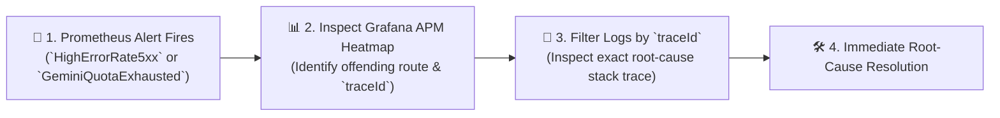
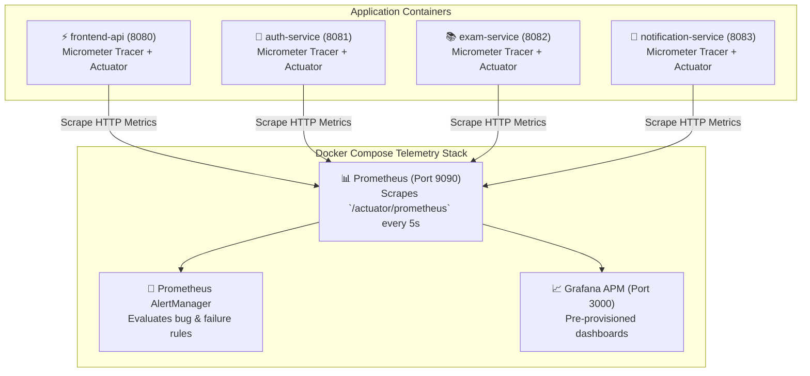

# Observability & Root-Cause Bug Detection Architecture

> **Design Pattern**: Datadog-Style APM & Fault Isolation  
> **Telemetry Engine**: Prometheus + Micrometer Tracing + Grafana (via Docker Compose)  
> **Core Objective**: Rapid root-cause diagnosis, anomaly detection, and distributed failure hunting  

---

## 1. Observability Philosophy: Beyond Vanity Dashboards

In production systems, traditional dashboards showing generic CPU and RAM graphs are rarely useful when an incident strikes. When an API slows down or fails, engineers must answer three concrete questions within seconds:
1. **What broke?** (Which endpoint or dependency is failing?)
2. **Where did it break?** (Gateway, Auth Service, Exam Service, Database, or external Gemini API?)
3. **Why did it break?** (What is the exact stack trace, query deadlock, or rate limit quota breach?)

AprovaENEM solves this using a **Datadog-style correlated observability triad**:
- **Metrics** tell you *that* a problem is occurring (Prometheus alerts).
- **Traces** tell you *where* latency or failure was introduced across network hops (Micrometer `traceId`).
- **Logs** tell you *why* it failed, automatically filtered by that exact `traceId` in Logback MDC.



---

## 2. Telemetry Architecture & Docker Compose Pipeline



---

## 3. Production Failure Modes & Targeted Metrics

### Failure Mode 1: Gemini Upstream Rate Limit Exhaustion (HTTP 429)
* **Risk**: Upstream Gemini API rate limits or quota boundaries. Traffic spikes can trigger HTTP 429 (Too Many Requests) from Google.
* **Telemetry Metric**:
  - `gemini_api_requests_total{status="429"}` (Rate limit counter).
  - `gemini_api_fallback_total` (Times the system fell back to static INEP resolutions).
* **Circuit Breaker Integration**: Resilience4j trips when failure rate $> 50\%$ over 10 calls, transitioning to `OPEN` to prevent cascading gateway timeouts.

### Failure Mode 2: Database Connection Pool Exhaustion (HikariCP)
* **Risk**: High-concurrency quiz generation requests can saturate the HikariCP connection pool, causing connection timeout exceptions (`SQLTransientConnectionException`).
* **Telemetry Metric**:
  - `hikaricp_connections_pending` (Requests waiting for an idle connection).
  - `hikaricp_connections_timeout_total` (Hard connection failure count).
  - `hikaricp_connections_active` vs `hikaricp_connections_max`.

### Failure Mode 3: Latency Spikes in Quiz Generation (p95 / p99)
* **Risk**: Unindexed question filters or inefficient B-tree scans cause database query timeouts.
* **Telemetry Metric**:
  - `http_server_requests_seconds{uri="/api/v1/sessions", quantile="0.95"}`
  - `http_server_requests_seconds{uri="/api/v1/sessions", quantile="0.99"}`

### Failure Mode 4: Unhandled Application Exceptions (5xx Anomalies)
* **Risk**: Regressions in grading logic or parsing null fields in INEP question options.
* **Telemetry Metric**:
  - `http_server_requests_errors_total{status=~"5.."}`

---

## 4. Correlated Distributed Tracing (MDC Standard)

Every incoming HTTP request through the Gateway receives a W3C-compliant `traceId` (32 hex characters) and a `spanId` (16 hex characters).

### HTTP Response Header Injection
Every response sent to mobile and web clients includes the trace header:
```http
HTTP/1.1 500 Internal Server Error
Content-Type: application/json
X-Trace-Id: 4bf92f3577b34da6a3ce929d0e0e4736
```

### Logback MDC Pattern (`logback-spring.xml`)
```xml
<configuration>
    <appender name="CONSOLE" class="ch.qos.logback.core.ConsoleAppender">
        <encoder>
            <pattern>%d{yyyy-MM-dd HH:mm:ss.SSS} %-5level [%X{serviceName:-unknown},%X{traceId:-none},%X{spanId:-none}] %logger{36} : %msg%n</pattern>
        </encoder>
    </appender>
</configuration>
```

### The Root-Cause Investigation Walkthrough
When a student reports an error with `X-Trace-Id: 4bf92f3577b34da6a3ce929d0e0e4736`:

1. Search logs across all microservices for that `traceId`:
```text
2026-09-17 19:45:02.105 INFO  [api-gateway,4bf92f3577b34da6,00f067aa0ba902b7] c.o.g.RouteFilter : Inbound POST /api/v1/questions/1024/ask
2026-09-17 19:45:02.118 INFO  [exam-service,4bf92f3577b34da6,11a123bb0ca801a2] c.o.a.s.TutorService : Dispatching Socratic query to Gemini API
2026-09-17 19:45:02.850 ERROR [exam-service,4bf92f3577b34da6,11a123bb0ca801a2] c.o.a.i.a.o.g.GeminiClient : Gemini API HTTP 429: ResourceExhausted: Quota exceeded for quota metric 'GenerateContent Requests'
2026-09-17 19:45:02.852 WARN  [exam-service,4bf92f3577b34da6,11a123bb0ca801a2] c.o.a.s.TutorService : Tripping CircuitBreaker [GeminiCircuitBreaker: HALF_OPEN -> OPEN]. Serving static resolution.
```
2. **Diagnosis completed in 10 seconds**: Zero guesswork. The logs confirm that the student's question triggered an upstream Gemini API 429 rate limit exhaustion, the circuit breaker tripped, and the fallback static explanation was returned safely.

---

## 5. Concrete Prometheus Alert Rules (`alerts.yml`)

These rules are loaded by Prometheus to proactively catch bugs before users notice them:

```yaml
groups:
  - name: aprovaenem-critical-alerts
    rules:
      # Alert 1: Unhandled 5xx Error Spike
      - alert: HighHttp5xxErrorRate
        expr: sum(rate(http_server_requests_seconds_count{status=~"5.."}[1m])) / sum(rate(http_server_requests_seconds_count[1m])) > 0.02
        for: 30s
        labels:
          severity: critical
        annotations:
          summary: "HTTP 5xx error rate exceeds 2% across microservices"
          description: "Microservice {{ $labels.app }} is returning elevated 5xx server errors."

      # Alert 2: Database Connection Pool Starvation
      - alert: HikariPoolStarvation
        expr: hikaricp_connections_pending > 5
        for: 15s
        labels:
          severity: warning
        annotations:
          summary: "HikariCP connection pool starvation in {{ $labels.app }}"
          description: "More than 5 requests are queued waiting for a database connection."

      # Alert 3: Question Catalog High Latency (p95 SLA Breach)
      - alert: HighQuestionReadLatency
        expr: histogram_quantile(0.95, sum(rate(http_server_requests_seconds_bucket{uri=~"/api/v1/questions.*"}[2m])) by (le)) > 0.200
        for: 1m
        labels:
          severity: warning
        annotations:
          summary: "Question read latency p95 > 200ms"
          description: "Database B-tree index or payload size regression on question queries."

      # Alert 4: Gemini AI Rate Limit Exhaustion
      - alert: GeminiRateLimitBreach
        expr: sum(rate(gemini_api_requests_total{status="429"}[1m])) > 0
        for: 10s
        labels:
          severity: warning
        annotations:
          summary: "Google Gemini Upstream Rate Limit hit (429)"
          description: "AI Tutor endpoint is hitting upstream rate limits. Activating fallback."
```
