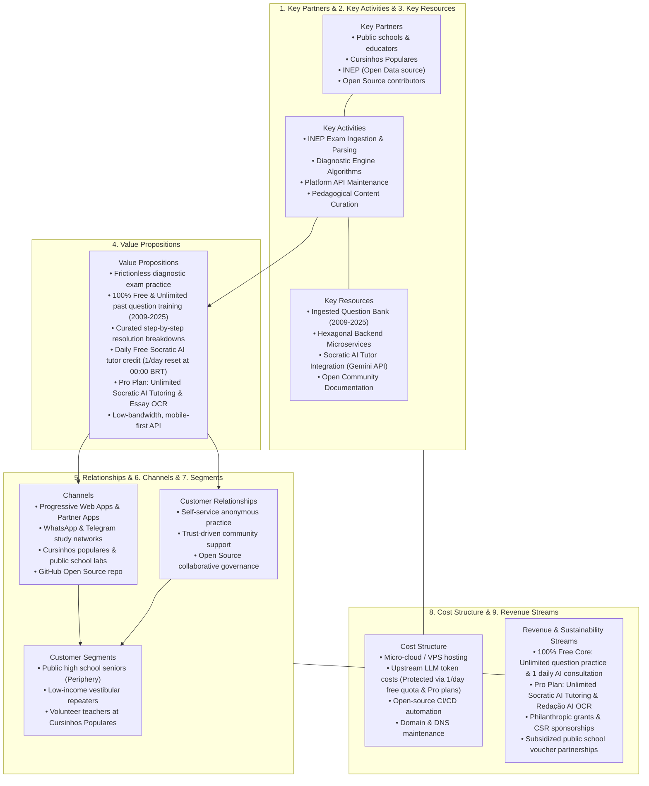
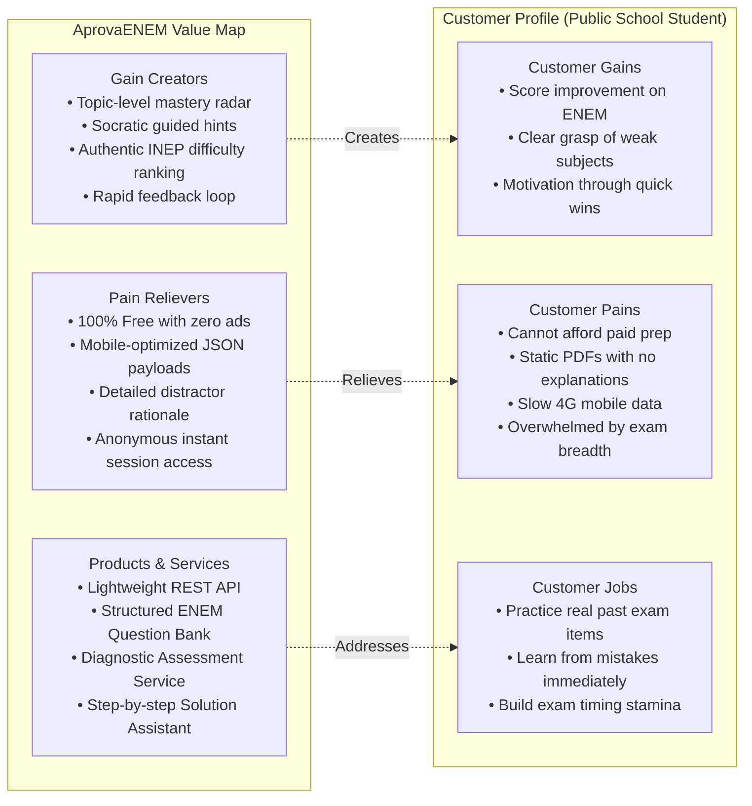

# Business & Market Strategy — AprovaENEM

> **Strategic Framework Alignment**: Business Model Canvas (Osterwalder), Value Proposition Canvas, Jobs-to-be-Done (JTBD), and UN Sustainable Development Goals (SDG 4 & SDG 10).

---

## 1. Executive Summary & Social Mission

**AprovaENEM** is an open-source, non-profit digital learning and diagnostic assessment platform built to democratize high-quality ENEM (*Exame Nacional do Ensino Médio*) preparation for Brazilian public high school students (*estudantes de escola pública*) and community prep initiatives (*cursinhos populares*).

In Brazil, **84.3% of secondary school students attend public high schools** (INEP Censo Escolar), yet they represent a fraction of admissions to high-demand programs in federal universities. While online commercial platforms charge between R$ 30 and R$ 200+/month (often locking up annual credit card limits) and private physical preparatory courses (*cursinhos*) cost between R$ 1,000 and R$ 2,500/month, public school students are left with static, confusing PDFs and fragmented YouTube videos.

AprovaENEM bridges this gap by leveraging 100% public, official open data from INEP (historical exams spanning 2009 to 2025, official answer keys, and Item Response Theory / TRI metadata) packaged into a modern, frictionless API that enables practice-based learning, diagnostic skill-gap mapping, and Socratic concept explanations.

---

## 2. Business Model Canvas (9 Building Blocks)

### Detailed Canvas Breakdown

| Canvas Block                            | Strategy & Implementation                                                                                                                                                                                                                                                                                                                                                                                                                                                                                                                                                                                                             |
| :-------------------------------------- | :------------------------------------------------------------------------------------------------------------------------------------------------------------------------------------------------------------------------------------------------------------------------------------------------------------------------------------------------------------------------------------------------------------------------------------------------------------------------------------------------------------------------------------------------------------------------------------------------------------------------------------ |
| **1. Key Partners**                     | • **Community Preparatory Courses (*Cursinhos Comunitários & Populares*)**: Partner with initiatives like Educafro, Uneafro, and university student-run cursinhos. • **Public School STEM Teachers**: Provide automated diagnostic reports for their classrooms. • **INEP**: Public provider of open exam datasets, guidelines, and answer keys. • **Open-Source Tech Community**: Developers contributing code, translations, and hosting optimizations.                                                                                                                                                                    |
| **2. Key Activities**                   | • Data extraction, cleaning, and normalization of historical ENEM exams (2009 to present). • Maintaining high-availability REST APIs with sub-100ms response times. • Developing adaptive diagnostic algorithms mapping skill deficiencies per topic. • Ensuring 100% uptime during pre-ENEM peak traffic periods.                                                                                                                                                                                                                                                                                                           |
| **3. Key Resources**                    | • Structured relational question repository categorized by discipline, topic, and difficulty. • High-performance Spring Boot Hexagonal backend with PostgreSQL. • Automated deployment scripts and Docker Compose environments. • Comprehensive documentation and developer guides.                                                                                                                                                                                                                                                                                                                                          |
| **4. Value Propositions**               | • **Zero Financial Barrier for Core Training**: All 17 years of objective questions, answer validations, and curated step-by-step resolutions are 100% free and unlimited for all students. • **Daily Free AI Tutor Quota**: 1 free Socratic AI Tutor consultation per day per student (resets daily at 00:00 BRT), ensuring every student accesses AI tutoring without cost. • **Frictionless Onboarding**: Start practicing in 1 click without mandatory sign-up or credit card. • **Targeted Diagnostic Feedback**: Identifies *why* an answer is wrong and which fundamental concept to review. • **Accessible Performance**: Lightweight API designed to function seamlessly over 3G/4G mobile connections. • **AprovaENEM Pro Tier**: Unlimited Socratic AI consultations and Phase 2 multimodal handwritten essay grading (*Redação Nota 1000*). |
| **5. Customer Relationships**           | • Anonymous, respectful, privacy-focused interactions. • Community-driven feature requests via public GitHub discussions. • Transparent educational data handling (no student data selling or tracking).                                                                                                                                                                                                                                                                                                                                                                                                                        |
| **6. Channels**                         | • Direct API integration for frontend mobile and web clients. • Community outreach via student WhatsApp/Telegram study groups. • Partnerships with public school computer labs and NGOs.                                                                                                                                                                                                                                                                                                                                                                                                                                        |
| **7. Customer Segments**                | • **Primary**: Brazilian public high school seniors (ages 16–19) from low-income households. • **Secondary**: Adult learners and workers studying after hours for university entry. • **Tertiary**: Volunteer educators needing question sets and diagnostic tracking for their classes.                                                                                                                                                                                                                                                                                                                                        |
| **8. Cost Structure**                   | • Minimal infrastructure: Designed to operate comfortably on low-cost virtual private servers or cloud instances. • Open-source software stack (Linux, PostgreSQL, Spring Boot, Prometheus, Docker). • Upstream LLM token costs: Strictly protected from runaway costs or quota exhaustion by enforcing a Redis-backed 1-per-day rate limit for free users; high-volume queries funded via Pro subscriptions. • Zero commercial database licensing or paid third-party proprietary software fees.                                                                                                                               |
| **9. Revenue Streams & Sustainability** | • **Core App (100% Free & Unlimited)**: Full past question catalog, quizzes, instant grading, TRI scoring, and 1 free Socratic AI consultation per day. • **AprovaENEM Pro Plan**: Affordable monthly subscription or subsidized voucher unlocking **Unlimited Socratic AI Tutoring** and multimodal handwritten essay photo OCR evaluation (5 official INEP competencies). • **Grant Funding & CSR**: Educational foundations (e.g., Fundação Lemann) and corporate tech sponsorships to fund free Pro vouchers for low-income public school students.                                                                        |

---

## 3. Ideal Customer Profiles (ICPs) & User Personas

### Persona 1: Lucas Silva — The Resilient Public School Senior

> [!NOTE]
> **Lucas Silva (18 years old)**  
> *Public High School Senior — Periphery of São Luís, Maranhão*

* **Demographics**: 18 years old, lives with his mother and two siblings in an urban periphery neighborhood. Attends a state public high school in the morning and dedicates his afternoons and evenings to independent study and exam prep at home.
* **Tech Access**: Budget Android smartphone (Moto G series) with a prepaid 4G data plan; accesses public school desktop computers twice a week.
* **Goal**: Score 700+ on ENEM to earn a full PROUNI scholarship or SISU admission into Computer Science or Civil Engineering at a federal university (UFMA/IFMA).

#### Jobs to Be Done (JTBD)
* **Functional Job**: Solve authentic ENEM exam questions on his phone during the 40-minute bus commute, receive instant verification, and see why his answer was incorrect without burning through his limited mobile data.
* **Emotional Job**: Feel confident and capable of competing against private school students; relieve anxiety about unknown weak spots.
* **Social Job**: Become the first person in his family to earn a university degree, breaking the generational cycle of low income.

#### Top Pain Points
1. **Frustration with Static PDFs**: Downloading 40MB exam PDFs on a prepaid data plan is slow and impossible to read on a mobile screen.
2. **Lack of Explanations**: Official answer keys only state *"Option C is correct"*, offering zero explanation of the underlying mathematical theorem or historical context.
3. **No Financial Means for Cursinho**: Private online platforms charge R$ 60-150/month, which equals 10-20% of his family's monthly disposable income.

#### What Delights Lucas in AprovaENEM
* Instant question loading without registration barriers.
* Step-by-step resolution breakdowns explaining *why* the distractor options are incorrect.
* Clear diagnostic badge showing: *"You missed this because of Quadratic Functions — Review Step 1"*.

---

### Persona 2: Mariana Costa — The Volunteer Educator

> [!NOTE]
> **Prof. Mariana Costa (27 years old)**  
> *Volunteer Physics Teacher — Cursinho Popular Comunitário*

* **Demographics**: 27 years old, Master’s student in Physics Education, volunteers every Saturday teaching 45 low-income students at a community center prep course.
* **Tech Access**: Mid-range laptop, reliable broadband at home, uses Google Drive and WhatsApp to share materials with her class.
* **Goal**: Maximize the limited 2 hours per week she has with her students by targeting their most widespread conceptual weaknesses.

#### Jobs to Be Done (JTBD)
* **Functional Job**: Quickly generate topic-specific practice quizzes (e.g., 10 questions on *Optics & Kinematics*) and identify which questions 70% of her class failed.
* **Emotional Job**: Avoid burnout from spending hours manually copying and formatting past ENEM questions from old PDFs.
* **Social Job**: Empower her community and mentor underprivileged youth toward higher education.

#### Top Pain Points
1. **Time Scarcity**: Spends 4-5 hours every Friday night compiling exam questions and typing out answer keys manually.
2. **Blind Spot Teaching**: Cannot easily determine whether her students are struggling with algebraic manipulation or fundamental physics principles.
3. **Student Disengagement**: Students lose homework sheets or give up when they hit a roadblock at home without assistance.

#### What Delights Mariana in AprovaENEM
* Ability to query the API for specific question sets filtered by year, topic, and difficulty.
* Structured diagnostic analytics that aggregate common student errors across standard curriculum topics.

---

## 4. Value Proposition Canvas

---

## 5. Strategic Alignment with UN Sustainable Development Goals

| SDG Target | How AprovaENEM Delivers Direct Impact |
| :--- | :--- |
| **SDG 4: Quality Education** *(Target 4.1 & 4.3)* | • **Equal Access to Higher Education**: Eliminates the preparation quality gap between private and public school students. • **Pedagogical Integrity**: Promotes deep conceptual understanding through step-by-step problem resolutions rather than rote memorization. • **Digital Educational Commons**: Creates an open-source, reusable digital public good (*Public Good Software*) for the Brazilian educational ecosystem. |
| **SDG 10: Reduced Inequalities** *(Target 10.2 & 10.3)* | • **Socioeconomic Mobility**: University graduation in Brazil increases lifetime earnings by over 150%, making higher education the single most powerful lever against intergenerational poverty. • **Equitable Opportunity**: Levels the playing field by providing the exact same diagnostic capability previously reserved for high-fee private academies. |

---

## 6. Key Performance Indicators (KPIs)

To evaluate platform success and social impact, the backend tracks the following metrics:

1. **Practice Velocity**: Total questions answered per session (target: $\ge 8$ questions/session).
2. **Diagnostic Completion Rate**: Percentage of users who complete a targeted 10-question diagnostic quiz (target: $\ge 65\%$).
3. **Weak-Spot Remediation Ratio**: Rate at which a student correctly answers a question in a topic they previously failed within a 14-day window (target: $\ge 40\%$).
4. **Latency Budget & Mobile Accessibility**: API response time at `p95 < 120ms` for payload sizes $< 25\text{ KB}$, ensuring smooth performance on constrained mobile connections.
5. **System Reliability**: Service availability $\ge 99.9\%$ with automated Prometheus bug and error rate alerting.
