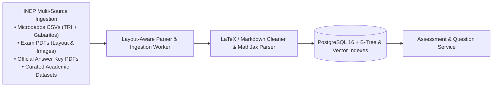

# Project Charter & Scope Statement — AprovaENEM

> **Document Status**: Approved (Sprint 1 Baseline)  
> **Product Name**: AprovaENEM  
> **Target Audience**: Brazilian Public School Students, Community Cursinhos, Open Source Education Ecosystem  

---

## 1. Project Overview & Vision

**AprovaENEM** is an open-source, production-grade distributed backend providing an intelligent question bank, assessment engine, and diagnostic study assistant based on past exams of the Brazilian National High School Exam (ENEM).

### Problem Statement
The National High School Exam (ENEM) is the primary gateway to higher education in Brazil, governing access to federal universities (via SISU), private college scholarships (PROUNI), and student loans (FIES). 
- Over **3.5 to 4 million candidates** register annually.
- Public high school students represent **84.3% of secondary enrollment** (INEP Censo Escolar), but are severely underrepresented in high-competition degree programs (Medicine, Law, Computer Science, Engineering).
- Commercial platforms monetize question banks with subscriptions ranging from R$ 30 to R$ 200+/month (and over R$ 1,000/month for physical prep academies) that exclude low-income students.
- Raw INEP exam data is published as disorganized PDFs and spreadsheets that cannot be consumed on mobile devices or easily filtered by pedagogical skill tags.

### Product Vision
To provide a clean, high-performance, open-access API that transforms public INEP exam data into structured, interactive, mobile-optimized diagnostic practice sessions with step-by-step problem resolutions and zero paywalls.

---

## 2. Ingestion Strategy for INEP Open Data

The platform sources 100% of its core examination data from public government releases published by INEP (*Instituto Nacional de Estudos e Pesquisas Educacionais Anísio Teixeira*), triangulating between **tabular Microdados**, **exam PDFs**, **answer keys**, and **open academic datasets** (see detailed specification in [`docs/sprint-1/09-data-ingestion-pipeline.md`](file:///home/verivi/Veras/Projects/ReconectaRecode/docs/sprint-1/09-data-ingestion-pipeline.md)):

### Data Pipeline Specifications
1. **Multi-Source Sourcing Strategy**:
   - **INEP Microdados (`ITENS_PROVA_*.csv`)**: Official tabular ground truth for question codes (`CO_ITEM`), answer keys (`TX_GABARITO`), skill mappings ($H_1$ to $H_{30}$), and Item Response Theory (TRI) mathematical parameters ($a, b, c$).
   - **Official Exam PDFs (*Cadernos de Questões*)**: Question statements, reading passages, embedded diagrams, maps, and comics (*tirinhas*) extracted via **IBM Docling** (DocLayNet neural layout parser with native formula-to-LaTeX conversion).
   - **Official Gabarito PDFs**: Verification of notebook color mappings (Blue, Yellow, White, Pink, Gray) and annulled items.
   - **Curated Open Academic Datasets**: Community benchmarks (e.g. Maritaca AI, Hugging Face) for historical cross-validation.
2. **Standard Subject Taxonomy**:
   - `MATHEMATICS` (*Matemática e suas Tecnologias*)
   - `NATURAL_SCIENCES` (*Ciências da Natureza e suas Tecnologias* - Physics, Chemistry, Biology)
   - `HUMANITIES` (*Ciências Humanas e suas Tecnologias* - History, Geography, Philosophy, Sociology)
   - `LANGUAGES` (*Linguagens, Códigos e suas Tecnologias* - Portuguese, Literature, Arts, English, Spanish)
3. **Question Representation Standard**:
   - Question statements are normalized to standard GitHub Flavored Markdown.
   - Mathematical formulas and chemical equations are normalized to LaTeX syntax (`$...$` and `$$...$$`).
   - Image diagrams are cropped at 300 DPI, converted to modern WebP format, and served via CDN/S3.

---

## 3. Functional Requirements (FR)

### Module 1: Question Bank Catalog & Ingestion
- **FR-01**: The system must allow querying questions filtered by `exam_year`, `subject_area`, `discipline`, `topic`, `difficulty_level`, and `status`. Public student endpoints strictly return `ACTIVE` questions.
- **FR-02**: The system must support pagination (default 10 items, maximum 50) and cursor/offset-based queries with total count headers.
- **FR-03**: The system must provide an endpoint to generate a randomized practice set based on specific filter criteria, drawing exclusively from `ACTIVE` questions (excluding `SUSPENDED`, `NEEDS_REVIEW`, `DRAFT`, or `ANNULLED` items).
- **FR-03b**: The system must support a lifecycle state for every question (`ACTIVE`, `SUSPENDED`, `NEEDS_REVIEW`, `DRAFT`, `ANNULLED`), allowing administrators to suspend questions with degraded formatting, missing assets, or during incremental pilot rollouts.

### Module 2: Practice Sessions & Grading
- **FR-04**: The system must allow starting an anonymous practice session using an `X-Session-Id` header (UUID) without requiring user authentication.
- **FR-05**: The system must record student answers for each question in a session and calculate immediate evaluation feedback (`CORRECT`, `INCORRECT`).
- **FR-06**: When evaluating a response, the system must immediately return the correct option letter, the student's selected option, and the base resolution explanation.
- **FR-07**: The system must finalize a practice session and generate a diagnostic summary report displaying:
  - Total score percentage.
  - Accuracy breakdown by subject and sub-topic.
  - Topic-level learning recommendations (flagging the weakest areas).

### Module 3: Socratic Explanation & AI Study Assistant
- **FR-08**: The system must allow students to request a step-by-step resolution breakdown for any specific question.
- **FR-09**: The system must support conversational inquiries regarding a question (e.g., *"Why is alternative B wrong?"*), routing to the Google Gemini API (with local development compatibility with the free tier).
- **FR-10**: The AI assistant must strictly follow Socratic educational guardrails: it must explain the underlying scientific/mathematical concept and guide the student, rather than simply stating the solution.
- **FR-10b (Tiered AI Tutor Access & Daily Rate Limiting)**: Practice questions, quizzes, scoring, and static step-by-step resolutions are 100% free and unlimited for all students with zero mandatory registration. Socratic AI Tutor consultations (`POST /questions/{id}/ask`) require a free registered account (`ROLE_STUDENT`) and are limited to **1 free consultation per day** (resetting daily at 00:00 BRT), preventing cookie-clearing quota abuse while preserving open access for core training. Subscribed students (`ROLE_PREMIUM_STUDENT`) receive **unlimited** Socratic AI Tutor consultations.
- **FR-19**: The system must implement Retrieval-Augmented Generation (RAG) using PostgreSQL `pgvector` and HNSW semantic search over curated INEP reference materials (curriculum matrices, verified step-by-step resolutions, distractor fallacies, and official essay grading rubrics) to augment prompt context and eliminate hallucinations before AI invocation.

### Module 4: Authentication & User Accounts (Optional / Dual Mode)
- **FR-11**: The system must support optional user registration and JWT login.
- **FR-12**: If authenticated via JWT, the student's practice history and diagnostic profile must be linked to their account and persisted across sessions.
- **FR-13**: Anonymous sessions must be linkable to an account upon student registration.

### Module 5: Gamification, Daily Streaks & Weekly Leaderboards (Registered Students)
- **FR-20**: The system must track Experience Points (XP) and student progression levels ($XP_{required} = 100 \times Level^{1.5}$) earned via correct answers, completed sessions, and diagnostic milestones.
- **FR-21**: The system must maintain a daily study streak tracker (*Ofensiva diária*) with emergency monthly streak protection freezes (*Bloqueio de Ofensiva*).
- **FR-22**: The system must allow registered students to set customizable daily question goals (e.g., 5, 10, 15, or 25 questions) and track daily completion status.
- **FR-23**: The system must provide opt-in daily reminders (in-app alerts and Web Push API) scheduled at 19:00 BRT to alert students with pending daily goals to protect their streak.
- **FR-24**: The system must compute a Weekly Reset Leaderboard resetting every Sunday at 23:59 BRT across 4 competitive leagues (Bronze, Silver, Gold, Diamond), promoting top performers and fostering community motivation.

### Module 6: Multi-Channel Notifications (`notification-service`)
- **FR-25**: The system must dispatch transactional emails (registration welcome, email verification, password recovery, and Sunday weekly diagnostic summary) via an asynchronous notification microservice.
- **FR-26**: The system must dispatch multi-channel push notifications (Web Push protocol for browser PWA, and Firebase Cloud Messaging FCM / Apple APNs for native mobile) to alert students about daily streak preservation, league promotions, and completed essay evaluations.

### Module 7: Future Scope — AI Essay Evaluation & OCR (*Redação Nota 1000*)
- **FR-14**: The system must accept photo uploads of handwritten student essays (`image/jpeg`, `image/png`, PDF) via `multipart/form-data`.
- **FR-15**: The system must extract handwritten Portuguese text using a provider-agnostic multimodal vision pipeline benchmarked through an evaluation harness (`evals/`) to select the model with the highest accuracy (lowest WER/CER) and lowest cost.
- **FR-16**: The system must evaluate transcribed essays strictly against the **5 official INEP competencies** (graded 0 to 200 points each, total 0 to 1,000) using a **Dual-Evaluator + LLM-as-a-Judge arbitration protocol** mirroring INEP's official human evaluation standard whenever score variance exceeds 100 points total or 80 points on any single competency:
  - *Competência 1*: Mastery of standard written Portuguese conventions.
  - *Competência 2*: Comprehension of the theme and application of diverse fields of knowledge.
  - *Competência 3*: Selection, relation, organization, and interpretation of arguments in defense of a point of view.
  - *Competência 4*: Demonstration of cohesive linguistic mechanisms to structure arguments.
  - *Competência 5*: Elaboration of an intervention proposal for the problem addressing human rights (*Proposta de Intervenção*).
- **FR-17**: The system must provide line-by-line pedagogical annotations, spelling/grammatical corrections, and actionable advice to improve thesis strength.
- **FR-18**: To sustain heavy multimodal OCR and LLM evaluation costs, this feature will operate under a **paid/subsidized plan** (`ROLE_PREMIUM_STUDENT`), delivered in Phase 2 after the base app.

---

## 4. Non-Functional Requirements (NFR)

| ID | Category | Requirement Description | Target Metric / Standard |
| :--- | :--- | :--- | :--- |
| **NFR-01** | **Performance** | API read latency for question queries and quiz generation. | `p95 < 100ms`, `p99 < 200ms` under 500 concurrent req/sec |
| **NFR-02** | **Availability** | System uptime and resilience against partial outages. | $\ge 99.9\%$ uptime; graceful degradation if external AI is down |
| **NFR-03** | **Rate Limiting** | Protection against scraping, denial of service, and API quota abuse. | Token Bucket rate limiting: 60 req/min per IP for general API; 15 req/min for AI endpoints |
| **NFR-04** | **Observability** | Real-time health metrics, tracing, and failure diagnostics. | Prometheus scraping at `/actuator/prometheus`; Micrometer `traceId` propagation on all logs and HTTP responses |
| **NFR-05** | **Internationalization** | API response localization for multilingual maintainers and students. | Spring Boot `MessageSource` supporting `Accept-Language: pt-BR` and `en` |
| **NFR-06** | **Code Quality** | Automated continuous inspection and test coverage. | 6-Stage GitHub Actions Quality Gate: 0 compiler warnings (`-Werror`), 0 PMD duplicates, 80%+ JaCoCo coverage |
| **NFR-07** | **Containerization** | Completely reproducible developer setup. | 1-command startup via `docker compose up` for PostgreSQL, Prometheus, and microservices |

---

## 5. Scope Boundaries

### In Scope (Sprint 1 to Sprint 3: The Base App)
- Fully functional REST APIs for question bank, practice sessions, instant grading, diagnostics, and Socratic AI resolutions.
- Complete PostgreSQL database schemas with B-tree indices and relational integrity.
- Nginx Edge Ingress (Ports 80/443 as the ONLY publicly exposed host ports) and dedicated `frontend-api` BFF microservice with Token Bucket rate limiting, strict CORS whitelisting, and zero-exposure perimeter network isolation shielding internal domain microservices ("Real APIs").
- Spring Security 6 stateless JWT authentication and dual-mode anonymous/registered RBAC.
- Gamification Engine (XP, Levels, Daily Goals, Streak Tracking, and Weekly Leaderboards).
- Asynchronous multi-channel Notification Microservice (`notification-service` for email and push).
- Docker Compose environment with Prometheus and Grafana telemetry.
- Comprehensive automated test suite (Unit, Testcontainers Integration, Frontend Vitest, Cypress E2E, Playwright, Newman Postman) with GitHub Actions CI.

### Out of Scope (Phase 2 Roadmap: After Base App Delivery)
- **AI Essay Evaluator & Handwritten OCR (*Redação Nota 1000*)**: Multimodal vision ingestion, 5-competency grading, and paid tier billing integration.
- **Native Mobile Application (Kotlin / Java & Jetpack Compose + KMP)**: Dedicated Native Android application (with Kotlin Multiplatform for iOS parity) featuring offline question caching (Room Database / SQLite), WorkManager background sync, and CameraX edge document scanning.
- Proprietary question licensing (strictly limited to public-domain INEP exams).
