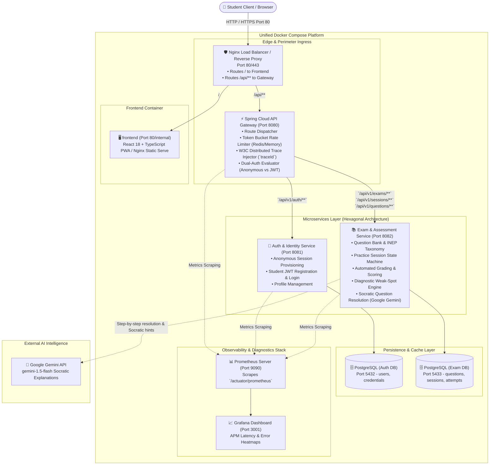
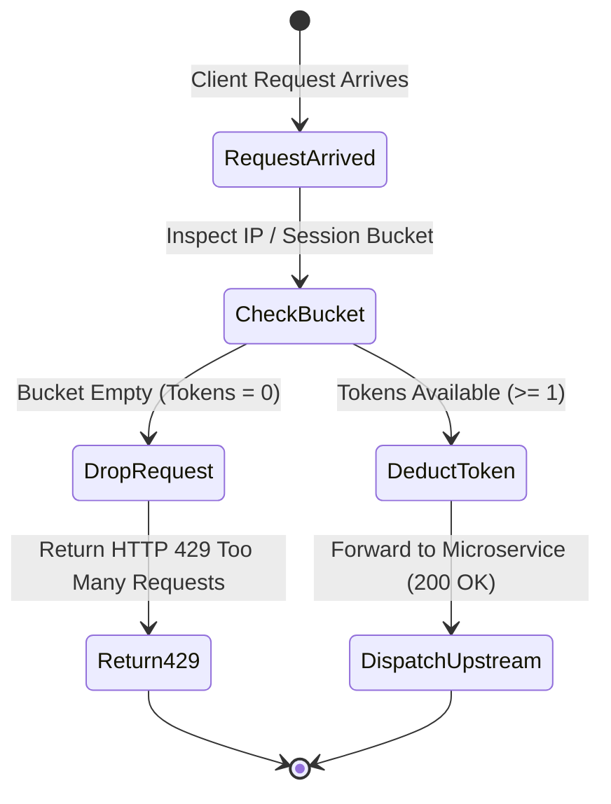
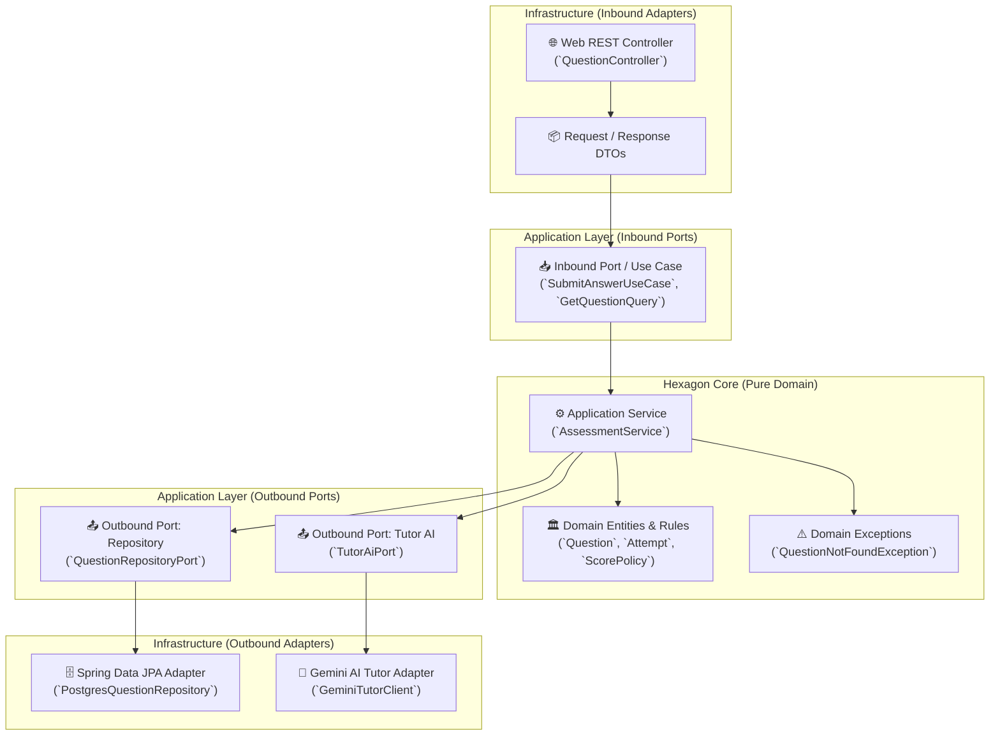
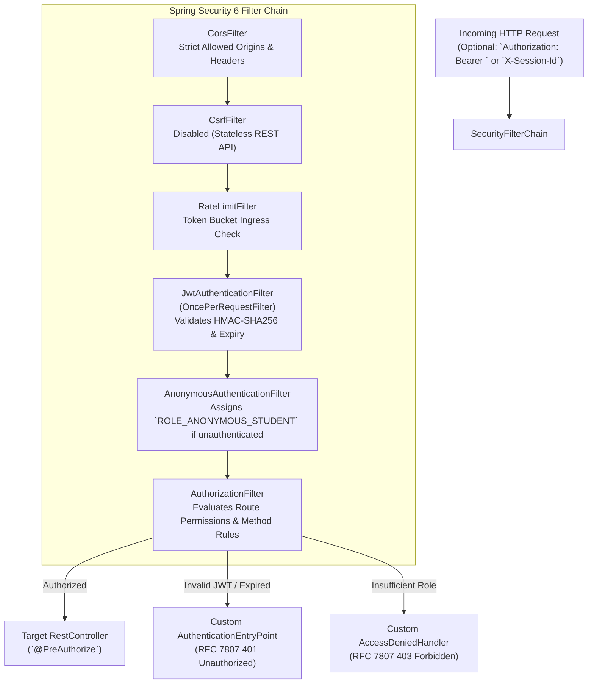
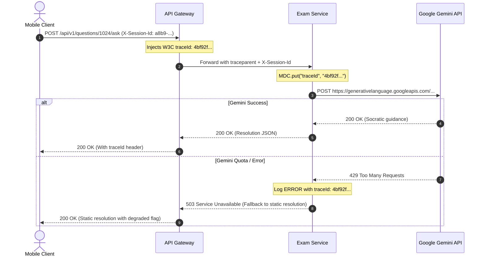
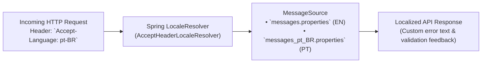
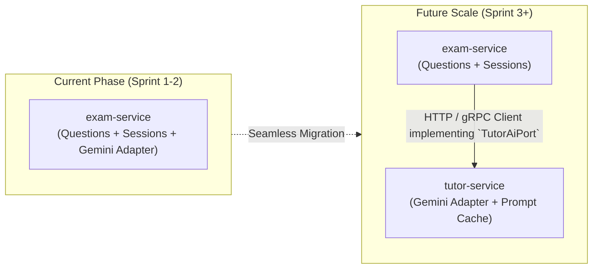

# System Architecture & Topology — AprovaENEM

> **Architecture Style**: Microservices with Hexagonal Architecture (Ports & Adapters)  
> **Ingress & Perimeter**: Nginx Load Balancer + Spring Cloud Gateway with Token Bucket Rate Limiter  
> **Backend Framework**: Java 21 LTS + Spring Boot 3.3+  
> **Persistence**: PostgreSQL 16  
> **Telemetry**: Prometheus + Micrometer Tracing (Datadog-style root-cause diagnostics)  

---

## 1. Global Topology & C4 Container Architecture

The system is deployed as a resilient, containerized multi-service ecosystem. Incoming public traffic passes through an outer Nginx perimeter proxy, moves through an authenticated and rate-limited API Gateway, and is dispatched to the downstream microservices.



---

## 2. Ingress, Perimeter & Rate Limiting Strategy

### Nginx Perimeter
The front-facing Nginx container acts as the L7 reverse proxy, providing:
1. **Request Buffering**: Absorbs slow mobile client uploads, freeing application threads.
2. **Security Headers**: Injects HTTP security headers (`Strict-Transport-Security`, `X-Content-Type-Options: nosniff`, `X-Frame-Options: DENY`).
3. **Keep-Alive Connection Pooling**: Maintains persistent upstream connections to the Spring Cloud Gateway.

### API Gateway & Token Bucket Rate Limiting
To protect the backend from denial-of-service, aggressive question scraping, and exhaustion of upstream **Google Gemini API rate limits and quotas**, the Gateway enforces a **Token Bucket** rate limiting algorithm:



#### Rate Limiting Policies
1. **General Examination Routes** (`GET /api/v1/questions/**`):
   - Capacity: **60 tokens**.
   - Refill Rate: **1 token / second** (allows bursts up to 60 req/min).
2. **AI Tutor Inquiries** (`POST /api/v1/questions/{id}/ask`):
   - Capacity: **10 tokens**.
   - Refill Rate: **10 tokens / minute** (strict guardrail protecting upstream LLM API consumption and rate limits).
3. **HTTP 429 Payload Structure**:
   ```json
   {
     "error": "TOO_MANY_REQUESTS",
     "message": "Rate limit exceeded. Please wait before asking another question.",
     "retryAfterSeconds": 15,
     "timestamp": "2026-09-17T19:30:00Z"
   }
   ```

---

## 3. Hexagonal Architecture (Ports and Adapters)

Both microservices (`auth-service` and `exam-service`) strictly adhere to **Hexagonal Architecture**. Business logic resides in a pure Java domain layer with zero dependencies on Spring Boot, JPA, or web frameworks.



### Standardized Package Layout
```text
com.openenem.assessment/
├── domain/                      # PURE JAVA (No Spring, No JPA)
│   ├── model/
│   │   ├── Question.java        # Aggregate root
│   │   ├── Option.java          # Value object (A, B, C, D, E)
│   │   ├── ExamSession.java     # Session entity with lifecycle states
│   │   ├── Attempt.java         # Student answer submission
│   │   └── DiagnosticReport.java# Performance calculation & weak topics
│   └── exception/
│       ├── DomainException.java
│       └── SessionCompletedException.java
├── application/                 # USE CASES & INTERFACES
│   ├── port/
│   │   ├── in/                  # Driving / Inbound Ports
│   │   │   ├── StartSessionUseCase.java
│   │   │   ├── SubmitAnswerUseCase.java
│   │   │   ├── GetDiagnosticReportUseCase.java
│   │   │   └── AskTutorQuestionUseCase.java
│   │   └── out/                 # Driven / Outbound Ports (SPIs)
│   │       ├── QuestionRepositoryPort.java
│   │       ├── ExamSessionRepositoryPort.java
│   │       └── TutorAiPort.java
│   └── service/                 # Orchestrators
│       ├── AssessmentApplicationService.java
│       └── TutorApplicationService.java
└── infrastructure/              # FRAMEWORK ADAPTERS (Spring Boot, JPA, HTTP)
    ├── adapter/
    │   ├── in/web/
    │   │   ├── QuestionRestController.java
    │   │   ├── ExamSessionRestController.java
    │   │   ├── dto/             # Web DTOs & Validation annotations
    │   │   └── GlobalExceptionHandler.java
    │   ├── out/persistence/
    │   │   ├── entity/          # JPA @Entity models (Postgres tables)
    │   │   ├── repository/      # Spring Data JPA interfaces
    │   │   └── PostgresQuestionAdapter.java # Implements QuestionRepositoryPort
    │   └── out/gemini/
    │       ├── GeminiProperties.java
    │       └── GeminiTutorClientAdapter.java # Implements TutorAiPort
    └── config/
        ├── BeanConfiguration.java # Wires domain services as Spring Beans
        ├── MetricsConfiguration.java # Micrometer Prometheus bindings
        └── SecurityFilterConfiguration.java
```

---

## 4. Spring Security 6 Architecture & Dual-Mode Access Control

To satisfy enterprise portfolio requirements (matching Alma Career / Teamio standards), AprovaENEM integrates **Spring Security 6.3+** with a component-based `SecurityFilterChain` model, stateless JWT authentication, and fine-grained Role-Based Access Control (RBAC).



### 4.1 SecurityFilterChain Configuration (`SecurityConfiguration.java`)
```java
@Configuration
@EnableWebSecurity
@EnableMethodSecurity(prePostEnabled = true)
public class SecurityConfiguration {

    private final JwtAuthenticationFilter jwtAuthFilter;
    private final CustomAuthenticationEntryPoint authEntryPoint;
    private final CustomAccessDeniedHandler accessDeniedHandler;

    public SecurityConfiguration(
            JwtAuthenticationFilter jwtAuthFilter,
            CustomAuthenticationEntryPoint authEntryPoint,
            CustomAccessDeniedHandler accessDeniedHandler) {
        this.jwtAuthFilter = jwtAuthFilter;
        this.authEntryPoint = authEntryPoint;
        this.accessDeniedHandler = accessDeniedHandler;
    }

    @Bean
    public SecurityFilterChain securityFilterChain(HttpSecurity http) throws Exception {
        return http
            .csrf(AbstractHttpConfigurer::disable)
            .cors(cors -> cors.configurationSource(corsConfigurationSource()))
            .sessionManagement(session -> session.sessionCreationPolicy(SessionCreationPolicy.STATELESS))
            .exceptionHandling(ex -> ex
                .authenticationEntryPoint(authEntryPoint)
                .accessDeniedHandler(accessDeniedHandler))
            .authorizeHttpRequests(auth -> auth
                // Public & Anonymous Endpoints
                .requestMatchers(HttpMethod.GET, "/api/v1/questions/**").permitAll()
                .requestMatchers(HttpMethod.POST, "/api/v1/auth/session").permitAll()
                .requestMatchers(HttpMethod.POST, "/api/v1/auth/register", "/api/v1/auth/login").permitAll()
                .requestMatchers(HttpMethod.GET, "/actuator/health", "/actuator/prometheus").permitAll()
                .requestMatchers("/swagger-ui/**", "/v3/api-docs/**").permitAll()
                // Practice Session & Tutor Endpoints (Anonymous or Registered Student)
                .requestMatchers("/api/v1/sessions/**").hasAnyRole("ANONYMOUS_STUDENT", "STUDENT")
                .requestMatchers(HttpMethod.POST, "/api/v1/questions/*/ask").hasAnyRole("ANONYMOUS_STUDENT", "STUDENT")
                // Registered Student Account & Sync Endpoints
                .requestMatchers("/api/v1/student/**").hasRole("STUDENT")
                // Admin Ingestion & Taxonomy Management
                .requestMatchers("/api/v1/admin/**").hasRole("ADMIN")
                .anyRequest().authenticated()
            )
            .anonymous(anon -> anon
                .principal("anonymousStudent")
                .authorities("ROLE_ANONYMOUS_STUDENT"))
            .addFilterBefore(jwtAuthFilter, UsernamePasswordAuthenticationFilter.class)
            .build();
    }

    @Bean
    public PasswordEncoder passwordEncoder() {
        return new BCryptPasswordEncoder(12);
    }
}
```

### 4.2 Role-Based Access Control (RBAC) Matrix
| Role | Assigned When | Permitted Operations |
| :--- | :--- | :--- |
| `ROLE_ANONYMOUS_STUDENT` | No JWT provided (Guest student browsing or practicing). | Query catalog, generate practice quizzes, submit answers, get Socratic hints. No persistent cross-device account syncing. |
| `ROLE_STUDENT` | Valid JWT signed by `auth-service` presented. | All anonymous operations + persistent diagnostic profile, cross-device history synchronization, saved sessions. |
| `ROLE_ADMIN` | Authenticated teacher/curator credentials. | Batch ingest INEP question archives, edit distractor taxonomies, monitor telemetry. |

### 4.3 Method-Level Security (`@PreAuthorize`)
Service methods enforce authorization via Spring Security annotations:
```java
@PreAuthorize("hasRole('STUDENT')")
public StudentProfileDTO getStudentProfile(UUID studentId) { ... }

@PreAuthorize("hasRole('ADMIN')")
public IngestionReportDTO ingestExamPackage(ExamPackageDTO packageDTO) { ... }
```

---

## 5. Inter-Service Communication & Distributed Tracing

### Synchronous Communication Contract
The Gateway communicates with downstream microservices via HTTP/1.1 REST with persistent connections. All service-to-service calls carry the standard **W3C Trace Context headers**:
- `traceparent`: `00-4bf92f3577b34da6a3ce929d0e0e4736-00f067aa0ba902b7-01`
- `X-Session-Id`: The anonymous student session UUID or authenticated user ID.



### Trace-to-Error Log Correlation
Every log line emitted by any microservice automatically includes `[serviceName, traceId, spanId]` via Logback MDC:
```text
2026-09-17 19:35:10.142 ERROR [exam-service,4bf92f3577b34da6,00f067aa0ba902b7] c.o.a.i.a.o.g.GeminiTutorClientAdapter : Gemini API rate limit hit. Falling back to cached INEP static explanation.
```
When an anomaly occurs in production, entering the `traceId` into Grafana/Prometheus immediately reveals the entire request lifecycle and exact failure point.

---

## 6. Internationalization (i18n) Architecture

The backend supports bilingual operations out of the box:
- **English (`en`)**: System error messages, validation errors, developer documentation, and API keys.
- **Portuguese (`pt-BR`)**: Domain-specific ENEM questions, subject names, distractor rationales, and Brazilian student feedback.



### Localization Implementation Details
1. **Spring Locale Resolver**: Standard `AcceptHeaderLocaleResolver` defaulted to `pt-BR` with fallback to `en`.
2. **Database Content Localization**:
   - The `questions` table includes a `content_language` column (default `'pt-BR'`).
   - Enables seamlessly adding translated international practice sets in the future without schema changes.

---

## 7. Future Scaling Path: Decoupling the AI Tutor

While starting with 2 microservices (`auth-service` and `exam-service`), the Hexagonal Ports & Adapters design guarantees that extracting the Socratic AI Tutor into an independent 3rd microservice (`tutor-service`) requires **zero changes to core business logic**:


The outbound port `TutorAiPort` remains identical; only the infrastructure adapter swaps from a local Gemini client bean to a remote HTTP/gRPC client bean.
