# System Architecture & Topology — AprovaENEM

> **Architecture Style**: Microservices with Hexagonal Architecture (Ports & Adapters)  
> **Ingress & Perimeter**: Nginx Edge Ingress (Host Port 80/443 ONLY) + Dedicated `frontend-api` Microservice (BFF / Edge API Gateway) with Token Bucket Rate Limiter & Strict CORS Engine  
> **Network Boundary**: Zero-Trust Internal Bridge (`aprovaenem-internal`, `internal: true`) with ZERO host ports exposed for downstream microservices, databases, and message brokers  
> **Backend Framework**: Java 21 LTS + Spring Boot 3.3+  
> **Persistence**: PostgreSQL 16 (Isolated DB per Service, Strictly Internal Docker Network)  
> **Telemetry**: Prometheus + Micrometer Tracing (Datadog-style root-cause diagnostics)  

---

## 1. Global Topology & C4 Container Architecture

The system is deployed as a secure, perimeter-isolated containerized ecosystem. **External users have network access strictly to the frontend ingress (ports 80/443) and nothing else.** All downstream domain microservices ("Real APIs"), databases, and message brokers reside in an isolated, private Docker network with zero host ports published. A dedicated **`frontend-api` microservice (BFF / Edge API Gateway)** acts as the sole, hardened API facade shielding the internal domain services.

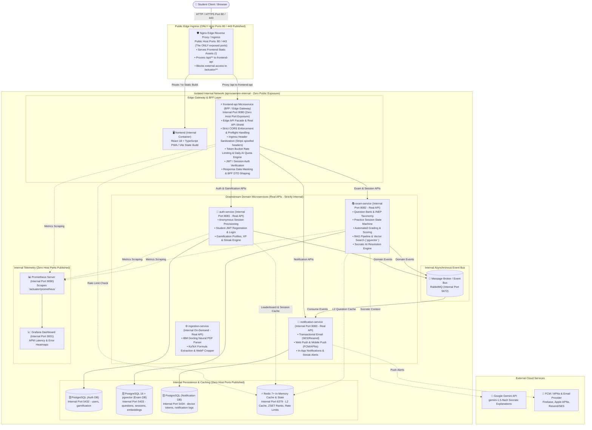

---

## 2. Ingress Perimeter, Frontend API (BFF) & Zero-Trust Network Isolation

### 2.1 Perimeter Isolation & Zero Host Port Exposure Policy
The core architectural mandate of AprovaENEM is **perimeter isolation**:
1. **Frontend-Only Public Access**: External public traffic (browsers and mobile clients) has network connectivity **strictly to the Nginx edge proxy on ports 80 and 443**.
2. **Zero Host Port Exposure for Internal Services**: Neither the `frontend-api` microservice nor any downstream domain microservices, PostgreSQL databases, or RabbitMQ message brokers bind ports to the host interface (`0.0.0.0`).
3. **Defense-in-Depth Network Segregation**:
   - `frontend-edge`: Public bridge network containing only the Nginx container, exposing host ports `80` and `443`.
   - `aprovaenem-internal`: Private, isolated Docker bridge network (`internal: true`). All application microservices, databases, and message brokers communicate exclusively through internal Docker DNS names (e.g., `http://frontend-api:8080`, `http://exam-service:8082`, `postgres-exam:5432`). External packets cannot route into this network.

#### Port Exposure & Network Isolation Matrix
| Service / Container | Internal Port | Host / Public Port | Network Placement | External Visibility |
| :--- | :--- | :--- | :--- | :--- |
| **Nginx Edge Ingress** | 80, 443 | `0.0.0.0:80`, `0.0.0.0:443` | `frontend-edge`, `aprovaenem-internal` | **PUBLIC (Only Gateway)** |
| **Frontend UI (Static)**| 80 | None (Served via Nginx volume) | `aprovaenem-internal` | **PROTECTED (Via Nginx)** |
| **`frontend-api` (BFF)**| 8080 | **None** (Internal Docker DNS) | `aprovaenem-internal` | **SHIELDED (Via Nginx `/api/`)** |
| **`auth-service` (Real API)** | 8081 | **None** | `aprovaenem-internal` | **STRICTLY PRIVATE** |
| **`exam-service` (Real API)** | 8082 | **None** | `aprovaenem-internal` | **STRICTLY PRIVATE** |
| **`notification-service` (Real API)** | 8083 | **None** | `aprovaenem-internal` | **STRICTLY PRIVATE** |
| **`ingestion-service` (Real API)** | None (Worker) | **None** | `aprovaenem-internal` | **STRICTLY PRIVATE** |
| **PostgreSQL Databases** | 5432, 5433, 5434 | **None** | `aprovaenem-internal` | **STRICTLY PRIVATE** |
| **Redis 7+ In-Memory Grid** | 6379 | **None** | `aprovaenem-internal` | **STRICTLY PRIVATE** |
| **RabbitMQ Event Bus** | 5672, 15672 | **None** | `aprovaenem-internal` | **STRICTLY PRIVATE** |
| **Prometheus / Grafana**| 9090, 3001 | **None** (SSH Tunnel / VPN only)| `aprovaenem-internal` | **STRICTLY PRIVATE** |

#### Docker Compose Resilient Network & Self-Healing Container Topology

To achieve **Kubernetes-grade self-healing and zero-downtime container resilience** without Kubernetes overhead, the platform implements a 4-tier Docker Compose resilience architecture:
1. **Automated Crash Restart (`restart: unless-stopped`)**: If any JVM process, database daemon, or proxy crashes or exits unexpectedly, the Docker daemon immediately respawns a fresh container within milliseconds.
2. **Spring Boot Actuator Healthchecks (`/actuator/health`)**: Every service exposes liveness and readiness state. Docker probes health every 15 seconds.
3. **Deterministic Boot Sequencing (`condition: service_healthy`)**: Downstream microservices only boot once PostgreSQL, Redis, and RabbitMQ report verified healthy status, eliminating cold-start database connection race conditions.
4. **Automated Deadlock & Hang Recovery (`autoheal` Daemon)**: An ultra-lightweight daemon monitors `/var/run/docker.sock`. If a container freezes or deadlocks (remains `unhealthy` for 3 consecutive probes), `autoheal` forcibly terminates and respawns it automatically.

```yaml
version: '3.8'

networks:
  frontend-edge:
    driver: bridge
  aprovaenem-internal:
    driver: bridge
    internal: true # Disallows external outbound/inbound traffic; isolated backend network

services:
  # --- Resilient Autoheal Daemon (Monitors and restarts unhealthy containers) ---
  autoheal:
    image: willfarrell/autoheal:latest
    container_name: aprovaenem-autoheal
    restart: always
    environment:
      - AUTOHEAL_CONTAINER_LABEL=all
      - AUTOHEAL_INTERVAL=10
      - AUTOHEAL_START_PERIOD=30
    volumes:
      - /var/run/docker.sock:/var/run/docker.sock
    networks:
      - aprovaenem-internal

  # --- Edge Ingress Proxy (The ONLY public entrypoint) ---
  nginx-proxy:
    image: nginx:1.25-alpine
    container_name: aprovaenem-nginx
    restart: unless-stopped
    ports:
      - "80:80"
      - "443:443"
    networks:
      - frontend-edge
      - aprovaenem-internal
    healthcheck:
      test: ["CMD-SHELL", "nginx -t && wget --spider -q http://localhost/ || exit 1"]
      interval: 15s
      timeout: 5s
      retries: 3
      start_period: 10s
    volumes:
      - exam-assets-data:/usr/share/nginx/html/assets/questions:ro
    depends_on:
      frontend-api:
        condition: service_healthy

  # --- Frontend API Gateway (BFF Facade) ---
  frontend-api:
    image: aprovaenem/frontend-api:latest
    container_name: aprovaenem-frontend-api
    restart: unless-stopped
    expose:
      - "8080"
    networks:
      - aprovaenem-internal
    environment:
      - CORS_ALLOWED_ORIGINS=http://localhost,http://localhost:3000,http://localhost:5173,https://aprovaenem.com.br
      - AUTH_SERVICE_URL=http://auth-service:8081
      - EXAM_SERVICE_URL=http://exam-service:8082
      - NOTIFICATION_SERVICE_URL=http://notification-service:8083
      - SPRING_DATA_REDIS_HOST=redis
      - SPRING_DATA_REDIS_PORT=6379
    healthcheck:
      test: ["CMD-SHELL", "wget --no-verbose --tries=1 --spider http://localhost:8080/actuator/health || exit 1"]
      interval: 15s
      timeout: 5s
      retries: 3
      start_period: 35s
    depends_on:
      redis:
        condition: service_healthy
      auth-service:
        condition: service_healthy
      exam-service:
        condition: service_healthy

  # --- Exam Microservice (Core Assessment Engine) ---
  exam-service:
    image: aprovaenem/exam-service:latest
    container_name: aprovaenem-exam-service
    restart: unless-stopped
    expose:
      - "8082"
    networks:
      - aprovaenem-internal
    environment:
      - SPRING_DATASOURCE_URL=jdbc:postgresql://postgres-exam:5432/exam_db
      - SPRING_DATASOURCE_HIKARI_CONNECTION_TIMEOUT=30000
      - SPRING_DATASOURCE_HIKARI_MAXIMUM_POOL_SIZE=20
      - SPRING_DATASOURCE_HIKARI_MAX_LIFETIME=1800000
      - SPRING_DATA_REDIS_HOST=redis
      - SPRING_DATA_REDIS_PORT=6379
      - SPRING_RABBITMQ_HOST=rabbitmq
    healthcheck:
      test: ["CMD-SHELL", "wget --no-verbose --tries=1 --spider http://localhost:8082/actuator/health || exit 1"]
      interval: 15s
      timeout: 5s
      retries: 3
      start_period: 40s
    depends_on:
      postgres-exam:
        condition: service_healthy
      redis:
        condition: service_healthy
      rabbitmq:
        condition: service_healthy

  # --- Redis 7 In-Memory Cache & State Grid ---
  redis:
    image: redis:7.2-alpine
    container_name: aprovaenem-redis
    restart: unless-stopped
    command: ["redis-server", "--requirepass", "${REDIS_PASSWORD}", "--maxmemory", "512mb", "--maxmemory-policy", "allkeys-lru"]
    expose:
      - "6379"
    networks:
      - aprovaenem-internal
    healthcheck:
      test: ["CMD", "redis-cli", "-a", "${REDIS_PASSWORD}", "ping"]
      interval: 10s
      timeout: 3s
      retries: 3
      start_period: 5s
    volumes:
      - redis-data:/data

  # --- PostgreSQL 16 + pgvector Database ---
  postgres-exam:
    image: pgvector/pgvector:pg16
    container_name: aprovaenem-postgres-exam
    restart: unless-stopped
    expose:
      - "5432"
    networks:
      - aprovaenem-internal
    environment:
      - POSTGRES_DB=exam_db
      - POSTGRES_USER=${DB_USER}
      - POSTGRES_PASSWORD=${DB_PASSWORD}
    healthcheck:
      test: ["CMD-SHELL", "pg_isready -U ${DB_USER} -d exam_db || exit 1"]
      interval: 10s
      timeout: 5s
      retries: 5
      start_period: 10s
    volumes:
      - exam-db-data:/var/lib/postgresql/data

  # --- RabbitMQ Event Bus ---
  rabbitmq:
    image: rabbitmq:3.13-management-alpine
    container_name: aprovaenem-rabbitmq
    restart: unless-stopped
    expose:
      - "5672"
      - "15672"
    networks:
      - aprovaenem-internal
    healthcheck:
      test: ["CMD", "rabbitmq-diagnostics", "-q", "ping"]
      interval: 15s
      timeout: 10s
      retries: 3
      start_period: 20s
    volumes:
      - rabbitmq-data:/var/lib/rabbitmq

  # --- PostgreSQL 16 Auth Database ---
  postgres-auth:
    image: postgres:16-alpine
    container_name: aprovaenem-postgres-auth
    restart: unless-stopped
    expose:
      - "5432"
    networks:
      - aprovaenem-internal
    environment:
      - POSTGRES_DB=auth_db
      - POSTGRES_USER=${DB_USER}
      - POSTGRES_PASSWORD=${DB_PASSWORD}
    healthcheck:
      test: ["CMD-SHELL", "pg_isready -U ${DB_USER} -d auth_db || exit 1"]
      interval: 10s
      timeout: 5s
      retries: 5
      start_period: 10s
    volumes:
      - auth-db-data:/var/lib/postgresql/data

  # --- PostgreSQL 16 Notification Database ---
  postgres-notification:
    image: postgres:16-alpine
    container_name: aprovaenem-postgres-notification
    restart: unless-stopped
    expose:
      - "5432"
    networks:
      - aprovaenem-internal
    environment:
      - POSTGRES_DB=notification_db
      - POSTGRES_USER=${DB_USER}
      - POSTGRES_PASSWORD=${DB_PASSWORD}
    healthcheck:
      test: ["CMD-SHELL", "pg_isready -U ${DB_USER} -d notification_db || exit 1"]
      interval: 10s
      timeout: 5s
      retries: 5
      start_period: 10s
    volumes:
      - notification-db-data:/var/lib/postgresql/data

  # --- Data Ingestion & OCR Microservice (On-Demand Worker) ---
  ingestion-service:
    image: aprovaenem/ingestion-service:latest
    container_name: aprovaenem-ingestion-service
    profiles: ["ingestion"]
    restart: "no" # On-demand batch execution
    networks:
      - aprovaenem-internal
    volumes:
      - exam-assets-data:/app/extracted_assets

  # --- Prometheus TSDB Telemetry ---
  prometheus:
    image: prom/prometheus:v2.51.0
    container_name: aprovaenem-prometheus
    restart: unless-stopped
    expose:
      - "9090"
    networks:
      - aprovaenem-internal
    volumes:
      - prometheus-data:/prometheus

  # --- Grafana APM Dashboard ---
  grafana:
    image: grafana/grafana:10.4.0
    container_name: aprovaenem-grafana
    restart: unless-stopped
    expose:
      - "3000"
    networks:
      - aprovaenem-internal
    volumes:
      - grafana-data:/var/lib/grafana

# --- Persistent Named Volumes ---
volumes:
  exam-db-data:
    driver: local
  auth-db-data:
    driver: local
  notification-db-data:
    driver: local
  redis-data:
    driver: local
  rabbitmq-data:
    driver: local
  exam-assets-data:
    driver: local
  prometheus-data:
    driver: local
  grafana-data:
    driver: local
```

---

#### Persistent Storage & Named Volume Architecture

To guarantee strict enterprise data durability, deterministic state preservation across container restarts, and optimal I/O throughput, AprovaENEM enforces a clear separation between **stateless compute** and **stateful persistence** using Docker **named volumes** (`driver: local`).

##### 1. Stateless Microservice Boundaries (The 12-Factor App Principle)
In strict compliance with **Factor VI (Stateless Processes)** of the Twelve-Factor App methodology:
- **Zero Local State in Application Containers**: Microservices (`frontend-api`, `auth-service`, `exam-service`, `notification-service`, `ingestion-service` runtime) and the React 18 SPA web application are strictly **stateless and disposable**.
- **Ephemeral Container Filesystem**: No user sessions, uploaded images, database state, or temporary business data are ever written to a container's mutable read-write layer (`OverlayFS`).
- **Seamless Teardown & Horizontal Scaling**: Any application container can be terminated, upgraded, or horizontally scaled by the Docker daemon or orchestrator without risk of data loss or session corruption. All persistent state is delegated exclusively to PostgreSQL databases, Redis, RabbitMQ, and dedicated named volumes.

##### 2. Docker Named Volumes (`driver: local`) vs. Host Bind Mounts
AprovaENEM deliberately standardizes on **Docker Named Volumes** managed by the Docker storage engine over host folder bind mounts (`./data/...`) for all persistent backends:
1. **Linux UID/GID Permission Isolation**: PostgreSQL containers execute under internal non-root system accounts (`postgres` UID `999`). When using host bind mounts on Linux hosts, the host user typically runs as UID `1000`, causing immediate permission conflicts (`initdb: directory exists but is not empty` or `chmod: Operation not permitted`). Docker named volumes (`/var/lib/docker/volumes/<volume_name>/_data`) are initialized and managed directly by the Docker daemon, automatically applying correct internal POSIX ownership and permissions.
2. **Filesystem Locking & Cross-Platform Integrity**: Databases (PostgreSQL write-ahead logs `pg_wal`, Redis append-only files `appendonly.aof`, RabbitMQ mnesia store) require strict POSIX file locking semantics. Host bind mounts across virtualization layers (such as WSL2 on Windows or Docker Desktop on macOS) introduce severe filesystem latency, file-locking deadlocks, and WAL corruption. Named volumes provide raw Linux I/O performance.
3. **Encapsulated Lifecycle Management**: Named volumes prevent accidental data leaks or file pollution in the Git source tree. They persist across standard restarts (`docker compose down && docker compose up -d`) and require explicit operator intent (`docker compose down -v`) to destroy.

##### 3. Persistent Storage & Volume Matrix
| Volume Identifier | Target Service(s) | Container Mount Path | Lifecycle & Retention Guarantee | Backup & Disaster Recovery Policy |
| :--- | :--- | :--- | :--- | :--- |
| **`exam-db-data`** | `postgres-exam` | `/var/lib/postgresql/data` | **Persistent / Mission-Critical**: Preserves 17 years (2009–2025) of ENEM question banks, official TRI parameters ($a, b, c$), 768-dim `pgvector` HNSW index, and student practice resolution histories. | Automated daily `pg_dump` snapshot to encrypted remote archive; WAL archiving enabled. |
| **`auth-db-data`** | `postgres-auth` | `/var/lib/postgresql/data` | **Persistent / Mission-Critical**: Stores student authentication credentials (BCrypt hashes), roles, anonymous session mappings, gamification XP balances, streaks, and unlocked badges. | Nightly automated `pg_dump` with point-in-time recovery (PITR). |
| **`notification-db-data`** | `postgres-notification` | `/var/lib/postgresql/data` | **Persistent / High Priority**: Retains notification dispatch audit trails, user notification preferences, and registered FCM/APNs mobile push device tokens. | Periodic snapshot dump; idempotent notification pipeline allows safe re-execution. |
| **`redis-data`** | `redis` | `/data` | **Persistent / High Performance**: Backs Redis AOF (Append-Only File) and RDB snapshots. Retains real-time weekly league leaderboards (`ZSET`), token-bucket rate limiter counters, and active session cache across container restarts. | Daily RDB snapshots; non-critical cache reconstructs automatically from primary database. |
| **`rabbitmq-data`** | `rabbitmq` | `/var/lib/rabbitmq` | **Persistent / Operational**: Retains durable message queues, pending notification dispatch payloads, and Dead-Letter Queues (DLQ) across broker restarts. | RabbitMQ cluster metadata export; auto-recovers durable queues on boot. |
| **`exam-assets-data`** | `ingestion-service`<br/>`nginx-proxy` | Ingestion: `/app/extracted_assets`<br/>Nginx: `/usr/share/nginx/html/assets/questions:ro` | **Shared Persistent Static Media**: Houses high-resolution exam diagrams, geometry figures, and charts cropped at 300 DPI by Docling and converted to lossless WebP format. | Daily rsync synchronization with S3 object storage; immutable content-hashed files. |
| **`prometheus-data`** | `prometheus` | `/prometheus` | **Persistent / Observability**: Retains Prometheus TSDB time-series metrics for 15+ days (JVM heap usage, GC pause duration, HTTP latencies, query response times). | Retained for SLA audit compliance; disposable in local development. |
| **`grafana-data`** | `grafana` | `/var/lib/grafana` | **Persistent / Observability**: Stores custom Grafana dashboards, alert notification channels, user preferences, and dashboard provisioning state. | Dashboards version-controlled in Git and provisioned via declarative YAML. |
| **Docker Socket (`/var/run/docker.sock`)** | `autoheal` | `/var/run/docker.sock` | **Host Operational Interface**: Grants the `autoheal` container direct communication with the local Docker daemon API to monitor container health status and issue automated restart signals upon deadlock detection. | Ephemeral host socket; no persistent storage requirements. |

##### 4. Shared Static Media Architecture (`exam-assets-data`)
To maximize web performance and protect JVM backend services from static asset delivery overhead, extracted exam diagrams follow a decoupled shared-volume architecture:

```mermaid
flowchart LR
    INEP["INEP PDF Exam<br/>(2009–2025)"] -->|1. Neural Layout Parsing| Ingestion["📥 ingestion-service<br/>(Docling OCR / WebP Cropper)"]
    Ingestion -->|2. Write Cropped WebP Figures| Volume[("💾 exam-assets-data<br/>(Named Docker Volume)")]
    Volume -->|3. Read-Only Mount (:ro)| Nginx["🛡️ Nginx Edge Proxy<br/>(/usr/share/nginx/html/assets/questions)"]
    Browser["Student Browser / Client"] -->|4. HTTP/2 GET /assets/questions/*.webp| Nginx
    Nginx -.->|5. Zero JVM Overhead<br/>Aggressive Cache-Control: 1yr| Browser
```

1. **Extraction & Optimization**: The on-demand `ingestion-service` parses INEP PDF exams using IBM Docling, locates figures and formulas, crops them at 300 DPI, converts them to compressed WebP format, and writes them directly to `/app/extracted_assets/` (backed by the `exam-assets-data` volume).
2. **Zero-JVM Static Ingress**: The Nginx edge ingress proxy mounts `exam-assets-data` into `/usr/share/nginx/html/assets/questions` as **read-only (`:ro`)**.
3. **Edge Performance & Caching**: When students take an exam, images are fetched directly from Nginx (`/assets/questions/{year}_{caderno}_{item_id}.webp`). Nginx serves these static assets with HTTP/2 and optimal HTTP caching headers (`Cache-Control: public, max-age=31536000, immutable`), completely bypassing Spring Boot microservices and avoiding JVM thread blocking or heap consumption.

##### 5. Disaster Recovery, Backup & Persistence Lifecycle Commands
Docker named volumes ensure seamless persistence across operational lifecycles without data loss:

```bash
# Standard graceful restart (All volume data is fully preserved)
docker compose down && docker compose up -d

# Nuclear environment reset (DANGEROUS: Wipes all databases, queues, and caches)
docker compose down -v

# Automated hot backup of exam-db-data to a timestamped tarball via transient alpine container
docker run --rm \
  -v exam-db-data:/source:ro \
  -v $(pwd)/backups:/backup \
  alpine tar czf /backup/exam_db_$(date +%Y%m%d_%H%M%S).tar.gz -C /source .

# Hot restore of exam-db-data from archive
docker run --rm \
  -v exam-db-data:/target \
  -v $(pwd)/backups:/backup \
  alpine sh -c "rm -rf /target/* && tar xzf /backup/exam_db_YYYYMMDD_HHMMSS.tar.gz -C /target"
```

---

### 2.2 The `frontend-api` Microservice (BFF / Edge API Facade)

The user client never communicates directly with the real domain microservices. Instead, all API traffic passes through the dedicated **`frontend-api` microservice (Backend-For-Frontend / Edge API Gateway)**, which fulfills five vital architectural and security functions:

```mermaid
flowchart LR
    Browser["Student Browser / Client<br/>(https://aprovaenem.com.br)"] -->|1. Request with Bearer JWT| Nginx["Nginx Ingress (Port 443)"]
    Nginx -->|2. Proxy /api/**| FrontendAPI["⚡ frontend-api (BFF Microservice)"]

    subgraph FrontendAPIResponsibilities ["frontend-api Perimeter Security & Shielding"]
        CORS["Strict CORS Engine<br/>• Origin Whitelisting<br/>• 1-Hour Preflight Cache"]
        Sanitizer["Ingress Header Sanitizer<br/>• Strips spoofed `X-User-Id`<br/>• Validates JWT authenticity"]
        RateLimiter["Rate & Quota Limiter<br/>• 60 req/min general<br/>• 10 req/min burst /ask<br/>• 1 free AI question/day<br/>• Unlimited for Pro Plan"]
        DataMasker["Response Data Masker<br/>• Strips stack traces & SQL errors<br/>• Aggregates BFF payloads"]
    end

    FrontendAPI --> CORS
    CORS --> Sanitizer
    Sanitizer --> RateLimiter
    RateLimiter --> DataMasker

    DataMasker -->|3. Trusted Internal REST<br/>X-User-Id: 42, ROLE_STUDENT| RealAPI["🔐 Real Domain APIs<br/>(auth-service, exam-service)<br/>[Internal Network Only]"]
```

1. **Real API Shielding & Information Hiding**:
   - Internal microservice topologies, port numbers, container names, and private network DNS records are completely hidden from the public client.
   - Attackers cannot probe or exploit internal microservice endpoints, administrative routes, or database adapters.
2. **Untrusted Ingress Header Stripping (Anti-Spoofing)**:
   - Malicious clients might attempt to inject internal headers such as `X-User-Id: admin`, `X-User-Roles: ROLE_ADMIN`, or `X-Internal-Token`.
   - The `frontend-api` microservice strips and discards all incoming `X-User-*` or `X-Internal-*` headers from external requests.
   - Only after validating the cryptographic signature of the student's JWT or resolving the anonymous session does `frontend-api` generate trusted internal headers (`X-User-Id`, `X-User-Roles`, `X-Session-Id`, `traceparent`) for downstream domain services.
3. **Ingress Token Validation & Session Resolution**:
   - Validates HMAC-SHA256 signature, issuer, and expiration time of incoming JWTs at the network boundary.
   - Malformed or expired tokens are rejected at the edge with RFC 7807 401 Unauthorized, saving compute cycles on downstream domain microservices.
4. **Outbound Response Data Masking**:
   - Prevents leaking internal database error messages, Hibernate SQL traces, table names, JVM exception stack traces, or internal server IPs.
   - Masks sensitive internal fields before returning JSON payloads to the browser.
5. **BFF DTO Shaping & Aggregation**:
   - Assembles composite data required by specific frontend views in a single HTTP roundtrip (e.g., student dashboard combining profile stats from `auth-service` and recent exam attempt history from `exam-service`), optimizing performance on high-latency mobile 3G/4G connections.

---

### 2.3 Strict Production CORS (Cross-Origin Resource Sharing) Configuration

#### Why Strict CORS is Essential
When the student browser executes asynchronous JavaScript requests (`fetch` or `axios`), modern browsers enforce the **W3C Same-Origin Policy**.
- **In Production**: Nginx serves the React SPA at `/` and proxies `/api/**` to `frontend-api`, which means browser requests are technically same-origin (`https://aprovaenem.com.br/api/...`). However, a strict CORS configuration is still mandatory to prevent unauthorized third-party websites from making cross-origin requests using a logged-in student's credentials (CSRF / unauthorized data exfiltration).
- **In Development / Staging / Multi-Client**: The frontend may run on a distinct origin (e.g., Vite dev server at `http://localhost:5173`, local preview at `http://localhost:3000`, staging environment at `https://staging.aprovaenem.com.br`, or Android native clients). The `frontend-api` microservice must strictly validate and respond with correct CORS headers.

#### Comprehensive CORS Policy Specification
| CORS Directive | Configured Value | Architectural Justification |
| :--- | :--- | :--- |
| **Allowed Origins** | Whitelist via `${CORS_ALLOWED_ORIGINS}`:<br/>`http://localhost:3000`, `http://localhost:5173`, `http://localhost`, `https://aprovaenem.com.br`, `https://staging.aprovaenem.com.br` | Strict origin matching. **Wildcard `*` is strictly forbidden** when credentials are used (violates W3C Fetch standard and causes browser rejection). |
| **Allowed Methods** | `GET`, `POST`, `PUT`, `PATCH`, `DELETE`, `OPTIONS` | Restricts HTTP verbs to standard REST operations; explicitly forbids dangerous methods (`TRACE`, `CONNECT`). |
| **Allowed Headers** | `Authorization`, `Content-Type`, `Accept`, `X-Session-Id`, `X-Requested-With`, `traceparent`, `X-Trace-Id` | Explicitly permits required operational, authentication, and W3C distributed tracing headers. |
| **Exposed Headers** | `Authorization`, `X-Trace-Id`, `X-Session-Id`, `X-RateLimit-Remaining`, `X-RateLimit-Retry-After-Seconds` | Explicitly authorizes browser JavaScript to read correlation IDs, refreshed tokens, and rate-limiting headers. |
| **Allow Credentials** | `true` | Permits the browser to send credentials (`Authorization: Bearer <token>` and session cookies) in cross-origin requests. |
| **Max Age** | `3600L` (1 hour / 3,600 seconds) | Instructs the browser to cache preflight `OPTIONS` responses for 1 hour, drastically reducing latency and mobile battery consumption. |

#### Preflight Request (`OPTIONS`) Handling Sequence

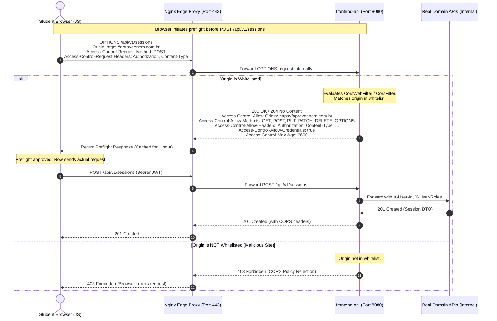

#### Spring Cloud Gateway / Reactive WebFlux CORS Configuration (`CorsConfig.java`)
```java
package com.aprovaenem.gateway.config;

import org.springframework.beans.factory.annotation.Value;
import org.springframework.context.annotation.Bean;
import org.springframework.context.annotation.Configuration;
import org.springframework.web.cors.CorsConfiguration;
import org.springframework.web.cors.reactive.CorsWebFilter;
import org.springframework.web.cors.reactive.UrlBasedCorsConfigurationSource;

import java.util.Arrays;
import java.util.List;

/**
 * Edge CORS Configuration for the frontend-api microservice (Spring Cloud Gateway).
 * Enforces strict origin whitelisting, header filtering, and preflight caching.
 */
@Configuration
public class CorsConfig {

    @Value("${cors.allowed-origins:http://localhost,http://localhost:3000,http://localhost:5173,https://aprovaenem.com.br}")
    private String allowedOriginsConfig;

    @Bean
    public CorsWebFilter corsWebFilter() {
        CorsConfiguration corsConfig = new CorsConfiguration();

        // 1. Whitelisted Origins (Parsed from environment variable)
        List<String> origins = Arrays.stream(allowedOriginsConfig.split(","))
                .map(String::trim)
                .filter(s -> !s.isEmpty())
                .toList();
        corsConfig.setAllowedOrigins(origins);

        // 2. Allowed HTTP Methods
        corsConfig.setAllowedMethods(List.of(
                "GET", "POST", "PUT", "PATCH", "DELETE", "OPTIONS"
        ));

        // 3. Allowed Request Headers
        corsConfig.setAllowedHeaders(List.of(
                "Authorization",
                "Content-Type",
                "Accept",
                "X-Session-Id",
                "X-Requested-With",
                "traceparent",
                "X-Trace-Id"
        ));

        // 4. Exposed Response Headers (Readable by Browser JS)
        corsConfig.setExposedHeaders(List.of(
                "Authorization",
                "X-Trace-Id",
                "X-Session-Id",
                "X-RateLimit-Remaining",
                "X-RateLimit-Retry-After-Seconds"
        ));

        // 5. Allow Credentials (Cookies, Authorization Bearer)
        // CRITICAL: NEVER set allowedOrigins = "*" when allowCredentials = true!
        corsConfig.setAllowCredentials(true);

        // 6. Preflight Cache Max Age (3600 seconds = 1 hour)
        corsConfig.setMaxAge(3600L);

        UrlBasedCorsConfigurationSource source = new UrlBasedCorsConfigurationSource();
        // Apply strictly to all API paths
        source.registerCorsConfiguration("/api/**", corsConfig);

        return new CorsWebFilter(source);
    }
}
```

---

### 2.4 Nginx Edge Reverse Proxy Configuration (`nginx.conf`)

The Nginx container serves the static React 18 production build and acts as the sole perimeter entry point, proxying `/api/**` to `frontend-api` and rejecting external access to sensitive internal paths:

```nginx
worker_processes auto;
pid /var/run/nginx.pid;

events {
    worker_connections 1024;
    use epoll;
    multi_accept on;
}

http {
    include /etc/nginx/mime.types;
    default_type application/octet-stream;

    # Logging format with distributed tracing support
    log_format main '$remote_addr - $remote_user [$time_local] "$request" '
                    '$status $body_bytes_sent "$http_referer" '
                    '"$http_user_agent" "$http_x_forwarded_for" '
                    'traceId="$http_traceparent"';

    access_log /var/log/nginx/access.log main;
    error_log /var/log/nginx/error.log warn;

    sendfile on;
    tcp_nopush on;
    tcp_nodelay on;
    keepalive_timeout 65;
    types_hash_max_size 2048;

    # Gzip Compression for budget mobile connections
    gzip on;
    gzip_vary on;
    gzip_proxied any;
    gzip_comp_level 6;
    gzip_types text/plain text/css text/xml application/json application/javascript 
               application/xml+rss application/atom+xml image/svg+xml;

    upstream frontend_api_upstream {
        server frontend-api:8080; # Internal Docker DNS
        keepalive 32;
    }

    server {
        listen 80;
        listen [::]:80;
        server_name aprovaenem.com.br www.aprovaenem.com.br localhost;

        # Edge Security Headers
        add_header X-Frame-Options "DENY" always;
        add_header X-Content-Type-Options "nosniff" always;
        add_header X-XSS-Protection "1; mode=block" always;
        add_header Referrer-Policy "strict-origin-when-cross-origin" always;
        add_header Content-Security-Policy "default-src 'self'; script-src 'self'; style-src 'self' 'unsafe-inline'; img-src 'self' data: https:; font-src 'self' data:; connect-src 'self' https://aprovaenem.com.br;" always;

        # 1. Frontend React SPA: Static File Delivery
        location / {
            root /usr/share/nginx/html;
            index index.html index.htm;
            try_files $uri $uri/ /index.html; # SPA HTML5 History fallback

            # Cache static assets (JS, CSS, WebP, SVG) for 7 days
            location ~* \.(?:css|js|webp|png|jpg|jpeg|gif|ico|svg|woff2)$ {
                expires 7d;
                add_header Cache-Control "public, no-transform";
            }
        }

        # 2. Frontend API Proxy: Route /api/** to frontend-api BFF
        location /api/ {
            proxy_pass http://frontend_api_upstream;
            proxy_http_version 1.1;
            proxy_set_header Connection "";
            
            # Forward Client Identity Headers
            proxy_set_header Host $host;
            proxy_set_header X-Real-IP $remote_addr;
            proxy_set_header X-Forwarded-For $proxy_add_x_forwarded_for;
            proxy_set_header X-Forwarded-Proto $scheme;
            proxy_set_header X-Forwarded-Host $host;
            proxy_set_header X-Forwarded-Port $server_port;

            # Buffering for mobile uploads
            proxy_buffering on;
            proxy_buffer_size 8k;
            proxy_buffers 8 64k;
            proxy_connect_timeout 5s;
            proxy_read_timeout 30s;
            proxy_send_timeout 15s;
        }

        # 3. Security Block: Prohibit external access to Actuator & Prometheus
        location ~* /(actuator|prometheus) {
            return 404; # Actuator is internal only; return 404 to hide existence
        }
    }
}
```

---

### 2.5 Rate Limiting & Tiered AI Tutor Quota Strategy

AprovaENEM maintains a strict pedagogical and economic boundary: **core exam training is 100% free and unlimited for everyone**, while **Socratic AI tutoring is metered** via a dual-layer rate limiting engine to prevent upstream Google Gemini API exhaustion and guarantee server sustainability:

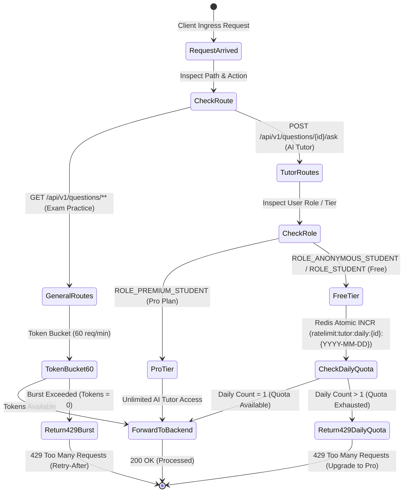

#### 1. Core Exam Practice (100% Free & Unlimited)
- Question catalog browsing, practice quiz generation, answer submissions, instant scoring, TRI calculations, and curated step-by-step written resolutions have **zero daily caps or paywalls**.
- Protected solely by **Layer 1 Token Bucket Rate Limiting** (capacity: 60 tokens, refill: 1 token/sec) to defend against malicious web scrapers and DoS traffic.

#### 2. Socratic AI Tutor: Dual-Layer Rate Limiting & Daily Quota
AI Tutor inquiries (`POST /api/v1/questions/{id}/ask`) pass through two sequential validation stages:

1. **Layer 1 — Short-Term Burst Limiter (Token Bucket)**:
   - Capacity: **10 tokens** per minute.
   - Refill Rate: **10 tokens / minute**.
   - Prevents automated script-spamming from exhausting connection pools.

2. **Layer 2 — Business Tier Daily Quota Engine (Redis Distributed Counter)**:
   - **Free Tier (`ROLE_ANONYMOUS_STUDENT` & `ROLE_STUDENT`)**:
     - **Quota**: **1 free Socratic AI Tutor consultation per day**.
     - **Storage**: Key `ratelimit:tutor:daily:{userId_or_sessionId}:{YYYY-MM-DD}` in Redis.
     - **TTL**: Automatically set to expire at midnight BRT (00:00 UTC-3).
     - **Headers Emitted**:
       - `X-AI-Quota-Limit: 1`
       - `X-AI-Quota-Remaining: 0` (or `1`)
       - `X-AI-Quota-Reset: <epoch_seconds_at_midnight_BRT>`
     - **Exhaustion Behavior**: Once 1 question is consulted, subsequent AI queries are rejected at the edge with RFC 7807 HTTP 429. The student can continue training with unlimited past questions and static resolutions.
   - **AprovaENEM Pro Plan (`ROLE_PREMIUM_STUDENT`)**:
     - **Quota**: **Unlimited** Socratic AI Tutor consultations (bypasses daily quota check).
     - **Headers Emitted**: `X-AI-Quota-Limit: -1`, `X-AI-Quota-Remaining: -1`.

#### 3. Quota Exhaustion Response (`HTTP 429 Too Many Requests`)
When a free student exhausts their single daily AI tutor credit:
```json
{
  "type": "https://aprovaenem.org/errors/DAILY_AI_QUOTA_EXHAUSTED",
  "title": "Daily AI Tutor Quota Exhausted",
  "status": 429,
  "detail": "You have used your 1 free Socratic AI consultation for today. You can continue practicing unlimited exam questions for free, or upgrade to AprovaENEM Pro for unlimited AI tutoring.",
  "quota": {
    "dailyLimit": 1,
    "usedToday": 1,
    "remainingToday": 0,
    "resetsAt": "2026-09-19T03:00:00Z"
  },
  "upgradeUrl": "https://aprovaenem.com.br/pro",
  "timestamp": "2026-09-18T14:30:00Z"
}
```

---

## 3. Hexagonal Architecture (Ports and Adapters)

Both microservices (`auth-service` and `exam-service`) strictly adhere to **Hexagonal Architecture**. Business logic resides in a pure Java domain layer with zero dependencies on Spring Boot, JPA, or web frameworks.

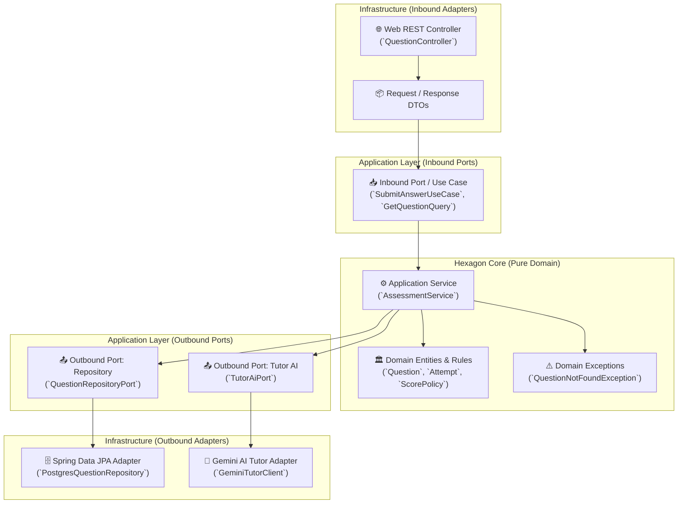

### Standardized Package Layout
```text
com.aprovaenem.assessment/
├── domain/                      # PURE JAVA (No Spring, No JPA)
│   ├── model/
│   │   ├── Question.java        # Aggregate root
│   │   ├── QuestionStatus.java  # Lifecycle state: ACTIVE, SUSPENDED, NEEDS_REVIEW, DRAFT, ANNULLED
│   │   ├── Option.java          # Value object (A, B, C, D, E)
│   │   ├── ExamSession.java     # Session entity with lifecycle states
│   │   ├── Attempt.java         # Student answer submission
│   │   └── DiagnosticReport.java# Performance calculation & weak topics
│   └── exception/
│       ├── DomainException.java
│       └── SessionCompletedException.java
├── application/                 # USE CASES & INTERFACES
│   ├── port/
│   │   ├── in/                  # Driving / Inbound Ports
│   │   │   ├── StartSessionUseCase.java
│   │   │   ├── SubmitAnswerUseCase.java
│   │   │   ├── GetDiagnosticReportUseCase.java
│   │   │   └── AskTutorQuestionUseCase.java
│   │   └── out/                 # Driven / Outbound Ports (SPIs)
│   │       ├── QuestionRepositoryPort.java
│   │       ├── ExamSessionRepositoryPort.java
│   │       └── TutorAiPort.java
│   └── service/                 # Orchestrators
│       ├── AssessmentApplicationService.java
│       └── TutorApplicationService.java
└── infrastructure/              # FRAMEWORK ADAPTERS (Spring Boot, JPA, HTTP)
    ├── adapter/
    │   ├── in/web/
    │   │   ├── QuestionRestController.java
    │   │   ├── ExamSessionRestController.java
    │   │   ├── dto/             # Web DTOs & Validation annotations
    │   │   └── GlobalExceptionHandler.java
    │   ├── out/persistence/
    │   │   ├── entity/          # JPA @Entity models (Postgres tables)
    │   │   ├── mapper/          # MapStruct / Domain-Entity Mappers
    │   │   ├── repository/      # Spring Data JPA interfaces
    │   │   └── PostgresQuestionAdapter.java # Implements QuestionRepositoryPort
    │   └── out/gemini/
    │       ├── GeminiProperties.java
    │       └── GeminiTutorClientAdapter.java # Implements TutorAiPort
    ├── config/
    │   ├── BeanConfiguration.java # Wires domain services as Spring Beans
    │   ├── MetricsConfiguration.java # Micrometer Prometheus bindings
    │   └── SecurityFilterConfiguration.java
    └── resources/
        ├── application.yml
        └── db/migration/        # Flyway SQL scripts (V1__..., V2__...)
```

---

## 4. Spring Security 6 Architecture & Dual-Mode Access Control

To satisfy enterprise production requirements, AprovaENEM integrates **Spring Security 6.3+** with a component-based `SecurityFilterChain` model, stateless JWT authentication, and fine-grained Role-Based Access Control (RBAC).

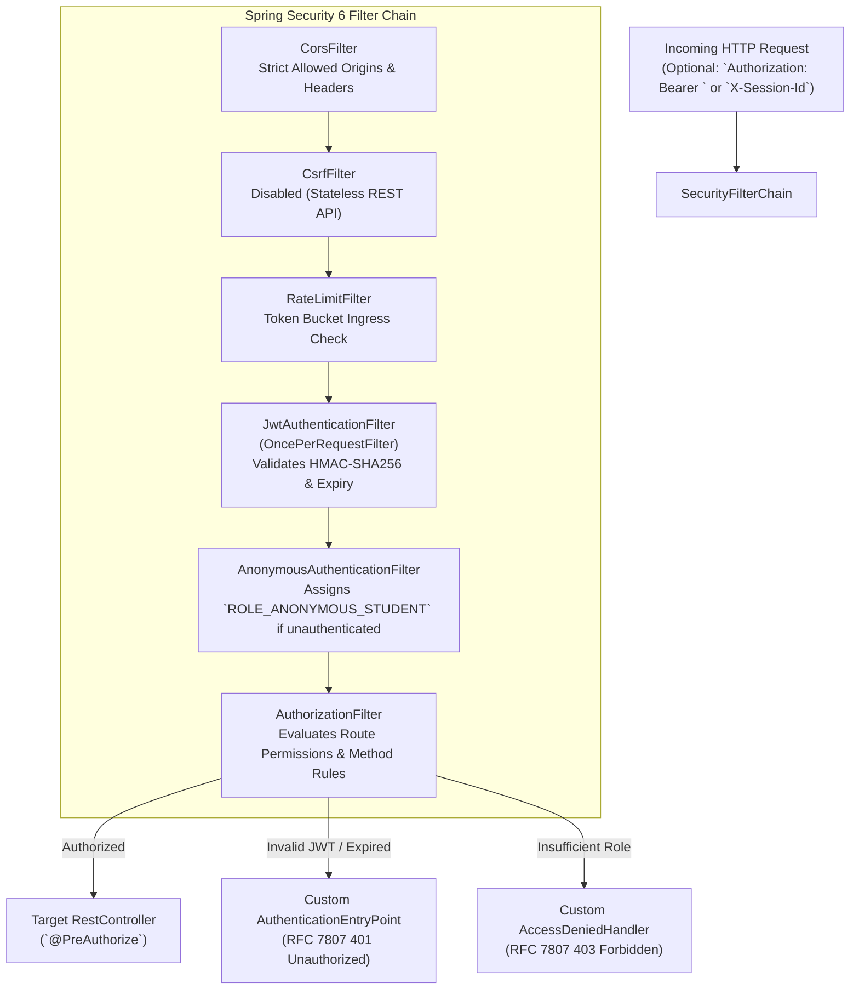

### 4.1 SecurityFilterChain Configuration (`SecurityConfiguration.java`)
```java
@Configuration
@EnableWebSecurity
@EnableMethodSecurity(prePostEnabled = true)
public class SecurityConfiguration {

    private final JwtAuthenticationFilter jwtAuthFilter;
    private final CustomAuthenticationEntryPoint authEntryPoint;
    private final CustomAccessDeniedHandler accessDeniedHandler;

    public SecurityConfiguration(
            JwtAuthenticationFilter jwtAuthFilter,
            CustomAuthenticationEntryPoint authEntryPoint,
            CustomAccessDeniedHandler accessDeniedHandler) {
        this.jwtAuthFilter = jwtAuthFilter;
        this.authEntryPoint = authEntryPoint;
        this.accessDeniedHandler = accessDeniedHandler;
    }

    @Bean
    public SecurityFilterChain securityFilterChain(HttpSecurity http) throws Exception {
        return http
            .csrf(AbstractHttpConfigurer::disable)
            .cors(cors -> cors.configurationSource(corsConfigurationSource()))
            .sessionManagement(session -> session.sessionCreationPolicy(SessionCreationPolicy.STATELESS))
            .exceptionHandling(ex -> ex
                .authenticationEntryPoint(authEntryPoint)
                .accessDeniedHandler(accessDeniedHandler))
            .authorizeHttpRequests(auth -> auth
                // Public & Anonymous Endpoints
                .requestMatchers(HttpMethod.GET, "/api/v1/questions/**").permitAll()
                .requestMatchers(HttpMethod.POST, "/api/v1/auth/session").permitAll()
                .requestMatchers(HttpMethod.POST, "/api/v1/auth/register", "/api/v1/auth/login").permitAll()
                .requestMatchers(HttpMethod.GET, "/actuator/health", "/actuator/prometheus").permitAll()
                .requestMatchers("/swagger-ui/**", "/v3/api-docs/**").permitAll()
                // Practice Session & Tutor Endpoints (Anonymous or Registered Student)
                .requestMatchers("/api/v1/sessions/**").hasAnyRole("ANONYMOUS_STUDENT", "STUDENT")
                .requestMatchers(HttpMethod.POST, "/api/v1/questions/*/ask").hasAnyRole("ANONYMOUS_STUDENT", "STUDENT")
                // Registered Student Account & Sync Endpoints
                .requestMatchers("/api/v1/student/**").hasRole("STUDENT")
                // Future Premium Essay Evaluation & OCR (Phase 2)
                .requestMatchers("/api/v1/essays/**").hasRole("PREMIUM_STUDENT")
                // Admin Ingestion & Taxonomy Management
                .requestMatchers("/api/v1/admin/**").hasRole("ADMIN")
                .anyRequest().authenticated()
            )
            .anonymous(anon -> anon
                .principal("anonymousStudent")
                .authorities("ROLE_ANONYMOUS_STUDENT"))
            .addFilterBefore(jwtAuthFilter, UsernamePasswordAuthenticationFilter.class)
            .build();
    }

    @Bean
    public PasswordEncoder passwordEncoder() {
        return new BCryptPasswordEncoder(12);
    }

    @Bean
    public CorsConfigurationSource corsConfigurationSource() {
        CorsConfiguration configuration = new CorsConfiguration();
        // Whitelist exact trusted frontends (never wildcard '*' with credentials)
        configuration.setAllowedOrigins(List.of(
            "http://localhost",
            "http://localhost:3000",
            "http://localhost:5173",
            "https://aprovaenem.com.br",
            "https://staging.aprovaenem.com.br"
        ));
        configuration.setAllowedMethods(List.of("GET", "POST", "PUT", "PATCH", "DELETE", "OPTIONS"));
        configuration.setAllowedHeaders(List.of(
            "Authorization", "Content-Type", "Accept", "X-Session-Id", "X-Requested-With", "traceparent", "X-Trace-Id"
        ));
        configuration.setExposedHeaders(List.of(
            "Authorization", "X-Trace-Id", "X-Session-Id", "X-RateLimit-Remaining", "X-RateLimit-Retry-After-Seconds"
        ));
        configuration.setAllowCredentials(true);
        configuration.setMaxAge(3600L); // 1-hour preflight cache

        UrlBasedCorsConfigurationSource source = new UrlBasedCorsConfigurationSource();
        source.registerCorsConfiguration("/api/**", configuration);
        return source;
    }
}
```

### 4.2 Role-Based Access Control (RBAC) Matrix
| Role | Assigned When | Permitted Operations |
| :--- | :--- | :--- |
| `ROLE_ANONYMOUS_STUDENT` | No JWT provided (Guest student browsing or practicing). | **Unlimited** question catalog queries, quiz generations, answer submissions, instant scoring, and step-by-step static resolutions. **1 free Socratic AI consultation per day** (resets 00:00 BRT). No persistent cross-device account syncing. |
| `ROLE_STUDENT` | Valid JWT signed by `auth-service` presented. | All anonymous operations (**unlimited practice + 1 free Socratic AI consultation per day**) + persistent diagnostic profile, cross-device history synchronization, saved sessions, XP gamification, daily streaks, and weekly reset league leaderboards. |
| `ROLE_PREMIUM_STUDENT` | Subscribed student (*AprovaENEM Pro*) or voucher holder. | All student operations + **Unlimited Socratic AI Tutor consultations** (bypasses 1/day daily quota) + upload handwritten essay photos for multimodal OCR extraction and in-depth 5-competency grading (*Redação Nota 1000*). |
| `ROLE_ADMIN` | Authenticated teacher/curator credentials. | Batch ingest INEP question archives, edit distractor taxonomies, monitor telemetry. |

### 4.3 Method-Level Security (`@PreAuthorize`)
Service methods enforce authorization via Spring Security annotations:
```java
@PreAuthorize("hasRole('STUDENT')")
public StudentProfileDTO getStudentProfile(UUID studentId) { ... }

@PreAuthorize("hasRole('ADMIN')")
public IngestionReportDTO ingestExamPackage(ExamPackageDTO packageDTO) { ... }
```

---

## 5. Inter-Service Communication & Distributed Tracing

### Synchronous Communication Contract
The Gateway communicates with downstream microservices via HTTP/1.1 REST with persistent connections. All service-to-service calls carry the standard **W3C Trace Context headers**:
- `traceparent`: `00-4bf92f3577b34da6a3ce929d0e0e4736-00f067aa0ba902b7-01`
- `X-Session-Id`: The anonymous student session UUID or authenticated user ID.

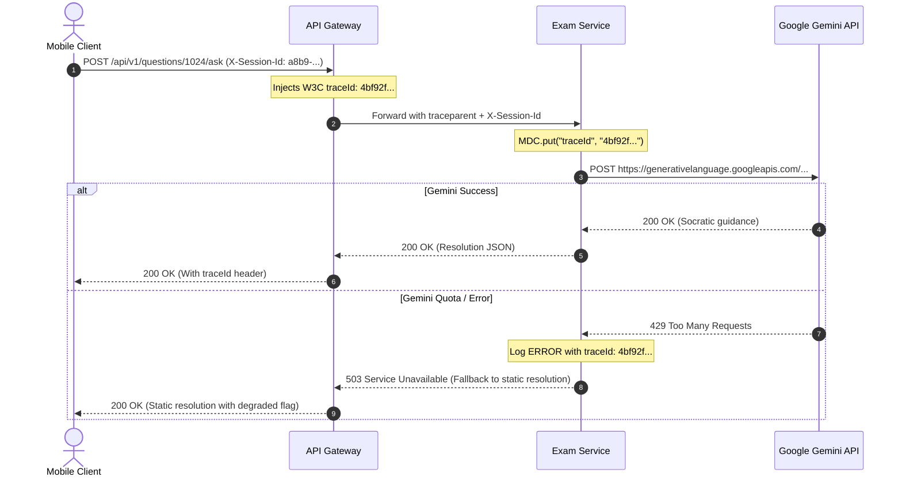

### Trace-to-Error Log Correlation
Every log line emitted by any microservice automatically includes `[serviceName, traceId, spanId]` via Logback MDC:
```text
2026-09-17 19:35:10.142 ERROR [exam-service,4bf92f3577b34da6,00f067aa0ba902b7] c.o.a.i.a.o.g.GeminiTutorClientAdapter : Gemini API rate limit hit. Falling back to cached INEP static explanation.
```
When an anomaly occurs in production, entering the `traceId` into Grafana/Prometheus immediately reveals the entire request lifecycle and exact failure point.

---

## 6. Internationalization (i18n) Architecture

The backend supports bilingual operations out of the box:
- **English (`en`)**: System error messages, validation errors, developer documentation, and API keys.
- **Portuguese (`pt-BR`)**: Domain-specific ENEM questions, subject names, distractor rationales, and Brazilian student feedback.

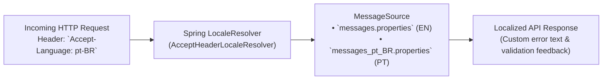

### Localization Implementation Details
1. **Spring Locale Resolver**: Standard `AcceptHeaderLocaleResolver` defaulted to `pt-BR` with fallback to `en`.
2. **Database Content Localization**:
   - The `questions` table includes a `content_language` column (default `'pt-BR'`).
   - Enables seamlessly adding translated international practice sets in the future without schema changes.

---

## 7. Future Scaling & Architecture Roadmap (Phase 2 Post-Base App)

### 7.1 Decoupling the AI Tutor (`tutor-service`)
While starting with 2 microservices (`auth-service` and `exam-service`), the Hexagonal Ports & Adapters design guarantees that extracting the Socratic AI Tutor into an independent 3rd microservice (`tutor-service`) requires **zero changes to core business logic**:

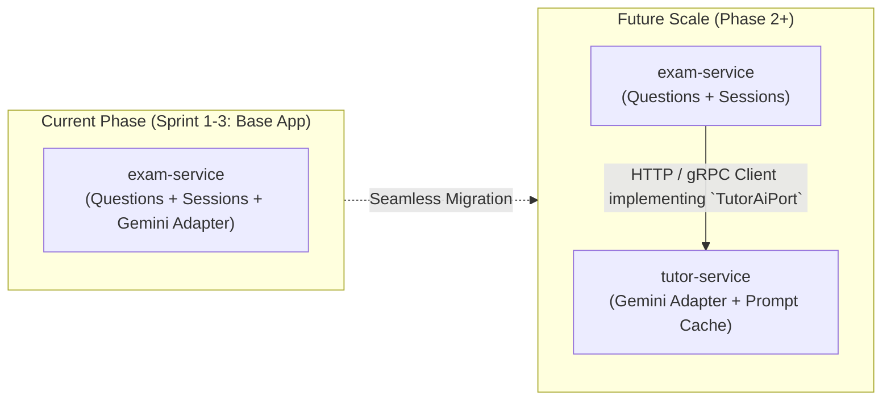

### 7.2 Premium AI Essay Evaluator & Multimodal Vision OCR (`essay-service`)

In the Brazilian ENEM, the essay (**Redação**) accounts for **20% of the entire final score** (up to 1,000 points out of 5,000) and is often the deciding criterion in SISU university admissions.

Evaluating handwritten essays requires **multimodal vision OCR** and high-token generative reasoning models. To safeguard infrastructure sustainability while keeping the base objective exam platform 100% free, this capability is architected as a **Phase 2 premium microservice (`essay-service`)** protected by `ROLE_PREMIUM_STUDENT` (or sponsored public school micro-vouchers).

#### 1. Provider-Agnostic Design & Empirical Model Evaluation (LLM Evals)
The architecture does **not hardcode a single AI provider**. Instead, the system uses an empirical **Evaluation Harness (`evals/`)** to benchmark candidate models against historical INEP human-graded ground-truth essays to select the model offering the best accuracy at the lowest cost:

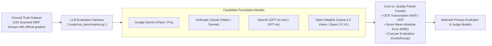

#### 2. INEP-Inspired Dual-Evaluator & LLM-as-a-Judge Protocol
In the official INEP protocol, every essay is independently evaluated by **two human graders**. If their total scores differ by more than **100 points**, or any single competency differs by more than **80 points**, a **third arbitrator (*avaliador de desempate*)** is called. 

AprovaENEM mirrors this exact rigorous protocol using **Dual Evaluators + LLM-as-a-Judge**:

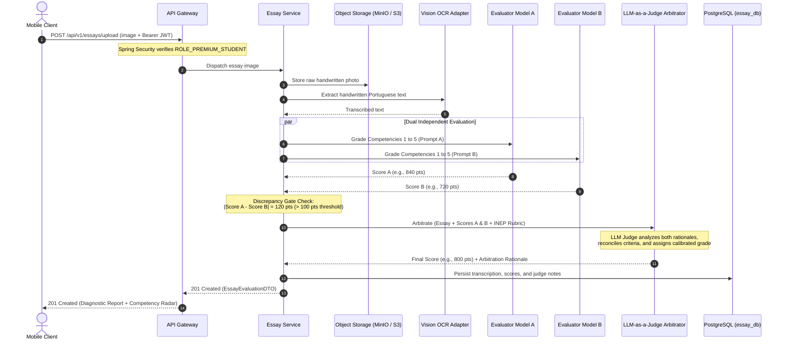

#### 3. Hexagonal Ports & Adapters Architecture
The core domain defines three pure Java outbound ports:
* `VisionOcrPort`: Abstracts handwritten Portuguese text extraction.
* `EssayEvaluatorPort`: Abstracts rubric scoring across Competencies 1 to 5.
* `LlmJudgePort`: Abstracts discrepancy arbitration and calibration.

Pluggable infrastructure adapters implement these ports (e.g., `GeminiVisionAdapter`, `OpenAiVisionAdapter`, `ClaudeJudgeAdapter`), enabling zero-downtime model switching based on benchmark results and API pricing updates.

#### 4. The 5 INEP Competencies Rubric
1. **Competência 1 (0–200 pts)**: Formal standard Portuguese syntax, concord, and spelling.
2. **Competência 2 (0–200 pts)**: Comprehending the proposed theme and integrating multidisciplinary knowledge (sociology, history, philosophy).
3. **Competência 3 (0–200 pts)**: Thesis defense: selecting, relating, and organizing arguments logically.
4. **Competência 4 (0–200 pts)**: Cohesion: appropriate use of inter- and intra-paragraph conjunctions and connectors.
5. **Competência 5 (0–200 pts)**: *Proposta de Intervenção*: Detailed actionable solution addressing the 5 required elements (*Agente, Ação, Meio/Modo, Efeito, Detalhamento*) respecting human rights.

---

### 7.3 Multi-Channel Notification Microservice (`notification-service`)

To prevent notification overhead, slow external network calls (SMTP/HTTP push gateways), and third-party rate limits from impacting core assessment APIs, all outbound notifications are decoupled into an independent **`notification-service`**:

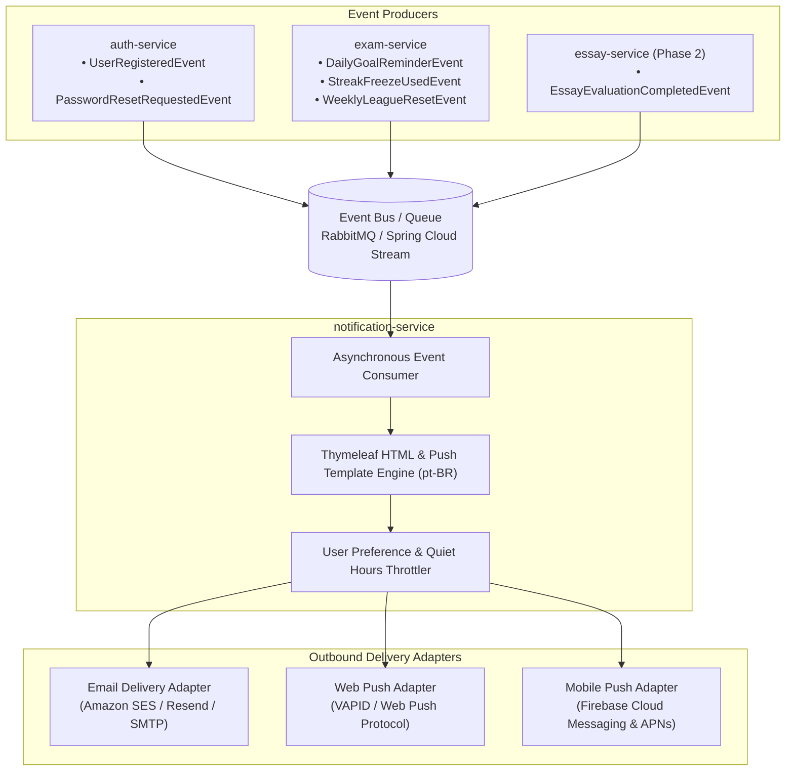

#### Key Capabilities:
1. **Multi-Channel Dispatch**:
   - **Transactional Email**: Account verification, password recovery, and Sunday weekly diagnostic digest (*Relatório Semanal de Desempenho*).
   - **Web & Mobile Push**: Daily streak reminders at 19:00 BRT, league promotion alerts, and instant notification when a handwritten essay is graded.
   - **In-App Notification Feed**: Real-time badge unlocks and system announcements.
2. **Quiet Hours & Notification Preferences**: Respects student sleep schedules (no push alerts between 22:00 and 07:00 unless explicitly requested) and honours opt-out preferences stored in `user_gamification_profiles`.

---

### 7.4 Native Mobile Application Roadmap (Native Android Kotlin & Kotlin Multiplatform)

While the initial release delivers a responsive, zero-install React 18 PWA optimized for mobile Chrome/Safari on budget smartphones, the architectural roadmap specifies a **Native Android application built with Kotlin / Java & Jetpack Compose**, designed for future cross-platform iOS expansion via **Kotlin Multiplatform (KMP)**:

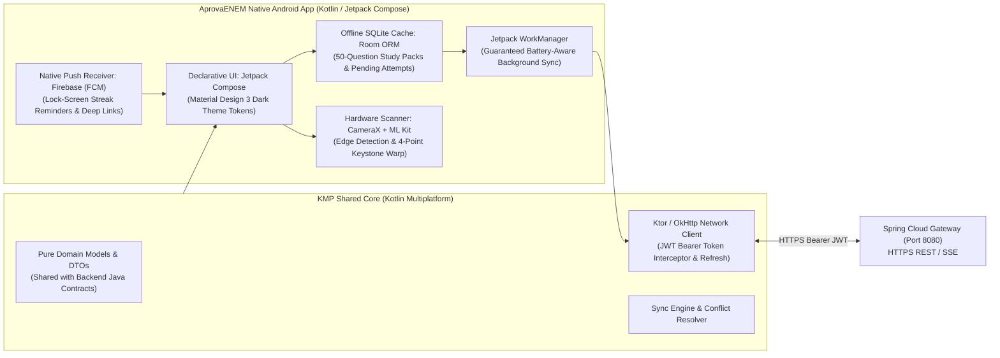

#### Strategic Advantages of the Native Android (Kotlin / JVM) Stack:
1. **Unified JVM Ecosystem Mastery**: Unifies the client and backend under the JVM umbrella (Java 21 Spring Boot 3 backend + Kotlin/Java Android client). Both platforms share clean architecture design patterns, compile-time type safety, and reactive paradigms (Kotlin Coroutines & Flow ↔ Java 21 CompletableFuture / Project Reactor).
2. **True Hardware Native Performance (Zero Bridge Overhead)**: Unlike hybrid frameworks (React Native / WebView) that serialize state over a JavaScript bridge or run an embedded V8/Hermes engine, Jetpack Compose compiles directly to native Android bytecode (ART runtime). This guarantees smooth 60/120 FPS navigation, negligible memory footprint, and high responsiveness on low-cost budget smartphones (e.g., Moto E/G series, Samsung Galaxy A0x).
3. **Offline Question Bank via Room ORM (Subway & Bus Study)**: Native Android **Room Database** provides an abstraction layer over SQLite with compile-time verified SQL queries. Students can download 50-question diagnostic exam packs before commuting; attempts are stored locally in Room tables and dispatched asynchronously.
4. **Guaranteed Background Sync via Jetpack WorkManager**: When network connectivity is intermittent or unavailable, `WorkManager` schedules deferred background sync jobs adhering to battery-conscious constraints (`NetworkType.CONNECTED`, `BatteryNotLow`). Completed exam attempts are guaranteed to sync to `exam-service` with exponential backoff.
5. **Edge Document Scanner for Essays (CameraX + ML Kit)**: Leverages **Android Jetpack CameraX** with an on-device `ImageAnalysis` pipeline. It automatically detects paper document boundaries, performs 4-point perspective keystone correction, optimizes contrast/grayscale for handwritten pencil text, and compresses the image locally before upload—drastically improving OCR and LLM evaluation accuracy while conserving mobile data bandwidth.
6. **High-Reliability Native Push Notifications (FCM)**: Native Firebase Cloud Messaging background receiver wakes the app to display critical daily streak defense alerts at 19:00 BRT and notifies students the moment their handwritten essay evaluation is finalized, supporting rich deep linking into specific question resolution screens.
7. **Future Cross-Platform Parity via KMP**: Adopting **Kotlin Multiplatform (KMP)** enables sharing 100% of domain models, validation logic, serialization (`kotlinx.serialization`), and networking with iOS (via Compose Multiplatform or native SwiftUI wrapper) without introducing JavaScript or compromising native execution.

---

## 8. Retrieval-Augmented Generation (RAG) & Vector Search Architecture

To eliminate model hallucinations and anchor all AI explanations in verified Brazilian high school curriculum standards, AprovaENEM implements an end-to-end **Retrieval-Augmented Generation (RAG)** pipeline powered by **PostgreSQL 16 with `pgvector`**:

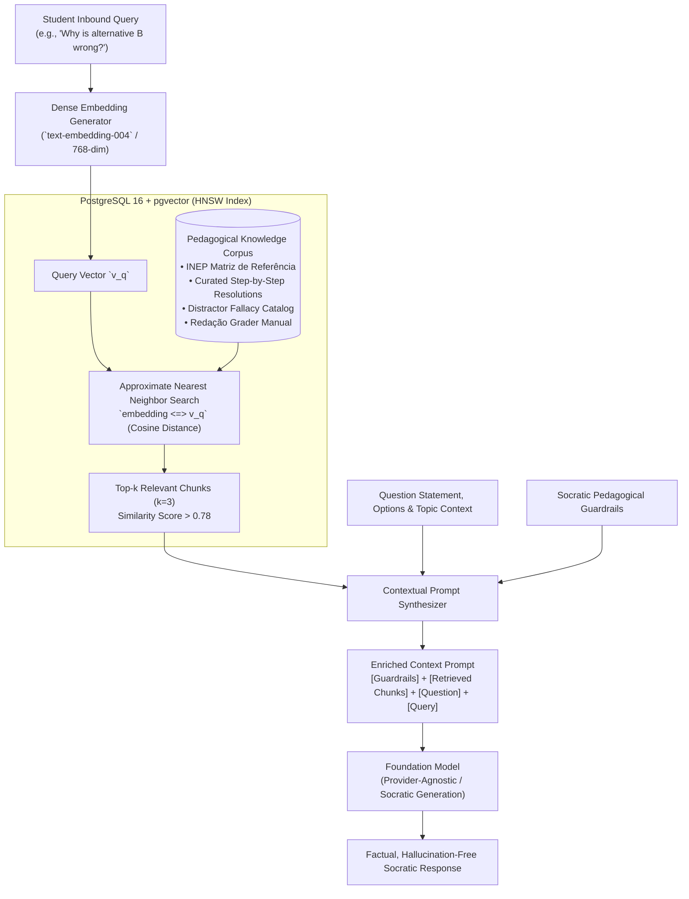

### 8.1 Vector Store Engine: PostgreSQL with `pgvector`
Rather than introducing the operational complexity, hosting costs, and network latency of an external standalone vector database cluster (e.g., Pinecone or Milvus), AprovaENEM utilizes **`pgvector` inside the existing PostgreSQL 16 container**:
- **Dimensionality**: 768 dimensions (`vector(768)`).
- **Index Type**: **HNSW (Hierarchical Navigable Small World)** with `vector_cosine_ops`, delivering sub-5ms cosine similarity searches under concurrent student traffic.
- **Index Definition**:
  ```sql
  CREATE INDEX idx_knowledge_chunks_hnsw 
  ON knowledge_chunks 
  USING hnsw (embedding vector_cosine_ops) 
  WITH (m = 16, ef_construction = 64);
  ```

### 8.2 Twofold Application of RAG in AprovaENEM
1. **Socratic AI Study Tutor (Core Feature)**:
   - Retrieves official INEP curriculum competencies, verified formulas, and distractor traps before prompting the tutor, ensuring the AI never gives incorrect scientific information or spoils answers.
2. **Redação AI Evaluator (Phase 2 Premium)**:
   - Retrieves the official INEP *Manual do Corretor de Redação*, thematic motivating texts, and exemplar benchmark criteria for the specific exam year, providing grounded evaluation across the 5 competencies.

---

## 9. Gamification & Habit-Loop Engine Architecture

To maximize student retention, combat prep fatigue, and provide a game-like educational journey for Brazilian public school students, AprovaENEM implements an event-driven **Gamification Engine** integrated across practice sessions:

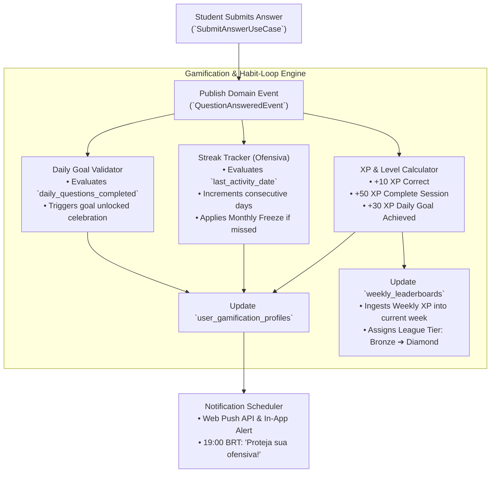

### 9.1 XP & Level Progression System
- **Level Scaling Formula**: $XP_{required}(Level) = 100 \times Level^{1.5}$
- **Level Tiers & Titles**:
  - **Levels 1–4**: *Calouro do ENEM*
  - **Levels 5–9**: *Vestibulando Focado*
  - **Levels 10–19**: *Mestre dos Simulados*
  - **Levels 20–29**: *Aspirante a Federal*
  - **Level 30+**: *Nota 1000 Implacável*

### 9.2 Weekly Reset Leaderboards & League Tiers
- **Reset Frequency**: Every Sunday at 23:59:59 BRT.
- **Tiers & Progression**:
  - 🥉 **Bronze League**: Default entry league for newly registered students. Top 20% promote.
  - 🥈 **Silver League**: Top 20% promote to Gold; bottom 10% relegate to Bronze.
  - 🥇 **Gold League**: Top 15% promote to Diamond; bottom 15% relegate to Silver.
  - 💎 **Diamond League**: Top 10 nationally recognized on the public Hall of Fame.

### 9.3 Daily Study Reminders & Streak Protection
- **Daily Goals**: Configurable question targets (5, 10, 15, or 25 questions/day).
- **Streak Freeze (*Bloqueio de Ofensiva*)**: Students receive 1 emergency streak freeze per calendar month to accommodate school exam weeks or emergencies without losing motivation.
- **Smart Push Reminders**: An asynchronous Spring `@Scheduled` worker scans for active registered users with `opt_in_reminders = true` who have not completed their daily goal by 19:00 BRT, triggering a friendly reminder notification.

