# System Architecture & Topology — AprovaENEM

> **Architecture Style**: Microservices with Hexagonal Architecture (Ports & Adapters)  
> **Ingress & Perimeter**: Nginx Load Balancer + Spring Cloud Gateway with Token Bucket Rate Limiter  
> **Backend Framework**: Java 21 LTS + Spring Boot 3.3+  
> **Persistence**: PostgreSQL 16  
> **Telemetry**: Prometheus + Micrometer Tracing (Datadog-style root-cause diagnostics)  

---

## 1. Global Topology & C4 Container Architecture

The system is deployed as a resilient, containerized multi-service ecosystem. Incoming public traffic passes through an outer Nginx perimeter proxy, moves through an authenticated and rate-limited API Gateway, and is dispatched to the downstream microservices.

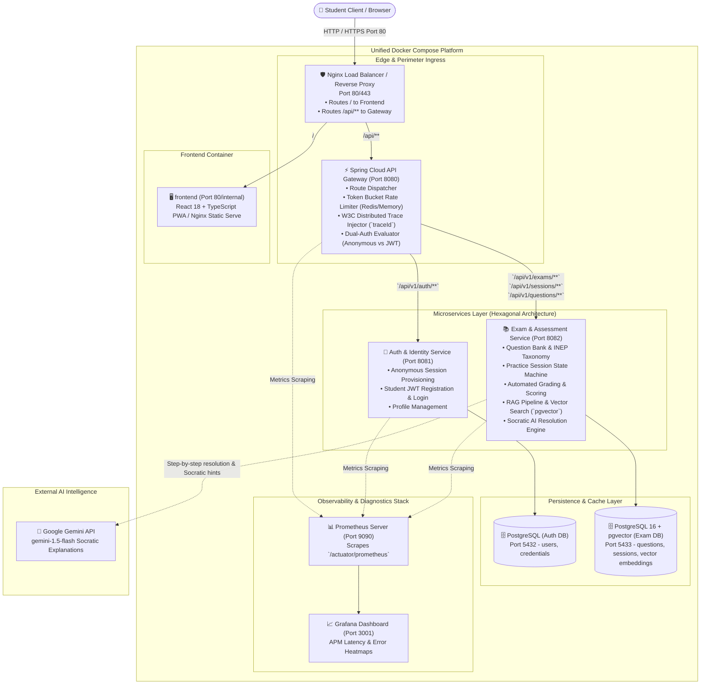

---

## 2. Ingress, Perimeter & Rate Limiting Strategy

### Nginx Perimeter
The front-facing Nginx container acts as the L7 reverse proxy, providing:
1. **Request Buffering**: Absorbs slow mobile client uploads, freeing application threads.
2. **Security Headers**: Injects HTTP security headers (`Strict-Transport-Security`, `X-Content-Type-Options: nosniff`, `X-Frame-Options: DENY`).
3. **Keep-Alive Connection Pooling**: Maintains persistent upstream connections to the Spring Cloud Gateway.

### API Gateway & Token Bucket Rate Limiting
To protect the backend from denial-of-service, aggressive question scraping, and exhaustion of upstream **Google Gemini API rate limits and quotas**, the Gateway enforces a **Token Bucket** rate limiting algorithm:

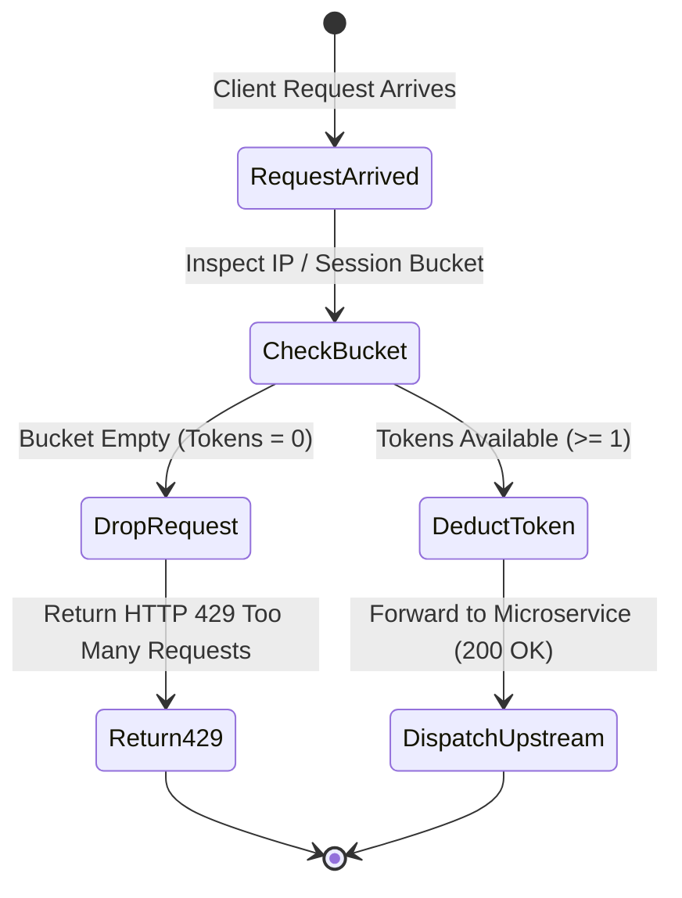

#### Rate Limiting Policies
1. **General Examination Routes** (`GET /api/v1/questions/**`):
   - Capacity: **60 tokens**.
   - Refill Rate: **1 token / second** (allows bursts up to 60 req/min).
2. **AI Tutor Inquiries** (`POST /api/v1/questions/{id}/ask`):
   - Capacity: **10 tokens**.
   - Refill Rate: **10 tokens / minute** (strict guardrail protecting upstream LLM API consumption and rate limits).
3. **HTTP 429 Payload Structure**:
   ```json
   {
     "error": "TOO_MANY_REQUESTS",
     "message": "Rate limit exceeded. Please wait before asking another question.",
     "retryAfterSeconds": 15,
     "timestamp": "2026-09-17T19:30:00Z"
   }
   ```

---

## 3. Hexagonal Architecture (Ports and Adapters)

Both microservices (`auth-service` and `exam-service`) strictly adhere to **Hexagonal Architecture**. Business logic resides in a pure Java domain layer with zero dependencies on Spring Boot, JPA, or web frameworks.

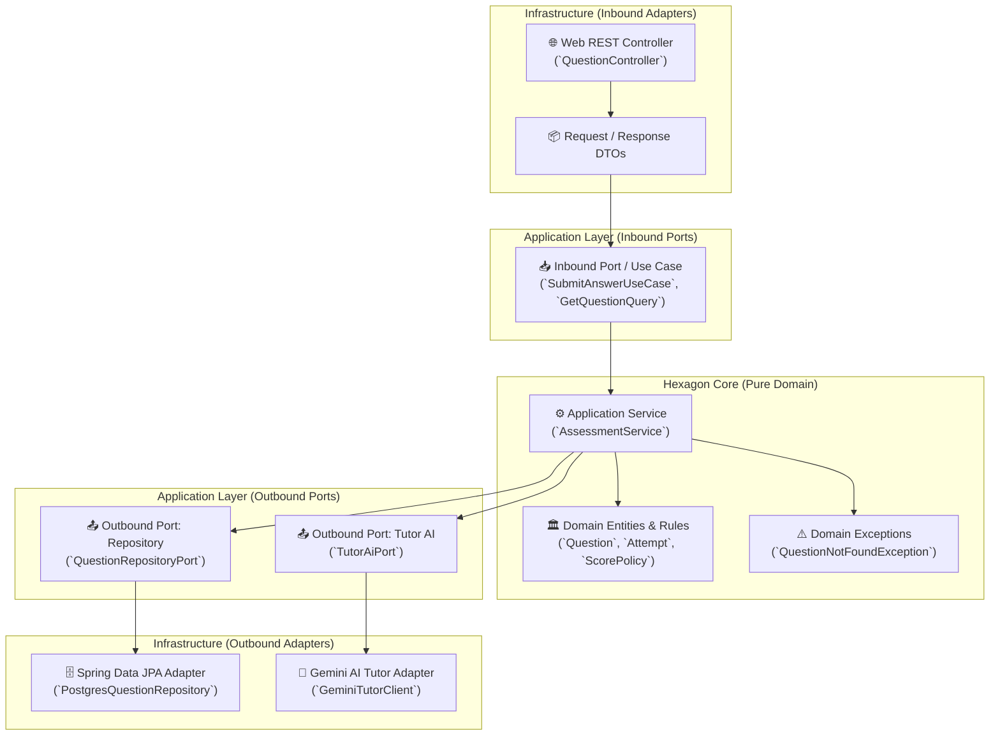

### Standardized Package Layout
```text
com.openenem.assessment/
├── domain/                      # PURE JAVA (No Spring, No JPA)
│   ├── model/
│   │   ├── Question.java        # Aggregate root
│   │   ├── Option.java          # Value object (A, B, C, D, E)
│   │   ├── ExamSession.java     # Session entity with lifecycle states
│   │   ├── Attempt.java         # Student answer submission
│   │   └── DiagnosticReport.java# Performance calculation & weak topics
│   └── exception/
│       ├── DomainException.java
│       └── SessionCompletedException.java
├── application/                 # USE CASES & INTERFACES
│   ├── port/
│   │   ├── in/                  # Driving / Inbound Ports
│   │   │   ├── StartSessionUseCase.java
│   │   │   ├── SubmitAnswerUseCase.java
│   │   │   ├── GetDiagnosticReportUseCase.java
│   │   │   └── AskTutorQuestionUseCase.java
│   │   └── out/                 # Driven / Outbound Ports (SPIs)
│   │       ├── QuestionRepositoryPort.java
│   │       ├── ExamSessionRepositoryPort.java
│   │       └── TutorAiPort.java
│   └── service/                 # Orchestrators
│       ├── AssessmentApplicationService.java
│       └── TutorApplicationService.java
└── infrastructure/              # FRAMEWORK ADAPTERS (Spring Boot, JPA, HTTP)
    ├── adapter/
    │   ├── in/web/
    │   │   ├── QuestionRestController.java
    │   │   ├── ExamSessionRestController.java
    │   │   ├── dto/             # Web DTOs & Validation annotations
    │   │   └── GlobalExceptionHandler.java
    │   ├── out/persistence/
    │   │   ├── entity/          # JPA @Entity models (Postgres tables)
    │   │   ├── mapper/          # MapStruct / Domain-Entity Mappers
    │   │   ├── repository/      # Spring Data JPA interfaces
    │   │   └── PostgresQuestionAdapter.java # Implements QuestionRepositoryPort
    │   └── out/gemini/
    │       ├── GeminiProperties.java
    │       └── GeminiTutorClientAdapter.java # Implements TutorAiPort
    ├── config/
    │   ├── BeanConfiguration.java # Wires domain services as Spring Beans
    │   ├── MetricsConfiguration.java # Micrometer Prometheus bindings
    │   └── SecurityFilterConfiguration.java
    └── resources/
        ├── application.yml
        └── db/migration/        # Flyway SQL scripts (V1__..., V2__...)
```

---

## 4. Spring Security 6 Architecture & Dual-Mode Access Control

To satisfy enterprise portfolio requirements (matching Alma Career / Teamio standards), AprovaENEM integrates **Spring Security 6.3+** with a component-based `SecurityFilterChain` model, stateless JWT authentication, and fine-grained Role-Based Access Control (RBAC).

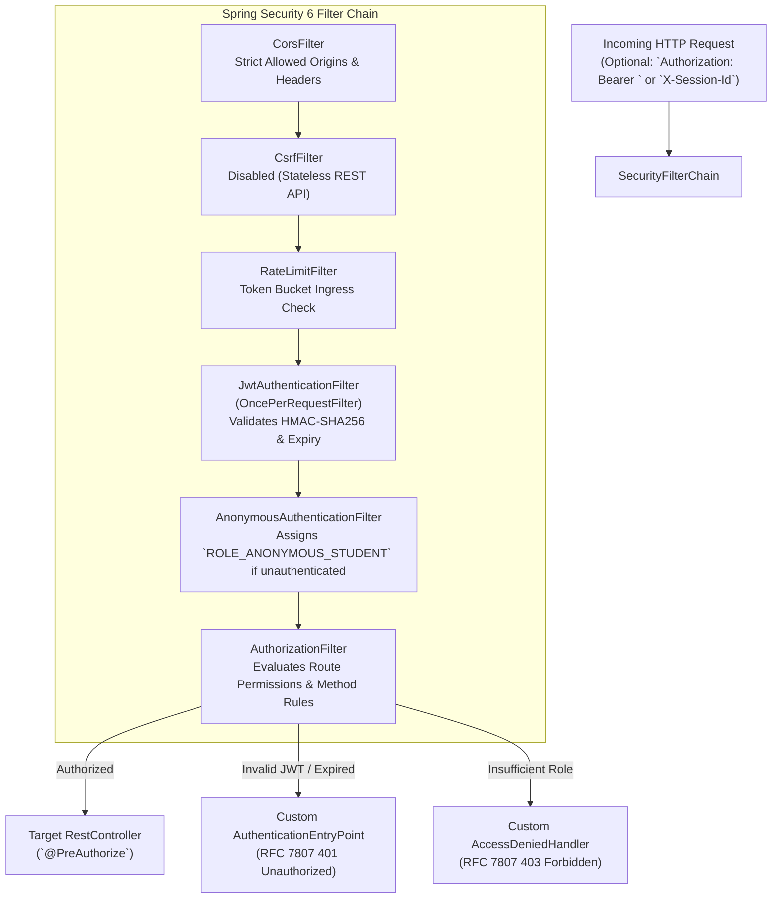

### 4.1 SecurityFilterChain Configuration (`SecurityConfiguration.java`)
```java
@Configuration
@EnableWebSecurity
@EnableMethodSecurity(prePostEnabled = true)
public class SecurityConfiguration {

    private final JwtAuthenticationFilter jwtAuthFilter;
    private final CustomAuthenticationEntryPoint authEntryPoint;
    private final CustomAccessDeniedHandler accessDeniedHandler;

    public SecurityConfiguration(
            JwtAuthenticationFilter jwtAuthFilter,
            CustomAuthenticationEntryPoint authEntryPoint,
            CustomAccessDeniedHandler accessDeniedHandler) {
        this.jwtAuthFilter = jwtAuthFilter;
        this.authEntryPoint = authEntryPoint;
        this.accessDeniedHandler = accessDeniedHandler;
    }

    @Bean
    public SecurityFilterChain securityFilterChain(HttpSecurity http) throws Exception {
        return http
            .csrf(AbstractHttpConfigurer::disable)
            .cors(cors -> cors.configurationSource(corsConfigurationSource()))
            .sessionManagement(session -> session.sessionCreationPolicy(SessionCreationPolicy.STATELESS))
            .exceptionHandling(ex -> ex
                .authenticationEntryPoint(authEntryPoint)
                .accessDeniedHandler(accessDeniedHandler))
            .authorizeHttpRequests(auth -> auth
                // Public & Anonymous Endpoints
                .requestMatchers(HttpMethod.GET, "/api/v1/questions/**").permitAll()
                .requestMatchers(HttpMethod.POST, "/api/v1/auth/session").permitAll()
                .requestMatchers(HttpMethod.POST, "/api/v1/auth/register", "/api/v1/auth/login").permitAll()
                .requestMatchers(HttpMethod.GET, "/actuator/health", "/actuator/prometheus").permitAll()
                .requestMatchers("/swagger-ui/**", "/v3/api-docs/**").permitAll()
                // Practice Session & Tutor Endpoints (Anonymous or Registered Student)
                .requestMatchers("/api/v1/sessions/**").hasAnyRole("ANONYMOUS_STUDENT", "STUDENT")
                .requestMatchers(HttpMethod.POST, "/api/v1/questions/*/ask").hasAnyRole("ANONYMOUS_STUDENT", "STUDENT")
                // Registered Student Account & Sync Endpoints
                .requestMatchers("/api/v1/student/**").hasRole("STUDENT")
                // Future Premium Essay Evaluation & OCR (Phase 2)
                .requestMatchers("/api/v1/essays/**").hasRole("PREMIUM_STUDENT")
                // Admin Ingestion & Taxonomy Management
                .requestMatchers("/api/v1/admin/**").hasRole("ADMIN")
                .anyRequest().authenticated()
            )
            .anonymous(anon -> anon
                .principal("anonymousStudent")
                .authorities("ROLE_ANONYMOUS_STUDENT"))
            .addFilterBefore(jwtAuthFilter, UsernamePasswordAuthenticationFilter.class)
            .build();
    }

    @Bean
    public PasswordEncoder passwordEncoder() {
        return new BCryptPasswordEncoder(12);
    }
}
```

### 4.2 Role-Based Access Control (RBAC) Matrix
| Role | Assigned When | Permitted Operations |
| :--- | :--- | :--- |
| `ROLE_ANONYMOUS_STUDENT` | No JWT provided (Guest student browsing or practicing). | Query catalog, generate practice quizzes, submit answers, get Socratic hints. No persistent cross-device account syncing. |
| `ROLE_STUDENT` | Valid JWT signed by `auth-service` presented. | All anonymous operations + persistent diagnostic profile, cross-device history synchronization, saved sessions. |
| `ROLE_PREMIUM_STUDENT` | Subscribed student or voucher holder. | All student operations + upload handwritten essay photos for multimodal OCR extraction and in-depth 5-competency grading (*Redação Nota 1000*). |
| `ROLE_ADMIN` | Authenticated teacher/curator credentials. | Batch ingest INEP question archives, edit distractor taxonomies, monitor telemetry. |

### 4.3 Method-Level Security (`@PreAuthorize`)
Service methods enforce authorization via Spring Security annotations:
```java
@PreAuthorize("hasRole('STUDENT')")
public StudentProfileDTO getStudentProfile(UUID studentId) { ... }

@PreAuthorize("hasRole('ADMIN')")
public IngestionReportDTO ingestExamPackage(ExamPackageDTO packageDTO) { ... }
```

---

## 5. Inter-Service Communication & Distributed Tracing

### Synchronous Communication Contract
The Gateway communicates with downstream microservices via HTTP/1.1 REST with persistent connections. All service-to-service calls carry the standard **W3C Trace Context headers**:
- `traceparent`: `00-4bf92f3577b34da6a3ce929d0e0e4736-00f067aa0ba902b7-01`
- `X-Session-Id`: The anonymous student session UUID or authenticated user ID.

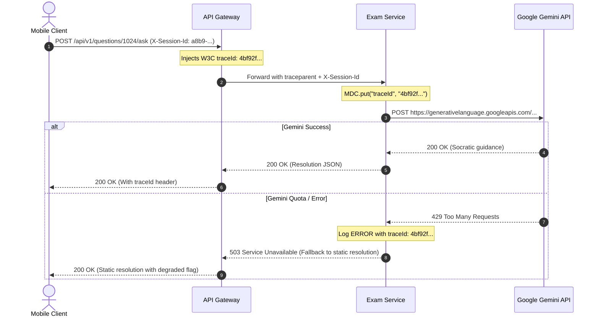

### Trace-to-Error Log Correlation
Every log line emitted by any microservice automatically includes `[serviceName, traceId, spanId]` via Logback MDC:
```text
2026-09-17 19:35:10.142 ERROR [exam-service,4bf92f3577b34da6,00f067aa0ba902b7] c.o.a.i.a.o.g.GeminiTutorClientAdapter : Gemini API rate limit hit. Falling back to cached INEP static explanation.
```
When an anomaly occurs in production, entering the `traceId` into Grafana/Prometheus immediately reveals the entire request lifecycle and exact failure point.

---

## 6. Internationalization (i18n) Architecture

The backend supports bilingual operations out of the box:
- **English (`en`)**: System error messages, validation errors, developer documentation, and API keys.
- **Portuguese (`pt-BR`)**: Domain-specific ENEM questions, subject names, distractor rationales, and Brazilian student feedback.

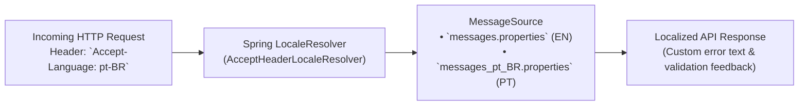

### Localization Implementation Details
1. **Spring Locale Resolver**: Standard `AcceptHeaderLocaleResolver` defaulted to `pt-BR` with fallback to `en`.
2. **Database Content Localization**:
   - The `questions` table includes a `content_language` column (default `'pt-BR'`).
   - Enables seamlessly adding translated international practice sets in the future without schema changes.

---

## 7. Future Scaling & Architecture Roadmap (Phase 2 Post-Base App)

### 7.1 Decoupling the AI Tutor (`tutor-service`)
While starting with 2 microservices (`auth-service` and `exam-service`), the Hexagonal Ports & Adapters design guarantees that extracting the Socratic AI Tutor into an independent 3rd microservice (`tutor-service`) requires **zero changes to core business logic**:

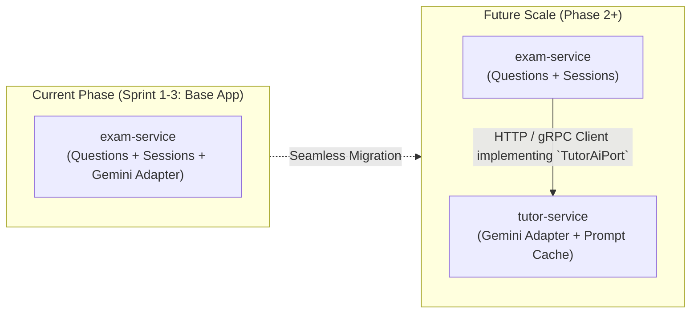

### 7.2 Premium AI Essay Evaluator & Multimodal Vision OCR (`essay-service`)

In the Brazilian ENEM, the essay (**Redação**) accounts for **20% of the entire final score** (up to 1,000 points out of 5,000) and is often the deciding criterion in SISU university admissions.

Evaluating handwritten essays requires **multimodal vision OCR** and high-token generative reasoning models. To safeguard infrastructure sustainability while keeping the base objective exam platform 100% free, this capability is architected as a **Phase 2 premium microservice (`essay-service`)** protected by `ROLE_PREMIUM_STUDENT` (or sponsored public school micro-vouchers).

#### 1. Provider-Agnostic Design & Empirical Model Evaluation (LLM Evals)
The architecture does **not hardcode a single AI provider**. Instead, the system uses an empirical **Evaluation Harness (`evals/`)** to benchmark candidate models against historical INEP human-graded ground-truth essays to select the model offering the best accuracy at the lowest cost:

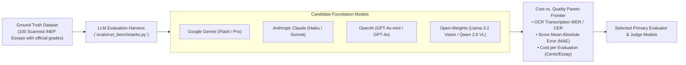

#### 2. INEP-Inspired Dual-Evaluator & LLM-as-a-Judge Protocol
In the official INEP protocol, every essay is independently evaluated by **two human graders**. If their total scores differ by more than **100 points**, or any single competency differs by more than **80 points**, a **third arbitrator (*avaliador de desempate*)** is called. 

AprovaENEM mirrors this exact rigorous protocol using **Dual Evaluators + LLM-as-a-Judge**:

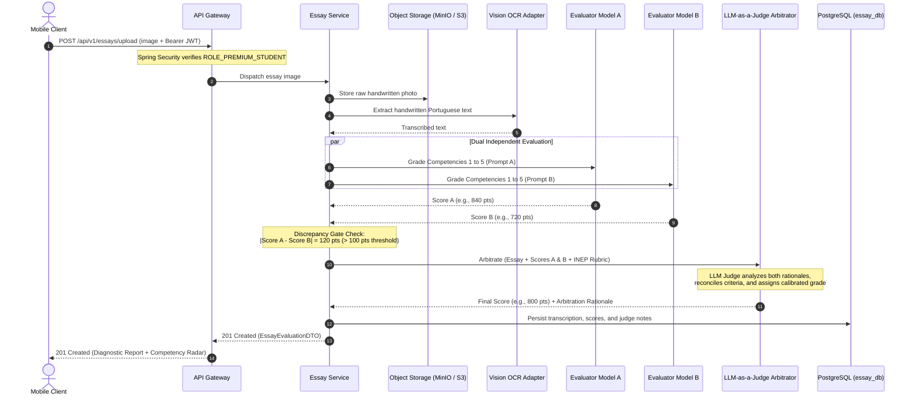

#### 3. Hexagonal Ports & Adapters Architecture
The core domain defines three pure Java outbound ports:
* `VisionOcrPort`: Abstracts handwritten Portuguese text extraction.
* `EssayEvaluatorPort`: Abstracts rubric scoring across Competencies 1 to 5.
* `LlmJudgePort`: Abstracts discrepancy arbitration and calibration.

Pluggable infrastructure adapters implement these ports (e.g., `GeminiVisionAdapter`, `OpenAiVisionAdapter`, `ClaudeJudgeAdapter`), enabling zero-downtime model switching based on benchmark results and API pricing updates.

#### 4. The 5 INEP Competencies Rubric
1. **Competência 1 (0–200 pts)**: Formal standard Portuguese syntax, concord, and spelling.
2. **Competência 2 (0–200 pts)**: Comprehending the proposed theme and integrating multidisciplinary knowledge (sociology, history, philosophy).
3. **Competência 3 (0–200 pts)**: Thesis defense: selecting, relating, and organizing arguments logically.
4. **Competência 4 (0–200 pts)**: Cohesion: appropriate use of inter- and intra-paragraph conjunctions and connectors.
5. **Competência 5 (0–200 pts)**: *Proposta de Intervenção*: Detailed actionable solution addressing the 5 required elements (*Agente, Ação, Meio/Modo, Efeito, Detalhamento*) respecting human rights.

---

## 8. Retrieval-Augmented Generation (RAG) & Vector Search Architecture

To eliminate model hallucinations and anchor all AI explanations in verified Brazilian high school curriculum standards, AprovaENEM implements an end-to-end **Retrieval-Augmented Generation (RAG)** pipeline powered by **PostgreSQL 16 with `pgvector`**:

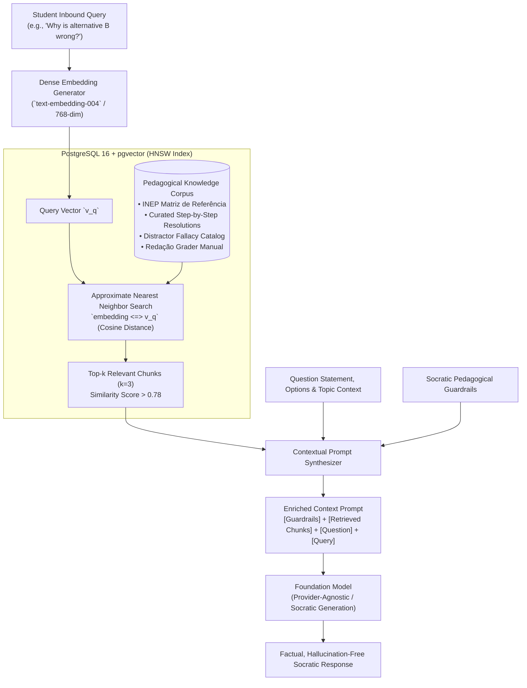

### 8.1 Vector Store Engine: PostgreSQL with `pgvector`
Rather than introducing the operational complexity, hosting costs, and network latency of an external standalone vector database cluster (e.g., Pinecone or Milvus), AprovaENEM utilizes **`pgvector` inside the existing PostgreSQL 16 container**:
- **Dimensionality**: 768 dimensions (`vector(768)`).
- **Index Type**: **HNSW (Hierarchical Navigable Small World)** with `vector_cosine_ops`, delivering sub-5ms cosine similarity searches under concurrent student traffic.
- **Index Definition**:
  ```sql
  CREATE INDEX idx_knowledge_chunks_hnsw 
  ON knowledge_chunks 
  USING hnsw (embedding vector_cosine_ops) 
  WITH (m = 16, ef_construction = 64);
  ```

### 8.2 Twofold Application of RAG in AprovaENEM
1. **Socratic AI Study Tutor (Core Feature)**:
   - Retrieves official INEP curriculum competencies, verified formulas, and distractor traps before prompting the tutor, ensuring the AI never gives incorrect scientific information or spoils answers.
2. **Redação AI Evaluator (Phase 2 Premium)**:
   - Retrieves the official INEP *Manual do Corretor de Redação*, thematic motivating texts, and exemplar benchmark criteria for the specific exam year, providing grounded evaluation across the 5 competencies.

---

## 9. Gamification & Habit-Loop Engine Architecture

To maximize student retention, combat prep fatigue, and provide a game-like educational journey for Brazilian public school students, AprovaENEM implements an event-driven **Gamification Engine** integrated across practice sessions:

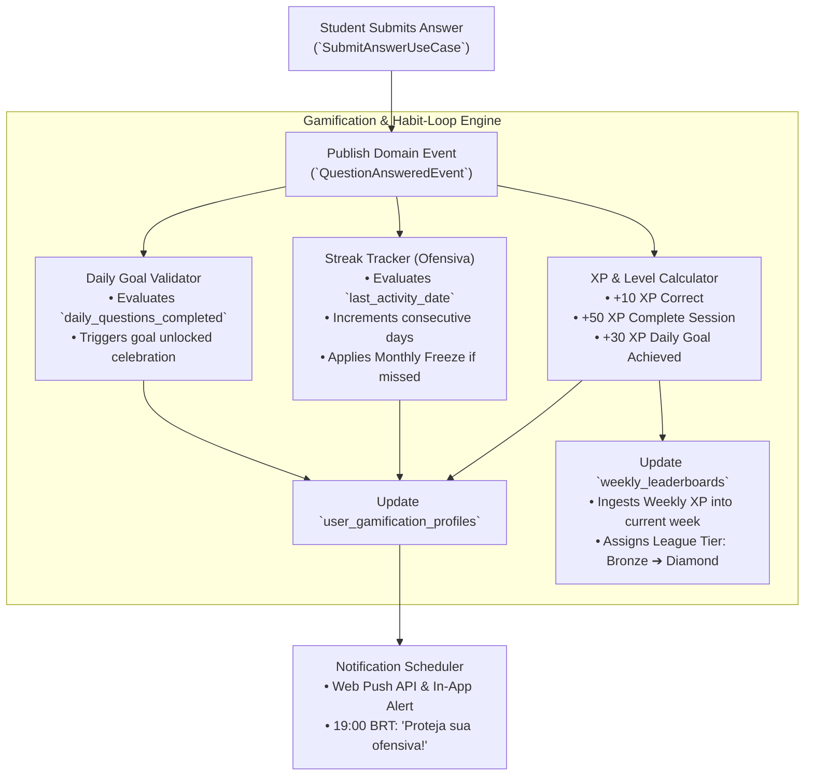

### 9.1 XP & Level Progression System
- **Level Scaling Formula**: $XP_{required}(Level) = 100 \times Level^{1.5}$
- **Level Tiers & Titles**:
  - **Levels 1–4**: *Calouro do ENEM*
  - **Levels 5–9**: *Vestibulando Focado*
  - **Levels 10–19**: *Mestre dos Simulados*
  - **Levels 20–29**: *Aspirante a Federal*
  - **Level 30+**: *Nota 1000 Implacável*

### 9.2 Weekly Reset Leaderboards & League Tiers
- **Reset Frequency**: Every Sunday at 23:59:59 BRT.
- **Tiers & Progression**:
  - 🥉 **Bronze League**: Default entry league for newly registered students. Top 20% promote.
  - 🥈 **Silver League**: Top 20% promote to Gold; bottom 10% relegate to Bronze.
  - 🥇 **Gold League**: Top 15% promote to Diamond; bottom 15% relegate to Silver.
  - 💎 **Diamond League**: Top 10 nationally recognized on the public Hall of Fame.

### 9.3 Daily Study Reminders & Streak Protection
- **Daily Goals**: Configurable question targets (5, 10, 15, or 25 questions/day).
- **Streak Freeze (*Bloqueio de Ofensiva*)**: Students receive 1 emergency streak freeze per calendar month to accommodate school exam weeks or emergencies without losing motivation.
- **Smart Push Reminders**: An asynchronous Spring `@Scheduled` worker scans for active registered users with `opt_in_reminders = true` who have not completed their daily goal by 19:00 BRT, triggering a friendly reminder notification.

