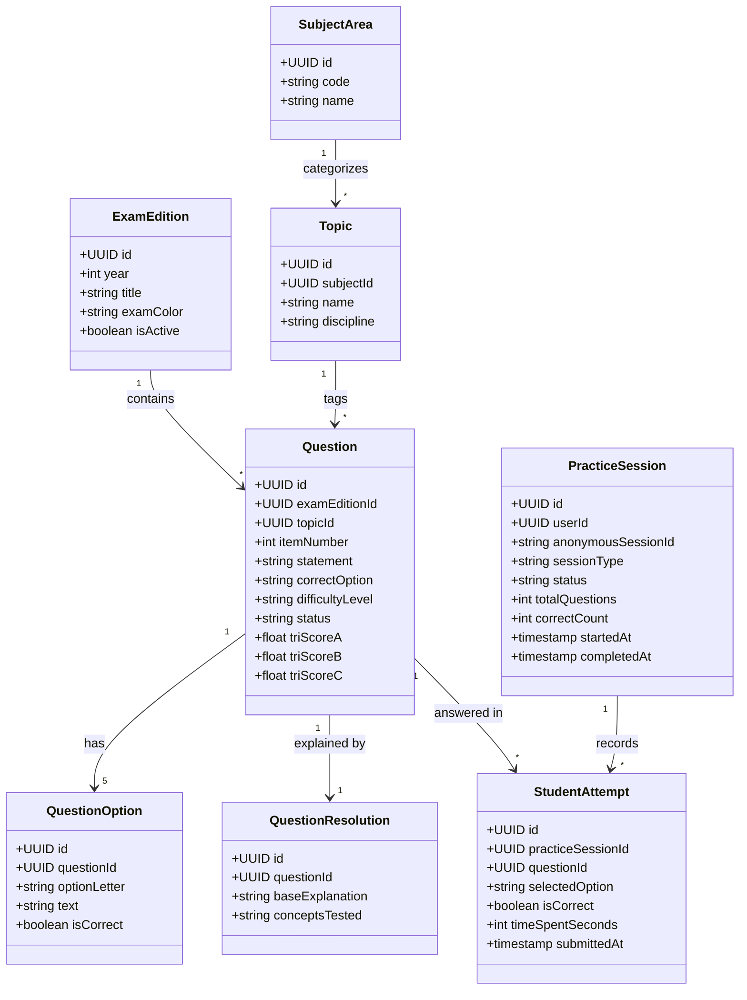
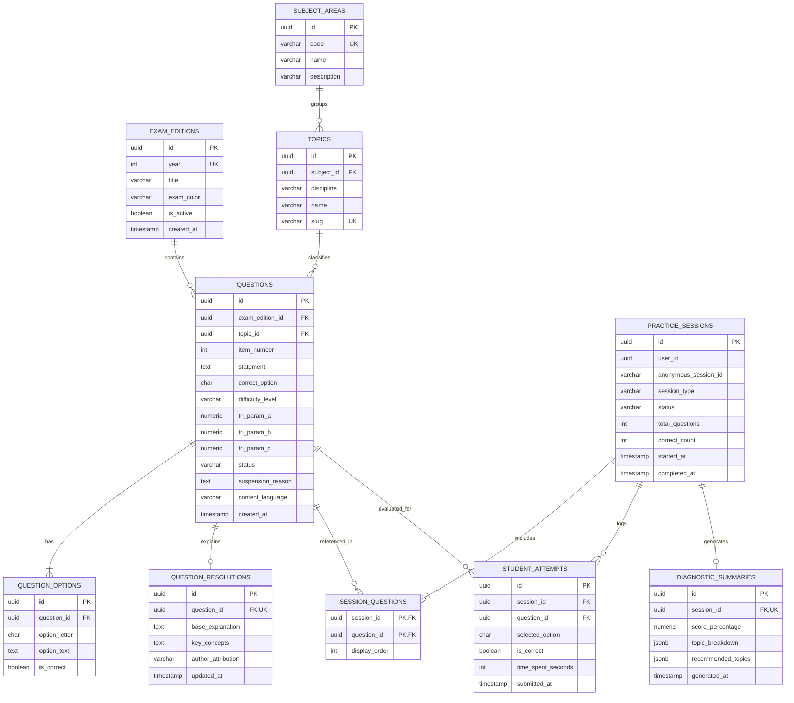
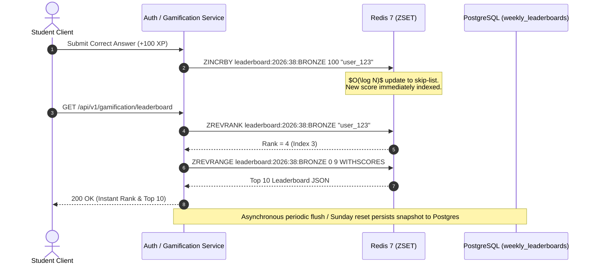

# Data Modeling & Persistence Architecture — AprovaENEM

> **Database Engine**: PostgreSQL 16  
> **Key Strategy**: UUIDv7 for distributed time-ordered primary keys  
> **Normalization Standard**: Third Normal Form (3NF) with specialized indexing for high-concurrency read queries  

---

## 1. Conceptual Data Model & Domain Boundaries

The persistence layer is split across two database boundaries to maintain microservice autonomy:
1. **`auth_db`**: Manages user credentials, roles, and anonymous session mapping.
2. **`exam_db`**: Manages the INEP exam catalog, question taxonomy, practice sessions, student attempt submissions, and diagnostic analytics.



---

## 2. Entity-Relationship (ER) Diagram



---

## 3. Physical DDL Specifications (PostgreSQL 16)

### 3.1 Auth Database (`auth_db`)

```sql
-- Enable UUID extension
CREATE EXTENSION IF NOT EXISTS "uuid-ossp";

-- Users Table
CREATE TABLE users (
    id UUID PRIMARY KEY DEFAULT gen_random_uuid(),
    email VARCHAR(255) NOT NULL UNIQUE,
    password_hash VARCHAR(255) NOT NULL,
    full_name VARCHAR(150) NOT NULL,
    school_type VARCHAR(50) NOT NULL DEFAULT 'PUBLIC_SCHOOL',
    target_degree VARCHAR(100),
    is_active BOOLEAN NOT NULL DEFAULT TRUE,
    created_at TIMESTAMP WITH TIME ZONE NOT NULL DEFAULT CURRENT_TIMESTAMP,
    updated_at TIMESTAMP WITH TIME ZONE NOT NULL DEFAULT CURRENT_TIMESTAMP
);

-- Anonymous Session Linkage
CREATE TABLE anonymous_sessions (
    id UUID PRIMARY KEY DEFAULT gen_random_uuid(),
    session_uuid VARCHAR(64) NOT NULL UNIQUE,
    claimed_by_user_id UUID REFERENCES users(id) ON DELETE SET NULL,
    ip_hash VARCHAR(64),
    created_at TIMESTAMP WITH TIME ZONE NOT NULL DEFAULT CURRENT_TIMESTAMP,
    last_active_at TIMESTAMP WITH TIME ZONE NOT NULL DEFAULT CURRENT_TIMESTAMP
);

CREATE INDEX idx_anonymous_session_uuid ON anonymous_sessions(session_uuid);

-- Gamification Profiles (Level, XP, Daily Goals & Streaks)
CREATE TABLE user_gamification_profiles (
    user_id UUID PRIMARY KEY REFERENCES users(id) ON DELETE CASCADE,
    current_level INT NOT NULL DEFAULT 1,
    current_xp INT NOT NULL DEFAULT 0,
    streak_days INT NOT NULL DEFAULT 0,
    streak_freeze_available INT NOT NULL DEFAULT 1, -- 1 emergency streak freeze per month
    last_activity_date DATE,
    daily_goal_questions INT NOT NULL DEFAULT 10,
    daily_questions_completed INT NOT NULL DEFAULT 0,
    daily_goal_reached_at TIMESTAMP WITH TIME ZONE,
    opt_in_reminders BOOLEAN NOT NULL DEFAULT TRUE,
    created_at TIMESTAMP WITH TIME ZONE NOT NULL DEFAULT CURRENT_TIMESTAMP,
    updated_at TIMESTAMP WITH TIME ZONE NOT NULL DEFAULT CURRENT_TIMESTAMP
);

-- Weekly Leaderboard Tiers (Resets every Sunday at 23:59 BRT)
CREATE TABLE weekly_leaderboards (
    id UUID PRIMARY KEY DEFAULT gen_random_uuid(),
    user_id UUID NOT NULL REFERENCES users(id) ON DELETE CASCADE,
    week_number INT NOT NULL,
    year INT NOT NULL,
    league_tier VARCHAR(20) NOT NULL DEFAULT 'BRONZE', -- BRONZE, SILVER, GOLD, DIAMOND
    weekly_xp INT NOT NULL DEFAULT 0,
    questions_solved INT NOT NULL DEFAULT 0,
    rank_position INT,
    created_at TIMESTAMP WITH TIME ZONE NOT NULL DEFAULT CURRENT_TIMESTAMP,
    updated_at TIMESTAMP WITH TIME ZONE NOT NULL DEFAULT CURRENT_TIMESTAMP,
    CONSTRAINT uq_user_week UNIQUE (user_id, week_number, year)
);

-- Student Badges & Achievements
CREATE TABLE user_achievements (
    id UUID PRIMARY KEY DEFAULT gen_random_uuid(),
    user_id UUID NOT NULL REFERENCES users(id) ON DELETE CASCADE,
    badge_code VARCHAR(50) NOT NULL, -- 'STREAK_7_DAYS', 'MATH_WIZARD_50', 'FIRST_SIMULADO', 'LEVEL_10'
    unlocked_at TIMESTAMP WITH TIME ZONE NOT NULL DEFAULT CURRENT_TIMESTAMP,
    CONSTRAINT uq_user_badge UNIQUE (user_id, badge_code)
);
```

---

### 3.2 Examination & Assessment Database (`exam_db`)

```sql
-- Enable UUID and Vector extensions
CREATE EXTENSION IF NOT EXISTS "uuid-ossp";
CREATE EXTENSION IF NOT EXISTS vector;

-- Exam Editions (e.g., ENEM 2023 Regular)
CREATE TABLE exam_editions (
    id UUID PRIMARY KEY DEFAULT gen_random_uuid(),
    year INT NOT NULL,
    title VARCHAR(100) NOT NULL,
    exam_color VARCHAR(30) NOT NULL DEFAULT 'BLUE',
    is_active BOOLEAN NOT NULL DEFAULT TRUE,
    created_at TIMESTAMP WITH TIME ZONE NOT NULL DEFAULT CURRENT_TIMESTAMP,
    CONSTRAINT uq_exam_year_color UNIQUE (year, exam_color)
);

-- Subject Areas (e.g., MATHEMATICS, NATURAL_SCIENCES)
CREATE TABLE subject_areas (
    id UUID PRIMARY KEY DEFAULT gen_random_uuid(),
    code VARCHAR(50) NOT NULL UNIQUE,
    name VARCHAR(100) NOT NULL,
    description TEXT
);

-- Topics & Disciplines (e.g., Physics -> Optics)
CREATE TABLE topics (
    id UUID PRIMARY KEY DEFAULT gen_random_uuid(),
    subject_id UUID NOT NULL REFERENCES subject_areas(id) ON DELETE RESTRICT,
    discipline VARCHAR(50) NOT NULL,
    name VARCHAR(100) NOT NULL,
    slug VARCHAR(120) NOT NULL UNIQUE,
    created_at TIMESTAMP WITH TIME ZONE NOT NULL DEFAULT CURRENT_TIMESTAMP
);

-- Questions (The Core Examination Asset)
CREATE TABLE questions (
    id UUID PRIMARY KEY DEFAULT gen_random_uuid(),
    exam_edition_id UUID NOT NULL REFERENCES exam_editions(id) ON DELETE RESTRICT,
    topic_id UUID NOT NULL REFERENCES topics(id) ON DELETE RESTRICT,
    item_number INT NOT NULL,
    statement TEXT NOT NULL,
    correct_option CHAR(1) NOT NULL CHECK (correct_option IN ('A', 'B', 'C', 'D', 'E')),
    difficulty_level VARCHAR(20) NOT NULL CHECK (difficulty_level IN ('EASY', 'MEDIUM', 'HARD')),
    tri_param_a NUMERIC(5, 3), -- Discrimination parameter
    tri_param_b NUMERIC(5, 3), -- Difficulty parameter
    tri_param_c NUMERIC(5, 3), -- Guessing parameter
    status VARCHAR(30) NOT NULL DEFAULT 'ACTIVE' CHECK (status IN ('ACTIVE', 'SUSPENDED', 'NEEDS_REVIEW', 'DRAFT', 'ANNULLED')),
    suspension_reason TEXT, -- Optional pedagogical/formatting notes for suspended items
    content_language VARCHAR(10) NOT NULL DEFAULT 'pt-BR',
    created_at TIMESTAMP WITH TIME ZONE NOT NULL DEFAULT CURRENT_TIMESTAMP,
    updated_at TIMESTAMP WITH TIME ZONE NOT NULL DEFAULT CURRENT_TIMESTAMP,
    CONSTRAINT uq_edition_item UNIQUE (exam_edition_id, item_number)
);

-- Multiple Choice Options (A, B, C, D, E)
CREATE TABLE question_options (
    id UUID PRIMARY KEY DEFAULT gen_random_uuid(),
    question_id UUID NOT NULL REFERENCES questions(id) ON DELETE CASCADE,
    option_letter CHAR(1) NOT NULL CHECK (option_letter IN ('A', 'B', 'C', 'D', 'E')),
    option_text TEXT NOT NULL,
    is_correct BOOLEAN NOT NULL DEFAULT FALSE,
    CONSTRAINT uq_question_option UNIQUE (question_id, option_letter)
);

-- Curated Explanations & Step-by-Step Resolutions
CREATE TABLE question_resolutions (
    id UUID PRIMARY KEY DEFAULT gen_random_uuid(),
    question_id UUID NOT NULL UNIQUE REFERENCES questions(id) ON DELETE CASCADE,
    base_explanation TEXT NOT NULL,
    key_concepts TEXT,
    author_attribution VARCHAR(100) DEFAULT 'INEP Official Guidelines / Open Educational Resource',
    updated_at TIMESTAMP WITH TIME ZONE NOT NULL DEFAULT CURRENT_TIMESTAMP
);

-- Practice Sessions (Exam Simulations or Custom Quizzes)
CREATE TABLE practice_sessions (
    id UUID PRIMARY KEY DEFAULT gen_random_uuid(),
    user_id UUID,
    anonymous_session_id VARCHAR(64) NOT NULL,
    session_type VARCHAR(30) NOT NULL CHECK (session_type IN ('TOPIC_PRACTICE', 'EXAM_SIMULATION', 'DIAGNOSTIC_QUICK')),
    status VARCHAR(20) NOT NULL DEFAULT 'IN_PROGRESS' CHECK (status IN ('IN_PROGRESS', 'COMPLETED', 'ABANDONED')),
    total_questions INT NOT NULL,
    correct_count INT NOT NULL DEFAULT 0,
    started_at TIMESTAMP WITH TIME ZONE NOT NULL DEFAULT CURRENT_TIMESTAMP,
    completed_at TIMESTAMP WITH TIME ZONE
);

-- Questions Included in a Specific Session
CREATE TABLE session_questions (
    session_id UUID NOT NULL REFERENCES practice_sessions(id) ON DELETE CASCADE,
    question_id UUID NOT NULL REFERENCES questions(id) ON DELETE RESTRICT,
    display_order INT NOT NULL,
    PRIMARY KEY (session_id, question_id)
);

-- Student Answers per Question Attempt
CREATE TABLE student_attempts (
    id UUID PRIMARY KEY DEFAULT gen_random_uuid(),
    session_id UUID NOT NULL REFERENCES practice_sessions(id) ON DELETE CASCADE,
    question_id UUID NOT NULL REFERENCES questions(id) ON DELETE RESTRICT,
    selected_option CHAR(1) NOT NULL CHECK (selected_option IN ('A', 'B', 'C', 'D', 'E')),
    is_correct BOOLEAN NOT NULL,
    time_spent_seconds INT NOT NULL DEFAULT 0,
    submitted_at TIMESTAMP WITH TIME ZONE NOT NULL DEFAULT CURRENT_TIMESTAMP,
    CONSTRAINT uq_session_question_attempt UNIQUE (session_id, question_id)
);

-- Generated Diagnostic Summaries & Skill Radar
CREATE TABLE diagnostic_summaries (
    id UUID PRIMARY KEY DEFAULT gen_random_uuid(),
    session_id UUID NOT NULL UNIQUE REFERENCES practice_sessions(id) ON DELETE CASCADE,
    score_percentage NUMERIC(5, 2) NOT NULL,
    topic_breakdown JSONB NOT NULL,
    recommended_topics JSONB NOT NULL,
    generated_at TIMESTAMP WITH TIME ZONE NOT NULL DEFAULT CURRENT_TIMESTAMP
);

-- Phase 2 Future Schema: Premium Essay Evaluation & OCR (Redação Nota 1000)
CREATE TABLE essay_prompts (
    id UUID PRIMARY KEY DEFAULT gen_random_uuid(),
    year INT NOT NULL,
    theme VARCHAR(255) NOT NULL,
    motivating_texts JSONB NOT NULL,
    created_at TIMESTAMP WITH TIME ZONE NOT NULL DEFAULT CURRENT_TIMESTAMP
);

CREATE TABLE student_essays (
    id UUID PRIMARY KEY DEFAULT gen_random_uuid(),
    user_id UUID NOT NULL,
    essay_prompt_id UUID NOT NULL REFERENCES essay_prompts(id) ON DELETE RESTRICT,
    image_storage_url VARCHAR(500) NOT NULL,
    transcribed_text TEXT,
    status VARCHAR(30) NOT NULL DEFAULT 'PROCESSING', -- PROCESSING, EVALUATED, FAILED
    total_score INT CHECK (total_score BETWEEN 0 AND 1000),
    general_feedback TEXT,
    created_at TIMESTAMP WITH TIME ZONE NOT NULL DEFAULT CURRENT_TIMESTAMP
);

CREATE TABLE essay_competency_evaluations (
    id UUID PRIMARY KEY DEFAULT gen_random_uuid(),
    essay_id UUID NOT NULL REFERENCES student_essays(id) ON DELETE CASCADE,
    competency_number INT NOT NULL CHECK (competency_number BETWEEN 1 AND 5),
    score INT NOT NULL CHECK (score BETWEEN 0 AND 200 AND score % 40 = 0),
    feedback TEXT NOT NULL,
    actionable_tips TEXT,
    CONSTRAINT uq_essay_competency UNIQUE (essay_id, competency_number)
);

-- RAG & Vector Knowledge Base (Pedagogical Reference Materials & Redação Rubrics)
CREATE TABLE knowledge_documents (
    id UUID PRIMARY KEY DEFAULT gen_random_uuid(),
    title VARCHAR(255) NOT NULL,
    source_type VARCHAR(50) NOT NULL, -- 'INEP_MATRIZ', 'STEP_RESOLUTION', 'DISTRACTOR_CATALOG', 'REDAÇÃO_RUBRIC'
    topic_id UUID REFERENCES topics(id) ON DELETE SET NULL,
    created_at TIMESTAMP WITH TIME ZONE NOT NULL DEFAULT CURRENT_TIMESTAMP
);

CREATE TABLE knowledge_chunks (
    id UUID PRIMARY KEY DEFAULT gen_random_uuid(),
    document_id UUID NOT NULL REFERENCES knowledge_documents(id) ON DELETE CASCADE,
    chunk_index INT NOT NULL,
    content TEXT NOT NULL,
    metadata JSONB NOT NULL DEFAULT '{}'::jsonb,
    embedding vector(768) NOT NULL,
    created_at TIMESTAMP WITH TIME ZONE NOT NULL DEFAULT CURRENT_TIMESTAMP,
    CONSTRAINT uq_document_chunk UNIQUE (document_id, chunk_index)
);
```

---

### 3.3 Notification Database (`notification_db`)

```sql
-- Enable UUID extension
CREATE EXTENSION IF NOT EXISTS "uuid-ossp";

-- User Device Push Tokens (Web Push, Android FCM, iOS APNs)
CREATE TABLE user_device_tokens (
    id UUID PRIMARY KEY DEFAULT gen_random_uuid(),
    user_id UUID NOT NULL, -- Logical reference to auth_db.users(id)
    device_token VARCHAR(500) NOT NULL UNIQUE,
    platform VARCHAR(20) NOT NULL CHECK (platform IN ('WEB_PUSH', 'ANDROID', 'IOS')),
    is_active BOOLEAN NOT NULL DEFAULT TRUE,
    created_at TIMESTAMP WITH TIME ZONE NOT NULL DEFAULT CURRENT_TIMESTAMP,
    last_used_at TIMESTAMP WITH TIME ZONE NOT NULL DEFAULT CURRENT_TIMESTAMP
);

CREATE INDEX idx_user_device_tokens_user 
ON user_device_tokens (user_id, is_active);

-- Multi-Channel Outbound Notification Logs & In-App Feed
CREATE TABLE notification_logs (
    id UUID PRIMARY KEY DEFAULT gen_random_uuid(),
    user_id UUID NOT NULL,
    channel VARCHAR(20) NOT NULL CHECK (channel IN ('EMAIL', 'WEB_PUSH', 'MOBILE_PUSH', 'IN_APP')),
    template_code VARCHAR(50) NOT NULL, -- 'DAILY_STREAK_REMINDER', 'WEEKLY_LEAGUE_RESULT', 'ESSAY_GRADED'
    title VARCHAR(255) NOT NULL,
    body TEXT NOT NULL,
    metadata JSONB NOT NULL DEFAULT '{}'::jsonb,
    status VARCHAR(20) NOT NULL DEFAULT 'PENDING', -- 'PENDING', 'SENT', 'FAILED', 'READ'
    sent_at TIMESTAMP WITH TIME ZONE,
    read_at TIMESTAMP WITH TIME ZONE,
    error_message TEXT,
    created_at TIMESTAMP WITH TIME ZONE NOT NULL DEFAULT CURRENT_TIMESTAMP
);

CREATE INDEX idx_notifications_user_inbox 
ON notification_logs (user_id, status, created_at DESC);
```

---

## 4. Indexing Strategy & Performance Optimization

To achieve the strict **`p95 < 50ms`** read requirement for quiz generation, catalog filtering, and leaderboard computation, PostgreSQL 16 employs a specialized indexing strategy combining **Composite B-Tree, Partial B-Tree, GIN (Generalized Inverted Index), and HNSW (Hierarchical Navigable Small World)** vector indexes.

### 4.1 Index Definitions by Database

#### A. Examination & Assessment Database (`exam_db`)
```sql
-- 1. Full-Text Search (Portuguese) on Question Statements
-- Enables instant keyword search (e.g., 'termologia', 'função quadrática') without full table scans
CREATE INDEX idx_questions_statement_fts 
ON questions USING GIN (to_tsvector('portuguese', statement));

-- 2. Multi-Column Catalog Filter (Topic, Difficulty, Language, Status)
CREATE INDEX idx_questions_topic_diff_lang 
ON questions (topic_id, difficulty_level, content_language, status);

-- 3. Partial B-Tree Index for Active Serving Questions
-- Eliminates table scans for practice quiz generation; ignores DRAFT, SUSPENDED, ANNULLED items
CREATE INDEX idx_questions_active_serving 
ON questions (topic_id, difficulty_level) 
WHERE status = 'ACTIVE';

-- 4. Edition & Item Lookup (Exam Simulation Mode)
CREATE INDEX idx_questions_edition_item 
ON questions (exam_edition_id, item_number);

-- 5. Foreign Key Covering: Topic to Subject Area
CREATE INDEX idx_topics_subject_id 
ON topics (subject_id);

-- 6. Question Options Retrieval by Question ID
CREATE INDEX idx_question_options_lookup 
ON question_options (question_id, option_letter);

-- 7. Practice Session Lookup (Anonymous Session & Status)
CREATE INDEX idx_practice_sessions_lookup 
ON practice_sessions (anonymous_session_id, status);

-- 8. Partial Index for Registered User Practice Sessions
CREATE INDEX idx_practice_sessions_user 
ON practice_sessions (user_id, started_at DESC) 
WHERE user_id IS NOT NULL;

-- 9. Reverse Index on Session Questions
CREATE INDEX idx_session_questions_question_id 
ON session_questions (question_id);

-- 10. Student Attempts Retrieval by Session
CREATE INDEX idx_student_attempts_session 
ON student_attempts (session_id, is_correct);

-- 11. Distractor & TRI IRT Analytics: Attempts by Question & Option
-- Accelerates computation of distractor selection percentages and item difficulty calibration
CREATE INDEX idx_student_attempts_question_distractor 
ON student_attempts (question_id, selected_option, is_correct);

-- 12. GIN Index on Diagnostic Breakdown (JSONB Path Operations)
CREATE INDEX idx_diagnostic_topic_breakdown_gin 
ON diagnostic_summaries USING GIN (topic_breakdown);

-- 13. HNSW Vector Index for Semantic Cosine Search (Sub-5ms RAG Retrieval)
CREATE INDEX idx_knowledge_chunks_hnsw 
ON knowledge_chunks 
USING hnsw (embedding vector_cosine_ops) 
WITH (m = 16, ef_construction = 64);

-- 14. Phase 2: Student Essays by User
CREATE INDEX idx_student_essays_user 
ON student_essays (user_id, created_at DESC);

-- 15. Phase 2: Partial Index for Worker Queue (Pending Essay OCR / Grading)
CREATE INDEX idx_student_essays_processing 
ON student_essays (created_at) 
WHERE status = 'PROCESSING';
```

#### B. Identity & Gamification Database (`auth_db`)
```sql
-- 1. Anonymous Session Token Lookup
CREATE INDEX idx_anonymous_session_uuid 
ON anonymous_sessions(session_uuid);

-- 2. Foreign Key Covering: Linked User Claims
CREATE INDEX idx_anonymous_sessions_claimed 
ON anonymous_sessions(claimed_by_user_id) 
WHERE claimed_by_user_id IS NOT NULL;

-- 3. Daily Streak Preserver Cron (Runs at 19:00 BRT)
-- Partial index targeting only users who opted in and have not yet studied today
CREATE INDEX idx_gamification_streak_reminder 
ON user_gamification_profiles (last_activity_date) 
WHERE opt_in_reminders = TRUE;

-- 4. Weekly Leaderboard Tier Query (Sunday Reset & Real-Time Ranks)
CREATE INDEX idx_weekly_leaderboards_league_xp 
ON weekly_leaderboards (year, week_number, league_tier, weekly_xp DESC);

-- 5. User Achievements Lookup
CREATE INDEX idx_user_achievements_user 
ON user_achievements (user_id, unlocked_at DESC);
```

#### C. Notification Database (`notification_db`)
```sql
-- 1. Active Device Tokens by User
CREATE INDEX idx_user_device_tokens_user 
ON user_device_tokens (user_id, is_active);

-- 2. User Notification Inbox (Sorted by Recency)
CREATE INDEX idx_notifications_user_inbox 
ON notification_logs (user_id, status, created_at DESC);
```

---

### 4.2 Query-to-Index Performance Mapping Matrix

| Inbound Query / Operation | Target Table | Primary Index Used | Index Scan Type | Target Latency |
| :--- | :--- | :--- | :--- | :---: |
| **Instant Quiz Generation** (`GET /api/v1/sessions/generate`) | `questions` | `idx_questions_active_serving` | `Bitmap Index Scan` | $< 5\text{ ms}$ |
| **Topic Question Catalog** (`GET /api/v1/questions?topic=...`) | `questions` | `idx_questions_topic_diff_lang` | `Index Scan` | $< 8\text{ ms}$ |
| **Keyword Search** (`GET /api/v1/questions?query=termologia`) | `questions` | `idx_questions_statement_fts` | `Bitmap Index Scan` | $< 12\text{ ms}$ |
| **Session Hydration** (`GET /api/v1/sessions/{id}`) | `question_options` | `idx_question_options_lookup` | `Index Scan` | $< 3\text{ ms}$ |
| **Attempt Submission & Distractor Stats** | `student_attempts` | `idx_student_attempts_question_distractor` | `Index Only Scan` | $< 4\text{ ms}$ |
| **RAG Vector Search** (`POST /api/v1/questions/{id}/ask`) | `knowledge_chunks` | `idx_knowledge_chunks_hnsw` | `HNSW Index Scan` | $< 5\text{ ms}$ |
| **Daily Streak 19:00 BRT Push Dispatch** | `user_gamification_profiles` | `idx_gamification_streak_reminder` | `Bitmap Index Scan` | $< 15\text{ ms}$ |
| **Weekly League Leaderboard Top 50** | `weekly_leaderboards` | `idx_weekly_leaderboards_league_xp` | `Index Scan` | $< 5\text{ ms}$ |
| **Notification Inbox** (`GET /api/v1/notifications`) | `notification_logs` | `idx_notifications_user_inbox` | `Index Scan` | $< 3\text{ ms}$ |

---

### 4.3 Index Maintenance & Monitoring Governance

1. **Unused Index Auditing**:
   Periodically monitored via PostgreSQL statistics to ensure no deadweight index slows down `INSERT`/`UPDATE` operations:
   ```sql
   SELECT schemaname, relname, indexrelname, idx_scan, idx_tup_read, idx_tup_fetch
   FROM pg_stat_user_indexes
   WHERE idx_scan = 0 AND schemaname = 'public';
   ```
2. **Zero-Downtime Index Rebuilding**:
   All production indexes are maintained with `REINDEX CONCURRENTLY` to avoid table-level write locks.
3. **Deterministic Flyway Migrations**:
   All indexes are codified into versioned migration scripts (`V1__init_schema.sql`, `V2__performance_indexes.sql`), strictly disallowing ad-hoc manual DDL.

---

## 5. Storage Capacity & Sizing Estimation

Applying the back-of-the-envelope estimation rules:

### Question Bank Volume (17 Years of Modern ENEM: 2009–2025)
- Annual ENEM Questions: 180 questions / year (45 per area).
- 17 Years (2009–2025): $17 \times 180 = 3,060\text{ questions}$.
- Including Second Application / PPL: $3,060 \times 2 \approx \mathbf{6,120\text{ total questions}}$.
- Average question payload (statement + 5 options + LaTeX): $\approx 4\text{ KB}$.
- Total Question Catalog Size: $6,120 \times 4\text{ KB} \approx \mathbf{24.5\text{ MB}}$.
- **Conclusion**: The entire question bank easily fits into PostgreSQL RAM buffers (`shared_buffers`), guaranteeing instant $O(1)$ in-memory index scans!

### Student Attempt Volume (Daily Active Scale)
- Expected Daily Active Users (DAU): $10,000\text{ students}$.
- Average questions practiced per user / day: $15\text{ questions}$.
- Daily Attempt Rows: $10,000 \times 15 = 150,000\text{ rows / day}$.
- Size per attempt row: $\approx 120\text{ bytes}$.
- Daily Attempt Volume: $150,000 \times 120\text{ bytes} \approx 18\text{ MB / day}$.
- 1-Year Attempt Storage: $18\text{ MB} \times 365 \approx \mathbf{6.57\text{ GB / year}}$.
- **Conclusion**: Readily handled by a single standard PostgreSQL node with zero sharding required for early and mid-stage operations.

---

## 6. Database Migration & ORM Strategy

### 6.1 Database Migration Tool: Flyway
To guarantee immutable, auditable, and automated schema evolution across development, CI/CD, and production, AprovaENEM utilizes **Flyway** (`flyway-core` + `flyway-database-postgresql`):

1. **Versioning Convention**:
   - Location: `src/main/resources/db/migration/`
   - Format: `V<Major>__<Description>.sql` (e.g., `V1__init_auth_schema.sql`, `V1__init_exam_schema.sql`, `V2__add_vector_knowledge_base.sql`)
   - Repeatable scripts for seed data: `R__seed_enem_taxonomy.sql`
2. **Schema Safety & Governance**:
   - **`spring.jpa.hibernate.ddl-auto=validate`**: Hibernate auto-DDL (`update` / `create`) is strictly disabled across all environments to prevent accidental column drops, unintended data loss, or unindexed foreign keys.
   - Flyway executes schema migrations deterministically before Spring Boot's `EntityManagerFactory` initializes.
   - All migrations are verified against real PostgreSQL 16 instances in CI using Testcontainers before pull requests merge.

### 6.2 ORM Strategy: Spring Data JPA (Hibernate 6) within Hexagonal Architecture
AprovaENEM pairs **Spring Data JPA / Hibernate 6** with Hexagonal Architecture (Ports and Adapters) to achieve high developer velocity without tight coupling:

```mermaid
flowchart LR
    subgraph DomainCore ["Core Domain (Framework-Agnostic)"]
        DomainModel["Pure Domain Entity<br/>(`Question.java`)<br/>• 0 JPA annotations<br/>• Encapsulates TRI logic & scoring"]
        OutboundPort["Outbound Repository Port<br/>(`QuestionRepositoryPort.java`)"]
    end

    subgraph PersistenceAdapter ["Outbound Persistence Adapter (Infrastructure)"]
        Adapter["PostgresQuestionAdapter<br/>implements `QuestionRepositoryPort`"]
        Mapper["Entity Mapper<br/>(`QuestionEntityMapper`)"]
        JpaEntity["Spring Data JPA Entity<br/>(`QuestionJpaEntity.java`)<br/>• @Entity, @Table, @Id<br/>• Column mappings & foreign keys"]
        SpringDataRepo["Spring Data Repository<br/>(`QuestionJpaRepository`)<br/>extends JpaRepository"]
    end

    OutboundPort <|.. Adapter
    Adapter --> Mapper
    Mapper --> JpaEntity
    Adapter --> SpringDataRepo
    SpringDataRepo --> Postgres[("PostgreSQL 16 + pgvector")]
```

#### Key ORM Design Principles:
1. **Decoupled Domain Entities**: Core domain models (`Question`, `PracticeSession`, `ExamEdition`) are pure Java POJOs containing business logic and invariants with **zero Jakarta Persistence (`@Entity`) dependencies**.
2. **Dedicated Persistence Entities**: `infrastructure/.../entity/` contains specialized `@Entity` classes (`QuestionJpaEntity`) optimized for Hibernate mapping, proxying, and caching.
3. **Bidirectional Mapping**: Explicit mappers (`MapStruct` or dedicated mapper classes) convert between JPA Entities and Pure Domain Models at the adapter boundary, preventing Hibernate lazy loading leaks (`LazyInitializationException`) or persistence state pollution in business logic.
4. **Vector Search Integration**: Vector similarity queries (`<=>`) are executed via native SQL queries within Spring Data repositories or through Spring AI's `PgVectorStore`.

---

## 7. Distributed Caching Architecture with Redis 7+

To offload 85%+ of read queries from PostgreSQL, guarantee sub-5ms response times during high-traffic exam seasons, and enable sub-millisecond gamification leaderboards, AprovaENEM integrates **Redis 7+ Alpine** as a distributed in-memory cache and state store.

```mermaid
flowchart TD
    Client["Client / frontend-api"] --> Service["Exam / Auth Service"]
    
    subgraph CachingLayer ["Redis 7+ Distributed Memory Grid"]
        RedisQuestion["L2 Entity Cache<br/>`questions:{id}` (TTL 24h)"]
        RedisCatalog["Catalog Filter Cache<br/>`catalog:{topic}:{diff}` (TTL 1h)"]
        RedisSession["Active Session Cache<br/>`sessions:active:{id}` (TTL 2h)"]
        RedisZSet["Gamification Leaderboard (ZSET)<br/>`leaderboard:{year}:{week}:{league}`"]
        RedisRateLimit["Token Bucket Rate Limiting<br/>`ratelimit:{ip}:{route}`"]
    end
    
    subgraph PersistentDB ["PostgreSQL 16 Storage Engine"]
        Postgres[("PostgreSQL 16 Tables")]
    end

    Service -->|1. Cache Hit (Sub-2ms)| CachingLayer
    Service -.->|2. Cache Miss| Postgres
    Postgres -.->|3. Hydrate & Populate Cache| CachingLayer
```

### 7.1 Redis Key Schema & Expiration (TTL) Matrix

| Cache Namespace / Key Format | Data Structure | TTL | Invalidation Trigger | Purpose |
| :--- | :--- | :--- | :--- | :--- |
| `questions:{questionId}` | String (JSON) | **24 hours** | Admin update (`@CacheEvict`) | Hydrates full question statement, options, and LaTeX without hitting `exam_db`. |
| `questions:resolutions:{questionId}` | String (JSON) | **48 hours** | Admin update | Step-by-step resolution text and pedagogical concept explanations. |
| `catalog:{topicId}:{diff}:{page}` | String (JSON) | **1 hour** | Question status change | Paginated catalog queries for browsing questions by subject and difficulty. |
| `sessions:active:{sessionId}` | Hash | **2 hours** | Session completion / abandonment | Fast state checks for in-progress student quiz sessions. |
| `leaderboard:{year}:{week}:{league}` | **Sorted Set (`ZSET`)** | **7 days** | Sunday 23:59 BRT league reset | Real-time $O(\log N)$ XP rankings across thousands of concurrent students. |
| `ratelimit:{ip}:{route}` | String (Int Counter) | **1 minute** | Sliding window expiry | Distributed Token Bucket quota counter shared across Gateway instances. |

---

### 7.2 Real-Time Gamification Leaderboard Engine (Redis `ZSET`)

Calculating global ranks in relational databases using `RANK() OVER (ORDER BY weekly_xp DESC)` triggers costly sequential table scans and sorting overhead under high concurrency. Redis **Sorted Sets (`ZSET`)** solve this by maintaining a skip-list with logarithmic time complexity:



---

### 7.3 Spring Boot Cache Configuration (`RedisConfig.java`)

```java
package com.openenem.assessment.infrastructure.config;

import com.fasterxml.jackson.databind.ObjectMapper;
import com.fasterxml.jackson.datatype.jsr310.JavaTimeModule;
import org.springframework.beans.factory.annotation.Value;
import org.springframework.cache.annotation.EnableCaching;
import org.springframework.context.annotation.Bean;
import org.springframework.context.annotation.Configuration;
import org.springframework.data.redis.cache.RedisCacheConfiguration;
import org.springframework.data.redis.cache.RedisCacheManager;
import org.springframework.data.redis.connection.RedisConnectionFactory;
import org.springframework.data.redis.connection.RedisStandaloneConfiguration;
import org.springframework.data.redis.connection.lettuce.LettuceConnectionFactory;
import org.springframework.data.redis.core.RedisTemplate;
import org.springframework.data.redis.serializer.GenericJackson2JsonRedisSerializer;
import org.springframework.data.redis.serializer.RedisSerializationContext;
import org.springframework.data.redis.serializer.StringRedisSerializer;

import java.time.Duration;
import java.util.HashMap;
import java.util.Map;

@Configuration
@EnableCaching
public class RedisConfig {

    @Value("${spring.data.redis.host:redis}")
    private String redisHost;

    @Value("${spring.data.redis.port:6379}")
    private int redisPort;

    @Value("${spring.data.redis.password:}")
    private String redisPassword;

    @Bean
    public LettuceConnectionFactory redisConnectionFactory() {
        RedisStandaloneConfiguration config = new RedisStandaloneConfiguration(redisHost, redisPort);
        if (redisPassword != null && !redisPassword.isBlank()) {
            config.setPassword(redisPassword);
        }
        return new LettuceConnectionFactory(config);
    }

    @Bean
    public RedisTemplate<String, Object> redisTemplate(RedisConnectionFactory connectionFactory) {
        RedisTemplate<String, Object> template = new RedisTemplate<>();
        template.setConnectionFactory(connectionFactory);

        ObjectMapper mapper = new ObjectMapper();
        mapper.registerModule(new JavaTimeModule());
        GenericJackson2JsonRedisSerializer serializer = new GenericJackson2JsonRedisSerializer(mapper);

        template.setKeySerializer(new StringRedisSerializer());
        template.setValueSerializer(serializer);
        template.setHashKeySerializer(new StringRedisSerializer());
        template.setHashValueSerializer(serializer);
        template.afterPropertiesSet();
        return template;
    }

    @Bean
    public RedisCacheManager cacheManager(RedisConnectionFactory connectionFactory) {
        ObjectMapper mapper = new ObjectMapper();
        mapper.registerModule(new JavaTimeModule());
        GenericJackson2JsonRedisSerializer serializer = new GenericJackson2JsonRedisSerializer(mapper);

        RedisCacheConfiguration defaultCacheConfig = RedisCacheConfiguration.defaultCacheConfig()
                .entryTtl(Duration.ofHours(1))
                .disableCachingNullValues()
                .serializeKeysWith(RedisSerializationContext.SerializationPair.fromSerializer(new StringRedisSerializer()))
                .serializeValuesWith(RedisSerializationContext.SerializationPair.fromSerializer(serializer));

        // Specialized TTLs per cache name
        Map<String, RedisCacheConfiguration> cacheConfigs = new HashMap<>();
        cacheConfigs.put("questions", defaultCacheConfig.entryTtl(Duration.ofHours(24)));
        cacheConfigs.put("question_resolutions", defaultCacheConfig.entryTtl(Duration.ofHours(48)));
        cacheConfigs.put("active_sessions", defaultCacheConfig.entryTtl(Duration.ofHours(2)));

        return RedisCacheManager.builder(connectionFactory)
                .cacheDefaults(defaultCacheConfig)
                .withInitialCacheConfigurations(cacheConfigs)
                .build();
    }
}
```

---

### 7.4 Memory Eviction & Safety Governance
1. **LRU Eviction Policy**:
   - `maxmemory 512mb`
   - `maxmemory-policy allkeys-lru` (Evicts least recently used keys automatically when memory pressure occurs, preventing out-of-memory crashes).
2. **Network Isolation**:
   - Redis binds exclusively to the internal Docker bridge network (`aprovaenem-internal`).
   - Host port `6379` is **strictly unexposed** to the outside world.
   - Protected with strong authentication (`requirepass ${REDIS_PASSWORD}`).
