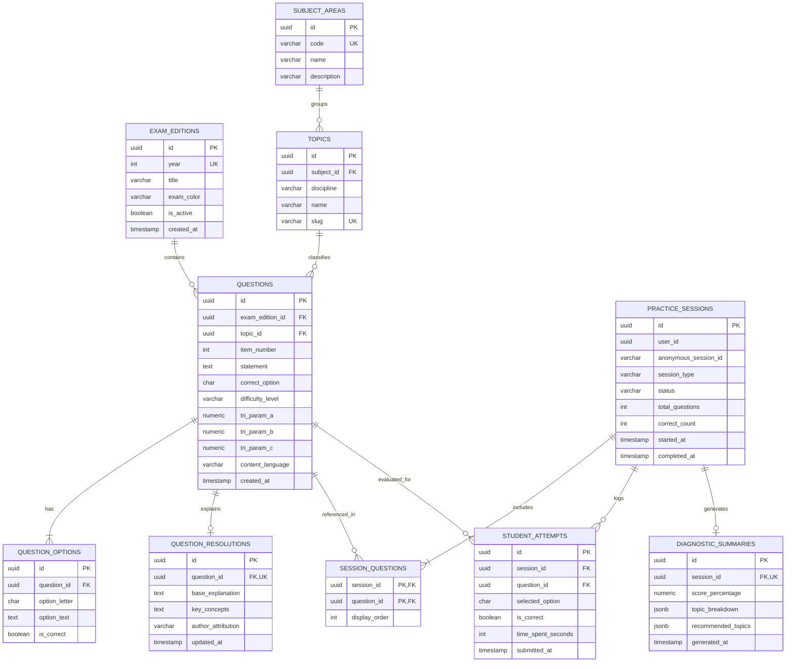

# Data Modeling & Persistence Architecture — AprovaENEM

> **Database Engine**: PostgreSQL 16  
> **Key Strategy**: UUIDv7 for distributed time-ordered primary keys  
> **Normalization Standard**: Third Normal Form (3NF) with specialized indexing for high-concurrency read queries  

---

## 1. Conceptual Data Model & Domain Boundaries

The persistence layer is split across two database boundaries to maintain microservice autonomy:
1. **`auth_db`**: Manages user credentials, roles, and anonymous session mapping.
2. **`exam_db`**: Manages the INEP exam catalog, question taxonomy, practice sessions, student attempt submissions, and diagnostic analytics.


---

## 2. Entity-Relationship (ER) Diagram



---

## 3. Physical DDL Specifications (PostgreSQL 16)

### 3.1 Auth Database (`auth_db`)

```sql
-- Enable UUID extension
CREATE EXTENSION IF NOT EXISTS "uuid-ossp";

-- Users Table
CREATE TABLE users (
    id UUID PRIMARY KEY DEFAULT gen_random_uuid(),
    email VARCHAR(255) NOT NULL UNIQUE,
    password_hash VARCHAR(255) NOT NULL,
    full_name VARCHAR(150) NOT NULL,
    school_type VARCHAR(50) NOT NULL DEFAULT 'PUBLIC_SCHOOL',
    target_degree VARCHAR(100),
    is_active BOOLEAN NOT NULL DEFAULT TRUE,
    created_at TIMESTAMP WITH TIME ZONE NOT NULL DEFAULT CURRENT_TIMESTAMP,
    updated_at TIMESTAMP WITH TIME ZONE NOT NULL DEFAULT CURRENT_TIMESTAMP
);

-- Anonymous Session Linkage
CREATE TABLE anonymous_sessions (
    id UUID PRIMARY KEY DEFAULT gen_random_uuid(),
    session_uuid VARCHAR(64) NOT NULL UNIQUE,
    claimed_by_user_id UUID REFERENCES users(id) ON DELETE SET NULL,
    ip_hash VARCHAR(64),
    created_at TIMESTAMP WITH TIME ZONE NOT NULL DEFAULT CURRENT_TIMESTAMP,
    last_active_at TIMESTAMP WITH TIME ZONE NOT NULL DEFAULT CURRENT_TIMESTAMP
);

CREATE INDEX idx_anonymous_session_uuid ON anonymous_sessions(session_uuid);

-- Gamification Profiles (Level, XP, Daily Goals & Streaks)
CREATE TABLE user_gamification_profiles (
    user_id UUID PRIMARY KEY REFERENCES users(id) ON DELETE CASCADE,
    current_level INT NOT NULL DEFAULT 1,
    current_xp INT NOT NULL DEFAULT 0,
    streak_days INT NOT NULL DEFAULT 0,
    streak_freeze_available INT NOT NULL DEFAULT 1, -- 1 emergency streak freeze per month
    last_activity_date DATE,
    daily_goal_questions INT NOT NULL DEFAULT 10,
    daily_questions_completed INT NOT NULL DEFAULT 0,
    daily_goal_reached_at TIMESTAMP WITH TIME ZONE,
    opt_in_reminders BOOLEAN NOT NULL DEFAULT TRUE,
    created_at TIMESTAMP WITH TIME ZONE NOT NULL DEFAULT CURRENT_TIMESTAMP,
    updated_at TIMESTAMP WITH TIME ZONE NOT NULL DEFAULT CURRENT_TIMESTAMP
);

-- Weekly Leaderboard Tiers (Resets every Sunday at 23:59 BRT)
CREATE TABLE weekly_leaderboards (
    id UUID PRIMARY KEY DEFAULT gen_random_uuid(),
    user_id UUID NOT NULL REFERENCES users(id) ON DELETE CASCADE,
    week_number INT NOT NULL,
    year INT NOT NULL,
    league_tier VARCHAR(20) NOT NULL DEFAULT 'BRONZE', -- BRONZE, SILVER, GOLD, DIAMOND
    weekly_xp INT NOT NULL DEFAULT 0,
    questions_solved INT NOT NULL DEFAULT 0,
    rank_position INT,
    created_at TIMESTAMP WITH TIME ZONE NOT NULL DEFAULT CURRENT_TIMESTAMP,
    updated_at TIMESTAMP WITH TIME ZONE NOT NULL DEFAULT CURRENT_TIMESTAMP,
    CONSTRAINT uq_user_week UNIQUE (user_id, week_number, year)
);

-- Student Badges & Achievements
CREATE TABLE user_achievements (
    id UUID PRIMARY KEY DEFAULT gen_random_uuid(),
    user_id UUID NOT NULL REFERENCES users(id) ON DELETE CASCADE,
    badge_code VARCHAR(50) NOT NULL, -- 'STREAK_7_DAYS', 'MATH_WIZARD_50', 'FIRST_SIMULADO', 'LEVEL_10'
    unlocked_at TIMESTAMP WITH TIME ZONE NOT NULL DEFAULT CURRENT_TIMESTAMP,
    CONSTRAINT uq_user_badge UNIQUE (user_id, badge_code)
);
```

---

### 3.2 Examination & Assessment Database (`exam_db`)

```sql
-- Enable UUID and Vector extensions
CREATE EXTENSION IF NOT EXISTS "uuid-ossp";
CREATE EXTENSION IF NOT EXISTS vector;

-- Exam Editions (e.g., ENEM 2023 Regular)
CREATE TABLE exam_editions (
    id UUID PRIMARY KEY DEFAULT gen_random_uuid(),
    year INT NOT NULL,
    title VARCHAR(100) NOT NULL,
    exam_color VARCHAR(30) NOT NULL DEFAULT 'BLUE',
    is_active BOOLEAN NOT NULL DEFAULT TRUE,
    created_at TIMESTAMP WITH TIME ZONE NOT NULL DEFAULT CURRENT_TIMESTAMP,
    CONSTRAINT uq_exam_year_color UNIQUE (year, exam_color)
);

-- Subject Areas (e.g., MATHEMATICS, NATURAL_SCIENCES)
CREATE TABLE subject_areas (
    id UUID PRIMARY KEY DEFAULT gen_random_uuid(),
    code VARCHAR(50) NOT NULL UNIQUE,
    name VARCHAR(100) NOT NULL,
    description TEXT
);

-- Topics & Disciplines (e.g., Physics -> Optics)
CREATE TABLE topics (
    id UUID PRIMARY KEY DEFAULT gen_random_uuid(),
    subject_id UUID NOT NULL REFERENCES subject_areas(id) ON DELETE RESTRICT,
    discipline VARCHAR(50) NOT NULL,
    name VARCHAR(100) NOT NULL,
    slug VARCHAR(120) NOT NULL UNIQUE,
    created_at TIMESTAMP WITH TIME ZONE NOT NULL DEFAULT CURRENT_TIMESTAMP
);

-- Questions (The Core Examination Asset)
CREATE TABLE questions (
    id UUID PRIMARY KEY DEFAULT gen_random_uuid(),
    exam_edition_id UUID NOT NULL REFERENCES exam_editions(id) ON DELETE RESTRICT,
    topic_id UUID NOT NULL REFERENCES topics(id) ON DELETE RESTRICT,
    item_number INT NOT NULL,
    statement TEXT NOT NULL,
    correct_option CHAR(1) NOT NULL CHECK (correct_option IN ('A', 'B', 'C', 'D', 'E')),
    difficulty_level VARCHAR(20) NOT NULL CHECK (difficulty_level IN ('EASY', 'MEDIUM', 'HARD')),
    tri_param_a NUMERIC(5, 3), -- Discrimination parameter
    tri_param_b NUMERIC(5, 3), -- Difficulty parameter
    tri_param_c NUMERIC(5, 3), -- Guessing parameter
    content_language VARCHAR(10) NOT NULL DEFAULT 'pt-BR',
    created_at TIMESTAMP WITH TIME ZONE NOT NULL DEFAULT CURRENT_TIMESTAMP,
    CONSTRAINT uq_edition_item UNIQUE (exam_edition_id, item_number)
);

-- Multiple Choice Options (A, B, C, D, E)
CREATE TABLE question_options (
    id UUID PRIMARY KEY DEFAULT gen_random_uuid(),
    question_id UUID NOT NULL REFERENCES questions(id) ON DELETE CASCADE,
    option_letter CHAR(1) NOT NULL CHECK (option_letter IN ('A', 'B', 'C', 'D', 'E')),
    option_text TEXT NOT NULL,
    is_correct BOOLEAN NOT NULL DEFAULT FALSE,
    CONSTRAINT uq_question_option UNIQUE (question_id, option_letter)
);

-- Curated Explanations & Step-by-Step Resolutions
CREATE TABLE question_resolutions (
    id UUID PRIMARY KEY DEFAULT gen_random_uuid(),
    question_id UUID NOT NULL UNIQUE REFERENCES questions(id) ON DELETE CASCADE,
    base_explanation TEXT NOT NULL,
    key_concepts TEXT,
    author_attribution VARCHAR(100) DEFAULT 'INEP Official Guidelines / Open Educational Resource',
    updated_at TIMESTAMP WITH TIME ZONE NOT NULL DEFAULT CURRENT_TIMESTAMP
);

-- Practice Sessions (Exam Simulations or Custom Quizzes)
CREATE TABLE practice_sessions (
    id UUID PRIMARY KEY DEFAULT gen_random_uuid(),
    user_id UUID,
    anonymous_session_id VARCHAR(64) NOT NULL,
    session_type VARCHAR(30) NOT NULL CHECK (session_type IN ('TOPIC_PRACTICE', 'EXAM_SIMULATION', 'DIAGNOSTIC_QUICK')),
    status VARCHAR(20) NOT NULL DEFAULT 'IN_PROGRESS' CHECK (status IN ('IN_PROGRESS', 'COMPLETED', 'ABANDONED')),
    total_questions INT NOT NULL,
    correct_count INT NOT NULL DEFAULT 0,
    started_at TIMESTAMP WITH TIME ZONE NOT NULL DEFAULT CURRENT_TIMESTAMP,
    completed_at TIMESTAMP WITH TIME ZONE
);

-- Questions Included in a Specific Session
CREATE TABLE session_questions (
    session_id UUID NOT NULL REFERENCES practice_sessions(id) ON DELETE CASCADE,
    question_id UUID NOT NULL REFERENCES questions(id) ON DELETE RESTRICT,
    display_order INT NOT NULL,
    PRIMARY KEY (session_id, question_id)
);

-- Student Answers per Question Attempt
CREATE TABLE student_attempts (
    id UUID PRIMARY KEY DEFAULT gen_random_uuid(),
    session_id UUID NOT NULL REFERENCES practice_sessions(id) ON DELETE CASCADE,
    question_id UUID NOT NULL REFERENCES questions(id) ON DELETE RESTRICT,
    selected_option CHAR(1) NOT NULL CHECK (selected_option IN ('A', 'B', 'C', 'D', 'E')),
    is_correct BOOLEAN NOT NULL,
    time_spent_seconds INT NOT NULL DEFAULT 0,
    submitted_at TIMESTAMP WITH TIME ZONE NOT NULL DEFAULT CURRENT_TIMESTAMP,
    CONSTRAINT uq_session_question_attempt UNIQUE (session_id, question_id)
);

-- Generated Diagnostic Summaries & Skill Radar
CREATE TABLE diagnostic_summaries (
    id UUID PRIMARY KEY DEFAULT gen_random_uuid(),
    session_id UUID NOT NULL UNIQUE REFERENCES practice_sessions(id) ON DELETE CASCADE,
    score_percentage NUMERIC(5, 2) NOT NULL,
    topic_breakdown JSONB NOT NULL,
    recommended_topics JSONB NOT NULL,
    generated_at TIMESTAMP WITH TIME ZONE NOT NULL DEFAULT CURRENT_TIMESTAMP
);

-- Phase 2 Future Schema: Premium Essay Evaluation & OCR (Redação Nota 1000)
CREATE TABLE essay_prompts (
    id UUID PRIMARY KEY DEFAULT gen_random_uuid(),
    year INT NOT NULL,
    theme VARCHAR(255) NOT NULL,
    motivating_texts JSONB NOT NULL,
    created_at TIMESTAMP WITH TIME ZONE NOT NULL DEFAULT CURRENT_TIMESTAMP
);

CREATE TABLE student_essays (
    id UUID PRIMARY KEY DEFAULT gen_random_uuid(),
    user_id UUID NOT NULL,
    essay_prompt_id UUID NOT NULL REFERENCES essay_prompts(id) ON DELETE RESTRICT,
    image_storage_url VARCHAR(500) NOT NULL,
    transcribed_text TEXT,
    status VARCHAR(30) NOT NULL DEFAULT 'PROCESSING', -- PROCESSING, EVALUATED, FAILED
    total_score INT CHECK (total_score BETWEEN 0 AND 1000),
    general_feedback TEXT,
    created_at TIMESTAMP WITH TIME ZONE NOT NULL DEFAULT CURRENT_TIMESTAMP
);

CREATE TABLE essay_competency_evaluations (
    id UUID PRIMARY KEY DEFAULT gen_random_uuid(),
    essay_id UUID NOT NULL REFERENCES student_essays(id) ON DELETE CASCADE,
    competency_number INT NOT NULL CHECK (competency_number BETWEEN 1 AND 5),
    score INT NOT NULL CHECK (score BETWEEN 0 AND 200 AND score % 40 = 0),
    feedback TEXT NOT NULL,
    actionable_tips TEXT,
    CONSTRAINT uq_essay_competency UNIQUE (essay_id, competency_number)
);

-- RAG & Vector Knowledge Base (Pedagogical Reference Materials & Redação Rubrics)
CREATE TABLE knowledge_documents (
    id UUID PRIMARY KEY DEFAULT gen_random_uuid(),
    title VARCHAR(255) NOT NULL,
    source_type VARCHAR(50) NOT NULL, -- 'INEP_MATRIZ', 'STEP_RESOLUTION', 'DISTRACTOR_CATALOG', 'REDAÇÃO_RUBRIC'
    topic_id UUID REFERENCES topics(id) ON DELETE SET NULL,
    created_at TIMESTAMP WITH TIME ZONE NOT NULL DEFAULT CURRENT_TIMESTAMP
);

CREATE TABLE knowledge_chunks (
    id UUID PRIMARY KEY DEFAULT gen_random_uuid(),
    document_id UUID NOT NULL REFERENCES knowledge_documents(id) ON DELETE CASCADE,
    chunk_index INT NOT NULL,
    content TEXT NOT NULL,
    metadata JSONB NOT NULL DEFAULT '{}'::jsonb,
    embedding vector(768) NOT NULL,
    created_at TIMESTAMP WITH TIME ZONE NOT NULL DEFAULT CURRENT_TIMESTAMP,
    CONSTRAINT uq_document_chunk UNIQUE (document_id, chunk_index)
);
```

---

## 4. Indexing Strategy & Performance Optimization

To achieve the **`p95 < 100ms`** read requirement for quiz generation and filtering, the following specialized PostgreSQL B-Tree, GIN, and HNSW indexes are deployed:

```sql
-- 1. Filter Questions by Topic, Difficulty and Language (Quiz Generator Hot Query)
CREATE INDEX idx_questions_topic_diff_lang 
ON questions (topic_id, difficulty_level, content_language);

-- 2. Filter Questions by Exam Edition
CREATE INDEX idx_questions_edition_item 
ON questions (exam_edition_id, item_number);

-- 3. Lookup Question Options by Question ID (Composite Foreign Key Fetch)
CREATE INDEX idx_question_options_lookup 
ON question_options (question_id, option_letter);

-- 4. Session Lookup by Anonymous Session ID or User ID
CREATE INDEX idx_practice_sessions_lookup 
ON practice_sessions (anonymous_session_id, status);

CREATE INDEX idx_practice_sessions_user 
ON practice_sessions (user_id) 
WHERE user_id IS NOT NULL;

-- 5. Student Attempts Retrieval by Session
CREATE INDEX idx_student_attempts_session 
ON student_attempts (session_id, is_correct);

-- 6. GIN Index on Diagnostic JSONB Breakdown
CREATE INDEX idx_diagnostic_topic_breakdown_gin 
ON diagnostic_summaries USING GIN (topic_breakdown);

-- 7. HNSW Vector Index for Semantic Cosine Search (Sub-5ms RAG Retrieval)
CREATE INDEX idx_knowledge_chunks_hnsw 
ON knowledge_chunks 
USING hnsw (embedding vector_cosine_ops) 
WITH (m = 16, ef_construction = 64);

-- 8. Weekly Leaderboard League Query (Sub-5ms Rank Filtering)
CREATE INDEX idx_weekly_leaderboards_league_xp 
ON weekly_leaderboards (year, week_number, league_tier, weekly_xp DESC);
```

---

## 5. Storage Capacity & Sizing Estimation

Applying the back-of-the-envelope estimation rules:

### Question Bank Volume (17 Years of Modern ENEM: 2009–2025)
- Annual ENEM Questions: 180 questions / year (45 per area).
- 17 Years (2009–2025): $17 \times 180 = 3,060\text{ questions}$.
- Including Second Application / PPL: $3,060 \times 2 \approx \mathbf{6,120\text{ total questions}}$.
- Average question payload (statement + 5 options + LaTeX): $\approx 4\text{ KB}$.
- Total Question Catalog Size: $6,120 \times 4\text{ KB} \approx \mathbf{24.5\text{ MB}}$.
- **Conclusion**: The entire question bank easily fits into PostgreSQL RAM buffers (`shared_buffers`), guaranteeing instant $O(1)$ in-memory index scans!

### Student Attempt Volume (Daily Active Scale)
- Expected Daily Active Users (DAU): $10,000\text{ students}$.
- Average questions practiced per user / day: $15\text{ questions}$.
- Daily Attempt Rows: $10,000 \times 15 = 150,000\text{ rows / day}$.
- Size per attempt row: $\approx 120\text{ bytes}$.
- Daily Attempt Volume: $150,000 \times 120\text{ bytes} \approx 18\text{ MB / day}$.
- 1-Year Attempt Storage: $18\text{ MB} \times 365 \approx \mathbf{6.57\text{ GB / year}}$.
- **Conclusion**: Readily handled by a single standard PostgreSQL node with zero sharding required for early and mid-stage operations.

---

## 6. Database Migration & ORM Strategy

### 6.1 Database Migration Tool: Flyway
To guarantee immutable, auditable, and automated schema evolution across development, CI/CD, and production, AprovaENEM utilizes **Flyway** (`flyway-core` + `flyway-database-postgresql`):

1. **Versioning Convention**:
   - Location: `src/main/resources/db/migration/`
   - Format: `V<Major>__<Description>.sql` (e.g., `V1__init_auth_schema.sql`, `V1__init_exam_schema.sql`, `V2__add_vector_knowledge_base.sql`)
   - Repeatable scripts for seed data: `R__seed_enem_taxonomy.sql`
2. **Schema Safety & Governance**:
   - **`spring.jpa.hibernate.ddl-auto=validate`**: Hibernate auto-DDL (`update` / `create`) is strictly disabled across all environments to prevent accidental column drops, unintended data loss, or unindexed foreign keys.
   - Flyway executes schema migrations deterministically before Spring Boot's `EntityManagerFactory` initializes.
   - All migrations are verified against real PostgreSQL 16 instances in CI using Testcontainers before pull requests merge.

### 6.2 ORM Strategy: Spring Data JPA (Hibernate 6) within Hexagonal Architecture
AprovaENEM pairs **Spring Data JPA / Hibernate 6** with Hexagonal Architecture (Ports and Adapters) to achieve high developer velocity without tight coupling:

```mermaid
flowchart LR
    subgraph DomainCore ["Core Domain (Framework-Agnostic)"]
        DomainModel["Pure Domain Entity<br/>(`Question.java`)<br/>• 0 JPA annotations<br/>• Encapsulates TRI logic & scoring"]
        OutboundPort["Outbound Repository Port<br/>(`QuestionRepositoryPort.java`)"]
    end

    subgraph PersistenceAdapter ["Outbound Persistence Adapter (Infrastructure)"]
        Adapter["PostgresQuestionAdapter<br/>implements `QuestionRepositoryPort`"]
        Mapper["Entity Mapper<br/>(`QuestionEntityMapper`)"]
        JpaEntity["Spring Data JPA Entity<br/>(`QuestionJpaEntity.java`)<br/>• @Entity, @Table, @Id<br/>• Column mappings & foreign keys"]
        SpringDataRepo["Spring Data Repository<br/>(`QuestionJpaRepository`)<br/>extends JpaRepository"]
    end

    OutboundPort <|.. Adapter
    Adapter --> Mapper
    Mapper --> JpaEntity
    Adapter --> SpringDataRepo
    SpringDataRepo --> Postgres[("PostgreSQL 16 + pgvector")]
```

#### Key ORM Design Principles:
1. **Decoupled Domain Entities**: Core domain models (`Question`, `PracticeSession`, `ExamEdition`) are pure Java POJOs containing business logic and invariants with **zero Jakarta Persistence (`@Entity`) dependencies**.
2. **Dedicated Persistence Entities**: `infrastructure/.../entity/` contains specialized `@Entity` classes (`QuestionJpaEntity`) optimized for Hibernate mapping, proxying, and caching.
3. **Bidirectional Mapping**: Explicit mappers (`MapStruct` or dedicated mapper classes) convert between JPA Entities and Pure Domain Models at the adapter boundary, preventing Hibernate lazy loading leaks (`LazyInitializationException`) or persistence state pollution in business logic.
4. **Vector Search Integration**: Vector similarity queries (`<=>`) are executed via native SQL queries within Spring Data repositories or through Spring AI's `PgVectorStore`.
