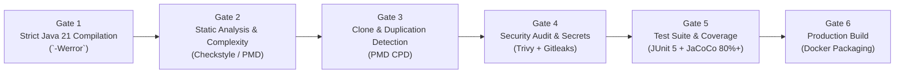

# Automated Quality Gate & CI/CD Specification

> **Quality Standard**: 1:1 Parity with [CV_Maker Quality Gate](file:///home/verivi/Veras/Projects/CV_Maker/.github/workflows/quality-gate.yml)  
> **Target Runtime**: Java 21 LTS + Apache Maven  
> **Enforcement Mechanism**: GitHub Actions Automated CI Workflow  

---

## 1. The 6-Stage Quality Gate Overview

To match the engineering rigor established in `CV_Maker`, AprovaENEM enforces a **strict, multi-stage automated verification pipeline**. Every Pull Request and commit to `main` must pass all gates before merge.



| Gate | Tool / Engine | Pass Threshold / Enforcement Policy |
| :--- | :--- | :--- |
| **Gate 1: Compilation** | `javac` via Maven Compiler Plugin | Zero warnings allowed: `-Werror`, `-Xlint:all`. Compiler treats all warnings as fatal errors. |
| **Gate 2: Static Analysis** | Checkstyle + PMD | • Google Java Style rules enforced.<br>• Cyclomatic Complexity per method $\le 12$.<br>• Method line count $\le 50$ lines; class line count $\le 350$ lines. |
| **Gate 3: Code Duplication** | PMD CPD (Copy/Paste Detector) | Duplication threshold $< 3\%$. Flags any duplicated token blocks $> 75$ tokens. |
| **Gate 4: Security & CVE Audit** | Trivy + Gitleaks Action | • 0 Critical / High CVEs in dependencies.<br>• Complete commit history scanned for leaked API keys, Gemini tokens, and credentials. |
| **Gate 5: Automated Testing** | JUnit 5 + JaCoCo Maven Plugin | • 100% unit tests passing.<br>• Minimum **80% line coverage** and **75% branch coverage** enforced by JaCoCo check rule. |
| **Gate 6: Build Verification** | Docker Buildx / Spring Boot Buildpack | Clean production container image builds with zero host system dependencies. |

---

## 2. Maven Quality Gate Plugins Configuration (`pom.xml`)

### 2.1 Compiler Warnings Enforcement
```xml
<plugin>
    <groupId>org.apache.maven.plugins</groupId>
    <artifactId>maven-compiler-plugin</artifactId>
    <version>3.13.0</version>
    <configuration>
        <release>21</release>
        <compilerArgs>
            <arg>-Werror</arg>
            <arg>-Xlint:all</arg>
            <arg>-Xlint:-processing</arg>
        </compilerArgs>
    </configuration>
</plugin>
```

### 2.2 JaCoCo Coverage Threshold Enforcement
```xml
<plugin>
    <groupId>org.jacoco</groupId>
    <artifactId>jacoco-maven-plugin</artifactId>
    <version>0.8.12</version>
    <executions>
        <execution>
            <id>prepare-agent</id>
            <goals><goal>prepare-agent</goal></goals>
        </execution>
        <execution>
            <id>check-coverage</id>
            <goals><goal>check</goal></goals>
            <configuration>
                <rules>
                    <rule>
                        <element>BUNDLE</element>
                        <limits>
                            <limit>
                                <counter>LINE</counter>
                                <value>COVEREDRATIO</value>
                                <minimum>0.80</minimum>
                            </limit>
                            <limit>
                                <counter>BRANCH</counter>
                                <value>COVEREDRATIO</value>
                                <minimum>0.75</minimum>
                            </limit>
                        </limits>
                    </rule>
                </rules>
            </configuration>
        </execution>
    </executions>
</plugin>
```

---

## 3. GitHub Actions CI Workflow (`.github/workflows/quality-gate.yml`)

```yaml
name: Quality Gate & Automated CI

on:
  push:
    branches: [ main, develop ]
  pull_request:
    branches: [ main ]

jobs:
  code-quality-and-test:
    name: Code Quality, Audit & Test Gates
    runs-on: ubuntu-latest

    services:
      postgres:
        image: postgres:16-alpine
        env:
          POSTGRES_USER: test_user
          POSTGRES_PASSWORD: test_password
          POSTGRES_DB: test_db
        ports:
          - 5432:5432
        options: >-
          --health-cmd pg_isready
          --health-interval 10s
          --health-timeout 5s
          --health-retries 5

    steps:
      - name: Checkout Source Code
        uses: actions/checkout@v4

      - name: Set up OpenJDK 21
        uses: actions/setup-java@v4
        with:
          java-version: '21'
          distribution: 'temurin'
          cache: 'maven'

      - name: 'Gate 1: Strict Compilation (-Werror)'
        run: mvn clean compile -DskipTests

      - name: 'Gate 2: Static Analysis & Cyclomatic Complexity (Checkstyle & PMD)'
        run: mvn checkstyle:check pmd:check

      - name: 'Gate 3: Code Duplication Detection (PMD CPD)'
        run: mvn pmd:cpd-check

      - name: 'Gate 4: Security Dependency Audit (Trivy Vulnerability Scan)'
        uses: aquasecurity/trivy-action@master
        with:
          scan-type: 'fs'
          ignore-unfixed: true
          severity: 'CRITICAL,HIGH'
          exit-code: '1'

      - name: 'Gate 5: Automated Unit & Integration Tests (JaCoCo 80%+ Coverage)'
        run: mvn verify -Dspring.profiles.active=test

      - name: 'Gate 6: Production Container Build Verification'
        run: docker compose build

  security-secret-scan:
    name: 'Gate 4b: Security Gate (Gitleaks Secret Scanning)'
    runs-on: ubuntu-latest

    steps:
      - name: Checkout Full Git History
        uses: actions/checkout@v4
        with:
          fetch-depth: 0

      - name: Scan Repository for Secrets & Tokens
        uses: gitleaks/gitleaks-action@v2
        env:
          GITHUB_TOKEN: ${{ secrets.GITHUB_TOKEN }}
```
