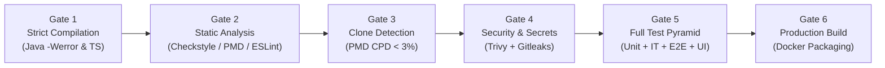
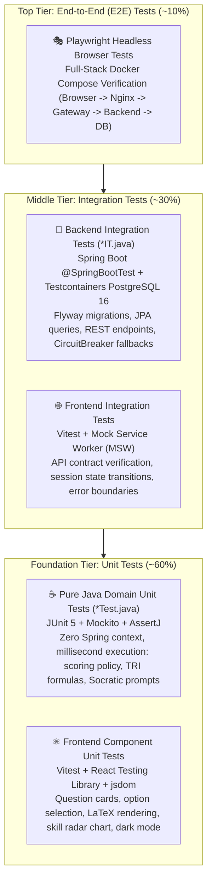

# Automated Quality Gate & Full-Stack Testing Specification

> **Quality Standard**: 1:1 Parity with [CV_Maker Quality Gate](file:///home/verivi/Veras/Projects/CV_Maker/.github/workflows/quality-gate.yml)  
> **Testing Scope**: Comprehensive Test Pyramid (Unit Tests, Integration Tests, End-to-End Tests, and Frontend Component Tests)  
> **Target Runtimes**: Java 21 LTS + Apache Maven | Node.js 20 LTS + Vite/React 18 | Playwright Headless  
> **Enforcement Mechanism**: GitHub Actions Multi-Job CI Workflow  

---

## 1. The 6-Stage Quality Gate Overview

To match the engineering rigor established in `CV_Maker`, AprovaENEM enforces a **strict, multi-stage automated verification pipeline**. Every Pull Request and commit to `main` must pass all gates across both backend and frontend tiers before merge.



| Gate | Tool / Engine | Pass Threshold / Enforcement Policy |
| :--- | :--- | :--- |
| **Gate 1: Compilation** | `javac` via Maven Compiler Plugin & `tsc --noEmit` | • Java: Zero warnings allowed (`-Werror`, `-Xlint:all`). All warnings fatal.<br>• TypeScript: Strict mode enabled (`strict: true`, zero `any`). |
| **Gate 2: Static Analysis** | Checkstyle + PMD + ESLint | • Google Java Style rules enforced.<br>• Cyclomatic Complexity per method $\le 12$.<br>• Method line count $\le 50$ lines; class line count $\le 350$ lines.<br>• ESLint zero warnings for React/TypeScript frontend. |
| **Gate 3: Code Duplication** | PMD CPD (Copy/Paste Detector) | Duplication threshold $< 3\%$. Flags any duplicated token blocks $> 75$ tokens. |
| **Gate 4: Security & CVE Audit** | Trivy + Gitleaks Action | • 0 Critical / High CVEs in dependencies.<br>• Complete git commit history scanned for leaked API keys, tokens, and credentials. |
| **Gate 5: Full Test Pyramid** | JUnit 5 + JaCoCo + Vitest + Playwright | • **Unit Tests**: 100% passing across domain and UI components.<br>• **Integration Tests**: Spring Boot + Testcontainers PostgreSQL passing.<br>• **Unified Backend Coverage**: $\ge 80\%$ line, $\ge 75\%$ branch (JaCoCo merged across Unit + IT).<br>• **Frontend Coverage**: $\ge 80\%$ statement/line coverage (Vitest).<br>• **E2E Tests**: 100% passing across simulated student user flows. |
| **Gate 6: Build Verification** | Docker Buildx / Docker Compose | Clean production container image builds with zero host system dependencies. |

---

## 2. Full-Stack Testing Pyramid Strategy

AprovaENEM rejects "unit-test-only" testing. A high-reliability educational platform serving students under spotty mobile conditions requires rigorous verification at every layer of the pyramid:



---

## 3. Backend Test Configuration & JaCoCo Unified Coverage

### 3.1 Separation of Unit Tests and Integration Tests in Maven
The build separates unit tests and integration tests using standard Maven conventions:
* **Unit Tests (`**/*Test.java`, `**/*UnitTest.java`)**: Pure Java, zero Spring context, executed by `maven-surefire-plugin` during the `test` phase.
* **Integration Tests (`**/*IT.java`, `**/*IntegrationTest.java`)**: Spin up real PostgreSQL 16 containers via Testcontainers, executed by `maven-failsafe-plugin` during the `integration-test` and `verify` phases.

### 3.2 Maven Compiler Configuration (`pom.xml`)
```xml
<plugin>
    <groupId>org.apache.maven.plugins</groupId>
    <artifactId>maven-compiler-plugin</artifactId>
    <version>3.13.0</version>
    <configuration>
        <release>21</release>
        <compilerArgs>
            <arg>-Werror</arg>
            <arg>-Xlint:all</arg>
            <arg>-Xlint:-processing</arg>
        </compilerArgs>
    </configuration>
</plugin>
```

### 3.3 Maven Surefire & Failsafe Plugins (`pom.xml`)
```xml
<!-- Unit Tests Runner -->
<plugin>
    <groupId>org.apache.maven.plugins</groupId>
    <artifactId>maven-surefire-plugin</artifactId>
    <version>3.2.5</version>
    <configuration>
        <includes>
            <include>**/*Test.java</include>
            <include>**/*UnitTest.java</include>
        </includes>
        <excludes>
            <exclude>**/*IT.java</exclude>
            <exclude>**/*IntegrationTest.java</exclude>
        </excludes>
        <argLine>@{surefireArgLine} -XX:+EnableDynamicAgentLoading -Xshare:off</argLine>
    </configuration>
</plugin>

<!-- Integration Tests Runner (Testcontainers & Spring Context) -->
<plugin>
    <groupId>org.apache.maven.plugins</groupId>
    <artifactId>maven-failsafe-plugin</artifactId>
    <version>3.2.5</version>
    <configuration>
        <includes>
            <include>**/*IT.java</include>
            <include>**/*IntegrationTest.java</include>
        </includes>
        <argLine>@{failsafeArgLine} -XX:+EnableDynamicAgentLoading -Xshare:off</argLine>
    </configuration>
    <executions>
        <execution>
            <goals>
                <goal>integration-test</goal>
                <goal>verify</goal>
            </goals>
        </execution>
    </executions>
</plugin>
```

### 3.4 JaCoCo Unified Coverage Configuration (`pom.xml`)
To prevent coverage blind spots, JaCoCo is configured to record **both** unit tests (`jacoco-ut.exec`) and integration tests (`jacoco-it.exec`), merge them into a single file (`jacoco.exec`), and enforce the **80% line / 75% branch** threshold on the merged result.

```xml
<plugin>
    <groupId>org.jacoco</groupId>
    <artifactId>jacoco-maven-plugin</artifactId>
    <version>0.8.12</version>
    <executions>
        <!-- 1. Attach agent to Surefire (Unit Tests) -->
        <execution>
            <id>prepare-unit-tests</id>
            <goals><goal>prepare-agent</goal></goals>
            <configuration>
                <destFile>${project.build.directory}/jacoco-ut.exec</destFile>
                <propertyName>surefireArgLine</propertyName>
            </configuration>
        </execution>

        <!-- 2. Attach agent to Failsafe (Integration Tests) -->
        <execution>
            <id>prepare-integration-tests</id>
            <phase>pre-integration-test</phase>
            <goals><goal>prepare-agent-integration</goal></goals>
            <configuration>
                <destFile>${project.build.directory}/jacoco-it.exec</destFile>
                <propertyName>failsafeArgLine</propertyName>
            </configuration>
        </execution>

        <!-- 3. Merge Unit and Integration execution data -->
        <execution>
            <id>merge-test-data</id>
            <phase>post-integration-test</phase>
            <goals><goal>merge</goal></goals>
            <configuration>
                <fileSets>
                    <fileSet>
                        <directory>${project.build.directory}</directory>
                        <includes>
                            <include>jacoco-ut.exec</include>
                            <include>jacoco-it.exec</include>
                        </includes>
                    </fileSet>
                </fileSets>
                <destFile>${project.build.directory}/jacoco.exec</destFile>
            </configuration>
        </execution>

        <!-- 4. Generate Unified HTML/XML Report -->
        <execution>
            <id>generate-unified-report</id>
            <phase>verify</phase>
            <goals><goal>report</goal></goals>
            <configuration>
                <dataFile>${project.build.directory}/jacoco.exec</dataFile>
                <outputDirectory>${project.reporting.outputDirectory}/jacoco-unified</outputDirectory>
            </configuration>
        </execution>

        <!-- 5. Enforce 80% Line and 75% Branch Thresholds -->
        <execution>
            <id>enforce-coverage-threshold</id>
            <phase>verify</phase>
            <goals><goal>check</goal></goals>
            <configuration>
                <dataFile>${project.build.directory}/jacoco.exec</dataFile>
                <rules>
                    <rule>
                        <element>BUNDLE</element>
                        <limits>
                            <limit>
                                <counter>LINE</counter>
                                <value>COVEREDRATIO</value>
                                <minimum>0.80</minimum>
                            </limit>
                            <limit>
                                <counter>BRANCH</counter>
                                <value>COVEREDRATIO</value>
                                <minimum>0.75</minimum>
                            </limit>
                        </limits>
                    </rule>
                </rules>
                <excludes>
                    <!-- Exclude configuration, DTO records, and application entry points -->
                    <exclude>**/com/openenem/**/Application.*</exclude>
                    <exclude>**/com/openenem/**/config/**</exclude>
                    <exclude>**/com/openenem/**/dto/**</exclude>
                </excludes>
            </configuration>
        </execution>
    </executions>
</plugin>
```

---

## 4. Frontend Testing Strategy (`frontend/`)

### 4.1 Unit & Component Testing (Vitest + React Testing Library)
* **Framework**: Vitest (fast native Vite test runner) + jsdom.
* **Component Testing**: `@testing-library/react` and `@testing-library/user-event` simulating student keyboard navigation, option picking, and UI clicks.
* **Coverage Engine**: `@vitest/coverage-v8` enforcing **80%+ statement and line coverage**.

#### `vitest.config.ts`
```typescript
import { defineConfig } from 'vitest/config';
import react from '@vitejs/plugin-react';

export default defineConfig({
  plugins: [react()],
  test: {
    globals: true,
    environment: 'jsdom',
    setupFiles: ['./src/setupTests.ts'],
    coverage: {
      provider: 'v8',
      reporter: ['text', 'html', 'lcov'],
      statements: 80,
      lines: 80,
      functions: 80,
      branches: 75,
      exclude: ['src/main.tsx', 'src/vite-env.d.ts', '**/*.test.{ts,tsx}']
    }
  }
});
```

### 4.2 Frontend Integration Testing (Mock Service Worker - MSW)
* MSW intercepts `fetch`/`axios` requests at the network layer in test execution.
* Verifies component resilience:
  - Validates correct rendering when API returns HTTP 429 Rate Limit.
  - Verifies fallback rendering when Socratic AI Tutor returns a static curated explanation.
  - Validates diagnostic radar computation rendering from backend JSON payloads.

---

## 5. Full-Stack End-to-End (E2E) Testing (Playwright)

### 5.1 Architecture & Scope
Playwright runs headless browser tests against the live Docker Compose environment (`http://localhost`). It tests complete, multi-step student scenarios:

1. **Student Practice Journey**:
   - Navigate to `http://localhost`.
   - Start an anonymous practice session (5 questions, Mathematics).
   - Select option `C` on question 1; verify instant feedback displays explanation.
   - Click *"Ask Socratic Tutor"*; verify AI concept drawer slides in and streaming response appears.
   - Complete the quiz; verify the **Diagnostic Skill Radar** renders with `MASTERED` / `ATTENTION_NEEDED` sections.

2. **Network Resilience & Edge Rate Limiting**:
   - Automated client fires burst requests to `/api/v1/questions/1/ask`.
   - Verify UI gracefully handles HTTP 429 with countdown timer.

3. **Accessibility & Responsive Layout**:
   - Mobile viewport emulation (iPhone SE / Motorola Moto G: 375x667).
   - Verify high-contrast dark mode contrast ratio ($\ge 4.5:1$ WCAG AA).
   - Verify KaTeX math formulas render cleanly without horizontal overflow.

#### `playwright.config.ts`
```typescript
import { defineConfig, devices } from '@playwright/test';

export default defineConfig({
  testDir: './e2e',
  timeout: 30 * 1000,
  expect: { timeout: 5000 },
  fullyParallel: true,
  retries: 1,
  use: {
    baseURL: process.env.BASE_URL || 'http://localhost',
    trace: 'on-first-retry',
    screenshot: 'only-on-failure',
    video: 'retain-on-failure'
  },
  projects: [
    { name: 'Mobile Chrome', use: { ...devices['Pixel 5'] } },
    { name: 'Desktop Chrome', use: { ...devices['Desktop Chrome'] } }
  ]
});
```

---

## 6. Multi-Job GitHub Actions CI Workflow (`.github/workflows/quality-gate.yml`)

The automated CI workflow runs parallelized backend and frontend verification jobs, followed by an end-to-end integration gate running against Docker Compose:

```yaml
name: Quality Gate & Full-Stack CI

on:
  push:
    branches: [ main, develop ]
  pull_request:
    branches: [ main ]

jobs:
  # ==========================================================
  # JOB 1: BACKEND QUALITY & TESTS (Unit + IT + JaCoCo 80%+)
  # ==========================================================
  backend-quality-and-test:
    name: Backend Quality & Tests (Java 21)
    runs-on: ubuntu-latest

    services:
      postgres:
        image: postgres:16-alpine
        env:
          POSTGRES_USER: test_user
          POSTGRES_PASSWORD: test_password
          POSTGRES_DB: test_db
        ports:
          - 5432:5432
        options: >-
          --health-cmd pg_isready
          --health-interval 10s
          --health-timeout 5s
          --health-retries 5

    steps:
      - name: Checkout Source Code
        uses: actions/checkout@v4

      - name: Set up OpenJDK 21
        uses: actions/setup-java@v4
        with:
          java-version: '21'
          distribution: 'temurin'
          cache: 'maven'

      - name: 'Gate 1: Strict Compilation (-Werror)'
        run: mvn clean compile -DskipTests
        working-directory: ./backend

      - name: 'Gate 2: Static Analysis & Cyclomatic Complexity (Checkstyle & PMD)'
        run: mvn checkstyle:check pmd:check
        working-directory: ./backend

      - name: 'Gate 3: Code Duplication Detection (PMD CPD < 3%)'
        run: mvn pmd:cpd-check
        working-directory: ./backend

      - name: 'Gate 4: Security Dependency Audit (Trivy Vulnerability Scan)'
        uses: aquasecurity/trivy-action@master
        with:
          scan-type: 'fs'
          ignore-unfixed: true
          severity: 'CRITICAL,HIGH'
          exit-code: '1'

      - name: 'Gate 5a: Backend Unit & Integration Tests (JaCoCo 80%+ Merged)'
        run: mvn verify -Dspring.profiles.active=test
        working-directory: ./backend
        env:
          SPRING_DATASOURCE_URL: jdbc:postgresql://localhost:5432/test_db
          SPRING_DATASOURCE_USERNAME: test_user
          SPRING_DATASOURCE_PASSWORD: test_password

      - name: Upload Backend JaCoCo Coverage Report
        uses: actions/upload-artifact@v4
        with:
          name: backend-jacoco-report
          path: backend/**/target/site/jacoco-unified/

  # ==========================================================
  # JOB 2: FRONTEND QUALITY & TESTS (Vitest 80%+)
  # ==========================================================
  frontend-quality-and-test:
    name: Frontend Quality & Tests (Node 20)
    runs-on: ubuntu-latest

    steps:
      - name: Checkout Source Code
        uses: actions/checkout@v4

      - name: Set up Node.js 20
        uses: actions/setup-node@v4
        with:
          node-version: '20'
          cache: 'npm'
          cache-dependency-path: frontend/package-lock.json

      - name: Install Frontend Dependencies
        run: npm ci
        working-directory: ./frontend

      - name: 'Gate 1b: TypeScript Strict Type Check'
        run: npm run type-check
        working-directory: ./frontend

      - name: 'Gate 2b: ESLint Static Analysis'
        run: npm run lint
        working-directory: ./frontend

      - name: 'Gate 5b: Frontend Unit & Component Tests (Vitest 80%+ Coverage)'
        run: npm run test:coverage
        working-directory: ./frontend

      - name: Upload Frontend Coverage Report
        uses: actions/upload-artifact@v4
        with:
          name: frontend-coverage-report
          path: frontend/coverage/

  # ==========================================================
  # JOB 3: FULL-STACK E2E TEST (Playwright + Docker Compose)
  # ==========================================================
  e2e-quality-test:
    name: End-to-End Full-Stack Verification (Playwright)
    needs: [backend-quality-and-test, frontend-quality-and-test]
    runs-on: ubuntu-latest

    steps:
      - name: Checkout Source Code
        uses: actions/checkout@v4

      - name: Set up Docker Buildx
        uses: docker/setup-buildx-action@v3

      - name: Launch Full-Stack Ecosystem via Docker Compose
        run: |
          docker compose up -d --build
          echo "Waiting for all services to become healthy..."
          sleep 25
          curl --fail --retry 10 --retry-delay 3 http://localhost/health || exit 1

      - name: Set up Node.js for Playwright
        uses: actions/setup-node@v4
        with:
          node-version: '20'

      - name: Install Playwright Browsers
        run: npx playwright install --with-deps chromium

      - name: 'Gate 5c: Run Full-Stack Playwright E2E Suite'
        run: npx playwright test
        env:
          BASE_URL: http://localhost

      - name: Upload Playwright Test Report on Failure
        if: failure()
        uses: actions/upload-artifact@v4
        with:
          name: playwright-report
          path: playwright-report/

      - name: Teardown Docker Compose
        if: always()
        run: docker compose down -v

  # ==========================================================
  # JOB 4: SECURITY SECRET SCAN (Gitleaks)
  # ==========================================================
  security-secret-scan:
    name: Security Gate (Gitleaks Secret Audit)
    runs-on: ubuntu-latest

    steps:
      - name: Checkout Full Git History
        uses: actions/checkout@v4
        with:
          fetch-depth: 0

      - name: Scan Repository for Leaked Secrets & API Keys
        uses: gitleaks/gitleaks-action@v2
        env:
          GITHUB_TOKEN: ${{ secrets.GITHUB_TOKEN }}
```
