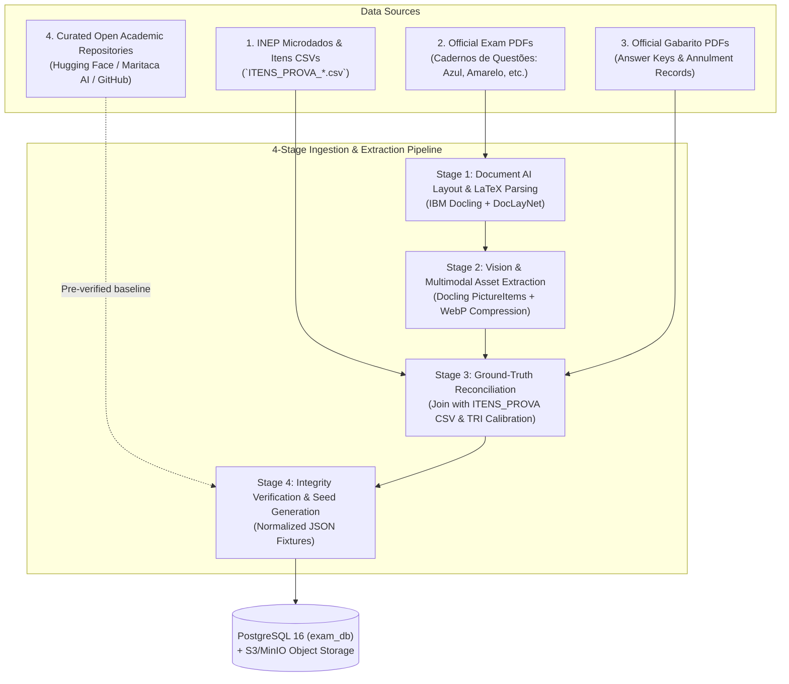
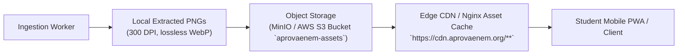

# Data Sourcing, Extraction & Ingestion Pipeline — AprovaENEM

> **Scope**: Extraction, normalization, and reconciliation of 17 years of ENEM examinations (2009–2025).  
> **Target Volume**: $\approx 6,120$ questions across all areas of knowledge (Regular, Second Application, and PPL).  
> **Core Principle**: Multimodal layout extraction paired with official government tabular ground truth.

---

## 1. Executive Summary: Are We Only Using PDFs?

**No. Relying exclusively on raw exam PDFs is inefficient and error-prone.**

Extracting exam questions solely from PDFs introduces severe pitfalls: complex mathematical formulas get garbled, multi-column layouts get scrambled, and Item Response Theory (TRI) statistical weights cannot be determined from question text alone.

To solve this, AprovaENEM employs a **Hybrid Triangulation Strategy** combining 4 authoritative sources:



---

## 2. Inventory of Data Sources

| Source | Format | Authority | What We Extract From It |
| :--- | :--- | :--- | :--- |
| **INEP Microdados (`ITENS_PROVA_*.csv`)** | CSV / Tabular | Official Gov (INEP) | • Ground-truth correct answers (`TX_GABARITO`)<br/>• Official Item Code (`CO_ITEM`)<br/>• Item Response Theory (TRI) parameters: Discrimination ($a$), Difficulty ($b$), Guessing ($c$)<br/>• Competency & Skill alignment ($H_1$ to $H_{30}$) |
| **Official Exam PDFs (*Cadernos de Questões*)** | Vector PDF | Official Gov (INEP) | • Complete question statements (*enunciados*)<br/>• Contextual reading passages and literary excerpts<br/>• Diagrams, charts, maps, and comics (*tirinhas*)<br/>• Alternatives A through E text |
| **Official Answer Key PDFs (*Gabaritos*)** | PDF | Official Gov (INEP) | • Color notebook mapping (Blue, Yellow, White, Pink, Gray)<br/>• Nullified/Annulled items (*questões anuladas*) confirmation |
| **Curated Open Academic Datasets** | JSON / Parquet | Open Science / Academic | • Pre-transcribed and verified text for older exam editions (2009–2022)<br/>• Accelerates historical bootstrap and provides cross-validation benchmark |

---

## 3. Technical Challenges of ENEM Exam PDFs

ENEM examination booklets present unique layout hurdles that break standard text extractors:

```
+-------------------------------------------------------------------+
|  [Header: CIÊNCIAS DA NATUREZA E SUAS TECNOLOGIAS]                |
+---------------------------------+---------------------------------+
| COLUMN 1                        | COLUMN 2                        |
|                                 |                                 |
| QUESTÃO 91                      | (Continuação Questão 92)        |
| [Supporting text / passage]     | [Chemical reaction formula]     |
| "Um pesquisador analisou..."   | $$C_6H_{12}O_6 \rightarrow ...$$|
|                                 |                                 |
| [Embedded Diagram: Circuit]     | A) glicose                      |
| [Image: circuit.png]            | B) etanol                       |
|                                 | C) ácido lático                 |
| QUESTÃO 92                      | D) dióxido de carbono           |
| Uma reação química endotérmica  | E) ATP                          |
| ocorre quando...                |                                 |
+---------------------------------+---------------------------------+
|  [Footer: ENEM 2023 - CADERNO 1 AZUL] - Página 12                |
+-------------------------------------------------------------------+
```

### The Pitfalls of Naive Extraction:
1. **Two-Column Reading Flow**: Naive extractors read horizontally across the entire page width, interleaving Column 1 line 5 with Column 2 line 5.
2. **Mathematical & Chemical Notations**: Fractions, square roots, sub/superscripts ($H_2SO_4$), and reaction mechanisms get mangled into unreadable plain text.
3. **Multimodal Content**: Questions frequently rely on cartoons (e.g., *Mafalda*, *Calvin & Haroldo*), regional maps, fine art paintings, and data infographics that must be preserved as high-resolution images.
4. **Footnotes & Bibliographical Citations**: Text passages end with tiny citation credits that must be cleanly separated from the question prompt.

---

## 4. The 4-Stage Extraction & Ingestion Pipeline

### Stage 1: Document AI Layout Decomposition & Reading Order (IBM Docling)
* **Core Engine**: **IBM Docling** (`docling.document_converter.DocumentConverter`) powered by the **DocLayNet** neural layout analysis model.
* **Why Docling Replaces Manual Heuristics**:
  1. **Automatic Reading Order Recovery**: Rather than writing brittle geometric coordinate heuristics ($X > 300\text{ pt}$) to separate columns, Docling's layout model natively segments the two-column reading flow, guaranteeing multi-column questions and full-width passages are never interleaved.
  2. **Native Math & Formula to LaTeX**: Docling features built-in formula recognition, converting inline and block mathematical expressions directly into clean KaTeX-compatible LaTeX (`$...$` and `$$...$$`).
  3. **TableFormer Integration**: Accurately recognizes tabular structures in Humanities and Science questions, transforming them into standard Markdown tables instead of scrambled text.
  4. **PictureItem Extraction**: Isolates diagram and cartoon bounding boxes, exporting high-resolution crops directly.

### Stage 2: Visual Asset Optimization & Multimodal Fallback
* **Worker**: `scripts/ingestion/extract_questions.py`
* **Process**:
  1. **Docling Picture Extraction**: Bounding boxes tagged as `PictureItem` are cropped and converted to modern lossless **WebP** (`assets/images/enem_{year}_{item}_{idx}.webp`), reducing mobile student data usage by $\approx 65\%$.
  2. **Multimodal LLM Verification (Edge Cases)**: For complex historical documents or degraded scans in older exams (e.g., ENEM 2009–2012), cropped visual regions are verified using Gemini 1.5 Flash Vision to guarantee 100% text fidelity.
  3. **Option Normalization**: Strips option prefixes (`a)`, `b)`, `(A)`) and structures alternatives into discrete items with Markdown support.

### Stage 3: Ground-Truth Reconciliation with Microdados
* **Worker**: Data Reconciliation Engine (`scripts/ingestion/reconcile_with_microdados.py`).
* **Protocol**:
  1. Loads `ITENS_PROVA_{year}.csv` from the official INEP Microdados bundle.
  2. Joins on `year`, `exam_color`, and `item_number`.
  3. **Gabarito Audit**: Compares the extracted answer key with INEP's official `TX_GABARITO`.
     - If matches: Mark verified (`reconciliation_status: VERIFIED`).
     - If mismatch: Flag immediately for manual human review (`reconciliation_status: FLAGGED`).
  4. **TRI Parameter Hydration**: Injects official INEP Item Response Theory parameters directly into the record:
     - Discrimination parameter ($a$)
     - Difficulty parameter ($b$)
     - Guessing parameter ($c$)
  5. **Curriculum Tagging**: Maps `CO_HABILIDADE` to our normalized taxonomy (e.g., `H21` $\rightarrow$ "Interpretar gráficos e diagramas de termodinâmica").

### Stage 4: Output Schema & Seed Generation
The pipeline emits normalized JSON fixtures adhering strictly to the PostgreSQL `exam_db` schema:

```json
{
  "examYear": 2023,
  "editionTitle": "ENEM 2023 - Caderno 1 Azul - Regular",
  "itemNumber": 91,
  "subjectArea": "NATURAL_SCIENCES",
  "discipline": "Physics",
  "topicName": "Circuitos Elétricos",
  "difficultyLevel": "MEDIUM",
  "statementMarkdown": "Um estudante dispõe de três resistores ôhmicos de resistências $R_1 = 10\\,\\Omega$, $R_2 = 20\\,\\Omega$ e $R_3 = 30\\,\\Omega$...\n\n\n\nQual é a corrente total drenada da bateria?",
  "options": [
    { "letter": "A", "text": "0,5 A", "isCorrect": false },
    { "letter": "B", "text": "1,2 A", "isCorrect": false },
    { "letter": "C", "text": "2,0 A", "isCorrect": true },
    { "letter": "D", "text": "3,5 A", "isCorrect": false },
    { "letter": "E", "text": "5,0 A", "isCorrect": false }
  ],
  "triParameters": {
    "discriminationA": 1.842,
    "difficultyB": 0.451,
    "guessingC": 0.198
  },
  "inepHabilidade": "H17",
  "resolution": {
    "stepByStep": "1. Calcule a resistência equivalente em paralelo...\n2. Aplique a 1ª Lei de Ohm: $U = R_{eq} \\cdot I$...",
    "pedagogicalTip": "Lembre-se: em ramos paralelos, a ddp é idêntica para todos os resistores."
  }
}
```

---

## 5. Asset Hosting & CDN Storage Architecture

Images extracted from past exams (drawings, charts, formulas) are stored and served with high availability:



- **Compression**: Extracted diagrams are converted to **WebP (quality 85)**, reducing image size by $\approx 65\%$ compared to raw PNGs to save mobile student bandwidth.
- **Cache Policy**: Immutable cache headers (`Cache-Control: public, max-age=31536000, immutable`) since historical exam diagrams never change once published.

---

## 6. Verification Quality Gates for Extracted Data

Every ingested batch must pass an automated Python/JVM test suite (`tests/ingestion/`) before being committed to production Flyway seeds:

1. **Option Cardinality Gate**: Exactly 5 options (`A`, `B`, `C`, `D`, `E`) per question, with exactly one marked `isCorrect: true`.
2. **LaTeX Syntax Gate**: All `$ ... $` and `$$ ... $$` delimiters must be syntactically valid KaTeX/MathJax expressions.
3. **Image Link Gate**: All image URLs referenced in Markdown must return HTTP 200 from the asset storage.
4. **Gabarito Consistency Gate**: 100% concordance with INEP's published official gabarito. Any deviation blocks the ingestion pipeline.
5. **TRI Bounds Gate**: Parameter $a > 0$, parameter $-3.5 \le b \le 3.5$, and parameter $0 \le c \le 0.35$.

---

## 7. Strategic Tooling Evaluation: IBM Docling vs. PyMuPDF

| Evaluation Criterion | **PyMuPDF (`fitz`)** | **IBM Docling (`docling`)** | AprovaENEM Decision |
| :--- | :--- | :--- | :--- |
| **Philosophy** | Low-level C library wrapper (MuPDF) | Modern Document AI Parser (DocLayNet + TableFormer) | **Docling as Primary Extractor** |
| **Two-Column Reading Flow** | Requires manual geometric slicing ($x_0 > 300$) | Native neural reading order resolution | **Docling**: Eliminates brittle coordinate hacks |
| **Mathematical Formulas** | Raw text / character spans; mangles formulas | Built-in LaTeX conversion (`$...$`, `$$...$$`) | **Docling**: Directly KaTeX-compatible |
| **Tables & Data** | Unstructured text blocks | Native TableFormer converts to Markdown tables | **Docling**: Preserves table fidelity |
| **Figure & Diagram Extraction** | Low-level pixmap extraction | Isolates `PictureItem` with captions and bounds | **Docling**: Native asset extraction |
| **Processing Speed** | Ultra-fast (~10–50ms per page) | Moderate (~0.5–2.0s per page on CPU) | **Docling**: Batch offline pipeline (acceptable) |
| **Runtime Footprint** | Extremely lightweight (~20MB) | PyTorch/ONNX dependencies (~500MB+) | **Docling**: Handled inside ingestion container |
| **Utility Role** | Fast rasterization and page splitting | Primary semantic document understanding | **PyMuPDF as secondary utility** |

> **Conclusion**: **IBM Docling** is adopted as our **primary extraction engine** because it inherently solves the three most failure-prone challenges of ENEM PDFs (two-column flow, formula-to-LaTeX, and table formatting) with neural accuracy, while **PyMuPDF** is retained as a lightweight utility for instantaneous pre-flight page slicing and raw DPI rendering.
